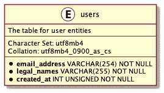
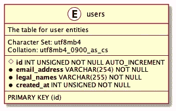
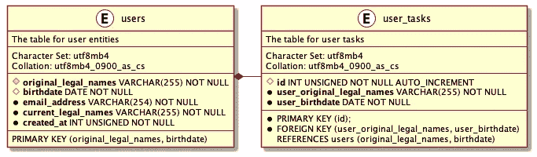

# 分布式系统中的主键

> 原文：<https://levelup.gitconnected.com/primary-keys-in-distributed-systems-b588bf17472c>

# 介绍

作为一名软件开发人员，我观察过各种选择表主键的方法。一些程序员表现出有目的地创建新列作为上述键的倾向，而其他人通常寻找涉及现有列的解决方案。我想从工程的角度来处理这个问题，考虑现有的理论和共同的经验，特别是在分布式系统部门。

# 候选键

设计表时，数据库设计人员应该问自己以下问题——如何识别表中的特定行？寻找答案的过程可能反过来揭示了提供身份的多种方式的存在。我发现最好用一个例子来解释这个难题。

我为本文构建的一个虚构系统的用户具有以下强制性属性:

*   一个电子邮件地址，
*   法定姓名的有序列表(因文化不同而不同，但英语圈广泛认可名、中间名和姓)，
*   用户条目的创建时间戳，以 Unix 纪元时间编码。

users 表的 UML 表示，使用 PlantUML 呈现。

有人可能会说电子邮件地址可以识别特定的用户，但我不同意。任何用户都可能决定切换到不同的地址，或者某个地址的所有权可能会改变，不管是不是偶然的。尽管这听起来像是一个不错的候选人，但搜索必须继续。

类似的推理也适用于法定姓名——在法律允许的情况下，其持有者可以相对容易地更改姓名。两个不相干的人可能会偶然拥有相同的名字，更不用说在每种文化中，法律认可的名字都是有限的。此外，家族传统可能会驱使许多代人给他们的后代起完全相同的名字(考虑一下英语国家的初级和高级后缀)。

最后，两个用户可能共享同一个创建时间戳(秒方式)，即使一些读者可能认为不太可能发生冲突。为了消除这种情况的可能性，时间戳在表中必须是不同的。这允许我声明行的惟一标识的第一个候选对象——创建时间戳。

## 代理键

万一我找不到任何合理的候选者，我就必须自己创建一个——臭名昭著的 ID 属性，它的值要么由一个整数序列定义，要么取自一个随机的 UUID 生成器。由于这样一个属性的值不是其他属性值的函数的结果，所以没有人能够在不首先询问数据库引擎的情况下计算 id。

users 表的 UML 表示，包括使用 PlantUML 呈现的自动生成的 id。

考虑到分布式系统，缺乏对 ID 创建的直接控制强制了信息在系统中传播的特定顺序，这增加了系统架构师在设计软件时必须注意的让步列表。在向数据库发送查询之前，可以通过使用 UUIDs 并按需生成它们来减轻上述限制。

最后，我找到了两个不可空的列，可以用来标识表中的行。用更专业的语言来说，我可能会说我得到了两个候选键。现在我需要选择一个将其声明为表的*主键*。

# 主关键字

我已经确定一个表可能存在多个候选键。数据库设计人员可以将其中一个提升为主键，但是，根据所选的数据库引擎，可能不一定需要创建这样的键。尽管定义了主键，但它为数据库用户提供了以下好处:

*   能够使用快速等式查找来识别表中的每一行，
*   按照受主键影响的顺序存储行(这意味着*结构化索引*跟在主键后面，但是每个数据库设计者在依赖这个特性之前都应该检查所选引擎的文档)，
*   能够在不同的表中使用主键作为外键，
*   (级联)包含外键的操作的引用完整性。

两种明显的主键类型在 RDBMS 数据库中占主导地位:

*   常规(单列)键，
*   复合(多列)键—大多数数据库引擎都限制这种键中包含的有效列数。

我可以很容易地从 ID 列或 creation-timestamp 列中选择一个常规主键——前者将作为一个代理键*而后者作为一个自然键*。因为常规主键的行为非常简单，所以我想在下一段讨论复合主键的内在特性。**

# *复合主键*

*根据定义，每个复合主键跨越多个列。这意味着这样一个键的值包含所有相关列的连接值(按照预定义的顺序)。这违背了任何主键的值都应该尽可能短的原则。*

*此外，在分布式系统中共享这样一个键需要传递一组值，我认为这种解决方案本身就是一种麻烦。多个值(表示为对象或有序列表)的序列化比单个值、字符串或数字等的序列化涉及更多的协议工作。幸运的是，可以使用散列法将任何复合主键简化为常规键，下面我将使用一个例子来演示这一点。*

*为了展示散列的作用，我可以通过提供两个新列来扩展前面引用的表:*

*   *当前法定名称(以前的法定名称需要在注册时更名为原始法定名称)，*
*   *生日。*

*我可以说，两个人共享原始法定姓名和出生日期的概率仍然很低，我应该把它视为几乎不可能发生的事情——无论如何，碰撞可能在各种情况下发生。这允许创建一个复合主键，由每个用户的原始合法姓名和出生日期组成。遗憾的是，这种方法需要不同表中的外键来利用两列，如下例所示:*

**

*使用复合外键连接的 users 和 user_tasks 表的 UML 表示，使用 PlantUML 呈现。*

## *哈希函数*

*以下方法允许将复合主键简化为单列常规键:*

*   *用所选列的连接值创建一个新列(我建议读者考虑一下这个解决方案可能存在的问题)，*
*   *创建新列作为所选列值的散列。*

*哈希函数应该按照预定义的键顺序(可能是字母数字顺序)计算值——这意味着如果不考虑上述顺序，纯 JSON 字符串化可能会产生不需要的数据。JavaScript 或 TypeScript 开发人员可以提供键的排序列表作为`JSON.stringify`函数的第二个参数，如下所示:*

*我可以想到这种解决方案的一个基本缺点——上述函数的返回值没有固定的长度。对于具有多个属性的复杂对象，返回值可能由数百个字节组成，因此，数据库设计人员可能不容易找到列长度的必要上限。*

*幸运的是，任何人都可以使用精心设计的哈希函数将任意长度的字符串缩减为固定长度的字符串。由于著名的数学家在过去的几十年里建立了大量的这些函数，我邀请读者自己研究这个主题。*

# *摘要*

*对于任何分布式系统，如果能够在不事先询问数据库引擎的情况下计算特定表(实体)的主键，就可以在将实体提交到所选数据库之前执行一些操作。仅使用一个固定大小的列而不是利用多个列来标识一行为系统提供了许多优势，尤其是在多个子系统之间共享实体信息时。最后，散列函数可能会将来自多列的值减少为一个可写入单个列的值。*