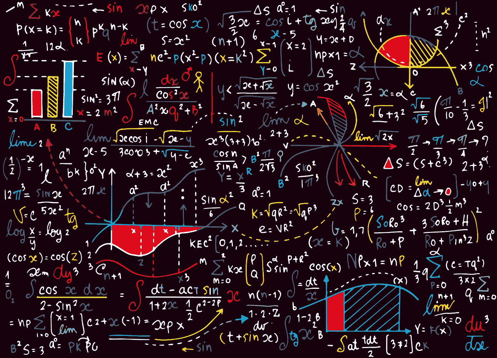
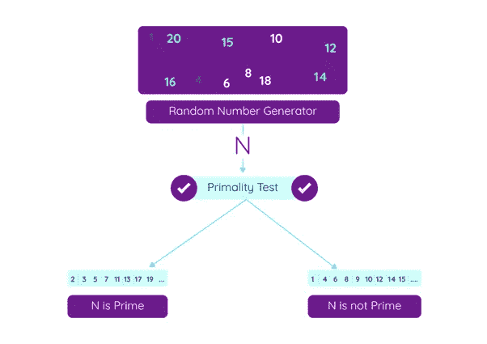
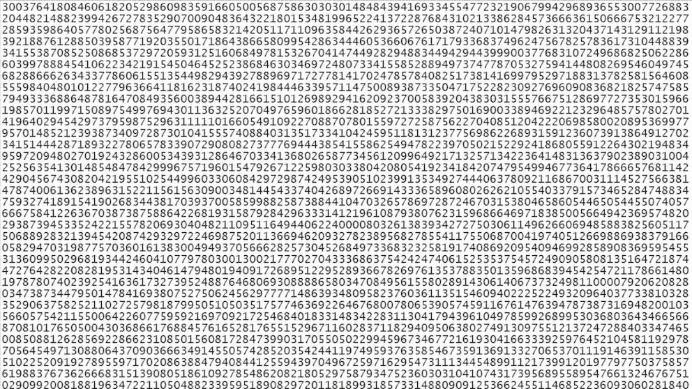
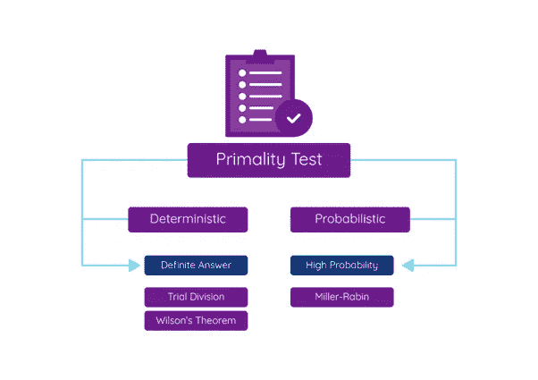

# 质数——以及为什么区块链不能没有质数！

> 原文：<https://levelup.gitconnected.com/prime-numbers-and-why-blockchains-cant-exist-without-them-f629bdc54bb3>

## 密码学系列 II——为什么质数在哈希和密码学中极其重要？

对于散列，使用质数是因为质数为散列函数提供了更好的创建唯一值的机会。哈希函数(如果你不知道[什么是哈希请阅读本文](/the-heart-of-blockchains-hash-functions-501d0b32762b))使用模数，使用合数(即非质数)增加了哈希碰撞的概率(即不同的输入产生相同的哈希)。质数将通过将值乘以质数来增加散列时创建唯一值的机会。这就是数学的本质。例如，如果您有一个字符串“Unblockchain”，将每个字母乘以一个质数，然后将它们相加，将得到一个非常独特的哈希值。明白了吗？

同样，**质数也用于创建私钥，广泛用于加密签名和加密**。在这种公钥基础设施中，用户的数字签名用于验证交易签名的真实性，从而提供了一种安全的方式来检查用户的交易是否由其拥有的私钥签名。任何人都可以使用收件人的公钥发送消息，只有收件人才能用他的私钥打开消息。

每次我们发送或接收比特币交易(以及几乎任何其他区块链)，我们都会使用 [**随机数**](/random-numbers-the-single-most-important-thing-in-blockchain-e850d4e23a51) 来帮助我们创建大素数，这些大素数用于创建强大而安全的私钥！

这就是质数和 [**随机数** s](/random-numbers-the-single-most-important-thing-in-blockchain-e850d4e23a51) 发挥作用的地方！

## 嗯嗯……好吧，但是什么是质数呢？

我知道，我也是很多年前离开学校的！我们来快速刷新一下！质数是只能被自身整除且能被 1 整除的数。质数的一些例子有:1，3，5，7，11，13，17…还有 89，97，8191，也是已知最大的质数是 2⁸，589，933，这是一个天文数字，写出来有 24，862，048 位数。

素数的数目向无穷大递减。数字越高，找到的概率越低。比如 1 到 100 之间有 25 个质数，但 100 到 200 之间只有 21 个质数，200 到 300 之间有 15 个质数，10 000 到 10 100 之间只有 6 个质数。

欧几里德在 2000 多年前就证明了质数是无穷的。虽然检查一个小数字是否是质数很容易，但它越大，就越难检查它是否是质数，这对数学和计算机科学提出了巨大的挑战。此外，数字的范围越大，我们找到素数的概率就越小，验证一个数字是否是素数就越困难。很难找出一个有效的计算公式来寻找大素数。

素数可以用公式 *x/In(x)* 近似计算，素数的密度可以用 *1/In(x)* 近似计算。 *X* 越大，公式越精确。

好了，让我们回到密码学！为了创建一个强私钥，我们需要 2 个大素数，并且确保这些素数很难被猜到，我们需要创建一个大随机数**并检查这个大数是否是一个素数。**

****怎样才能发现一个数是不是质数？最直接的方法是用这个数字除以它下面的每一个数字。如果它不能被其中任何一个整除，那么它就是一个素数。然而，这是一项非常繁重工作。****

****

**所以我们需要应用一个测试或者算法来测试一个素数是不是素数。同样，如果我们正在寻找一个小的 6 位数的质数，检查 100699 是否是一个质数是非常容易和快速的。然而，如果我们要搜索大素数，比如说，长度超过 1000 位的素数，这项工作就会变得更加困难。**

****

**来源:[https://ABC news . go . com/Technology/math-nerds-geek-prime-discovery/story？id=36399058](https://abcnews.go.com/Technology/math-nerds-geek-prime-discovery/story?id=36399058)**

## **素性测试—确定性和概率性**

**这就是素性测试的切入点，也是为什么我们要讨论它们，因为它们对密码学很重要。**

****

**基本上有两种计算质数的方法。一种是使用确定性算法，比如做试除法(用素数除以它之前的所有数，检查是否有可能被除)或威尔逊定理。确定性意味着我们将能够 100%准确地说出这个数是否是质数。确定性算法的计算效率非常低。**

**另一种选择是更快获得答案的概率方法，但它不能 100%肯定地告诉我们它是一个素数(虽然适度准确，但不是 100%)。**

**检验一个素数的确定性方法是非常劳动密集型的，因为它们需要大量的计算。试除法要求 *n* (要因式分解的整数)除以任何较小的数。威尔逊定理也需要大量的能量。它是这样工作的:给定一个自然数 *n > 1* ，它是素数当且仅当所有小于 n 的正整数的乘积小于 n 的倍数 1 即 *n 素数à (n — 1)！≡ 1 (mod n)***

**米勒-拉宾是概率方法，即它不是 100%准确，但对大多数加密算法来说足够准确。大多数密码系统使用米勒-拉宾素性检验来确定一个数是否可能是素数。**

**米勒-拉宾方法在区块链也广泛用于寻找质数。它是 Python 库的一部分，在 [GitHub](https://github.com/mertkosan/miller-rabin) 上可以广泛获得。**

**好吧。在下一篇文章中，我们将使用质数，并通过[步骤使用质数和 RSA 加密算法](/decoding-the-rsa-algorithm-ecc5caca1392)签署交易！令人兴奋的东西！！！**

****🚀跟着我，也请查看我的🧱区块链课程:****

****🐶** [**有史以来第一个 Dogecoin 课程**](https://www.udemy.com/course/-dogecoin-course-the-first-complete-dogecoin-course/?referralCode=9416B1408224CE309DD8)**

****👨‍🎓** [**Fintech、云和网络安全课程**](https://www.udemy.com/course/fintech-technologies-cloud-and-cybersecurity/?referralCode=F1D4EA005A2881735A36)**

****📖****[**完整的 NFTs 教程**](https://www.udemy.com/course/the-complete-nft-course-learn-everything-about-nfts/?referralCode=AAEE908D13D0E2276B19)****

******👨‍🎓** [**Unblockchain 课程**](https://www.udemy.com/course/blockchain-deep-dive-from-bitcoin-to-ethereum-to-crypto/?referralCode=B8463EE382E6D313304B) **—脑洞大开的区块链课程******