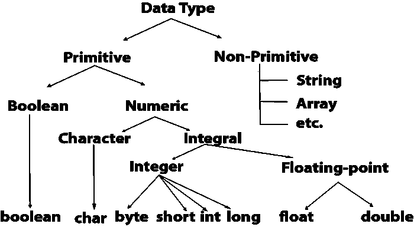

# 原始类型与包装类:在 Java 中使用哪一个？

> 原文：<https://levelup.gitconnected.com/primitive-type-vs-wrapper-class-which-one-to-use-in-java-e0742144f768>

## 虽然看起来很小，但它对你的代码有很大的影响

在这篇短文中，我将带您了解基本类型和包装类的区别和实现，以及不正确使用时的相关后果。

# 什么是基本类型和包装类？

虽然我们很多人都知道它们的意思，但还是让我简单介绍一下

## 原始类型

原始数据类型指定变量值的大小和类型，它没有其他方法。

## 包装类

包装类提供了一种使用原始数据类型(`int`、`boolean`等)的方法..)作为对象。

与上面解释的一个主要区别是，原始类型的默认值取决于类型，如`int is 0`、`char is \u0000`、`boolean is false`等，但是所有类型的包装类的默认值都是`null`，因为它们是对象。

# 用哪个？

基元类型和包装类都需要在代码中使用，这取决于您希望代码的行为方式。虽然这听起来很难，但我会用例子来覆盖大部分用例，以帮助您更好地理解它。

> 当不确定使用什么时，总是使用原始类型

写代码时，用问题而不是解决方案来驱动自己。那是什么意思？

*   如果我用`int`代替`Integer`会怎么样？
*   如果我使用`String`常量而不是枚举，会发生什么
*   如果我使用`Boolean`而不是`boolean`会发生什么
*   诸如此类…

也就是说，让我们看看这些问题如何帮助我们使用正确的数据类型

让我们分析以上代码

*   在货物被分配之前，纬度和经度的默认值是什么？`0.0, 0.0`？不，因为它是一个合适的位置，所以在它被赋值之前必须为空，因此我们用`Float`代替`float`
*   `isActive`可以为空吗？那将意味着什么？某物要么是活动的，要么是非活动的，不存在活动的第三种状态，因此`boolean`
*   产品的重量可以是 0 吗？极不可能。所以我们在上面的代码中使用的`float`是不正确的，因为它在代码中使用时会给出不正确的结果
*   在`OrderManagementService.java`接口中，我使用了相同的概念，例如`userId`需要是一个有效值，不能为空

# 我们可以从应用程序本身驱动正确的数据类型的其他场景

## 数据库模型

*   数据库可以有各种类型的值，包括 null，所以模型对象或实体必须总是有包装类

## **DTOs(请求和响应)**

*   如果您的 API 设计包含可空值，用于请求和响应 ***的 dto 可能*** 有包装类

## 实施和解决方案

*   具有局部范围的变量总是原始类型
*   字段变量应该是原始的，除非它不能满足我们关于它的用法的问题

# 结果

*   当错误地使用包装类时
*   错误使用基元类型时出现意外的默认值
*   调试天数(如果您不知道如何在 IDE 中使用调试器)
*   错误使用包装类时的额外内存使用

# 收场白

一旦你理解了这些概念背后的概念，你就很容易知道和实现这些概念。请在下面的评论中分享你的观点。