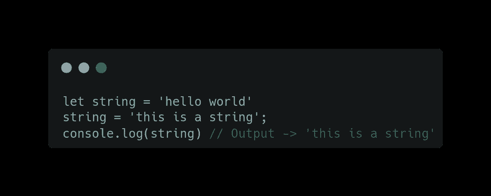
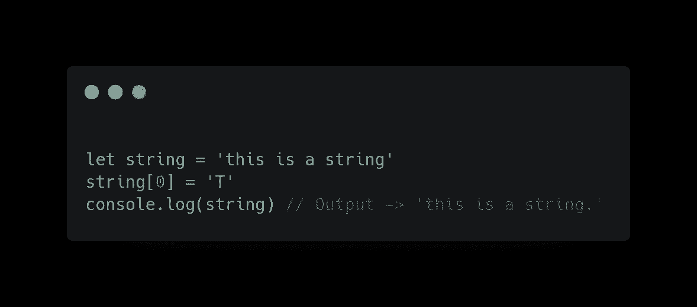
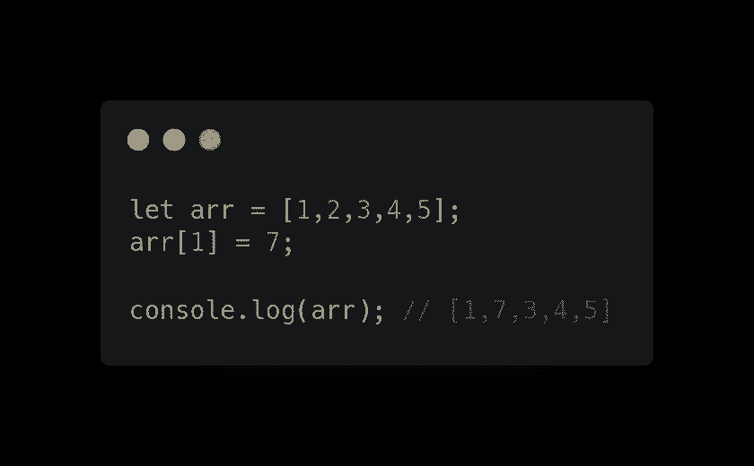
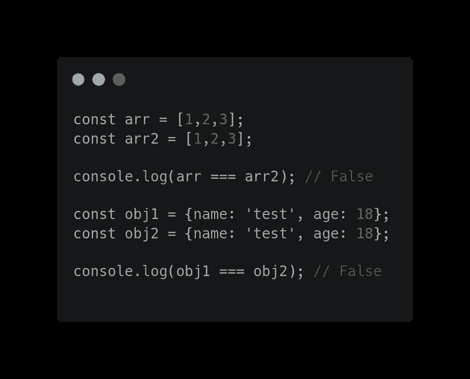

# Javascript 中的原始值与非原始值？

> 原文：<https://levelup.gitconnected.com/primitive-vs-non-primitive-value-in-javascript-82030928fd9>

> *JS 中的原语值和非原语值(对象引用)有什么区别？*


穆罕默德·拉赫马尼在 [Unsplash](https://unsplash.com?utm_source=medium&utm_medium=referral) 上拍摄的照片

如果你正在面试一个前端开发人员的角色，你很有可能会被问到这个问题。

那么这些到底是什么？

为了理解这一点，我们需要知道 Javascript 中有多少不同类型的数据类型。

```
**The latest ECMAScript standard defines eight data types:**
```

1.  线
2.  布尔代数学体系的
3.  数字
4.  BigInt
5.  空
6.  未定义
7.  标志
8.  目标

**注意:数组不属于这个列表，因为它们也是对象。这是开发人员的常见困惑，他们认为数组是 Javascript 中的一种特殊数据类型。**

现在，这些数据类型大致分为两种类型:

*   **原语** :-(字符串、布尔、数字、BigInt、空、未定义、符号)
*   **非原语** :-对象(数组、函数)也称为对象引用。

原语和非原语的根本区别在于原语是`immutable`，非原语是`mutable`。

*   **可变值**是指创建后可以修改的值。
*   **不可变值**是指创建后不能修改的值。

**原语**被认为是不可变的数据类型，因为一旦原语值被创建，就没有办法改变它。
例 1:-



原语是不可变的(不能直接改变)

需要注意的是，在上面的例子中，一个存储原始值的变量可以被重新分配一个新值，如上面的例子所示，但是现有的值不能被改变，如下所示



原始值是不可变的

```
A primitive value can be replaced, but it can’t be directly altered.
```

第二，`Primitive`是**按价值比较**。如果两个值具有相同的值，则它们严格相等。

```
const example1 = 'This is a test string';
const example2 = 'This is a test string';example1 == example2 // True
```

**非原语**被称为`mutable`数据类型，因为我们可以在创建后更改其值。



非原始值是可变的

正如您在上面的示例中看到的，我们可以在创建后更改数组。

其次，对象不是通过价值来比较的，而是通过`reference`来比较的。

例如，如果两个对象具有相同的键-值对，它们就不是严格相等的。数组也是如此。即使它们具有相同顺序的相同元素，它们也不是严格相等的。



通过引用而不是值进行比较的对象

两个对象只有在引用同一个基础对象时才是严格相等的。

示例:-

```
let obj1 = {name: 'test', city: 'Jaipur'}
let obj3 = obj1;obj1 === obj3; // True
```

# 差异和总结

*   原始值是不可变的
*   按值比较的原始值
*   非原始值是可变的
*   通过引用而非值进行非原始比较

> 请在评论区分享你的观点，欢迎反馈。
> 希望你会喜欢并将此分享给更好的 reach
> 查看我的其他文章于—[***https://medium.com/@aayushtibra1997***](https://medium.com/@aayushtibra1997) ***感谢阅读:)***