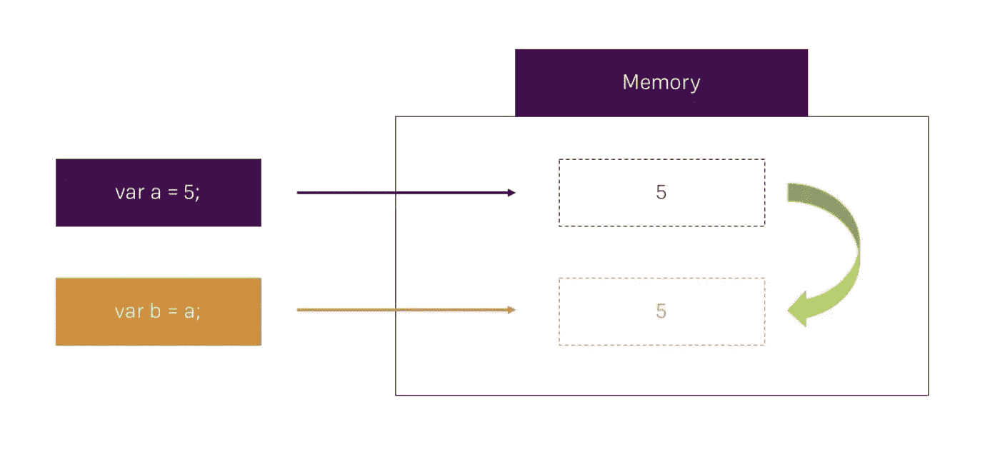
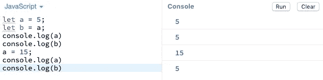
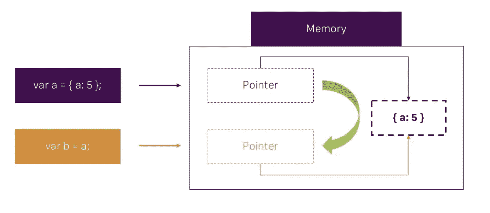
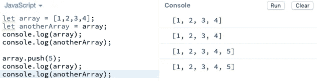
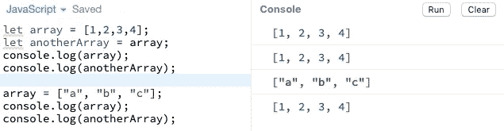

# JavaScript 中的基本类型与引用类型

> 原文：<https://levelup.gitconnected.com/primitive-vs-reference-types-javascript-10d3849f8742>

当我们谈论编程语言中的**类型**时，我们脑海中首先想到的是*字符串*、*布尔*、*数字等等。*这是一个可以称为“数据类型”的通用概念。在这里，我想简单地揭示一些 Javascript 的基本概念，这些概念很容易被忽视，因此会在任何应用程序中产生错误。

在 Javascript 中，有两个类别，即**原语**和**引用类型**。例如，原语是直接在语言实现的最低层表示的。关于基元类型的另一个事实是它们是不可变的，重要的是不要将基元本身与被赋予基元值的变量混淆。例如:

如果我们将 **5** 的值存储在变量**“a”**中，该值将被存储在内存中，如果我们检索或尝试记录该变量，我们将访问该内存。对于第二个变量，我们将 **"a"** 赋值给 **"b"** ，这样就创建了一个副本，这意味着 **"b** 保存了 **5** 的值，但它并不指向变量 **"a"** ，它将指向内存中创建的副本。因此，如果我们将**“a**”的值更改为 **15** ，变量**“b**”仍然是 **5** 。

现在，当我们谈论**引用类型**时，它们可以保存不同类型的值，如数组、对象、函数等。由于引用类型的内容无法容纳在变量可用的固定内存量中，所以引用类型的内存值就是引用本身(内存地址)。例如:

当我们将一个对象赋给变量" **a** "时，我们将值存储在内存中，但变量并不保存这个值，而是保存对它的引用。这是**与**原语**的第一个**差异，其中变量实际保存值。当我们创建一个变量“ **b** ”并将值“ **a** ”赋值时，我们复制了对该值的引用，这就是第二个差异，因为在**原语**中，该值被复制并存储在内存中。这是因为**引用类型**可以获得非常复杂的数据结构，为了避免它们创建许多副本并污染内存，最好的解决方案是复制引用。让我们看看代码:

通过创建一个数组并将该值赋给一个变量 **array** ，我们将该值存储在内存中，并且只将引用附加到该变量上。当我们将**数组**赋给第二个变量 **anotherArray** 时，我们创建了一个指向内存的引用副本，这就是为什么当我们记录两个变量时，我们会得到相同的结果 **[1，2，3，4]** 。当我们通过执行 *array.push(5)* 将数字 **5** 添加到数组中时，我们正在改变存储在内存中的值，该值由变量 **array** 中的引用点分配，并且因为 **anotherArray** 已经将引用点复制到相同的值，所以当我们 console.log 这两个变量时，我们会得到相同的结果。

现在是最后一个也是最令人兴奋的区别，也是最令人困惑的地方:

这里我们仍然保留前两个 console.logs，只是为了理解这些变化。现在，如果我们将 **["a "，" b "，" c"]** 赋值给**数组**我们并没有改变一个现有的值，而是创建了一个新的对象(数组的类型为 object，因为它是一个引用类型)，因此它创建了一个带有新引用的新值。这就是为什么 **anotherArray** 没有改变，因为 **array** 的原始值仍然在内存中，引用指向 **anotherArray。**

这是最重要的区别，使用 *array.push* 我们正在更新一个现有的对象，所以具有相同引用的两个变量都被更新了。但是在第二种方法中，我们只是创建了一个新值，所以 **anotherArray** 保留了对主值的引用。

我希望这是澄清，感谢您的阅读和更多文章去[https://medium.com/@jhcxavier](https://medium.com/@jhcxavier)。

*最初发表于*[https://www.linkedin.com/in/joao-henrique-xavier/](https://www.linkedin.com/pulse/primitive-vs-reference-types-javascript-jo%C3%A3o-henrique-xavier/)