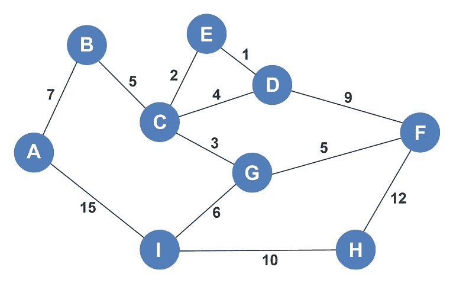
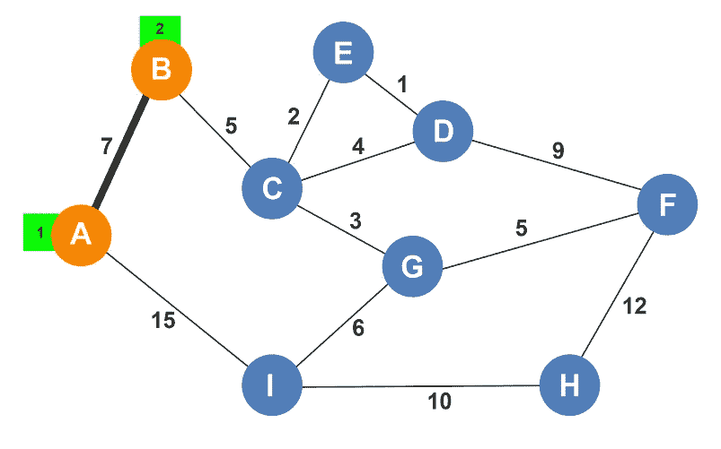
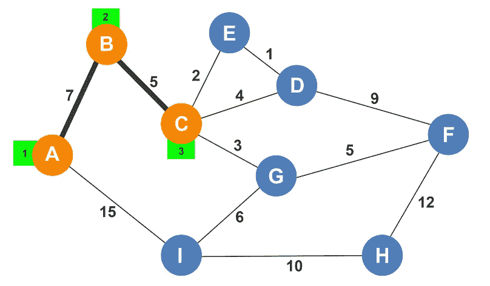
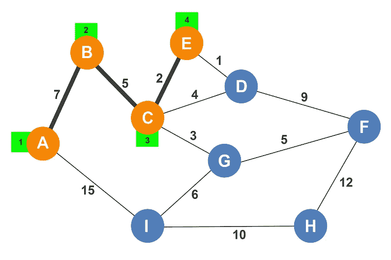
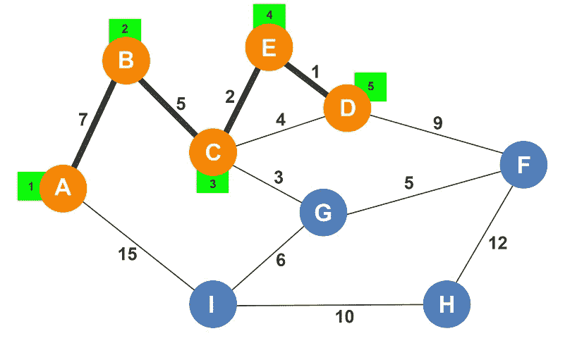
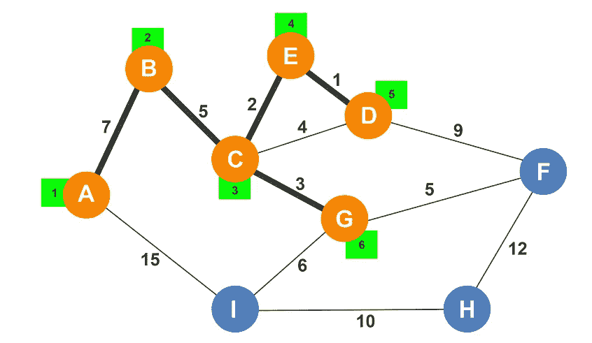
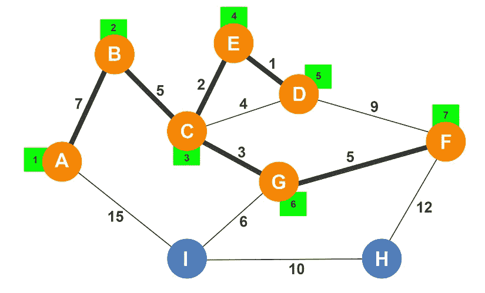
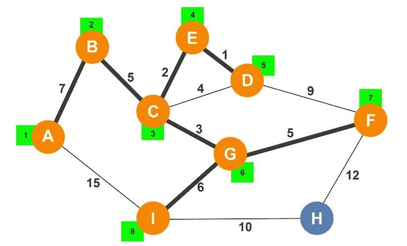
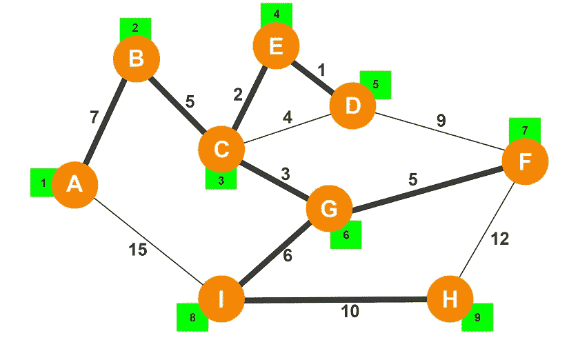

# 普里姆的算法直观地解释了

> 原文：<https://levelup.gitconnected.com/prims-algorithm-visually-explained-fb69a786f352>

P rim 的算法类似于 Kruskal 的算法。这是一个贪婪的算法，为一个加权的无向图寻找最小生成树。从任意顶点开始，该算法一次构建一个顶点的 MST，其中每个顶点采用从根节点开始的最短路径。让我们来看看我们的例子。

虽然我们可以从任何顶点开始，但在这个例子中我们选择顶点 A。顶点 A 有到 B 和 I 的直接边，到顶点 B 的开销是 7，到顶点 I 的开销是 15。由于 Prim 的算法是一种贪婪算法，它选择具有最低权重的边，在这种情况下是边 A-B。绿色的数字代表顶点发现的顺序。

顶点 A 和 B 现在可以看到顶点 C 和 I，顶点 B 访问 C，顶点 A 访问 I，再看顶点 C，B 到 C 的距离是 5；从 A 到 I 的距离是 15。Prim 的算法选择最小的边，在这种情况下，它来自 B-C。

该算法必须考虑从所有已经发现的顶点可见的所有边。未被发现的可见边现在是 A-I、C-E、C-D 和 C-G。通过比较每条边的权重，Prim 的算法得出的结论是从顶点 C 到顶点 E 的权重最低，因此它选择了该边。

该算法现在可以访问边 A-I、C-D、C-G 和 E-D。边 E-D 的成本最低，因此该算法接下来选择它。

Prim 的算法现在必须考虑以下边:A-I、C-G 和 D-F。边 C-D 不考虑，因为两个顶点都已经找到。如果选择了这条边，就会产生一个循环。边 C-G 包含最小的权重，所以接下来选择它。

还有三个未被发现的顶点。Prim 的算法将从以下边中选择成本最低的边:A-I、D-F、G-F 和 G-I。边 G-F 包含成本最低的边，因此接下来选择它。

Prim 的查看边 A-I、F-H 和 G-I。由于 G-I 是最小的边，Prim 的选择它作为下一条边。

最后，可以通过边 F-H 或边 I-H 访问顶点 H，由于边 I-H 较小，Prim 的算法选择了它。

因为已经找到了所有的顶点，所以算法结束。已经找到了最小生成树。顶点发现的顺序如下:

> a，B，C，E，D，G，F，I，h。

*如果你喜欢你所读的，我的书，***算法的说明性介绍，涵盖了这个算法和更多。**

**

*迪诺·卡伊奇目前是 [LSBio(寿命生物科学公司)](https://www.lsbio.com/)、[绝对抗体](https://absoluteantibody.com/)、 [Kerafast](https://www.kerafast.com/) 、[珠穆朗玛生物](https://everestbiotech.com/)、[北欧 MUbio](https://www.nordicmubio.com/) 和 [Exalpha](https://www.exalpha.com/) 的 IT 负责人。他还担任我的自动系统的首席执行官。他有十多年的软件工程经验。他拥有计算机科学学士学位，辅修生物学。他的背景包括创建企业级电子商务应用程序、执行基于研究的软件开发，以及通过写作促进知识的传播。*

*你可以在 [LinkedIn](https://www.linkedin.com/in/dinocajic/) 上联系他，在 [Instagram](https://instagram.com/think.dino) 上关注他，或者[订阅他的媒体出版物](https://dinocajic.medium.com/subscribe)。*

*[*阅读迪诺·卡吉克(以及媒体上成千上万其他作家)的每一个故事。你的会员费直接支持迪诺·卡吉克和你阅读的其他作家。你也可以在媒体上看到所有的故事。*](https://dinocajic.medium.com/membership)*