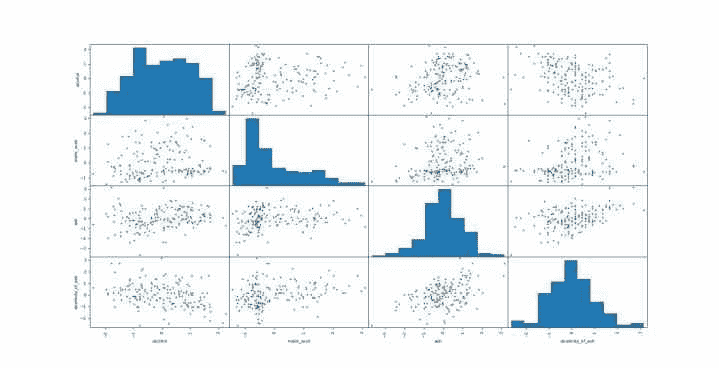
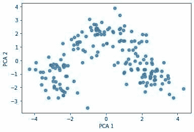
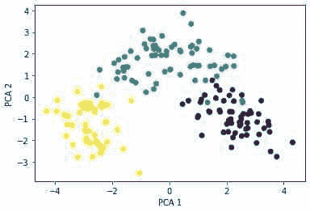
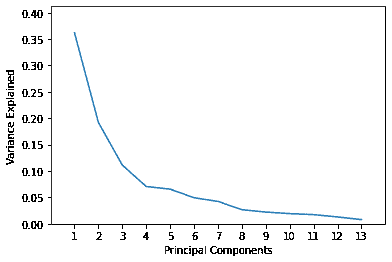
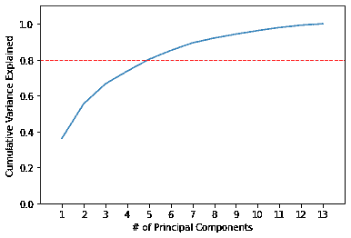

# Python 语言降维的主成分分析

> 原文：<https://levelup.gitconnected.com/principal-component-analysis-for-dimensionality-reduction-in-python-4187d98f7cc1>

本文将重点介绍 Python 中的主成分分析。

**目录:**

*   介绍
*   主成分分析(综述)
*   Python 中的主成分分析
*   结论

# 介绍

写这篇文章的一个主要原因是我痴迷于了解主成分分析(PCA)背后的细节、逻辑和数学。如今，大多数关于 Python 中主成分分析的在线教程和文章都专注于向学习者展示如何应用这种技术并可视化结果，而不是从头开始思考我们为什么需要它？我们的数据为什么需要减少要素的数量或对它们进行分组？

让我们从头开始。即使不做任何降维处理，你打算用你拥有的数据集做什么？我猜你是想把它输入到机器学习算法中，对吗？

这是我们的第一步。我们的目标是有一个算法友好的数据集。我们这样说是什么意思？

当您拥有大量功能时，会有一些潜在的缺点:

*   你的模型将会非常复杂
*   它们可能会产生很大的噪音
*   如果它们具有不同的比例，则会降低一些对比例敏感的算法的性能
*   n 维空间中更复杂的可视化

这就是 PCA 发挥作用的地方。它将通过提取/消除重要/不重要的特征来帮助我们降低数据集的维度。

# 主成分分析(综述)

主成分分析(PCA)是一种线性降维技术。从数学上来说，PCA 使用潜在相关特征到线性不相关的主成分的正交变换。

因此， **n** 个主成分的序列是按照它们所解释的原始数据集中的方差大小以降序排列的。这实质上意味着第一个主成分比第二个主成分解释了更多的差异，依此类推。

更好的做法是把它放在如何逐步计算主成分的背景下:

1.  计算协方差矩阵
2.  计算特征值
3.  计算特征向量
4.  按照特征值降序排列特征向量
5.  使用 **k** 特征向量将原始数据转换到 **k** 维

注意:如前所述，根据您正在处理的数据和要素的缩放比例，您可能希望在对数据运行 PCA 之前对数据进行标准化。

# Python 中的主成分分析

为了继续学习本教程，我们需要两个 Python 库:pandas、numpy、sklearn 和 matplotlib。

如果您没有安装它们，请打开“命令提示符”(在 Windows 上)并使用以下代码安装它们:

```
pip install pandas
pip install numpy
pip install sklearn
pip install matplotlib
```

导入所需的库:

```
import pandas as pd
import numpy as np
import matplotlib.pyplot as plt
from sklearn.datasets import load_wine
from sklearn.preprocessing
import StandardScaler from sklearn.decomposition
import PCA
```

一旦下载、安装和导入了库，我们就可以继续 Python 代码实现了。

## 步骤 1:加载数据集

在本教程中，我们将使用作为 sklearn 库一部分的葡萄酒识别数据集。该数据集包含 13 个特征，目标是 3 类葡萄酒。
数据集的描述如下:

*   酒精
*   苹果酸
*   灰
*   灰分的碱性
*   镁
*   总酚
*   黄酮类化合物
*   非类黄酮酚
*   原花青素
*   彩色亮度
*   顺化(越南城市)
*   稀释葡萄酒的 OD280/OD315
*   脯氨酸

这个数据集对于说明分类问题特别有趣，对于我们展示 PCA 应用也非常有用。它有足够的特性来说明降维的真正好处。

```
wine = load_wine()
df = pd.DataFrame(wine.data, columns=wine.feature_names)
print(df.iloc[:,0:4].head())
```

来自 sklearn 的数据在导入时( **wine** )显示为数据集的容器对象。它类似于一个字典对象。然后我们将它转换成 pandas 数据帧，并使用特性名作为我们的列名。

因为我们有 13 个特性，所以要展示的范围很广，所以我们看一下前 4 列，以确保我们的代码有效。

## 步骤 2:浏览数据集

现在，让我们来看看这个数据框架的基本描述性统计数据。我们将继续只显示前 4 列，以节省一些输出空间。

```
print(df.iloc[:,0:4].describe())
```

下面是我们在上面讨论过的 4 个特性的散点图矩阵。它在博客页面上的尺寸较小，因此不会减少页面加载时间。如果你想更深入地探索它，你可以很容易地通过一些参数调整[重新创建](https://pandas.pydata.org/pandas-docs/stable/user_guide/visualization.html#visualization-scatter-matrix)。


您在散点图矩阵中看到的是描述性统计输出的可视化。我们将使用它与缩放后的数据进行比较，以显示标准化后每个要素的值的分布和分布保持不变。

正如我们所看到的，每个特性的范围以及它们的均值和方差都非常不同。我们的下一步是通过减去每个值的平均值并除以其标准偏差来缩放每个特征的数据。

## 步骤 3:标准化数据集

PCA 主要关注最大化方差的特征。在当前未缩放数据的情况下，PCA 将认为特征 4(“alcalinity _ of _ ash”)支配最大方差度量，因为其范围比特征 1:3 大 5-10 倍。因此，得到的主成分可能与标准化数据非常不同。有关 PCA 缩放重要性的更多详细信息，请点击[此处](https://scikit-learn.org/stable/auto_examples/preprocessing/plot_scaling_importance.html)。

在扩展我们的数据时，我们将应用以下标准化方法:

```
df = StandardScaler().fit_transform(df) df=pd.DataFrame(df,columns=wine.feature_names)
```

当我们将 StandatdScaler()应用于 dataframe 时，得到的转换对象是一个数组，然后我们将它转换回 pandas dataframe 对象。我们可以看到，与原始数据相比，转换后的要素在要素间的比例更加相似。

为了说明这意味着什么，让我们看一下缩放数据的描述性统计。

```
print(df.iloc[:,0:4].describe())
```

请注意，在缩放后的数据中，要素的平均值以 0 为中心，方差是单位方差。

下面的矩阵散点图显示了上述观点。



您可以像之前的散点图矩阵一样[重新创建](https://pandas.pydata.org/pandas-docs/stable/user_guide/visualization.html#visualization-scatter-matrix)。重要的是比较要素的分布和缩放值的分布，请注意它们是相同的。

注意:如果您有分类数据，您将需要在缩放之前对其进行[标签编码](https://pyshark.com/label-encoding-in-python/)。

## 步骤 4:在 Python 中应用主成分分析

在缩放我们的数据后，我们就进入了本教程最有趣的部分。我们将继续对缩放后的数据集应用 PCA。

```
pca = PCA(n_components=2)
pca_model=pca.fit(df)
df_trans=pd.DataFrame(pca_model.transform(df), columns=['pca1', 'pca2'])
```

首先，将 sklearn PCA 的实例存储为具有 2 个组件的 **pca** 。我们特别选择 2 的原因只是为了本教程的简单和演示。在文章的后面，我们将讨论如何找到最佳主成分的数量。

**pca_model** 存储所应用技术的特征向量，该特征向量用于通过将其形状从 13 个原始特征缩减为由主分量表示的 2 个特征，将缩放数据集 **df** 转换为 **df_trans** 。

下面是这种降维的可视化(从 13 维到 2 维。让我们来看看:

```
print(df_trans.head())
```

上面我们看到的是经过缩放的 13 要素数据集转换为 2 要素数据集，其中每个要素都是一个主成分。由于维数减少，它现在允许我们在二维空间中可视化 13 维数据集。

可视化转换后的数据 **df_trans** :

```
plt.scatter(df_trans['pca1'], df_trans['pca2'], alpha=0.8)
plt.xlabel('PCA 1')
plt.ylabel('PCA 2')
plt.show()
```



我们可以将目标值作为颜色添加到上面的图中(有三个等级:1、2、3 ),得到下面的散点图:



在主成分变换之后，观察值被分组到可定义的群中。例如，如果您正在为分类构建预测算法(如 KNN 算法),当应用于转换后的数据集时，将会产生更高的准确性。

## 步骤 5:用 Python 解释主成分

回到我们的主成分，它们实际上意味着什么？他们提供什么信息？

**主成分与原始数据集的关系**

探索的第一部分将是每个主成分和来自原始数据集的特征之间的相关性。

```
comp=pd.DataFrame(pca_model.components_, columns=wine.feature_names)
print(comp)
```

每个索引为 0 的行指的是第一个主成分。主成分和原始数据集特征之间的最高相关性(绝对值)是与“黄酮类化合物”特征的相关性(0.422934)。这意味着在 **trans_df** 中‘pc1’值大的葡萄酒‘黄素’值也高。
对于第二个主成分，最高相关性(绝对值)是与‘颜色强度’特征(-0.529996)，这意味着在**反式 _df** 中‘pc2’值大的葡萄酒‘颜色强度’值低。

按照这种方法，您可以很好地理解每个主成分的值与特定数据集要素的值的相关程度。

注意:这与特征重要性不同(但它会根据哪个特征更重要来显示相似的结果)，而不是主成分和原始数据集之间的相关性概述。

**主成分解释方差**

回想一下，这里有两个主成分，它们线性不相关。这些组件中的每一个都解释了原始数据集的一些变化。主成分分析的工作方式是根据每个成分解释的变化量，以降序找到主成分。让我们调查一下。

```
print(pca_model.explained_variance_ratio_)Output: [0.36198848 0.1920749 ]
```

从上面可以看出，第一个主成分解释了原始数据集方差的大约 36.2%，而第二个主成分解释了大约 19.2%。

回想一下，在步骤 4 中创建 **pca** 实例时，我们将其限制为 2 个组件。这样做主要是为了展示该技术，并在本教程中简化解释。

事实上，可以有两个以上的主成分，数据科学家想要使用多少主成分实际上取决于他们想要解释多少方差。组件的最大数量受到特性数量的限制(在我们的例子中是 13)。为了说明我们所指的是什么，我们将重复他的教程的几个步骤，而不限制主成分的数量为 2。

```
pca = PCA()
pca_model=pca.fit(df)
```

对于一个 N 维数据集，上面的代码将计算 N 个主成分。我们的葡萄酒数据集有 13 个特征，因此我们现在有 13 个主要成分。让我们看看他们各自解释的方差的分数:

```
print(pca_model.explained_variance_ratio_)Output: [0.36198848 0.1920749 0.11123631 0.0706903 0.06563294 0.04935823 0.04238679 0.02680749 0.02222153 0.01930019 0.01736836 0.01298233 0.00795215]
```

第一个和第二个分量的值和之前一样。现在我们又添加了 11 个，它们都按降序排列。

我们如何选择需要将数据集缩减到多少主成分的一个重要因素是它们所解释的累积方差。对于每个后续的主成分，我们将把它解释的方差加上前面主成分解释的所有方差。

```
print(np.cumsum(pca_model.explained_variance_ratio_))Output: [0.36198848 0.55406338 0.66529969 0.73598999 0.80162293 0.85098116 0.89336795 0.92017544 0.94239698 0.96169717 0.97906553 0.99204785 1\. ]
```

前两个主成分解释了 55.41%左右。随着我们添加更多的主成分，累积方差以递减的速率增加。

假设，作为一名数据科学家，您的要求是 80%的方差必须在 PCA 转换的数据中得到解释。这种水平的累积差异可以通过包含 5 个主成分来解释。让我们想象一下。

```
plt.plot(list(range(1,14)), pca.explained_variance_ratio_) plt.axis([0, 14, 0, max(pca.explained_variance_ratio_)+0.05]) plt.xticks(list(range(1,14)))
plt.xlabel('Principal Components')
plt.ylabel('Variance Explained')
plt.show()
```



```
plt.plot(list(range(1,14)), np.cumsum(pca.explained_variance_ratio_))
plt.axis([0, 14, 0, 1.1])
plt.axhline(y=0.8, color='r', linestyle='--', linewidth=1) plt.xticks(list(range(1,14)))
plt.xlabel('# of Principal Components')
plt.ylabel('Cumulative Variance Explained')
plt.show()
```



# 结论

本文介绍了 Python 中主成分分析的理论和应用。
您可以采取的进一步探索该技术优势的下一步是尝试在原始数据集和主成分数据集上应用一些机器学习算法，并比较您的准确性结果。

如果你有任何问题或者对编辑有任何建议，请在下面留下你的评论。

*原载于 2020 年 3 月 29 日【https://pyshark.com】[](https://pyshark.com/principal-component-analysis-in-python/)**。***