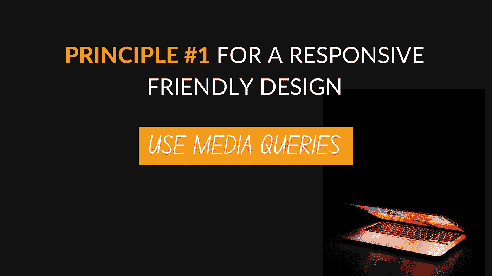
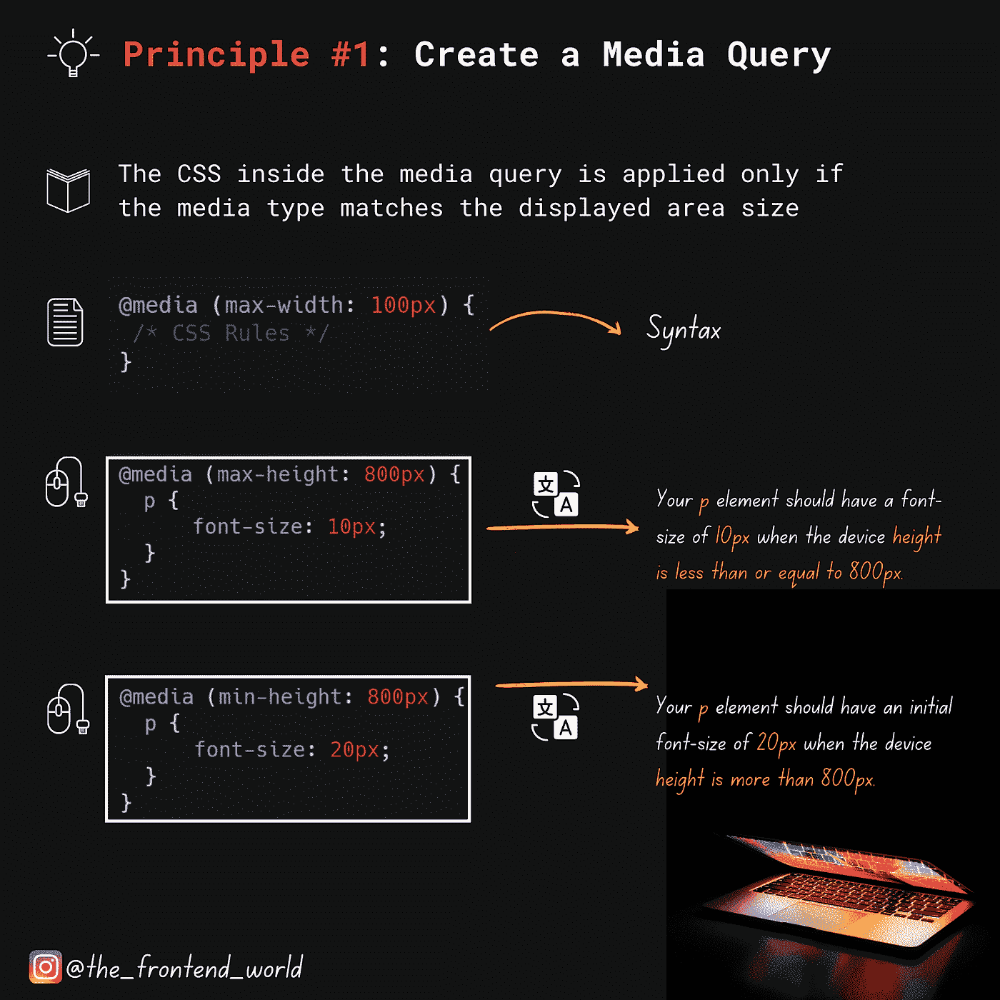

# 响应友好设计的原则#1

> 原文：<https://levelup.gitconnected.com/principle-1-for-a-responsive-friendly-design-6461c45646d2>

## **使用媒体查询**



作者:FAM

这是最重要的原则。这是 CC3 中引入的一项技术。它是根据不同的视窗大小来改变网页的外观和内容。

## 好吧，什么是视窗尺寸？

视区大小是网页的可见区域。它是你在不同设备上看到的，可见区域。

可以把这个技术看作是一个`switch`条件。当屏幕的宽度小于或等于`100px`时，应用下面的样式:改变一个类名的宽度为另一个值，改变它的位置。综上所述，改变事物，使其适合显示区域。下面是它在 CSS 中的样子:

```
**@media** (**max-width**: 100px) {
 /* CSS Rules */}
```

当然，这还不足以使网页具有响应性。不仅仅是设备的屏幕小于或等于`100px`。我们必须对其他案件采取同样的做法。不是只有`max-width`可以用。你也可以用`max-height`和`min-height`来调整高度。

> 只有当媒体类型与显示的区域大小匹配时，才会应用媒体查询中的 CSS

## 示例:

```
/* Case 1 */Your p element should have a font-size of 10px when the device height is less than or equal to 800px.@media (max-height: 800px) {
  p {
      font-size: 10px;
  }
}/*Case 2 */
Your p element should have an initial font-size of 20px when the device height is more than 800px.@media (min-height: 800px) {
  p {
      font-size: 20px;
  }
}
```



作者:FAM

了解其他原则:

[](https://famzil.medium.com/4-principles-for-a-responsive-web-design-619ef192a36) [## 响应式网站设计的 4 个原则

### 响应式设计是每个前端开发人员的必备知识。

famzil.medium.com](https://famzil.medium.com/4-principles-for-a-responsive-web-design-619ef192a36) 

# 感谢您宝贵的时间，希望这对您有用！

亲爱的读者，我希望这是明确和有用的。我希望你无论在哪里都是安全的，你的家人也是！坚持住。明天会更好！

**让我们联系一下** [**中**](https://medium.com/@famzil/)**[**Linkedin**](https://www.linkedin.com/in/fatima-amzil-9031ba95/)**[**脸书**](https://www.facebook.com/The-Front-End-World)**[**insta gram**](https://www.instagram.com/the_frontend_world/)**[**Youtube**](https://www.youtube.com/channel/UCaxr-f9r6P1u7Y7SKFHi12g)**或**********

****[www.fam-front.com](http://www.fam-front.com/)****