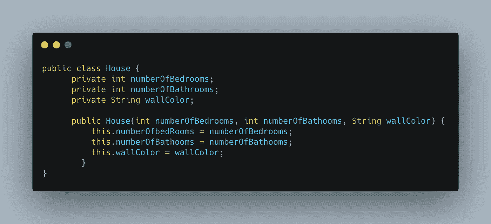
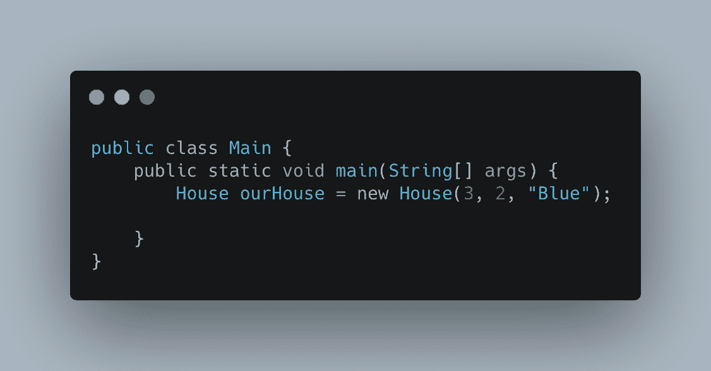
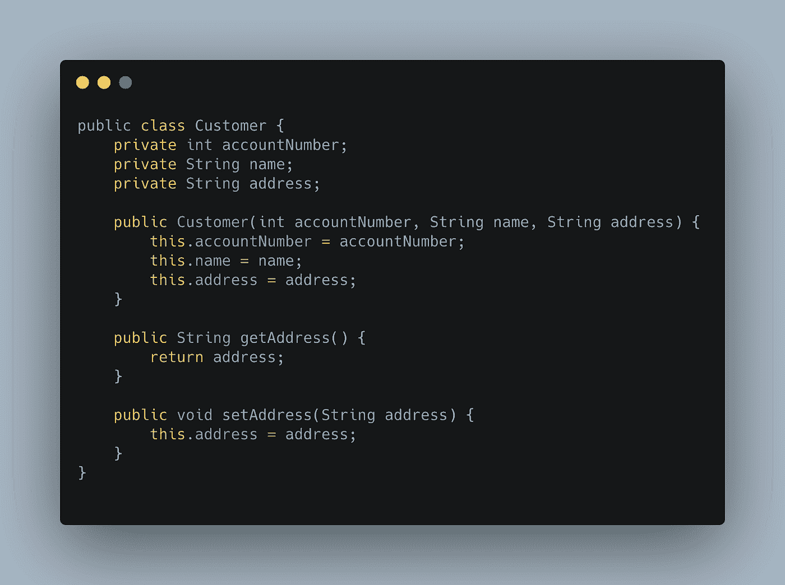
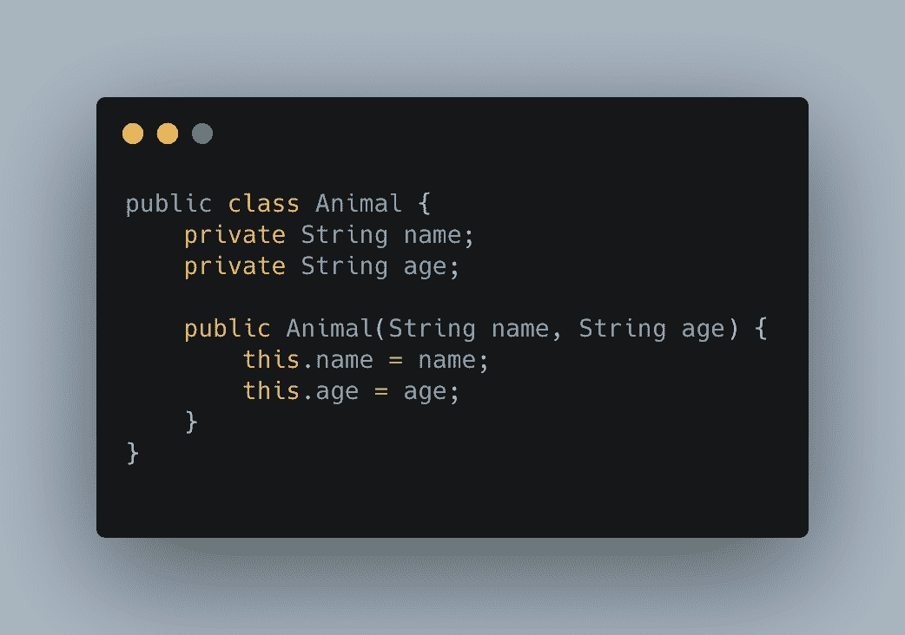
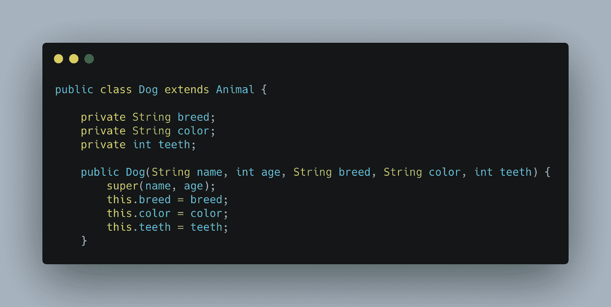
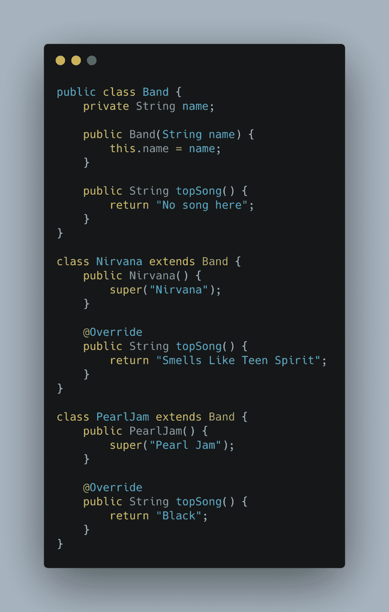

# 面向对象编程原理

> 原文：<https://levelup.gitconnected.com/principles-of-object-oriented-programming-33a08094afe6>

首先，什么是面向对象编程(OOP)？嗯，我们打开维基百科快速搜索，瞧，我们有了答案:

> 面向对象编程(OOP)是一种基于“对象”概念的编程范式，它可以包含数据和代码:字段形式的数据(通常称为属性或特性)，以及过程形式的代码(通常称为方法)。

好吧，但那是什么意思？什么是编程范式？什么是字段或过程？如果您是编程新手，并且您阅读了这个定义，那么最初感到困惑是可以理解的。所以，我们来分解一下。

一个对象就是:一个对象。想想现实世界中的任何物体:一辆车，一栋房子，一个人，一张信用卡，你能想到的。凡是你能想到的，都可以用代码表示成一个对象。一个对象的属性，比如狗的品种、信用卡号或汽车的燃料容量，都被称为字段。对象的任何属性都可以用代码来描述。过程或方法是给定对象可以执行的操作。汽车会动，狗会叫，信用卡可以用来买东西。

完美，所以一个对象是一个真实世界中的对象，但是我们如何用代码创建一个呢？要用代码创建一个对象，我们需要绘制这个对象的蓝图。我们编写了一段代码，详细描述了对象在创建时将拥有的所有字段和方法。这个蓝图被称为一个类。如果我们有一个 House 类，那么每当我们想要建造一个新房子的时候，我们都需要调用这个类。我们建造的每栋新房子都被称为一个实例。

一个房子类，也就是房子的蓝图

创建一个名为 ourHouse 的新房子对象

好的，很好。因此，我们对什么是对象有了更好的理解，但是什么是编程范式呢？嗯，只是“思考编程问题的一种方式”的更优雅的说法。在面向对象的情况下，这意味着程序员根据对象来思考问题。如果我们需要开发银行应用程序，我们可以通过思考这里有哪些对象在起作用来着手解决这个问题。例如，客户可以是一个对象，该对象可以具有诸如帐号之类的属性(字段)和诸如存款能力之类的过程(方法)。这种用物体来思考事物的思维方式也延伸到了无形的事物上。虽然客户是一个完美的有形对象的例子，但像账户这样的东西呢？嗯，是啊！那也可能是一个物体！支票账户、储蓄账户和投资账户甚至可以有不同的对象。

酷，我们知道对象是什么，我们知道我们可以用这种思维方式来解决编程问题..现在怎么办？现在，我们需要知道如何编写好的面向对象代码！要做到这一点，我们应该坚持 OOP 的 4 个支柱。它们如下:

1.  包装
2.  抽象
3.  遗产
4.  多态性

# 包装

封装意味着我们不用直接访问和操作对象的属性，而是使用方法来实现。对于访问，我们通常使用 getters 方法，对于操作，我们通常使用 setters 方法。例如，如果我们是一个客户对象，我们希望更新他们的地址，我们可以通过在 customer 类中创建一个名为 getAddress 的方法来访问这些信息，该方法将返回客户的地址。然后，要更改客户的地址，我们可以创建一个名为 setAddress 的函数来更新客户的地址。没错，但是当我们可以将属性公开并直接访问它们时，为什么还要创建这些方法呢？答案是，让信息变得容易获取是有风险的。为什么？因为这增加了数据被操纵的可能性，而我们实际上并不希望它被操纵。通过使用封装，我们创建了更安全的代码，不太可能导致这种不必要的数据操作。

带有地址字段的 getter 和 setter 的 Customer 类

# 抽象

抽象意味着你应该只向用户展示必要的细节。当用户开车时，他们不想知道活塞、传动带和曲轴在做什么。他们只想知道他们踩下油门，车就开了！这就是抽象。我们有一个方法，我们想从对象中使用，任何不需要暴露的东西都不会被暴露，除非特别请求。例如，如果我们有一个汽车对象，我们想在这个对象上调用一个方法，比如 car.start()，我们不需要知道启动马达启动、火花塞点火、曲轴转动等等。我们只需要知道我们调用了 car.start()方法，汽车启动了。

# 遗产

继承，就像 OOP 的许多方面一样，听起来确实如此。我们可以有一个从另一个类继承字段和方法的类。例如，我们可能有一个动物类和一个狗类，它们可以继承动物类的所有字段和方法。我们这样设计是因为所有的狗都是动物，都应该有一些动物都有的基本属性。例如，动物类的字段可以是年龄。所有动物都受制于时间，因此都有年龄。不管是狗、水母还是大象。除了从 Animal 类继承的基本属性和过程之外，dog 也可以有自己的领域，比如 breed，还有自己的方法，比如 bark。

动物类

从动物类继承而来的狗类

# 多态性

多态性意味着同一个对象可以根据需求执行不同的操作。让我们来看一个使用波段的例子。在这个例子中，我们有一个类 band，它只是一个用于任何波段的通用类。当我们在一个 Band 对象上调用 topSong()方法时，它返回“这里没有歌曲”。如果我们将 Band 类扩展到另一个类，即代表特定乐队的类，我们可以覆盖 topSong()方法，以便它返回该乐队中最热门的歌曲。

面向对象编程起初可能是一个令人困惑的概念，但这通常只是因为我们通过使它看起来比实际更复杂来使它变得复杂。说到底，OOP 只是我们现实世界中对象概念在代码中的延伸。我们以类的形式为这些对象绘制蓝图，这些类将对象属性作为字段，将其相关动作作为方法。为了保持面向对象系统尽可能的干净和防错，我们必须坚持 OOP 的 4 个基本原则:封装、抽象、继承和多态。我希望这篇文章对你有用，如果有用，请给它一个赞和分享！编码快乐！