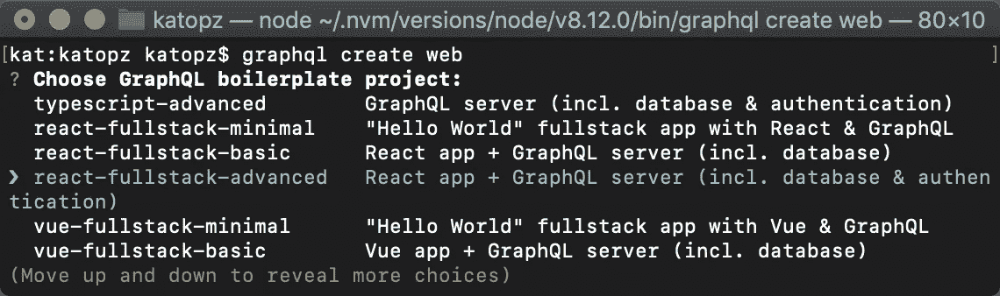
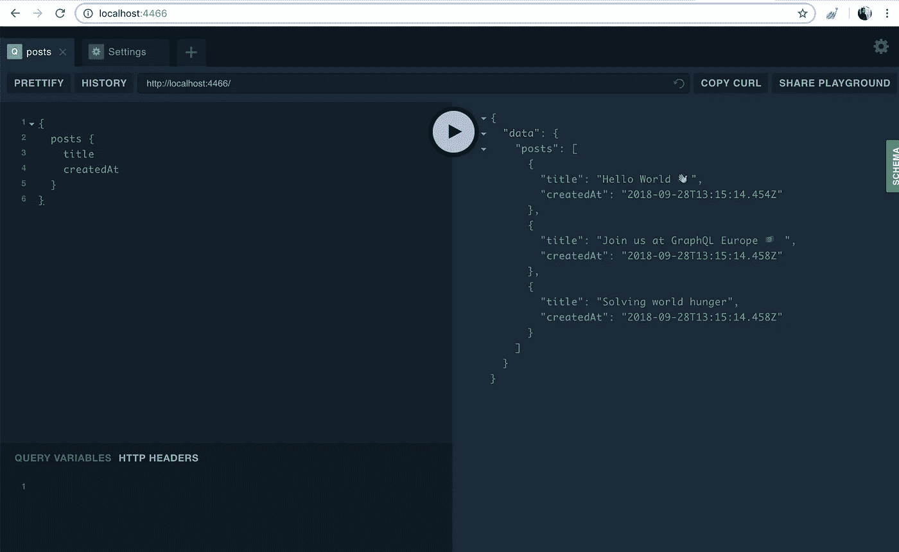
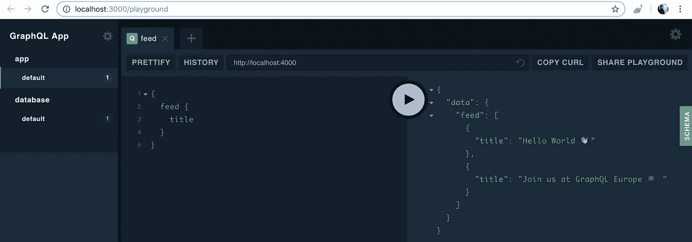
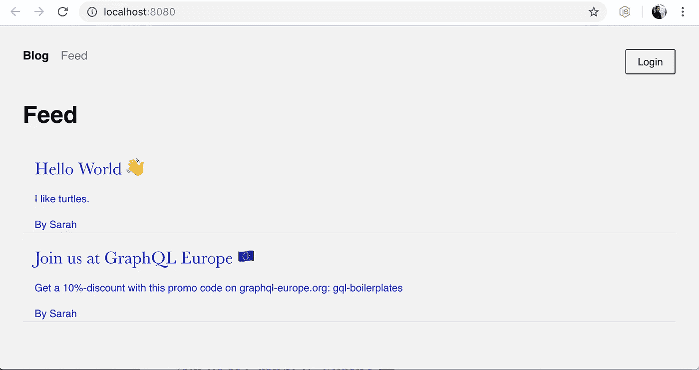
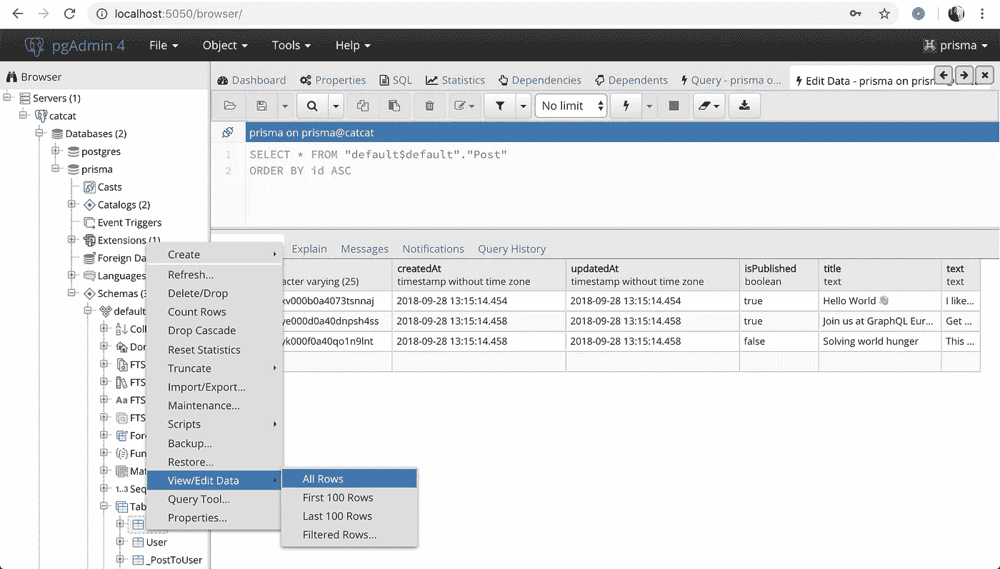

# 普里斯马❤ PostgreSQL + pgAdmin

> 原文：<https://levelup.gitconnected.com/prisma-postgresql-pgadmin-ba398b7890e8>

让我们通过 **Docker** 用 **PostgreSQL** 和 **pgAdmin** 试试 **Prisma** ，开始吧！

# **TLDR**

[https://github.com/katopz/prisma-postgresql-pgadmin-example](https://github.com/katopz/prisma-postgresql-pgadmin-example)

# 来源

我们将使用[这个文档](https://www.prisma.io/docs/tutorials/bootstrapping-boilerplates/react-(fullstack)-tijghei9go/)生成 web

```
npm install -g prisma graphql-cli
graphql create web
```



# 发展

## 1.上升`prisma`、`postgres`、`pgadmin`

```
cd dev
. up
```



## 2.Prisma 服务器

```
cd web/server
yarn dev
```



## 3.阿波罗网络客户端

> 邮箱:`*developer@example.com*` 密码:`*nooneknows*`

```
cd web
yarn install
yarn start
```



## 4.PostgreSQL 管理

> 连接:`postgres` SSL : `Disable`

```
open [http://localhost:5050](http://localhost:5050)
```



完成了！感谢 Docker Compose！

[](https://levelup.gitconnected.com)