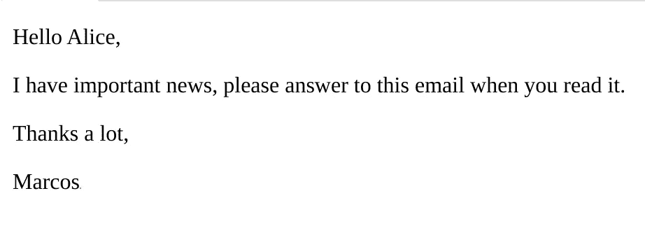
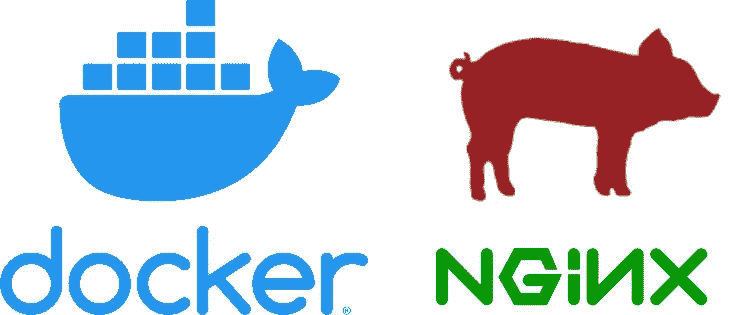
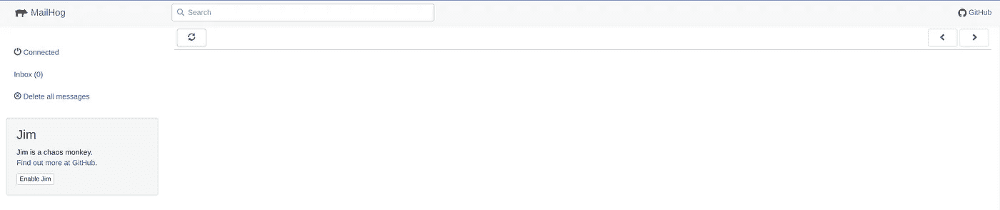
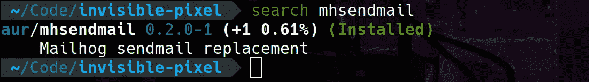
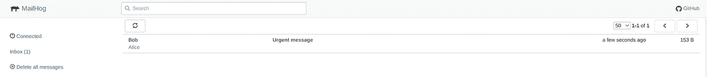
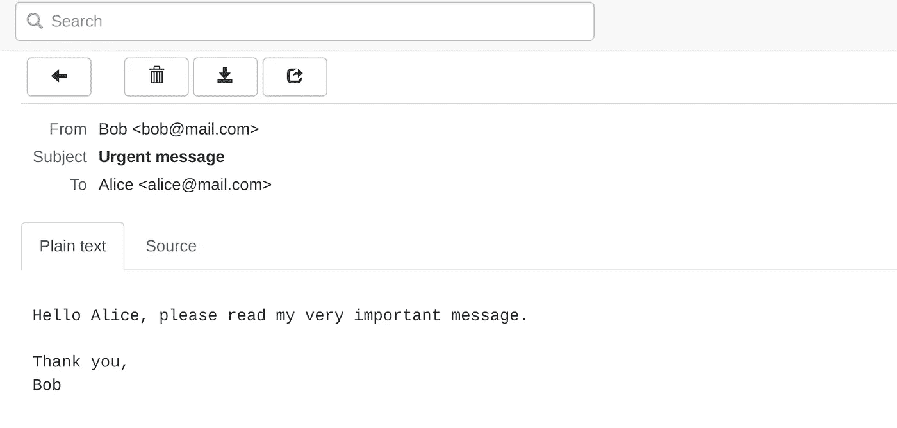
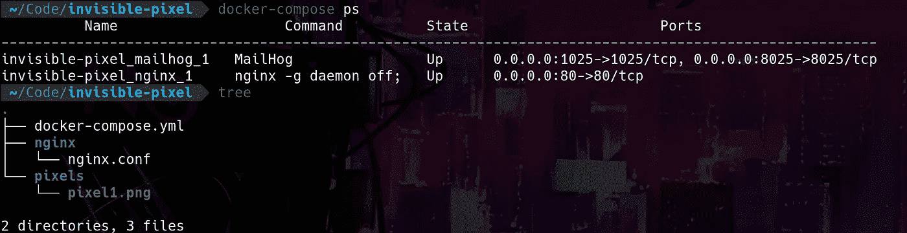
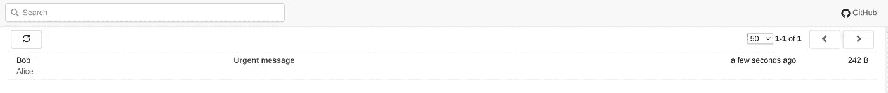
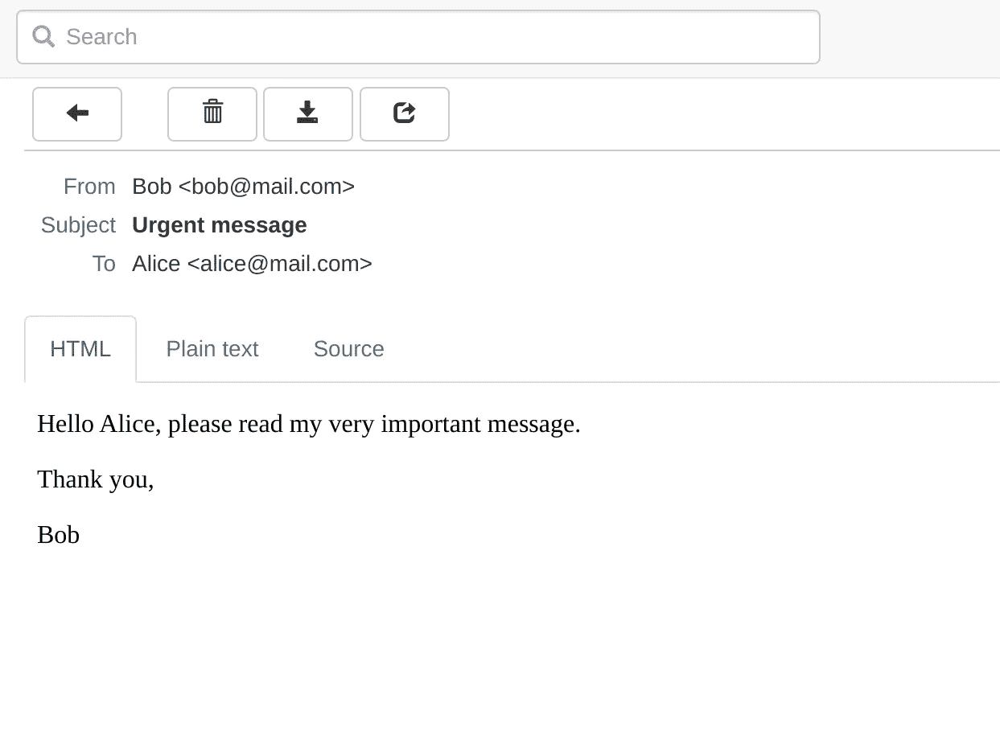
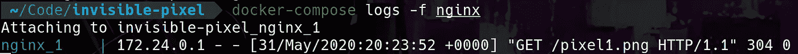

# 电子邮件的隐私从来就不存在，这就是它们被追踪的方式

> 原文：<https://levelup.gitconnected.com/privacy-on-emails-never-existed-and-this-is-how-they-are-tracked-748c3c5f049c>

## 互联网追踪收藏

## 我将介绍不可见像素技术，这是一种广泛使用的电子邮件跟踪技术，并快速实现，以便您可以在实践中看到它。


作者图片

# 什么是电子邮件跟踪，为什么要关注它？

隐私是一个非常热门的话题，现在比以往任何时候都更热门。为什么隐私对我们所有人来说都是一项重要的权利，原因因人而异。不管我们在乎与否，互联网上流传的大多数电子邮件都以这样或那样的方式被跟踪，我认为提高对这种跟踪如何工作的认识很重要，这样我们就可以意识到这一点，从这个意义上说，如果这是我们的决定，那么收回我们的隐私。本文的目的不是制作一个复杂的电子邮件跟踪系统，而是通过一个非常简单但真实的例子用代码展示如何实现这一点，这样我们就知道了它背后的基本概念。再次声明，本文是出于**教育目的**。

# **什么是隐形像素，为什么人们会使用它？**

不可见像素是一种知道谁在访问资源的方法，在某种程度上，它对访问资源的用户是透明的，这对于知道电子邮件何时被阅读特别有用。被跟踪的人不知道跟踪正在发生，这使它成为一种模糊的技术，我们至少可以认为是潜在的不必要的。它通常用于衡量电子邮件活动的成功，或用于个人用途，即当我们的收件人阅读我们的电子邮件时，尽管据我所知，它不是一种具有法律约束力的技术来确保邮件被阅读(也不应该被阅读)。

# **这个方法是如何工作的？**

事情是这样的。电子邮件格式非常古老，而且在设计时从未考虑到安全性。它基本上由一些标题和一个主体组成，很像 HTML，它的主体实际上可以呈现 HTML，所以我们可以看到格式优美的电子邮件，而不是那些难看的纯文本。恶心！(注意这里的*讥讽*)。除了文本，电子邮件正文还有其他资源，比如图像。这些资源可以是嵌入式的，通常以 base64 编码，也可以存储在我们必须检索的远程位置，这是整个电子邮件跟踪技术的关键。

当我们打开一封电子邮件时，我们通常会有一些链接指向远程位置的资源，如图标或图像。默认情况下，大多数电子邮件客户端会自动下载这些资源并显示给用户，这非常方便，也是我们理所当然的事情。但是现在想象一下下面的场景:

> 如果我们控制了这些资源所在的服务器，我们就可以等到它们被请求，在那一刻我们就知道包含它们的邮件已经被打开了。

这就是技巧，不多不少。剩下的唯一一件事就是让我们发送的每封邮件保持一致，以一种读邮件的人看不见的方式。为了实现这一点，一个非常常见的技术是在我们的电子邮件正文中包含一个大小为 1x1 像素的图像，称为**不可见像素**。在白色背景的电子邮件中，这张图片很难被人注意到，人眼也分辨不出来(嗯，这是非常明显的)。



这封邮件里有一个看不见的像素，但是我已经把它涂成红色了。你能发现它吗？

# **安全 vs 用户体验**

最好的(或最坏的)部分是，它利用了完全合法的电子邮件机制，以一种非设计的方式利用它。而且，就像在大多数网络安全案例中一样，它之所以有效，是因为在安全性和便利性之间存在一种权衡，这是我们不愿意假设的。大多数(如果不是全部)电子邮件客户端和 web 应用程序都提供了禁用外部资源自动下载的选项，完全避免了这种跟踪技术的发生。但总的来说，我们都觉得这很不方便，这就是为什么它在大多数客户端默认是禁用的。有一些精明的例外，现在你可以想象为什么那些邮件客户端不是主流了。

# **它有合法用途**

不可见像素技术通常用于我们收件箱中收到的每一封电子邮件。大多数情况下，它不是这种晦涩的技术，而是另一种变体，其中商业电子邮件中包含的许多资源都是出于跟踪目的而制作的。其目的是衡量电子邮件活动的成功程度，或者获得对营销活动的可观察性非常有用的参与度指标。此外，我们可以就这种技术对我们的隐私有多大影响展开辩论，特别是当其他技术已经采用了对发送的消息进行[跟踪，并且得到了非常顺利和广泛的接受。](https://www.business-standard.com/article/news-ani/whatsapp-introduces-new-double-blue-tick-feature-that-lets-users-know-when-messages-are-read-114110700275_1.html)

# **我们如何检测和避免不可见的像素？**

虽然我们不能确保这种技术是否被应用，但某人在他们的电子邮件中包含 *1x1 像素白色图像*的可能性非常小，因此我们可以假设当这种情况发生时，不可见像素技术正在被应用。通过查看电子邮件的源代码，我们可以发现正在下载的所有资源。所有这些链接都是潜在的追踪者，如果它们指向一个与营销有关的网站，可能性就会增加。我们可以通过禁用电子邮件资源的自动获取或自动下载来避免这种跟踪技术。我们必须意识到这会让我们的电子邮件阅读体验变得不那么愉快，但这是要付出的代价。这总是取决于我们。

这就是不可见像素的方法。假设你邮箱里收到的所有东西都是用来跟踪你的。被不被跟踪是你的选择。

# docker + nginx + mailhog 的工作示例



docker + nginx + mailhog 的例子

# 跟踪基础设施:容器和 docker-compose

我们在这里会有一点技术性。为了实现不可见像素(或任何变体)的技术，我们需要一点基础设施。在这种情况下，由于这是一个概念验证，我们将把它保持在最低限度。我们将使用 docker-compose 运行几个容器，所以没有必要在我们的计算机中安装任何额外的东西。我们将利用两个服务:一个包含可下载资源的 web 服务器，以及一个接收和转发电子邮件的 SMTP 服务器。在我们的例子中，我们将分别使用 *nginx* 和 *mailhog* 的图像，因为它们的安装和使用非常简单。

# SMTP 服务器:Mailhog

Mailhog 是一个集成的 SMTP +电子邮件客户端 web 应用程序，由于其设置和运行简单，经常在开发中使用。它还不能运行生产 SMTP 服务器，因为它缺少邮件传输代理(MTA)通常实现的功能。但对我们来说是完美的。所以现在，我们需要为项目创建一个新的文件夹，并创建文件 *docker-compose.yml* ，它将包含运行我们的容器化服务的声明。此刻，它会是这个样子。

```
version: "3"services:
  mailhog:
    image: mailhog/mailhog
    ports:
      - 1025:1025  # smtp server
      - 8025:8025  # web ui
```

非常简单，我们将从[dockerhub.com](https://hub.docker.com/r/mailhog/mailhog/)获取 mailhog 的映像，并使用映射到本地主机的指定端口运行它。当我们从 dockerhub 运行 docker 镜像时，我们应该总是阅读如何部署它。因此，如果我们以`docker-compose up -d mailhog`开始堆栈，用浏览器导航到`localhost:8025/`，我们已经可以看到空的 mailhog 收件箱。



我们的空邮箱运行在一个容器内

# 向 localhost 发送电子邮件:mhsendmail

由于我们在本地主机上运行 SMTP 服务器，我们无法从 gmail 或 yahoo 等电子邮件提供商发送电子邮件，因为我们无法从互联网访问本地主机，也没有办法知道如何将包裹从 gmail 路由到我们的机器。所以我们需要一种方法向运行在`localhost:1025`上的 SMTP 服务器发送消息。我们如何做到这一点？嗯，mailhog 有一个非常方便的工具，叫做`mhsendmail`,它让我们格式化一个原始消息，并准确地将它发送到默认情况下运行在 localhost 上的 SMTP 服务器，这正是我们现在的情况。所以我们先安装程序。我使用的是 Arch Linux，所以我可以在 Arch 用户存储库中找到这个包，但是在任何其他操作系统中也很容易找到这个包。



这种包装在 AUR 很容易找到

> 注意:如果你想知道我在 Arch Linux 中用来保持我所有的包井井有条的系统，我推荐你查看[这篇文章](https://medium.com/@msebas5/how-i-painlessly-migrate-my-linux-packages-f4f0d5e91191)，其中我解释了别名`*search*`、`*install*`和`*uninstall*`的用法，你可能会在我的一些文章中看到。

所以让我们试着给自己发一封电子邮件。提醒一下，电子邮件基本上是由一些标题和正文组成的纯文本。因此，让我们伪造一封 Bob 给 Alice 的电子邮件，其中 Bob 希望在 Alice 打开电子邮件时得到通知。

```
$ mhsendmail test@mailhog.local <<EOF                                                                                                                                                 
From: Bob <[bob@mail.com](mailto:bob@mail.com)>
To: Alice <[alice@mail.com](mailto:alice@mail.com)>
Subject: Urgent messageHello Alice, please read my very important message.Thank you,
Bob
EOF
```



Bob 发送的邮件出现在 Alice 的收件箱中



这是爱丽丝打开的邮件

# 设置捕熊陷阱:Nginx

现在 Bob 可以给 Alice 发送一封电子邮件，他想在他控制的某个地方设置一个可下载的资源。为此，他可以设置一个服务器，比如用 *nginx* ，就像我们现在要做的。首先，将 *nginx* 包含在 *docker-compose.yml* 中，作为一个新服务。一如既往，建议[在 dockerhub.com](https://hub.docker.com/_/nginx)中查找图像，并阅读说明。 *docker-compose.yml* 中的声明现在看起来像这样:

```
version: "3"services:
  mailhog:
    image: mailhog/mailhog
    ports:
      - 1025:1025 # smtp server
      - 8025:8025 # web uinginx:
    image: nginx:latest
    volumes:
      - ./pixels:/pixels
      - ./nginx/nginx.conf:/etc/nginx/nginx.conf
    ports:
      - 80:80
```

这里有几件事，我们将容器的端口 80 映射到 localhost，它将接收 http 连接，我们创建两个命名卷:一个包含`nginx.conf`文件，其中包含运行 web 服务器的路由和策略，另一个是包含可下载资源的`pixels/`文件夹。然后，我们将在`nginx/nginx.conf`中创建一个文件，内容如下:

```
events {}http {
  server {
    listen  80;
    location ~ {
      root  /pixels;
    }
  }
}
```

这个配置将 nginx 配置为在`/pixels/`文件夹中查找与`http://localhost/{file}` /中的`{file}`同名的文件名，该文件夹安装在容器的根目录下。这将让我们在不同的电子邮件中请求不同的内容，所以我们确切地知道哪个电子邮件被打开了。因此，如果我们现在做`docker-compose up -d`，我们应该为 SMTP 服务器和 web 服务器这两个服务部署堆栈。

然后，我们将把一个名为`pixel1.png`的文件放在我们项目的目录`pixels/`下，记住，它被映射到我们 web 服务器内的目录`/pixels/`。我发现这个[非常酷的网站](http://www.1x1px.me/)就是这么做的。记住，对于我们想到的大多数事情，都有一个人已经做到了，并且放到了网上。



我们小小的跟踪基础设施已经建立并运行

# 发送电子邮件

让我们回顾一下到目前为止我们所拥有的。爱丽丝拥有一个电子邮件地址，鲍勃能够给爱丽丝发送电子邮件。Bob 是 nginx 服务的所有者，他可以完全控制放置任何可下载的内容。然后，Bob 的目标是给 Alice 发送一封电子邮件，因为他能够知道该电子邮件何时被打开。

正如我们前面看到的，电子邮件格式有标题和正文。电子邮件正文直接接受 HTML，由电子邮件客户端呈现，无需用户交互。我们通过添加一个新的标题来表明这一点:`Content-type: text/html`它表明消息的正文应该像 HTML 一样阅读。然后，我们将在电子邮件的正文中包含一个 1x1 像素的图像，如果 Alice 启用了“自动下载外部资源”,这将在打开电子邮件时下载，这对大多数用户来说都是如此。让我们将资源作为远程图像发送给 Alice:

```
$ mhsendmail test@localhost <<EOF                                                                                                                                                     
From: Bob <[bob@mail.com](mailto:bob@mail.com)>
To: Alice <[alice@mail.com](mailto:alice@mail.com)>
Subject: Urgent message
Content-Type: text/html<p>Hello Alice, please read my very important message.</p><p>Thank you,</p>
<p>Bob</p>

EOF
```



收件箱中的新邮件



新邮件，但这次它包含一个不可见的像素



当电子邮件打开时，发件人会收到通知

通过这个实验，我们可以自己制作一个简单的电子邮件跟踪基础设施。这个例子非常简单，但是有些公司以此为生，并提供电子邮件跟踪服务。在此基础上，您可以做很多事情，比如仪表盘、其他(更好)类型的下载资源、人工智能等等。我希望这本书读起来和写起来一样有趣。

享受乐趣和隐私！
马科斯