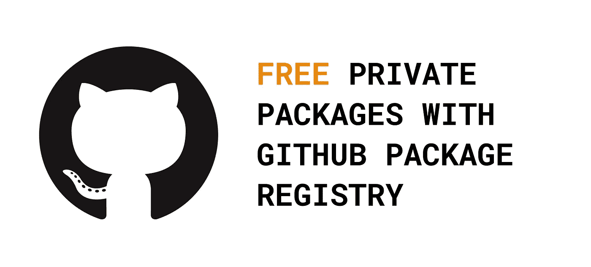
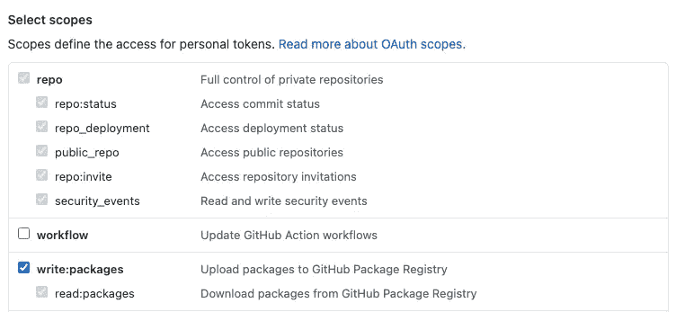
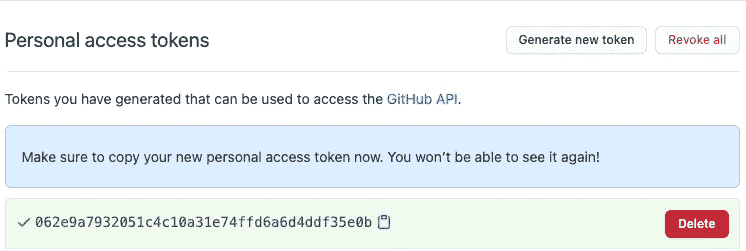

# Github 包注册表中的私有 npm 包

> 原文：<https://levelup.gitconnected.com/private-npm-packages-in-github-package-registry-fbfda43acab3>



所以你已经到了你的开发者中的一个点，你似乎在多个项目中重复和/或复制粘贴相同的代码。它可能是一些实用函数，对您喜欢用代码做事情的方式非常有帮助，或者它可能是一组类型脚本类型，您希望您的前端和后端代码共享—无论在什么情况下，您都可能希望创建自己的 npm 包。

如果你偶然来到这里，你可能会问:“为什么不用 npmjs.com？”如果你不介意你的包是公开的，当然可以，但是，那里的私有包会花你钱，不是很多，而是一些，Github 包注册表不是这样。

## 创建包

对于这个例子，我们将使用[https://tsdx.io/](https://tsdx.io/)来搭建我们的包，这很简单，因为当你想从头开始设置一个 typescript 项目时，它负责所有通常需要的配置:

```
npx tsdx create mylib
```

您将有几个选项可供选择，但这不会影响您以后发布包的方式。安装完成后，您需要:

```
cd mylib
```

并在代码编辑器中打开该目录。

## 将包放在 Github 存储库中

为此，你需要前往[https://github.com/](https://github.com/)(并创建一个帐户，如果你还没有的话)，创建一个新的库并把我们的包代码推送到这个库。

## 授权在注册处发布

对于这一步，您需要生成一个 github 令牌，允许我们稍后发布。为此，转到[https://github.com/settings/tokens](https://github.com/settings/tokens)并按下“生成新令牌”,并确保为令牌分配以下范围:



图一。发布包所需的范围

点击“生成令牌”后，您将看到这样的令牌，请确保在离开之前记下它:



图二。您的 Github 令牌

## 向您的回购协议添加令牌

在这里你要做两件事:

1.  在存储库的根目录下创建一个名为`.npmrc`的文件，并将内容设置为:

```
@YOUR_GITHUB_USERNAME:registry=https://npm.pkg.github.com/YOUR_GITHUB_USERNAME//npm.pkg.github.com/:_authToken=YOUR_GITHUB_TOKENregistry=https://registry.npmjs.org
```

并分别填写`YOUR_GITHUB_USERNAME`和`YOUR_GITHUB_TOKEN`。

2.打开`package.json`，这也是你的库的根，更改`name`的值，并在`name`下面添加`repository`条目(再次注意，用所有大写字母填写占位符值):

```
"name": "@YOUR_GITHUB_USERNAME/PACKAGE_NAME","repository": "git://github.com/YOUR_GITHUB_USERNAME/REPO_NAME.git",
```

## 从终端登录到 npm

运行:

```
npm login --scope=@YOUR_GITHUB_USERNAME --registry=[https://npm.pkg.github.com](https://npm.pkg.github.com/)
```

在您的终端中，系统会提示您提供以下信息:

```
Username: YOUR_GITHUB_USERNAME
Password: YOUR_GITHUB_TOKEN
Email (this IS public): YOUR_EMAIL
```

如果登录已经成功，你会在下一行中出现如下消息:

```
Logged in as YOUR_GITHUB_USERNAME on [https://registry.npmjs.org/](https://registry.npmjs.org/).
```

## 发布包的版本

这一步非常短，只需运行`npm publish`，剩下的就交给`tsdx`了。一旦成功，终端中的最后一行应该如下所示:

```
[@](http://twitter.com/jacobdo2/mypackage)YOUR_GITHUB_USERNAME[/Y](http://twitter.com/jacobdo2/mypackage)OUR_PACKAGE_NAME@0.1.0
```

首先，如果你做了一些修改并想发布一个新版本，你需要做两件事——确保你想发布的修改已经提交，进入`package.json`并相应地修改版本号。请参考这个，了解更多关于版本的信息:[https://semver.org/](https://semver.org/)。

现在，如果您读到“进入`package.json`并相应地更改版本号”并感到有点恶心，不要担心——这是正常的反应。请随意调查 https://www.npmjs.com/package/np 的情况。你很快就会感觉好起来。

## **消费你的套餐**

首先打开项目，您想在其中使用您新创建的包。因为它不是仅仅存在于 npmjs 中的任何旧的常规包，我们需要让我们的项目知道在哪里寻找这个包。

对于消费者项目的根，我们再次需要创建一个名为`.npmrc`的文件，并将该文件的内容设置为:

```
//npm.pkg.github.com/:_authToken=YOUR_GITHUB_TOKENregistry=https://npm.pkg.github.com
```

最后，跑`npm install @YOUR_USERNAME/YOUR_PACKAGE_NAME@0.1.0`，从此幸福生活🙃