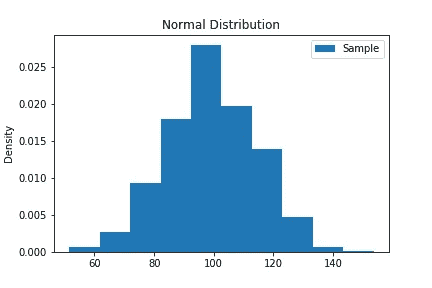
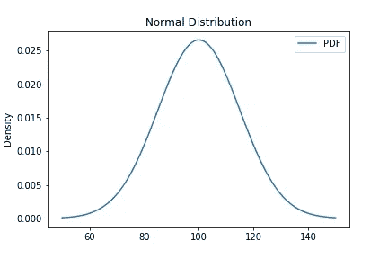
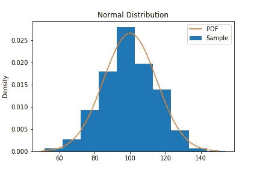
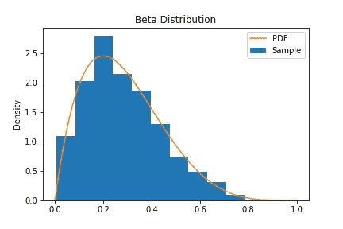
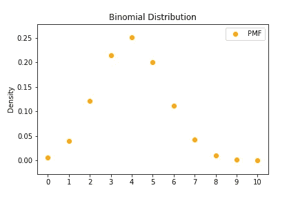
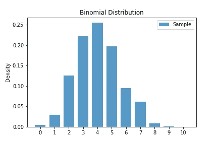
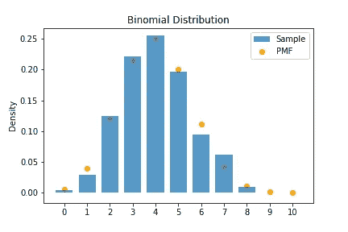
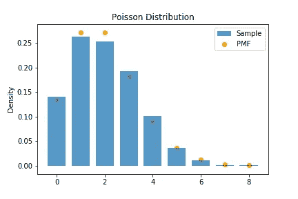

# 使用 SciPy 的概率分布

> 原文：<https://levelup.gitconnected.com/probability-distributions-using-scipy-58fdab53d7ac>

在这篇文章中，我将向你展示如何使用`SciPy`来处理概率分布。我们将从导入相关的包开始。

```
import scipy.stats as stats
import numpy as np
%matplotlib inline
import matplotlib.pyplot as plt
```

`sciPy`的`stats`模块提供了许多发行版，所以你一定会找到你想要的。它们分为三类:连续、离散和多元。这里是[完整列表](https://docs.scipy.org/doc/scipy/reference/stats.html)。在这篇博文中，我们将关注(两个)连续分布和(两个)离散分布。

## 连续分布

我们将从可能是最著名的分布开始:正态(高斯)分布。

我们从创建一个`stats.norm`类的实例开始，将这个对象初始化为平均值 100 和标准偏差 15:

`normal=stats.norm(loc=100, scale=15)`

接下来，我们可以通过在这个对象上调用方法`.rvs(size=10)`来生成 10 个随机数，从而生成一个随机样本。

```
normal.rvs(size=10,random_state=143)
>> array([ 87.50268488, 118.56536514,  62.86403442,  84.42053641,
       114.91967271, 102.67337385,  92.6638058 ,  93.36867073,
        96.22587266,  92.97029531])
```

`random_state=143`只是为了使结果具有可重复性。如果包括这个，这个结果永远是一样的。如果您想重复并得到不同的结果，只需省略它，这样您的代码就会显示为`normal.rvs(size=10)`。

那很容易！现在从这个分布中产生 1000 个随机数，并制作一个直方图。

```
normal_sample = normal.rvs(size=1000,random_state=123)
plt.hist(normal_sample,density=True,label="Sample")
plt.title("Normal Distribution")
plt.ylabel("Density")
plt.legend()
plt.show()
```

这是结果。



从正态分布生成 1000 个随机数的直方图。

现在让我们把注意力放在概率密度函数上。使用我们创建的同一个(分布)对象，我们可以通过方法`.pdf`访问 PDF。第一个参数可以是值数组的标量。

```
print(normal.pdf(120))
print(normal.pdf([120,130,140]))
>> 0.010934004978399577
>> [0.010934   0.0035994  0.00075973]
```

接下来，让我们看看如何绘制 PDF。首先为水平轴创建一些值。我们将使用`np.linspace(start,stop,num)`在`start`和`end`之间生成等间距的`num` 数字。我们案例的相关值似乎在 50 到 150 之间:`t.np.linspace(50,150,100)`。这些将作为绘图的水平(x)值。

为了获得垂直(y)值，我们可以计算这些值的 PDF:`normal.pdf(t)`。下面我们有代码把所有这些放在一起，给我们一个正常的 PDF 绘图。

```
t = np.linspace(50,150,100)
plt.plot(t,normal.pdf(t),label="PDF")
plt.legend()
plt.show()
```



正常 PDF 的绘图

最后，我们可以将它覆盖在直方图的顶部，看看随机数生成器做得有多好！



正态分布样本的直方图和相应的 PDF 图

看起来不错！

另一个流行的发行版是 Beta 发行版。这也是一个连续分布，用于模拟 0 到 1 之间的随机变量。例如，如果随机变量是成功的概率，那么这可能是一个很好的分布。beta 分布有两个参数，a 和 b。因此，为了在`scipy`中创建一个 Beta 分布对象，我们把`beta=stats.beta(a=2,b=5)`。下面的代码从这个分布中生成一个随机样本。

```
beta=stats.beta(a=2,b=5)
beta.rvs(size=5,random_state=133)
>>array([0.13580999, 0.55628319, 0.39061464, 0.51549706, 0.3439727 ])
```

像以前一样，让我们从这个分布中得到 1000 个数字，制作一个直方图并覆盖它的 PDF。

```
beta_sample=beta.rvs(size=1000,random_state=133)
t=np.linspace(0,1,100)
plt.hist(beta_sample,density=True,label="Sample")
plt.plot(t,beta.pdf(t),label="PDF")
plt.legend()
plt.ylabel("Density")
plt.title("Beta Distribution")
plt.savefig("beta_hist_pdf.png")
plt.show()
```



贝塔分布的样本直方图和相应的 PDF 图

## 离散分布

有时，我们需要处理离散分布。我们将演示两个:二项式和泊松。二项式分布用于模拟重复试验的成功次数，其中每次试验可能导致“成功”或“失败”，每次试验的成功概率保持不变，试验相互独立，最终试验次数预先固定。一个典型的例子是投掷固定次数的硬币。下面是我们如何在`scipy`中得到二项式分布对象并生成一些随机数:

```
binomial=stats.binom(n=10,p=0.4)
binomial.rvs(size=10,random_state=143)
>> array([5, 3, 4, 4, 4, 6, 1, 1, 3, 2])
```

请记住，离散分布没有 PDF。相应的函数是概率质量函数或 PMF。在`scipy`中，我们可以如下访问分配对象的该功能:`binomial.pmf`。就像 PDF 一样，我们可以计算单个数字或一系列数字的 PMF。

```
binomial.pmf(2)
binomial.pmf([2,3,4])
>>> 0.12093235199999994
>>> [0.12093235 0.21499085 0.25082266]
```

接下来，让我们绘制 PMF。既然是离散的，我们就用`plt.scatter`代替`plt.plot`。此外，PMF 是零，除非这个分布恰好是 0，1，2，…，10。我们将使用`np.arange(start,stop,step=1)`生成离散集合的值，而不是使用`np.linspace`从连续范围生成数字。对我们来说，这将是

```
t=np.arange(0,11)
t
>> array([ 0,  1,  2,  3,  4,  5,  6,  7,  8,  9, 10])
```

注意，我们必须用`np.arange(0,11)`代替`np.arange(0,10)`，因为它不返回最后一个数字。现在，利用这些值，我们可以画出二项式分布的 PMF。

```
plt.scatter(t,binomial.pmf(t),label="PMF",color="Orange")
plt.title("Binomial Distribution")
plt.ylabel("Density")
plt.legend()
plt.xticks(t)
plt.show()
```



二项分布的 PMF 图。

现在，我们将从这个分布`binomial_sample=binomial.rvs(size=1000,random_state=143)`中生成 1000 个随机数，并创建一个直方图。由于我们处理的是离散数字，我们必须添加一些选项来控制直方图的计算方式:

*   `bins=11`确保我们有 11 个箱子，每个箱子对应一个数字 0，1，…，10
*   `range=(0,11)`确保各个类别为[0，1]，[1，2)，…，[10，11)
*   `align='left'`确保该条与 PMF 对齐(稍后当我们覆盖所有内容时，您会看到原因。
*   `rwidth=0.75`所以直方图的条是类宽度的 75%。这将确保条形图不会相互接触，以表明我们正在处理离散数据。
*   `alpha=0.75`这样条形是半透明的，使覆盖看起来很漂亮。

这是完整的代码。

```
binomial_sample=binomial.rvs(size=1000,random_state=143)
plt.hist(binomial_sample,bins=11,range=(0,11),density=True,align='left',rwidth=0.75,label="Sample",alpha=0.75)
plt.title("Binomial Distribution")
plt.ylabel("Density")
plt.legend()
plt.xticks(t)
plt.show()
```



来自二项式分布的 1000 个随机数的直方图

最后，下面是将 PMF 和直方图放在一起的代码。

```
binomial_sample=binomial.rvs(size=1000,random_state=143)
t = np.arange(0,11)
plt.hist(binomial_sample,bins=11,range=(0,11),density=True,align='left',rwidth=0.75,label="Sample",alpha=0.75)
plt.scatter(t,binomial.pmf(t),label="PMF",color="Orange")
plt.title("Binomial Distribution")
plt.ylabel("Density")
plt.legend()
plt.xticks(t)
plt.show()
```



来自二项式分布的随机样本的直方图和相关的 PMF 图

泊松分布在实践中也非常常用。它用于模拟在固定持续时间(或空间)内发生的事件(如车祸)数量。这个随机变量可以取的值是 0，1，2，…(它永远持续下去)。在`scipy`中，我们可以通过`stats.poisson(mu=2)`设置一个泊松分布对象。生成随机数就像其他分布一样:

```
poisson.rvs(size=10,random_state=143)
>> array([2, 3, 0, 1, 1, 0, 2, 2, 0, 1])
```

基于我们上面所做的一切，我们可以从这个分布中生成 1000 个随机数，绘制直方图，并将 PMF 一起绘制在同一个图上。在查看下面的代码之前，尝试自己完成这项工作。为了鼓励你，我先展示最终结果，然后是代码。



泊松分布中随机样本的直方图和相关的 PMF 图

```
poisson_sample = poisson.rvs(size=1000,random_state=143)
end = np.max(poisson_sample)+1
t=np.arange(0,end)
plt.hist(poisson_sample, bins=end,range=(0,end), density=True,align='left', rwidth=0.75,label="Sample", alpha=0.75)
plt.scatter(t,poisson.pmf(t),label="PMF",color="Orange")
plt.title("Poisson Distribution")
plt.ylabel("Density")
plt.legend()
plt.show()
```

这里一个棘手的部分是，由于泊松随机变量的支持是没有尽头的，我们必须决定在哪里停止计算。对我们来说，这将是我们样本数据的最大价值；因此，我们`end=np.max(poisson_sample)+1`。

这里有一个链接指向包含这篇文章所有代码的要点。

我希望你喜欢这篇文章！