# 用 NumPy 研究数据科学的概率

> 原文：<https://levelup.gitconnected.com/probability-for-data-science-with-numpy-7e76e5e65910>

## 数据科学的数学

## 介绍 Python 的 NumPy 解决概率问题！

由[特里·维里斯迪斯](https://unsplash.com/@vlisidis?utm_source=unsplash&utm_medium=referral&utm_content=creditCopyText)在 [Unsplash](https://unsplash.com/s/photos/chance?utm_source=unsplash&utm_medium=referral&utm_content=creditCopyText) 上拍摄的照片

Python 为我们提供了“n”个工具来进行统计分析。熊猫和 NumPy 就是其中的两个。Pandas 允许我们分析数据框中的数据，并对数据集执行各种方法。另一方面，NumPy 或 Numerical Python 让我们可以在几秒钟内完成高级计算，也就是科学计算。

在前一系列文章中，我已经介绍了概率、推断统计、描述统计和回归概念。现在我想在编程接口中把它们结合在一起。

> 你如何应用二项分布？你会如何在 Jupyter 笔记本中使用贝叶斯法则？

Numpy 让我们做所有的事情！但是，为此，我们必须了解一些 NumPy 方法以及如何逐一使用它们。

## **介绍 numpy.random**

根据 [NumPy 的官方文档](https://numpy.org/doc/1.18/reference/random/index.html)，NumPy 的随机数例程使用组合 a `**BitGenerator**`创建序列和使用这些序列从不同的统计分布中采样的`**Generator**`来产生伪随机数。

其中位生成器生成随机数，生成器将来自位生成器的随机位序列转换成遵循特定概率分布的数字序列。

您可以使用 Numpy 的随机数例程来解决概率问题。先从基础的开始吧。

## **random.randint**

> 例如，我们有一枚硬币，想知道掷硬币的结果。

我们要用“ ***randint*** ”来做这道基础概率题。Numpy 的"***random . randint***"取一个整数范围，并从该范围返回一个随机数。

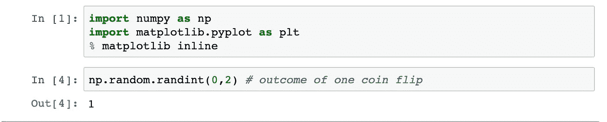

我选择了一个范围[0，2]，即 0 和 1 个可能的结果。我说“ **0** 是头，“ **1** 是尾。当第二个单元运行时，它返回一个表示“**Tail”**的数字。

您还可以将 size 作为一个参数来给出“n”个事件。得到 n 个结果的数组。如果你看看两个结果的平均值，两个数字都有近 50%的比例，即公平硬币。

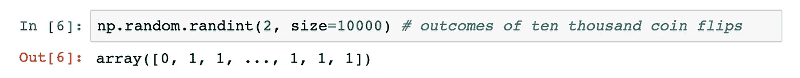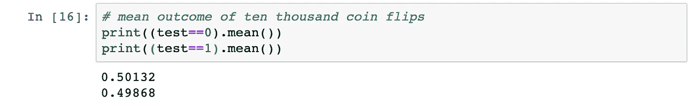

## 随机选择

> 我们的硬币有偏差，现在怎么办？

如果我们要计算一枚有偏差硬币的概率。我们必须从“**randint”**跳到“**choice”**的方法。**选择**方法从给定的一维数组中生成随机样本。但是，您可以给出与传递的 ndarray/int 中的每个条目相关的概率。

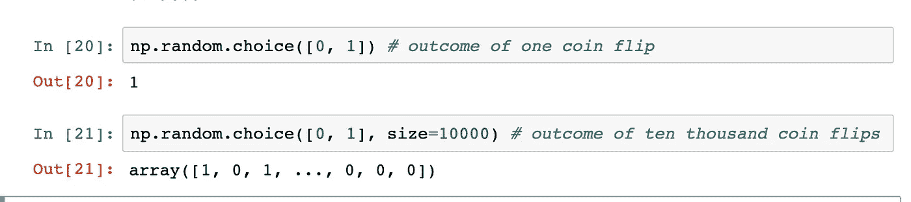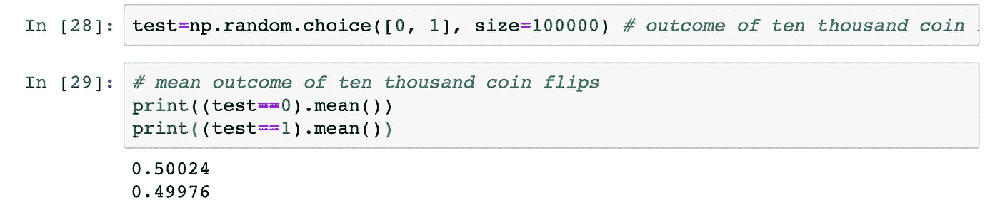

使用“**选择**方法并保持硬币公平，结果类似于“ **randint** ”结果。现在，让我们拿一个正面概率为 0.8 的有偏向的硬币？

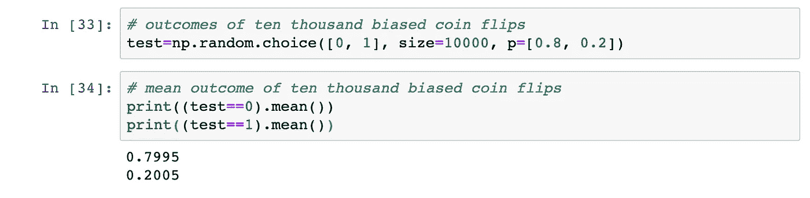

通过传递“**p**”参数和它的偏置，我们可以看到我们的输出反映了同样的情况—大约 80%的正面！

## 随机二项式

> 如果我们把 10 个硬币翻转 1 万次会怎么样？得到 4 个头的概率会有多大？

像这样的问题是不能用上面提到的任何一个函数来解决的。如果你注意到了，就是“二项分布”的情况。并且，对于二项式分布问题，Numpy 有自己的“二项式”方法。它模拟事件的数量“n ”,每个事件都有成功的概率“p”。在掷硬币的情况下，“n”是掷硬币的次数，“p”是成功的概率，即 0.5。

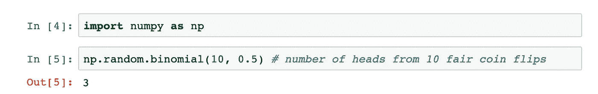

结果显示我们在 10 次抛硬币中有 3 次正面朝上。与上面提到的两个函数不同，它只是返回一个整数，表示我们有这么多头——在我们的例子中是 3 头。

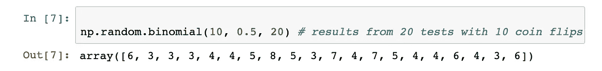

现在，我们将 10 枚硬币抛 20 次，我们得到了一个 20 个结果的列表，显示了每次测试中的人头数。如果你从左边看，6 是第一次抛硬币测试的人头数，第二次是 3，以此类推。

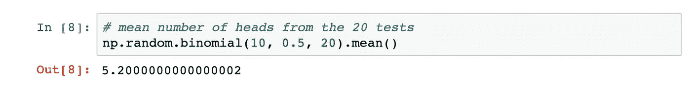

因为我们的硬币是公平的，所以在每次“ **10 次抛硬币**”测试中，我们平均得到 5 个正面。这是对随机事件的模拟，因此它们不一定总是等于 5。但是，随着测试次数的增加，模拟会更好地反映硬币的公平性。

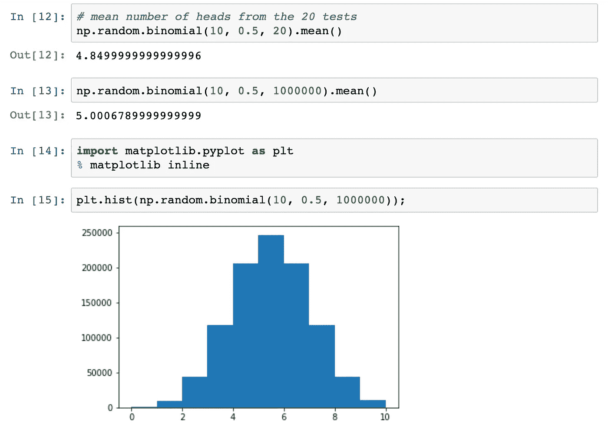

只要看看测试次数为 20 次和 100 万次时硬币的公平性之间的差异就知道了。你可以看到随着测试的增加，模拟的公平性也增加了。

## 使用熊猫的贝叶斯规则

如何应用贝叶斯法则或条件性质解题？

对于这样的问题，你可能不会去深究数字的概念。相反，熊猫可以帮助我们对数据集做同样的事情。我们有一个“癌症”数据集，其中有“患者 ID”、“测试结果”和“has_cancer”列。

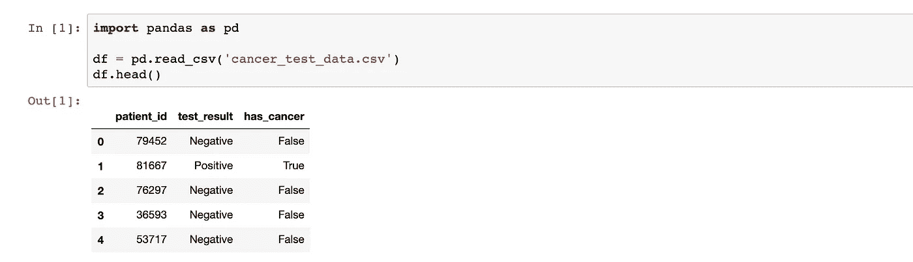

让我们从数据集中找出一些常见的答案，如患癌和未患癌患者的数量。

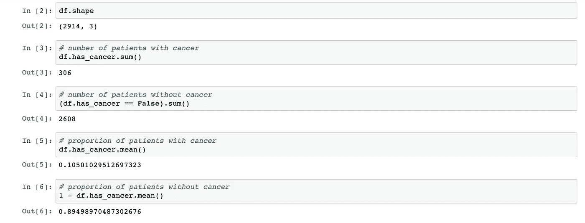

数据集中总个体的 10.5%患有癌症，而 89.5%没有。这为我们指出一个新患者有 10.5%的机会可能患有癌症奠定了基础。

但是，如果一个人患有癌症，但测试结果呈阴性，或者反之亦然。

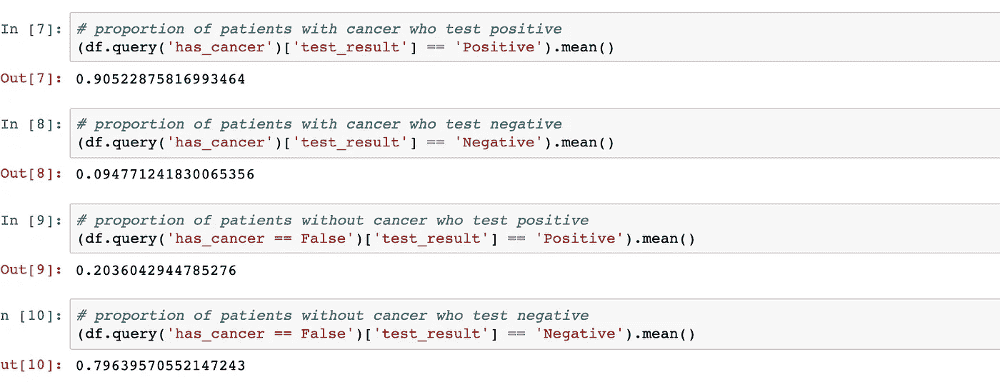

90%的癌症患者检测呈阳性。这 90%的观众来自 10%的癌症患者。另一方面，有 20%的人测试呈阳性，但没有癌症。

现在，我们已经得到了执行贝叶斯规则问题所需的所有变量。

> P(癌症)=0.105，P(非癌症)=0.895
> 
> P(阳性|癌)=0.905，P(阳性|非癌)=0.204，
> 
> P(阴性|癌)=0.095，P(阴性|非癌)= 0.796

> 患者患有癌症并被检测为阳性或 P(癌症|阳性)的概率是多少？

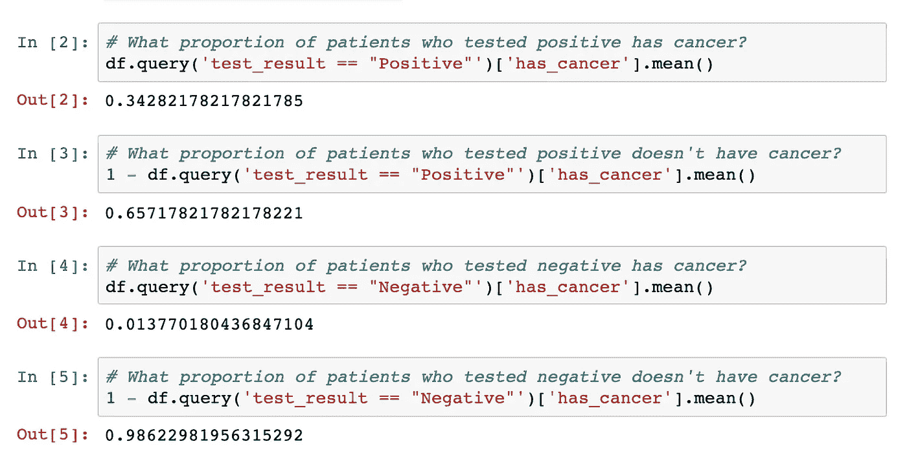

用熊猫，可以简单来解！例如，大约 34%的癌症患者被检测为阳性。而且，大约 66%的人被检测为阴性，但患有癌症。

现在，让我们使用贝叶斯规则并生成输出。

我们要求 P(癌|阳性)，我们有 P(癌)=0.105，P(阳性|癌)=0.905，P(阳性)=0.2772。

在公式中输入所有这些值后，我得到 P(癌症|阳性)=0.3428，即与我们上面使用 Pandas 计算的值相同。

## 摘要

我讲过用 Python 的 NumPy 解决概率问题。最终，你将不是在纸上而是在编程界面上解决数据科学问题。所以，开始解决吧！

**和平！**

 [## 数据科学的描述和推断统计学

### 推断性和描述性统计！

medium.com](https://medium.com/@essharmav/descriptive-and-inferential-statistics-for-data-science-e8b8b56b1ed2)