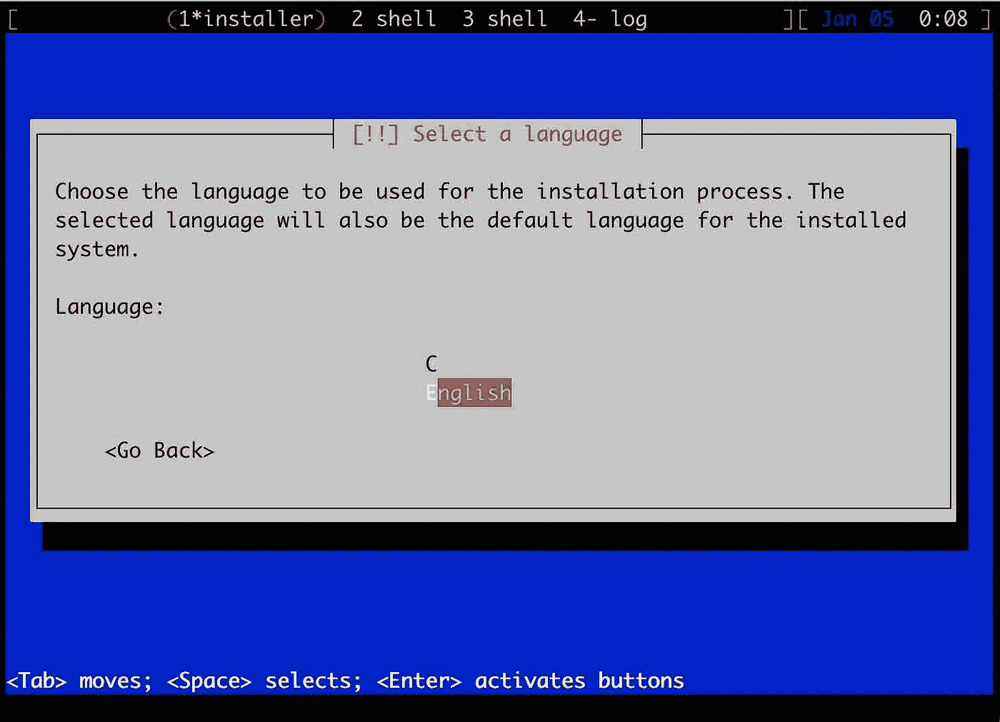

# 可能是在 QEMU 中安装 Debian/Ubuntu 最简单的方法

> 原文：<https://levelup.gitconnected.com/probably-the-simplest-way-to-install-debian-ubuntu-in-qemu-2db6afde27ef>

## 无需下载任何安装介质

有时，您可能需要快速启动一个虚拟机来进行一些测试或安全实验。典型的方法是下载安装介质(通常是一些 ISO 映像)，将其附加到 VM 实例，然后开始安装过程。然而，有一个更简单的解决方案可以通过网络在 QEMU 中引导 Debian/Ubuntu 安装，而不需要下载任何 ISO。

## Debian/Ubuntu 安装介质类型

谈到安装介质，Debian(及其衍生发行版 Ubuntu)为不同的需求提供了不同类型的安装介质:

*   完整的安装 CD 和 DVD 映像
*   用于网络安装的 CD 映像
*   用于网络安装的更小的 CD 映像(也称为`mini.iso`)

## 完整的 CD/DVD

Debian 通常为[提供两种版本的](https://www.debian.org/CD/http-ftp/#stable):一个 CD 镜像，大约 650 MB(实际上，对于`amd64`来说，当前稳定的“克星”镜像是 694 MB)和一堆高达 4.4 GB 的 DVD 镜像。对于一个简单的标准安装，我们应该可以使用 CD 镜像。即使我们需要额外的软件包并需要使用 DVD，Debian 建议只下载第一个 DVD 映像(在撰写本文时是第 1 个，共 3 个),如果安装程序需要的话，下载其余的。

[Ubuntu 图像](https://ubuntu.com/download)的分类有点不同:该项目提供了一个“桌面”图像，对于当前的 20 . 04 . 1 LTS“Focal Fossa”版本大约为 2.6 GB，以及一个“服务器”图像，大约为 914 MB！桌面映像是…嗯，如果我们想在桌面上安装 Ubuntu，服务器映像，你可能已经猜到了，是用于服务器安装的。主要的区别是桌面映像会默认安装一个图形用户界面，而服务器映像不会(尽管我们可以稍后安装)。另外值得一提的是，Ubuntu 安装镜像是[live CD](https://en.wikipedia.org/wiki/Live_CD):我们可以直接从 CD 上运行 Ubuntu，不需要安装。最后，Ubuntu 还提供了各种各样的“桌面”图像，带有不同的图形用户界面:Kubuntu 带有基于 KDE 的桌面，Xubuntu 带有基于 Xfce 的桌面，等等。顺便说一下，Ubuntu 的默认桌面是 GNOME。

## 网络安装映像

使用完整的 CD/DVD 通常只在特定情况下有用，例如:

*   我们希望一次供应多台机器(因此我们下载软件一次，并多次使用)。
*   在没有连接到互联网的机器上安装 Linux(在当今的互联世界中，这是非常不可能的用例——可能只对一些安全关键设置有用)。

对于简单的一次性安装，在几乎所有其他情况下，我们最好通过网络进行安装。这有两个主要原因:

*   使用网络安装，我们只下载我们真正需要的包:例如，如果我们想运行一个简单的 HTTP 服务器，我们不需要下载 GNOME 桌面(它将包含在完整的安装 CD 中)。
*   软件更新:现代 Linux 发行版定期发布软件更新(通常比他们制作安装光盘的频率高得多)，所以在光盘安装完成后，我们可能需要检查更新并下载一些软件包的新版本。通过网络安装，我们可以从一开始就获得最新最好的版本，而不是下载包后立即用新版本覆盖它们。

如果网络安装更好，为什么我们会有“网络安装光盘”？好吧，一台空机器(或一个 VM)不能独自完成复杂的操作系统安装，因为它是空的(没有软件)。我们需要安装软件来解决安装软件的鸡和蛋的问题。这些“网络安装光盘”提供的正是:一个启动安装程序的最小化的实时操作系统(Linux 也是)，它将为我们下载并安装完整的操作系统(通常允许我们在此过程中定制和个性化安装)。

如果我们搜索 Debian 网络安装，很可能我们会发现[这个页面](https://www.debian.org/CD/netinst/)让我们下载一个“最小启动光盘”通过网络安装 Debian。Debian 声称这些 CD 的大小应该在 150 MB 到 300 MB 之间，这取决于体系结构，但目前`amd64`的“克星”映像是 336 MB(仍然很多，但超过整个 CD 大小的一半)。

## 迷你 iso

如果你想知道为什么我们需要一个 336 MB 的 CD 镜像来引导一个简单的安装程序，它从互联网上下载软件包，你并不孤单。然而，Debian 和 Ubuntu 都提供了另一种安装介质，称为`mini.iso`(你可以在这里获得 Debian Buster one [)。这些确实要小得多(在`amd64`上安装 Debian Buster 只需要 48 MB)，但是同样可以很好地完成网络安装的工作。不过要找到它们有点困难，因为官方文档中没有太多指向这些图片的链接。然而，如果你需要安装 Debian/Ubuntu 并且你必须使用 ISO，我推荐`mini.iso`，因为它提供了一个真正最小的安装引导。](https://ftp.debian.org/debian/dists/buster/main/installer-amd64/current/images/netboot/mini.iso)

## 在 QEMU 中安装 Debian/Ubuntu，无需任何安装介质

48 MB 不错，但是什么更好呢？当然是 0 MB 啦！除了下载更少，我们还得到了在安装完成后没有这些剩余的垃圾 ISO 文件的好处。虽然这并不总是可能的，但是对于一个特定的用例“在 QEMU 中引导 Debian/Ubuntu VM”是完全可行的。

让我们创建一个 QEMU 磁盘映像，它将托管我们的安装(我们在下面创建一个 16 GB 的映像，但是您可以根据需要调整容量):

```
**$ qemu-img create -f qcow2 test.img 16G**
```

现在，如果我们用这个磁盘映像启动一个 QEMU VM，我们将看到如下所示的内容:

```
**$ qemu-system-x86_64 -nographic -m 4G -hda test.img**
SeaBIOS (version 1.12.0-1)

iPXE (http://ipxe.org) 00:03.0 C980 PCI2.10 PnP PMM+BFF900F0+BFED00F0 C980

Booting from Hard Disk...
Boot failed: not a bootable disk

Booting from Floppy...
Boot failed: could not read the boot disk

Booting from DVD/CD...
Boot failed: Could not read from CDROM (code 0003)
Booting from ROM...
iPXE (PCI 00:03.0) starting execution...ok
iPXE initialising devices...ok

iPXE 1.0.0+git-20190125.36a4c85-1 -- Open Source Network Boot Firmware -- http:/
/ipxe.org
Features: DNS HTTP iSCSI NFS TFTP AoE ELF MBOOT PXE bzImage Menu PXEXT

net0: 52:54:00:12:34:56 using 82540em on 0000:00:03.0 (open)
  [Link:up, TX:0 TXE:0 RX:0 RXE:0]
Configuring (net0 52:54:00:12:34:56)...... ok
net0: 10.0.2.15/255.255.255.0 gw 10.0.2.2
net0: fec0::5054:ff:fe12:3456/64 gw fe80::2
net0: fe80::5054:ff:fe12:3456/64
Nothing to boot: No such file or directory (http://ipxe.org/2d03e13b)
No more network devices

No bootable device.
```

我们的 QEMU VM 尝试先从磁盘引导，但是显然失败了，因为磁盘是新的，是空的。接下来，它试图从…软盘启动💾！虽然，甚至有一个表情符号，我不会在这里涵盖任何关于软盘(如果有人不知道软盘是什么，只需点击[这里](https://en.wikipedia.org/wiki/Floppy_disk))。接下来，它试图从 CD/DVD 启动，但是我们没有将任何 ISO 映像附加到这个虚拟机，所以再次失败。最后，它试图 [PXE 引导](https://en.wikipedia.org/wiki/Preboot_Execution_Environment)——一种标准化的机器网络引导形式，但是它需要本地网络上的支持基础设施:正确配置的 DHCP 和 TFTP 服务器。QEMU 实际上可以使用`tftp=`和`bootfile=`选项为我们模拟这些(详细信息，请参见 [QEMU 网络文档](https://www.qemu.org/docs/master/system/invocation.html#hxtool-5))，但是我们仍然需要提供实际的引导文件，所以最终这个选项并不比仅仅将一个`mini.iso`附加到我们的虚拟机上更好。

不过我们可能会注意到，QEMU 中的 PXE 引导选项是通过 iPXE 实现的，iPXE 是一种流行的开源引导程序和网卡固件。iPXE 的好处是它比传统的网卡固件“聪明”得多，可以通过更常见的 HTTP 协议而不是非常古老的 PXE 启动协议进行通信，后者仅适用于本地网络。这意味着我们可以使用 iPXE 通过 HTTP 直接从互联网启动我们的虚拟机！

我们将用它来引导我们的 Debian/Ubuntu 安装。但是我们从哪里得到安装程序呢？托管`mini.iso`的[同一个在线文件夹](https://ftp.debian.org/debian/dists/buster/main/installer-amd64/current/images/netboot/)也有一个名为`debian-installer`的文件夹，里面有一个架构特定的文件夹(目前仅`amd64`)。[在那里](http://ftp.debian.org/debian/dists/buster/main/installer-amd64/current/images/netboot/debian-installer/amd64/)我们会找到一堆文件，但是我们只需要两个:`linux` -安装环境 Linux 内核映像，和`initrd.gz` -安装环境的用户空间部分(安装程序本身)。现在让我们试着用 iPXE 直接将这些导入 QEMU。

启动 QEMU(我们使用`-nographic`命令行选项将控制台输出留在终端中，而不是默认的 QEMU 模拟监视器——这对以后复制粘贴较长的 debian 安装程序 HTTP 链接很有用):

```
**$ qemu-system-x86_64 -nographic -m 4G -hda test.img**
```

当它到达 PXE 启动阶段时，我们将简要地看到:

```
Press Ctrl-B for the iPXE command line...
```

我们需要快速按下这里的`Ctrl+B`来中断 PXE 启动阶段并进入 iPXE shell(如果您错过了这个机会，只需重启虚拟机并重试):

```
**iPXE>**
```

现在我们可以指导 iPXE 从互联网上下载 Debian 安装程序并启动它。但是首先，我们需要在 iPXE 中配置网卡。如果你使用默认的 QEMU 用户网络模式(就像我们在这里做的)，QEMU 将为你模拟一个 DHCP 服务器，VM 将通过主机[NAT](https://en.wikipedia.org/wiki/Network_address_translation)到互联网。因此，我们需要做的就是 DHCP 网络接口:

```
**iPXE> dhcp net0**
Configuring (net0 52:54:00:12:34:56)...... ok
```

接下来，我们将指示 iPXE 通过 HTTP 直接从[在线 netboot 文件夹](http://ftp.debian.org/debian/dists/buster/main/installer-amd64/current/images/netboot/debian-installer/amd64/)下载安装程序内核(`linux`)和 initrd ( `initrd.gz`):

```
**iPXE> kernel http://ftp.debian.org/debian/dists/buster/main/installer-amd64/curr
ent/images/netboot/debian-installer/amd64/linux console=ttyS0**
http://ftp.debian.org/debian/dists/buster/main/installer-amd64/current/images/ne
tboot/debian-installer/amd64/linux... ok
**iPXE> initrd http://ftp.debian.org/debian/dists/buster/main/installer-amd64/curr
ent/images/netboot/debian-installer/amd64/initrd.gz**
http://ftp.debian.org/debian/dists/buster/main/installer-amd64/current/images/ne
tboot/debian-installer/amd64/initrd.gz... ok
```

注意，我们已经为内核添加了`console=ttyS0`命令行选项。这是因为我们使用`-nographic`选项运行 QEMU，并且我们的 VM 输入/输出是通过一个仿真串行端口完成的。所以我们需要告诉引导内核将它的主控制台重定向到这个串行端口。

最后，让我们启动下载的安装程序:

```
**iPXE> boot**
Probing EDD (edd=off to disable)... o
[    0.000000] Linux version 4.19.0-13-amd64 (debian-kernel@lists.debian.org) ()
[    0.000000] Command line: console=ttyS0
[    0.000000] x86/fpu: x87 FPU will use FXSAVE
[    0.000000] BIOS-provided physical RAM map:
[    0.000000] BIOS-e820: [mem 0x0000000000000000-0x000000000009fbff] usable
[    0.000000] BIOS-e820: [mem 0x000000000009fc00-0x000000000009ffff] reserved
[    0.000000] BIOS-e820: [mem 0x00000000000f0000-0x00000000000fffff] reserved
[    0.000000] BIOS-e820: [mem 0x0000000000100000-0x00000000bffdffff] usable
[    0.000000] BIOS-e820: [mem 0x00000000bffe0000-0x00000000bfffffff] reserved
[    0.000000] BIOS-e820: [mem 0x00000000fffc0000-0x00000000ffffffff] reserved
[    0.000000] BIOS-e820: [mem 0x0000000100000000-0x000000013fffffff] usable
[    0.000000] NX (Execute Disable) protection: active
[    0.000000] SMBIOS 2.8 present.
[    0.000000] DMI: QEMU Standard PC (i440FX + PIIX, 1996), BIOS 1.12.0-1 04/014
...
```

当它最终启动时，我们会看到熟悉的 Debian 安装窗口:



Debian 安装第一个屏幕

此时，我们可以像从`mini.iso`启动一样继续安装，但是我们只下载了 34mb(`linux`下载了 5mb,`initrd.gz`下载了 29 MB ),当安装完成时，不会有任何剩余的 ISO 文件。

值得注意的是，如果我们在 [UEFI 模式](https://en.wikipedia.org/wiki/Unified_Extensible_Firmware_Interface)下运行 QEMU，同样的方法也是有效的。

## 安全考虑

这种方法的一个缺点是我们已经通过非加密的 HTTP 下载了安装程序:尽管上游 iPXE [支持 HTTPS](https://ipxe.org/crypto) ，但是到目前为止，它还没有在 QEMU 构建中启用。这意味着我们可能无法完全信任虚拟机上运行的软件，但是对于简单的测试和实验来说，这可能是可以的。如果您担心安装的安全性，请使用`mini.iso`方法。