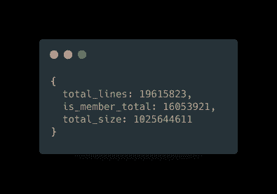
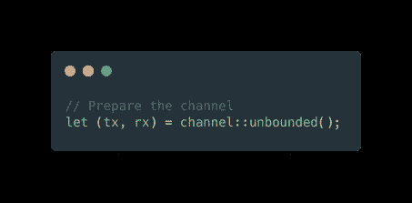
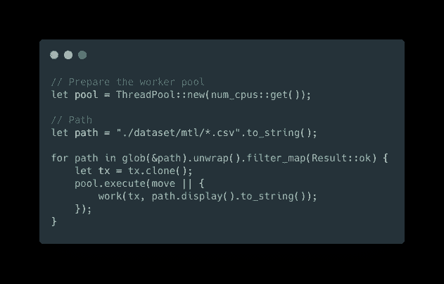
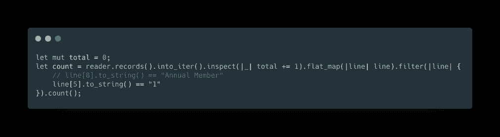
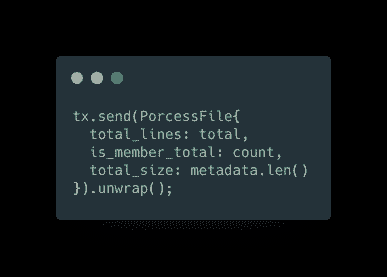
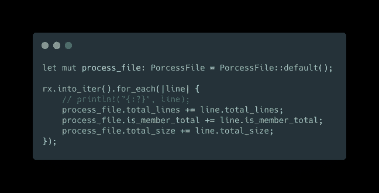
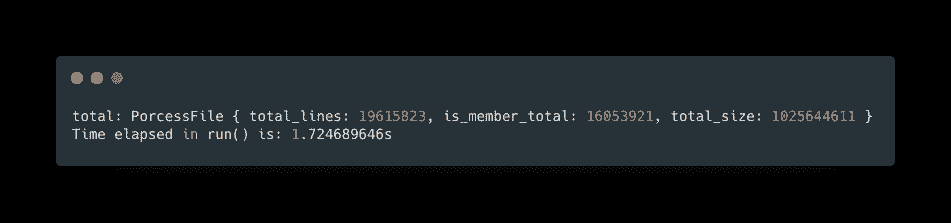

# 使用 Rust 在 1 秒钟内处理 1900 万行 CSV

> 原文：<https://levelup.gitconnected.com/processing-19-million-rows-csv-in-1-second-with-rust-96c5b360171>

周末建设和学习

## 背景和使用案例

作为我新年决心的一部分，我需要探索铁锈。这是我最后一篇关于铁锈的文章。

[https://medium . com/@ jayhuang 75/file-processing-go-vs-rust-6e 210 a 3168 FD](https://medium.com/@jayhuang75/file-processing-go-vs-rust-6e210a3168fd)

今天的用例是来自 Kaggle 的数据集，其中包含 2016 年至 2019 年蒙特利尔的自行车共享信息。

**数据集如下:**

`start_date`:行程开始的日期和时间(AAAA-MM-JJ hh: mm )
`start_station_code`:始发站 ID
`end_date`:行程开始的日期和时间(AAAA-MM-JJ hh: mm )
`end_station_code`:终点站 ID
`is_member`:类型用户。(1:用户，0:非用户)
`duration_sec`:总行程时间(秒)

**数据集有 35 个文件，1G 左右。**

> 对于一个简单的用例，我们希望找出所有的 is_member 行并获得总计数。

输出应该是:

已处理的输出

## 应用设计

一切都是关于设计的，应用程序设计很重要，在你开始编码之前思考更重要。

> 好的软件设计和架构来自白板，而不是键盘。

为了最大化单机，我们会考虑使用 worker pool 和内置迭代器。

创建一个容量无限的渠道。

根据计算机的 CPU 数量，创建工作池。

每个工人池执行迭代器，过滤器，计数。

使用通道的发送端发送回主执行器。

在通道的接收端循环并准备输出。

结果。

# 我学到了什么？

1.  铁锈工人。
2.  Rust 迭代器。
3.  永远享受编码的乐趣。:)

**如果你想看我的其他系列文章，请看下面:**

[https://medium.com/@jayhuang75](https://medium.com/@jayhuang75)