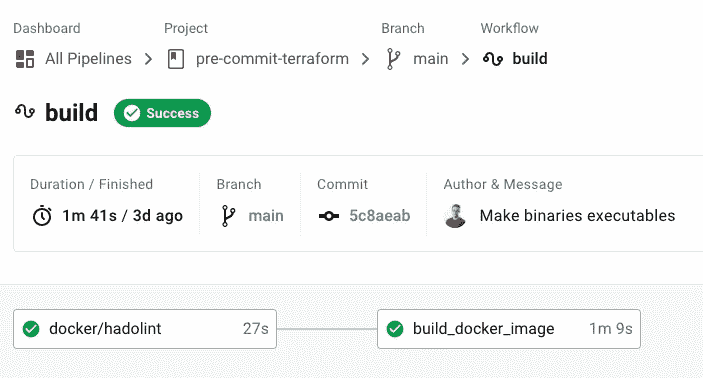
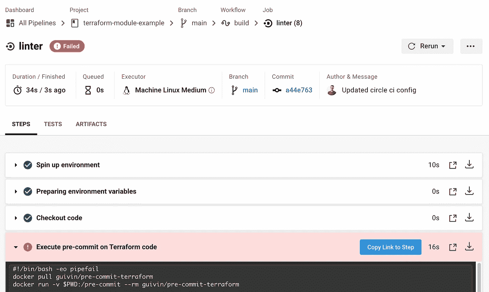

# 为可靠的 Terraform 代码使用预提交的方法

> 原文：<https://levelup.gitconnected.com/produce-reliable-terraform-code-with-pre-commit-hooks-d263bc332e6a>

## 在您的 CI/CD 中运行代码搜索和扫描程序


照片由[塞缪尔·佩恩](https://unsplash.com/@samuelpenn?utm_source=ghost&utm_medium=referral&utm_campaign=api-credit) / [Unsplash](https://unsplash.com/?utm_source=ghost&utm_medium=referral&utm_campaign=api-credit) 拍摄

在上一篇文章中，我向您展示了[编码风格的重要性和预提交框架](https://medium.com/faun/why-you-should-use-coding-style-and-pre-commit-bb0d10ef9a1e)。今天，我们将处理 Terraform 代码的预提交。它将负责使用棉绒和扫描仪验证代码。对于任何新的 git 提交，我们将能够**确保没有回归**并保持恒定的质量。

首先，我们将创建一个 Terraform 模块来测试一些东西。这些模块不会重复代码，应该很难测试其可靠性。我们将看看哪些预提交插件用于 Terraform。

一旦模块就绪，我们将为预提交生成一个 Docker 映像。目标是为使用 [Circle CI](https://circleci.com/) 的 CI/CD 提供一个便携且随时可用的工具箱。Terraform 模块也将有自己的 Circle CI 项目，并重复使用图像进行测试。

# Terraform 模块示例

Terraform 模块非常适合分解代码。在这种情况下，持续测试非常有意义。例如，我们将编写一个模块来**配置 AWS** 中的网络。

## 模块版本和提供商

Terraform 模块的版本文件

## 模块输入

Terraform 模块的变量文件

## 模块输出

Terraform 模块的输出文件

## 模块心脏

terraform 模块的主文件

## 提交前配置

git repo 包括预提交配置。在内部，我耦合了两个预提交回购:

*   [gruntwork-io/pre-commit](https://github.com/gruntwork-io/pre-commit)格式化、验证和 lint 模块代码，并检查降价。
*   [antonbabenko/预提交](https://github.com/antonbabenko/pre-commit-terraform)出于安全目的运行`tfsec`并自动更新文档。

Terraform 模块库中的预提交配置

`tflint` [规则](https://github.com/terraform-linters/tflint/tree/master/docs/rules)存在于单独的文件中:

tflint 配置文件

# CI/CD 的预提交 Docker 映像

## 文档文件

现在我们要创建 Docker 图像。它应该准备好与所有的依赖项一起使用，并且尽可能的轻便。我们将根据一张阿尔卑斯山的图片来建造它。我们尽可能地限制层数。Docker 将更快地恢复和构建它，从而加快 CI/CD 工作流程。

预提交-terraform Docker 图像内容

## 测试并构建 Docker 映像

我们在 Circle CI 项目中配置映像的测试和构建。它运行 [hadolint](https://github.com/hadolint/hadolint) 来确保图像是干净的。然后，它构建映像并将其推送到 DockerHub 存储库:

将 CI 配置圈到 lint 并构建预提交平台 Docker 映像



预提交-平台化 Circle CI 项目

# 带预提交的 Terraform CI/CD

## 圆形 CI 配置

模块 repo 有自己的 Circle CI 配置。工作流签出存储库并执行映像以运行提交前检查:

圈出 terraform 模块库中的 CI 配置文件

## 决赛成绩

git 中的任何更改都会触发检查工作流:



Terraform 模块的 Circle CI 项目

检查结果在工作流日志中可见:

```
#!/bin/bash -eo pipefail docker run -v $PWD:/pre-commit --rm guivin/pre-commit-terraformUnable to find image 'guivin/pre-commit-terraform:latest' locally
latest: Pulling from guivin/pre-commit-terraform

ab65f19f: Pulling fs layer 
2803aa7c: Pulling fs layer 
1c1036d2: Pulling fs layer 
Digest: sha256:fcbef363542a891ef0a238381aed17e974279cb657083d8abe5852ba2c1d144a
Status: Downloaded newer image for guivin/pre-commit-terraform:latest
[INFO] Initializing environment for https://github.com/gruntwork-io/pre-commit.
[INFO] Initializing environment for git://github.com/antonbabenko/pre-commit-terraform.
Terraform fmt............................................................Failed
- hook id: terraform-fmt
- exit code: 3

main.tf
--- old/main.tf
+++ new/main.tf
@@ -25,8 +25,8 @@
   vpc_id = join("", aws_vpc.this[*].id)

   route {
-	cidr_block = "0.0.0.0/0"
-	gateway_id = join("", aws_internet_gateway.this[*].id)
+    cidr_block = "0.0.0.0/0"
+    gateway_id = join("", aws_internet_gateway.this[*].id)
   }

   tags = var.tags
variables.tf
--- old/variables.tf
+++ new/variables.tf
@@ -6,9 +6,9 @@

 variable "region" {
-  type = string
+  type        = string
   description = "AWS region where to create resources"
-  default = "us-east-1"
+  default     = "us-east-1"
 }

 variable "tags" {
@@ -28,7 +28,7 @@
 variable "public_subnet_cidr_blocks" {
   type        = list(string)
   description = "List of CIDR blocks for public subnets"
-  default     = [
+  default = [
     "10.0.1.0/24",
     "10.0.2.0/24",
     "10.0.3.0/24"
@@ -38,7 +38,7 @@
 variable "private_subnet_cidr_blocks" {
   type        = list(string)
   description = "List of CIDR blocks for private subnets"
-  default     = [
+  default = [
     "10.0.4.0/24",
     "10.0.5.0/24",
     "10.0.6.0/24"

Terraform validate.......................................................Failed
- hook id: terraform-validate
- files were modified by this hook

--> Running 'terraform validate' in directory '.'

Initializing provider plugins...
- Reusing previous version of hashicorp/aws from the dependency lock file
- Installing hashicorp/aws v3.30.0...
- Installed hashicorp/aws v3.30.0 (signed by HashiCorp)

Terraform has been successfully initialized!
Success! The configuration is valid.

tflint...................................................................Failed
- hook id: tflint
- exit code: 2

Failed to check `terraform_naming_convention` rule. 1 error(s) occurred:

Error: Unsupported block type

  on .tflint.hcl line 42:
  (source code not available)

Blocks of type "local" are not expected here. Did you mean "locals"?

markdown-link-check......................................................Failed
- hook id: markdown-link-check
- exit code: 1

markdown-link-check is not available on this system.
Please install it by running 'npm install -g markdown-link-check'

Terraform validate with tfsec............................................Passed
Terraform docs...........................................................Passed

Exited with code exit status 1
CircleCI received exit code 1
```

# 资源

[](https://pre-commit.com/) [## 预提交

### 编辑描述

pre-commit.com](https://pre-commit.com/) [](https://github.com/hadolint/hadolint) [## 哈多林特/哈多林特

### 一个更智能的 Docker 文件链接器，帮助您建立最佳实践 Docker 图像。linter 正在将 docker 文件解析成…

github.com](https://github.com/hadolint/hadolint) [](https://github.com/antonbabenko/pre-commit-terraform) [## antonbabenko/预提交-地形

### terraform_docs 挂钩需要 terraform-docs。如果使用 0.8.0 之前的 terraform-docs 和…

github.com](https://github.com/antonbabenko/pre-commit-terraform) [](https://github.com/gruntwork-io/pre-commit) [## gruntwork-io/预提交

### 这个 repo 定义了用于预提交的 Git 预提交挂钩。目前支持的挂钩有…

github.com](https://github.com/gruntwork-io/pre-commit)