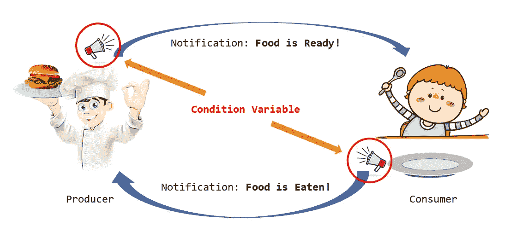
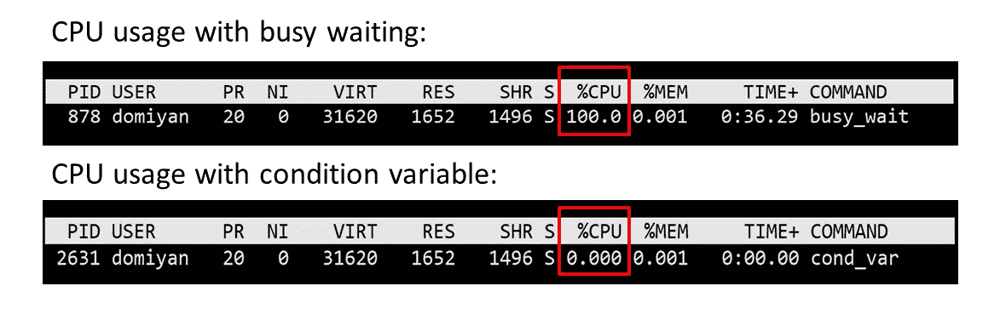

# C++中使用条件变量的生产者-消费者问题

> 原文：<https://levelup.gitconnected.com/producer-consumer-problem-using-condition-variable-in-c-6c4d96efcbbc>

在并发计算中，生产者-消费者问题是一个经典问题。我们经常用它来演示不同的同步技术。在[之前的一篇文章](https://domiyanyue.medium.com/producer-consumer-problem-using-mutex-in-c-764865c47483)中，我们用互斥体解决了这个问题。今天，我们将重新讨论这个问题，并用条件变量改进解决方案。

本教程由三部分组成。首先，我们将回顾互斥锁的唯一答案并分析它的缺点。接下来，我们将引入条件变量。最后，我们将利用学到的知识开发更好的解决方案。

# 带有互斥的生产者-消费者

如果你没有看过我的[上一篇](https://domiyanyue.medium.com/producer-consumer-problem-using-mutex-in-c-764865c47483)，我强烈推荐你先看看。以下是核心功能:

低效率来自“忙等待”循环，因为 CPU 停留在一个循环中什么也不做。即使我们可以添加“睡眠命令”来“减慢”循环频率，也很难得到睡眠时间的合理估计。此外，等待时间在不同的迭代中是不同的。“忙着等待”不是最佳策略。

根本原因是*除了轮询*，我们没有办法让一个线程知道另一个线程已经完成。我们需要一种更直接的方式让线程通知其他线程。为这些场景创建了条件变量。

# 条件变量

条件变量支持线程间的“等待和通知”行为。它们用于阻塞一个或多个线程，直到另一个线程发送通知。C++包含内置的(从 C++11 开始)std::condition_varible 原语。

我们将调用一个发送通知的线程 *sender* 和一个被阻塞时等待通知的线程 *receiver* 。在同步过程中:

发件人必须:

1.  获取一个 std::mutex(通过 std::lock_guard)。
2.  修改全局状态 shared(接收方将检查它是否应该启动)。
3.  std::condition_variable 执行“notify_one”或“notify_all”来通知接收方。这一步不需要持有互斥/锁。

等待的接收者:

1.  获取一个 std::unique_lock <:mutex>，这是同一个互斥发送器使用的。
2.  Declare std::condition_variable(同一个发送方引用)等待 lambda 表达式指定的特定条件。现在接收器处于“等待”状态。互斥体被释放。
3.  当通知条件变量时，接收方重新获取互斥体并检查条件。只有当条件为真时，接收方才会继续执行。否则，它返回到“等待”状态并释放锁。

该过程可以被证明为:

第 15 行可能是最令人困惑的一行。接收方线程处于“挂起”状态，直到它得到通知(由发送方发出)。当通知到达时:

1.  接收方线程获取锁。
2.  如果条件(g_ready)为假，则释放锁。回到“暂停”状态。
3.  如果条件(g_ready)为真，继续执行不解锁。

为了帮助您理解，下面是一个使用“忙等待”方法的语义等效版本:

逐行比较，条件变量取代了“busy wait”循环，并检查停止循环的相同谓词(g_ready)。

互斥体+ condition_variable +共享全局状态的组合在进行线程间通信时很有用。让我们把它应用于生产者-消费者问题。

# 有条件变量的生产者-消费者

我们可以重用前一部分中的模式。这一次，两个线程都在发送方和接收方的角色之间切换。当产品产生时，生产者是发送者，消费者是接收者。在消费产品时，他们的角色颠倒了。以下是完整的解决方案:

您可以将它与“忙碌-等待”解决方案[进行比较，看看我们是如何修改代码的。](https://gist.github.com/domiyanyue/1a4646ec74f4f0934377da01f4e17db2#file-producer_consuer_mutex_only-cpp)

此时，你可能会有疑问。条件变量是如何实现的？他们有效率吗？取决于操作系统和 CPU 类型，实现可能会有所不同。这是一个复杂的话题，我们今天不讨论。在下一节中，我们将运行一个快速实验，将其与“忙-等待”进行比较

# 条件变量的性能如何？

我们想验证当条件变量挂起线程时，它们没有浪费 CPU 周期。

该程序包含一个等待另一个线程(工作线程)的简单线程(waitThread):

作为比较，我们也有“忙-等待”版本:

我们在 Linux 中使用“top”命令来监控一个线程等待时(另一个线程正在休眠)的 CPU 使用情况:

CPU 利用率比较:繁忙等待与条件变量

CPU 利用率是 100%(忙-等待)对零(条件变量)。这并不奇怪，因为我们期望条件变量是有效的。

# 摘要

在本文中，我们:

1.  分析了仅使用互斥体的生产者-消费者问题的解决方案，并指出其局限性。
2.  引入了条件变量，学会了用 C++编码。
3.  生产者-消费者问题中的应用 STD::condition _ variable。
4.  测试条件变量的效率。

# 参考

1.  [生产者-消费者问题](https://en.wikipedia.org/wiki/Producer%E2%80%93consumer_problem)
2.  【cppreference.com】STD::condition _ variable
3.  C++核心指南:注意条件变量的陷阱