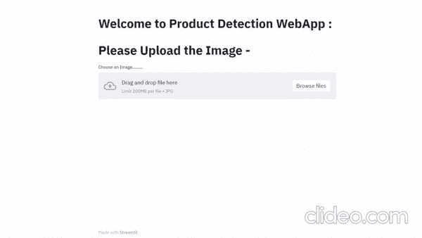

# 使用计算机视觉检测食品货架上的产品

> 原文：<https://levelup.gitconnected.com/product-detection-from-grocery-shelf-9db031e0ddc1>


# 索引

1.  介绍
2.  商业问题
3.  映射到机器学习问题
4.  数据概述
5.  电子设计自动化(Electronic Design Automation)
6.  建模
7.  模型比较
8.  最终管道和部署
9.  未来的工作
10.  参考
11.  轮廓

# **1。)简介**

问题围绕着检测放在杂货店中的产品，我们正在构建一个模型，它可以检测产品，并以二维(x，y)坐标的形式在图像周围给我们一个矩形边界框

# **2。)业务问题**

由于这种检测问题以后可能会扩展到许多问题，如产品盗窃警报和产品计数问题，因此为该问题提出解决方案变得非常重要

# 3.)映射到机器学习问题

在解决这个问题后，我们可以观察到，我们可以通过应用计算机视觉对象检测技术来解决这个问题，通过该技术我们可以获得图像中存在的产品的坐标，因此我们将使用最先进的对象检测技术，这些技术构建在卷积神经网络和深度神经网络层之上，以构建一个鲁棒的高性能模型。

# 4.)数据集概述:

数据由杂货店货架的图像和文本文件形式的边界框注释组成。

*   使用来自 https://github.com/gulvarol/grocerydataset#shelfimages[的数据](https://github.com/gulvarol/grocerydataset#shelfimages)
*   数据表单:JPG 图像文件
*   特征-杂货店货架的图像
*   地面真实:图像的注释

以下是图像属性和命名:

```
"C<c>_P<p>_N<n>_S<s>_<i>.JPG"
        where
            <c> := camera id (1: iPhone5S, 2: iPhone4, 3: Sony Cybershot, 4: Nikon Coolpix)
            <p> := planogram id
            <n> := the rank of the top shelf on the image according to the planogram
            <s> := number of shelves on the image
            <i> := copy number
```

# 5.)探索性数据分析

我们将进行一些探索性的数据分析，以获得一些见解，并更好地理解数据

**可用图像数量**

获取数据集中可用的数据点数

```
Number of Data Points: 354
```

**从数据中打印随机图像**

让我们从数据集中打印一张随机图像


**在随机图像上绘制包围盒**

所以让我们用我们的注释来想象一个带注释的图像是什么样子


## 图像中的平均架数

由于这些图像来自杂货店，并且每个图像都包含货架上的产品，因此每个图像都可以有多个货架，所以让我们来看看数据集拥有的平均货架数量

```
Average Number of Shelves in Image 3.2720848056537104
```

## 货架数量直方图

在上面的代码片段中，我们看到一个图像中的平均货架数约为 3，但是为了更好地可视化，我们将绘制货架数的直方图


## 图像中产品的平均数量

让我们看看一个图像可以包含的平均产品数量是多少

```
Average Number of Products in Image 37.24293785310734
```

## **产品数量直方图**

为了更直观，我们将再次绘制几种产品的直方图


## 使用每台相机拍摄的图像数量

由于图像是使用不同类型的相机拍摄的，所以让我们绘制一个条形图，告诉我们从每个相机点击的图像数量


## 观察结果:

*   货架平均数量约为 3 个
*   不到 90%的映像具有少于或等于 4 个托架
*   图片中产品的平均数量 37 . 4836383836363637
*   不到 99%的图片中的产品少于 80 种
*   iPhone 5 是所有设备中图像捕捉数量最多的

> 因此，我们将从这里开始构建我们的模型，我们将尝试不同的模型，并选择更适合数据的模型。

# 准备输入和模型

**克隆 Github 模型**

在下面的命令片段中，我们将把工作目录更改到我们的工作区文件夹中，在我们的例子中是“tf2”。然后我们将克隆张量流模型。然后，我们可以将工作目录更改为 object_detection，它位于“models/research/”中

```
%cd /content/drive/MyDrive/tf2/
!git clone [https://github.com/tensorflow/models/](https://github.com/tensorflow/models/)
%cd /content/drive/My Drive/tf2/models/research/object_detection
```

## 创建输入管道

*   首先，我们将创建一个字典，其中键是图像，值是注释
*   创建包含以下列的 train_labels.csv 和 test _ labels.csv】文件名'，'宽度'，'类别'，'高度'，' xmin '，' xmax '，' ymin '，' ymax '

## 从图像和注释创建张量流记录文件

*   我们将创造一列火车。记录并测试。记录在下面

## 创建标签地图

在下面的代码片段中，我们只是将包含标签信息的文件 labelmap.pbtxt 写入 training 文件夹

```
%%writefile models/research/object_detection/training/labelmap.pbtxt
item {
 id: 1
 name: ‘Product’
}
```

# 6.)建模

# 高效 Det 建模

## 从 Tensorflow Zoo 下载 efficient_det 模型

TensorFlow zoo 中有许多可用的预训练模型，我们将挑选一些模型，并在我们的数据集上对它们进行微调

```
%cd /content/drive/MyDrive/tf2/model/research/object_detection/!wget [http://download.tensorflow.org/models/object_detection/tf2/20200711/efficientdet_d0_coco17_tpu-32.tar.gz](http://download.tensorflow.org/models/object_detection/tf2/20200711/efficientdet_d0_coco17_tpu-32.tar.gz)!tar -xvzf efficientdet_d0_coco17_tpu-32.tar.gz!rm -rf efficientdet_d0_coco17_tpu-32.tar.gz
```

## 将配置文件保存到 Training/effdet.config

在此步骤中，我们将在 training 文件夹中保存高效 det 模型的配置文件，下面是创建和保存配置文件的命令

```
%%writefile training/effdet.config
model {
 ssd {
 num_classes: 1
 image_resizer {
 keep_aspect_ratio_resizer {
 min_dimension: 512
 max_dimension: 512
 pad_to_max_dimension: true
 }
 }
 feature_extractor {
 type: “ssd_efficientnet-b0_bifpn_keras”
 conv_hyperparams {
 regularizer {
 l2_regularizer {
 weight: 3.9999998989515007e-05
 }
 }
 initializer {
 truncated_normal_initializer {
 mean: 0.0
 stddev: 0.029999999329447746
 }
 }
 activation: SWISH
 batch_norm {
 decay: 0.9900000095367432
 scale: true
 epsilon: 0.0010000000474974513
 }
 force_use_bias: true
 }
 bifpn {
 min_level: 3
 max_level: 7
 num_iterations: 3
 num_filters: 64
 }
 }
 box_coder {
 faster_rcnn_box_coder {
 y_scale: 1.0
 x_scale: 1.0
 height_scale: 1.0
 width_scale: 1.0
 }
 }
 matcher {
 argmax_matcher {
 matched_threshold: 0.5
 unmatched_threshold: 0.5
 ignore_thresholds: false
 negatives_lower_than_unmatched: true
 force_match_for_each_row: true
 use_matmul_gather: true
 }
 }
 similarity_calculator {
 iou_similarity {
 }
 }
 box_predictor {
 weight_shared_convolutional_box_predictor {
 conv_hyperparams {
 regularizer {
 l2_regularizer {
 weight: 3.9999998989515007e-05
 }
 }
 initializer {
 random_normal_initializer {
 mean: 0.0
 stddev: 0.009999999776482582
 }
 }
 activation: SWISH
 batch_norm {
 decay: 0.9900000095367432
 scale: true
 epsilon: 0.0010000000474974513
 }
 force_use_bias: true
 }
 depth: 64
 num_layers_before_predictor: 3
 kernel_size: 3
 class_prediction_bias_init: -4.599999904632568
 use_depthwise: true
 }
 }
 anchor_generator {
 multiscale_anchor_generator {
 min_level: 3
 max_level: 7
 anchor_scale: 4.0
 aspect_ratios: 1.0
 aspect_ratios: 2.0
 aspect_ratios: 0.5
 scales_per_octave: 3
 }
 }
 post_processing {
 batch_non_max_suppression {
 score_threshold: 9.99999993922529e-09
 iou_threshold: 0.5
 max_detections_per_class: 100
 max_total_detections: 100
 }
 score_converter: SIGMOID
 }
 normalize_loss_by_num_matches: true
 loss {
 localization_loss {
 weighted_smooth_l1 {
 }
 }
 classification_loss {
 weighted_sigmoid_focal {
 gamma: 1.5
 alpha: 0.25
 }
 }
 classification_weight: 1.0
 localization_weight: 1.0
 }
 encode_background_as_zeros: true
 normalize_loc_loss_by_codesize: true
 inplace_batchnorm_update: true
 freeze_batchnorm: false
 add_background_class: false
 }
}
train_config {
 batch_size: 12
 data_augmentation_options {
 random_horizontal_flip {
 }
 }
 data_augmentation_options {
 random_scale_crop_and_pad_to_square {
 output_size: 512
 scale_min: 0.10000000149011612
 scale_max: 2.0
 } 
 }

 sync_replicas: true
 optimizer {
 momentum_optimizer {
 learning_rate {
 cosine_decay_learning_rate {
 learning_rate_base: 0.07999999821186066
 total_steps: 300000
 warmup_learning_rate: 0.0010000000474974513
 warmup_steps: 2500
 }
 }
 momentum_optimizer_value: 0.8999999761581421
 }
 use_moving_average: false
 }
 fine_tune_checkpoint: “efficientdet_d0_coco17_tpu-32/checkpoint/ckpt-0”
 num_steps: 300000
 startup_delay_steps: 0.0
 replicas_to_aggregate: 8
 max_number_of_boxes: 100
 unpad_groundtruth_tensors: false
 fine_tune_checkpoint_type: “detection”
 use_bfloat16: true
 fine_tune_checkpoint_version: V2
}
train_input_reader: {
 label_map_path: “training/labelmap.pbtxt”
 tf_record_input_reader {
 input_path: “train.record”
 }
}eval_config: {
 metrics_set: “coco_detection_metrics”
 use_moving_averages: false
 batch_size: 1;
}eval_input_reader: {
 label_map_path: “training/labelmap.pbtxt”
 shuffle: false
 num_epochs: 1
 tf_record_input_reader {
 input_path: “test.record”
 }
}
```

## 训练模型

在下面的命令片段中，我们正在训练我们的 effdet 模型

```
#Changing directory to inside our object detecton model
%cd /content/drive/My Drive/tf2/models/research/object_detection#Configuring the protos
!protoc object_detection/protos/*.proto --python_out=.# training the model
!python model_main_tf2.py --pipeline_config_path=training/effdet.config --model_dir=training/effdet/ --alsologtostderr --num_train_steps=2000
```

## 高效 Det 的评估

因为我们已经训练了我们的 effdet 模型，所以我们将评估该模型并得到结果

```
!python model_main_tf2.py — model_dir=training/effdet/ — pipeline_config_path=training/effdet.config — checkpoint_dir=training/effdet/
```

## 训练后绘制并标记分数

以下是我们对模型进行评估后得到的分数

```
Average Precision  (AP) @[ IoU=0.50:0.95 | area=   all | maxDets=100 ] = 0.641
 Average Precision  (AP) @[ IoU=0.50      | area=   all | maxDets=100 ] = 0.959
 Average Precision  (AP) @[ IoU=0.75      | area=   all | maxDets=100 ] = 0.834
 Average Precision  (AP) @[ IoU=0.50:0.95 | area= small | maxDets=100 ] = -1.000
 Average Precision  (AP) @[ IoU=0.50:0.95 | area=medium | maxDets=100 ] = -1.000
 Average Precision  (AP) @[ IoU=0.50:0.95 | area= large | maxDets=100 ] = 0.641
 Average Recall     (AR) @[ IoU=0.50:0.95 | area=   all | maxDets=  1 ] = 0.020
 Average Recall     (AR) @[ IoU=0.50:0.95 | area=   all | maxDets= 10 ] = 0.200
 Average Recall     (AR) @[ IoU=0.50:0.95 | area=   all | maxDets=100 ] = 0.699
 Average Recall     (AR) @[ IoU=0.50:0.95 | area= small | maxDets=100 ] = -1.000
 Average Recall     (AR) @[ IoU=0.50:0.95 | area=medium | maxDets=100 ] = -1.000
 Average Recall     (AR) @[ IoU=0.50:0.95 | area= large | maxDets=100 ] = 0.699
```

## 张量板的视觉损失

让我们设想 effdet 模型的损失


# 用中心网建模

## 从 Tensorflow 动物园下载中心网络模型

从 Tensorflow Zoo 下载 Centernet 模型

```
%cd /content/drive/MyDrive/tf2/model/research/object_detection/!wget [http://download.tensorflow.org/models/object_detection/tf2/20200713/centernet_hg104_512x512_coco17_tpu-8.tar.gz](http://download.tensorflow.org/models/object_detection/tf2/20200713/centernet_hg104_512x512_coco17_tpu-8.tar.gz)!tar -xvzf centernet_hg104_512x512_coco17_tpu-8.tar.gz!rm -rf centernet_hg104_512x512_coco17_tpu-8.tar.gz
```

## 将以下配置文件保存到 Training/centernet

在此步骤中，我们将把中心网络模型的配置文件保存在 training 文件夹中，下面是创建和保存配置文件的命令

```
%%writefile training/effdet.config%%writefile training/centernet.config
model {
 center_net {
 num_classes: 1
 feature_extractor {
 type: “hourglass_104”
 channel_means: 104.01361846923828
 channel_means: 114.03422546386719
 channel_means: 119.91659545898438
 channel_stds: 73.60276794433594
 channel_stds: 69.89082336425781
 channel_stds: 70.91507720947266
 bgr_ordering: true
 }
 image_resizer {
 keep_aspect_ratio_resizer {
 min_dimension: 512
 max_dimension: 512
 pad_to_max_dimension: true
 }
 }
 object_detection_task {
 task_loss_weight: 1.0
 offset_loss_weight: 1.0
 scale_loss_weight: 0.10000000149011612
 localization_loss {
 l1_localization_loss {
 }
 }
 }
 object_center_params {
 object_center_loss_weight: 1.0
 classification_loss {
 penalty_reduced_logistic_focal_loss {
 alpha: 2.0
 beta: 4.0
 }
 }
 min_box_overlap_iou: 0.699999988079071
 max_box_predictions: 100
 }
 }
}
train_config {
 batch_size: 12
 data_augmentation_options {
 random_horizontal_flip {
 }
 }
 data_augmentation_options {
 random_crop_image {
 min_aspect_ratio: 0.5
 max_aspect_ratio: 1.7000000476837158
 random_coef: 0.25
 }
 }
 data_augmentation_options {
 random_adjust_hue {
 }
 }
 data_augmentation_options {
 random_adjust_contrast {
 }
 }
 data_augmentation_options {
 random_adjust_saturation {
 }
 }
 data_augmentation_options {
 random_adjust_brightness {
 }
 }
 data_augmentation_options {
 random_absolute_pad_image {
 max_height_padding: 200
 max_width_padding: 200
 pad_color: 0.0
 pad_color: 0.0
 pad_color: 0.0
 }
 }
 optimizer {
 adam_optimizer {
 learning_rate {
 manual_step_learning_rate {
 initial_learning_rate: 0.0010000000474974513
 schedule {
 step: 90000
 learning_rate: 9.999999747378752e-05
 }
 schedule {
 step: 120000
 learning_rate: 9.999999747378752e-06
 }
 }
 }
 epsilon: 1.0000000116860974e-07
 }
 use_moving_average: false
 }
 fine_tune_checkpoint: “centernet_hg104_512x512_coco17_tpu-8/checkpoint/ckpt-0”
 num_steps: 140000
 max_number_of_boxes: 100
 unpad_groundtruth_tensors: false
 fine_tune_checkpoint_type: “fine_tune”
 fine_tune_checkpoint_version: V2
}
train_input_reader {
 label_map_path: “training/labelmap.pbtxt”
 tf_record_input_reader {
 input_path: “train.record”
 }
}
eval_config {
 metrics_set: “coco_detection_metrics”
 use_moving_averages: false
 batch_size: 1
}
eval_input_reader {
 label_map_path: “training/labelmap.pbtxt”
 shuffle: false
 num_epochs: 1
 tf_record_input_reader {
 input_path: “test.record”
 }
}
```

## 训练模型

在下面的命令片段中，我们正在训练我们的模型

```
#changing directory to inside object_detection folder
%cd /content/drive/My Drive/tf2/model/research/object_detection#configuring the protos
!protoc object_detection/protos/*.proto — python_out=.# Training the model
!python model_main_tf2.py — pipeline_config_path=training/centernet.config — model_dir=training/centernet/ — alsologtostderr — num_train_steps=2000
```

## 评估模型

使用下面的命令片段，我们将评估 centernet 模型

```
!python model_main_tf2.py — model_dir=training/centernet — pipeline_config_path=training/centernet.config — checkpoint_dir=training/centernet/
```

## 训练后绘制并标记分数

以下是 centernet 模型在我们数据集上的得分

```
Average Precision  (AP) @[ IoU=0.50:0.95 | area=   all | maxDets=100 ] = 0.709
 Average Precision  (AP) @[ IoU=0.50      | area=   all | maxDets=100 ] = 0.957
 Average Precision  (AP) @[ IoU=0.75      | area=   all | maxDets=100 ] = 0.930
 Average Precision  (AP) @[ IoU=0.50:0.95 | area= small | maxDets=100 ] = -1.000
 Average Precision  (AP) @[ IoU=0.50:0.95 | area=medium | maxDets=100 ] = -1.000
 Average Precision  (AP) @[ IoU=0.50:0.95 | area= large | maxDets=100 ] = 0.709
 Average Recall     (AR) @[ IoU=0.50:0.95 | area=   all | maxDets=  1 ] = 0.022
 Average Recall     (AR) @[ IoU=0.50:0.95 | area=   all | maxDets= 10 ] = 0.217
 Average Recall     (AR) @[ IoU=0.50:0.95 | area=   all | maxDets=100 ] = 0.762
 Average Recall     (AR) @[ IoU=0.50:0.95 | area= small | maxDets=100 ] = -1.000
 Average Recall     (AR) @[ IoU=0.50:0.95 | area=medium | maxDets=100 ] = -1.000
 Average Recall     (AR) @[ IoU=0.50:0.95 | area= large | maxDets=100 ] = 0.762
```

## 张量板

使用张量板可视化损失


# 从 Tensorflow 动物园下载模型

通过下面的命令片段，我们可以从 TensorFlow zoo 下载一个更快的 R-CNN 模型

```
**%**cd **/**content**/**drive**/**MyDrive**/**tf2**/**model**/**research**/**object_detection**/****!**wget [http:**//**download.tensorflow.org**/**models**/**object_detection**/**tf2**/**20200711**/**faster_rcnn_resnet101_v1_800x1333_coco17_gpu**-**8.tar.gz](http://download.tensorflow.org/models/object_detection/tf2/20200711/faster_rcnn_resnet101_v1_800x1333_coco17_gpu-8.tar.gz)**!**tar **-**xvzf faster_rcnn_resnet101_v1_800x1333_coco17_gpu**-**8.tar.gz**!**rm **-**rf faster_rcnn_resnet101_v1_800x1333_coco17_gpu**-**8.tar.gz
```

# 将以下配置文件保存在 Training/faster_rcnn.config 中

将 faster _ rcnn 配置文件写入磁盘

```
%%writefile training/faster_rcnn.config
# Faster R-CNN with Resnet
# Sync-trained on COCO (8 GPUs),
# Initialized from Imagenet classification checkpoint
# TF2-Compatible, *Not* TPU-Compatiblemodel {
  faster_rcnn {
    num_classes: 1
    image_resizer {
      keep_aspect_ratio_resizer {
        min_dimension: 800
        max_dimension: 1333
        pad_to_max_dimension: true
      }
    }
    feature_extractor {
      type: 'faster_rcnn_resnet101_keras'
    }
    first_stage_anchor_generator {
      grid_anchor_generator {
        scales: [0.25, 0.5, 1.0, 2.0]
        aspect_ratios: [0.5, 1.0, 2.0]
        height_stride: 16
        width_stride: 16
      }
    }
    first_stage_box_predictor_conv_hyperparams {
      op: CONV
      regularizer {
        l2_regularizer {
          weight: 0.0
        }
      }
      initializer {
        truncated_normal_initializer {
          stddev: 0.01
        }
      }
    }
    first_stage_nms_score_threshold: 0.0
    first_stage_nms_iou_threshold: 0.7
    first_stage_max_proposals: 300
    first_stage_localization_loss_weight: 2.0
    first_stage_objectness_loss_weight: 1.0
    initial_crop_size: 14
    maxpool_kernel_size: 2
    maxpool_stride: 2
    second_stage_box_predictor {
      mask_rcnn_box_predictor {
        use_dropout: false
        dropout_keep_probability: 1.0
        fc_hyperparams {
          op: FC
          regularizer {
            l2_regularizer {
              weight: 0.0
            }
          }
          initializer {
            variance_scaling_initializer {
              factor: 1.0
              uniform: true
              mode: FAN_AVG
            }
          }
        }
      }
    }
    second_stage_post_processing {
      batch_non_max_suppression {
        score_threshold: 0.0
        iou_threshold: 0.6
        max_detections_per_class: 100
        max_total_detections: 100
      }
      score_converter: SOFTMAX
    }
    second_stage_localization_loss_weight: 2.0
    second_stage_classification_loss_weight: 1.0
  }
}train_config: {
  batch_size: 2
  num_steps: 200000
  optimizer {
    momentum_optimizer: {
      learning_rate: {
        cosine_decay_learning_rate {
          learning_rate_base: 0.01
          total_steps: 200000
          warmup_learning_rate: 0.0
          warmup_steps: 5000
        }
      }
      momentum_optimizer_value: 0.9
    }
    use_moving_average: false
  }
  gradient_clipping_by_norm: 10.0
  fine_tune_checkpoint_version: V2
  fine_tune_checkpoint: "faster_rcnn_resnet101_v1_800x1333_coco17_gpu-8/checkpoint/ckpt-0"
  fine_tune_checkpoint_type: "detection"
  data_augmentation_options {
    random_horizontal_flip {
    }
  }data_augmentation_options {
    random_adjust_hue {
    }
  }data_augmentation_options {
    random_adjust_contrast {
    }
  }data_augmentation_options {
    random_adjust_saturation {
    }
  }data_augmentation_options {
     random_square_crop_by_scale {
      scale_min: 0.6
      scale_max: 1.3
    }
  }
}train_input_reader: {
  label_map_path: "training/labelmap.pbtxt"
  tf_record_input_reader {
    input_path: "train.record"
  }
}eval_config: {
  metrics_set: "coco_detection_metrics"
  use_moving_averages: false
  batch_size: 1;
}eval_input_reader: {
  label_map_path: "training/labelmap.pbtxt"
  shuffle: false
  num_epochs: 1
  tf_record_input_reader {
    input_path: "test.record"
  }
}
```

## 训练模型

下面的命令片段在我们的数据集上训练我们更快的 R-CNN 模型

```
%cd /content/drive/My Drive/tf2/models/research/object_detection!protoc /protos/*.proto — python_out=.!python model_main_tf2.py — pipeline_config_path=training/faster_rcnn.config — model_dir=training/faster_rcnn/ — alsologtostderr — num_train_steps=2000
```

## 评估模型

使用下面的代码，我们将能够评估我们更快的 R-CNN 模型

```
!python model_main_tf2.py — model_dir=training/faster_rcnn — pipeline_config_path=training/faster_rcnn.config — checkpoint_dir=training/faster_rcnn/
```

## 张量板

可视化损失更快的 R-CNN 模型我们的数据集。


# 7.)对比

因此，让我们看看数据集上所有模型的 mAP(precision)和 mAR(recall)


从上表来看，我们所有的模型都运行良好，但显然，centernet 的性能优于所有模型，因此让我们使用 centernet 来构建我们的最终管道

# 8.)最终管道和部署

我们将在 colab 上本地部署应用程序。但是在 colab 中，我们无法使用浏览器访问本地端口，因此我们将使用 ngrok API 将端口上运行的应用托管到 ngrok 服务器，我们还将使用 streamlit 来部署我们的应用。

让我们将完整的部署代码保存在 app.py 文件中

```
%%writefile app.pyimport streamlit as stst.markdown(“<h1 style=’text-align: center; color: White;background-color:#e84343'>Welcome to Product Detection WebApp : </h1>”, unsafe_allow_html=True)import numpy as npimport osimport six.moves.urllib as urllib
import sys
import tarfile
import tensorflow as tf
import zipfile
from collections import defaultdict
from io import StringIO
from matplotlib import pyplot as plt
from PIL import Image
from IPython.display import display
from object_detection.utils import ops as utils_ops
from object_detection.utils import label_map_util
from object_detection.utils import visualization_utils as vis_util
utils_ops.tf = tf.compat.v1
tf.gfile = tf.io.gfile
category_index = label_map_util.create_category_index_from_labelmap(‘training/labelmap.pbtxt’, use_display_name=True)detection_model = tf.saved_model.load(‘inference_graph/saved_model’)def run_inference_for_single_image(model, image): image = np.asarray(image) input_tensor = tf.convert_to_tensor(image) input_tensor = input_tensor[tf.newaxis,…] model_fn = model.signatures[‘serving_default’] output_dict = model_fn(input_tensor) num_detections = int(output_dict.pop(‘num_detections’)) output_dict = {key:value[0, :num_detections].numpy() for key,value in output_dict.items()} output_dict[‘num_detections’] = num_detections output_dict[‘detection_classes’] =       output_dict[‘detection_classes’].astype(np.int64) if ‘detection_masks’ in output_dict: detection_masks_reframed =   utils_ops.reframe_box_masks_to_image_masks(   output_dict[‘detection_masks’],   output_dict[‘detection_boxes’],image.shape[0], image.shape[1] ) detection_masks_reframed = tf.cast(detection_masks_reframed > 0.5,tf.uint8) output_dict[‘detection_masks_reframed’] =   detection_masks_reframed.numpy() return output_dictdef show_inference(model, image_path): image_np = np.array(Image.open(image_path)) output_dict = run_inference_for_single_image(model, image_np) vis_util.visualize_boxes_and_labels_on_image_array( image_np, output_dict[‘detection_boxes’], output_dict[‘detection_classes’], output_dict[‘detection_scores’], category_index, instance_masks=output_dict.get(‘detection_masks_reframed’, None), use_normalized_coordinates=True, line_thickness=8) return image_npdef main(): st.markdown(“<h1 style=’text-align: center; color:     White;background-color:#e84343'>Please Upload the Image — </h1>”, unsafe_allow_html=True) uploaded_path = st.file_uploader(“Choose an Image………” , type = “jpg”) if uploaded_path != None: st.markdown(“<h1 style=’text-align: center; color: White;background-color:#e84343'>Generating Output …</h1>”, unsafe_allow_html=True) array = show_inference(detection_model, uploaded_path) im = Image.fromarray(array) st.image(im , caption=”Output” , use_column_width = True)if __name__ ==’__main__’: main() #calling the main method
```

让我们使用上面写的 app.py 文件来部署我们的应用程序

让我们来看看应用程序的运行情况



# 9.)未来工作

*   从不同的产品来源收集更多的图片。
*   试验除上述对象检测模型之外的模型。
*   在模型中添加不同的产品类别。

# 10.)参考文献

*   [https://towards data science . com/custom-object-detection-for-non-data-scientists-70325 fef 2 dbb](https://towardsdatascience.com/custom-object-detection-for-non-data-scientists-70325fef2dbb)
*   [https://tensor flow-object-detection-API-tutorial . readthedocs . io/en/latest/training . html](https://tensorflow-object-detection-api-tutorial.readthedocs.io/en/latest/training.html)
*   【https://www.appliedaicourse.com/ 
*   [https://github.com/tensorflow/models](https://github.com/tensorflow/models)

# 11.)简介

*   **GitHub**T10**链接 **
*   **LinkedIn P**[**rofile**](https://www.linkedin.com/in/parv-gupta-neo/)**。**