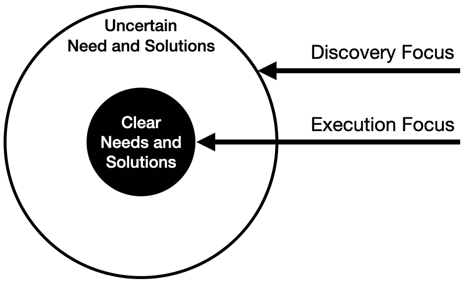
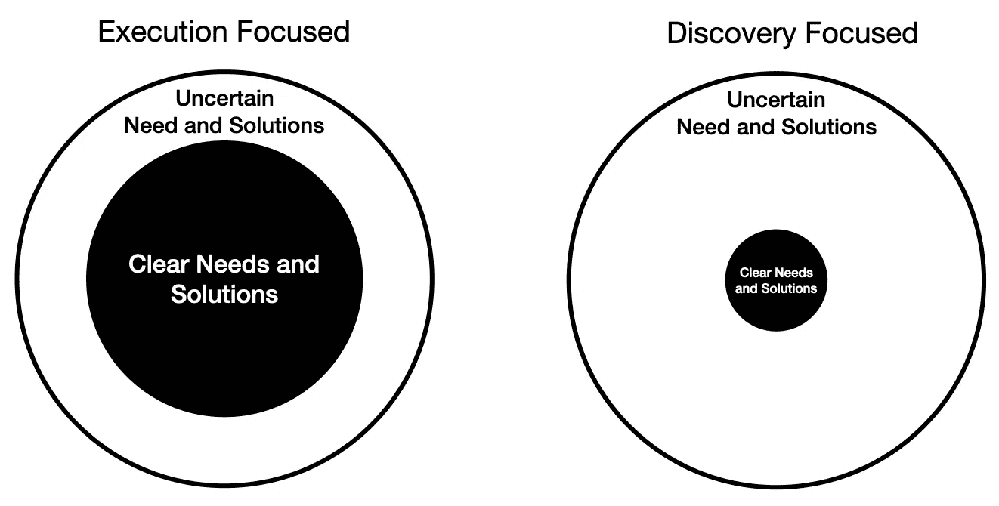

# 产品执行与发现

> 原文：<https://levelup.gitconnected.com/product-execution-versus-discovery-eef5794e70f3>

## 确保你根据你的产品策略专注于正确的事情。

当开始一个新产品计划时，所有伟大的产品思想家都向我们灌输，我们必须考虑风险。我们的假设是什么？哪些风险最大？我们如何尽早降低这些假设中固有的风险？

我们的大部分注意力都集中在 Marty Cagan 描述的四种风险类型中:

1.  价值风险
2.  可用性风险
3.  可行性风险
4.  商业生存风险

替代模型将这些分解为合意性、可行性和生存能力。无论您希望解决什么未知问题，相关的风险都可以通过发现过程来解决。有时我们会碰壁然后转向。有时，我们需要在浪费更多稀缺资源之前扼杀一项计划。

我想后退一步，考虑一下我们可以做出的决定，这些决定可能会完全影响发现风险的规模。不幸的是，降低这些风险有一个同样具有挑战性的权衡。

# 擅长产品执行

我相信，在向市场推出新产品时，我们有一个重要的选择。我们可以决定去探索未知，并通过征服发现过程来承担风险。这是大多数产品管理思想领袖所关注的，也是最好的产品管理培训所教授的。

然而，另一种选择是复制现有的成功产品业务，目的是在此过程中超越它们，窃取潜在市场的重要部分。

如果一家或多家公司已经在特定的产品类别中获得成功，那么你就大大降低了被发现的风险。你知道有一个有价值的问题值得解决。此外，您知道创建一个可用的解决方案是可能的，技术问题显然是可以解决的，并且围绕它创建一个可行的业务模型也是可能的。

如果你只是想复制现有的业务，那么你现在试图应对的核心挑战是比现有的替代方案执行得更好。

对任何既定产品类别的调查都会发现多家供应商提供有竞争力的产品。无论是网络浏览器、电子邮件营销工具、客户关系管理系统还是基本的支票账户。所以很明显，许多市场需求是如此之大，以至于即使以非差异化的方式，也有多个提供商解决的空间。

# 那么，为什么不是每个人都在大市场上生产跟风产品呢？

建立一个模仿型产品的核心挑战是很难超越现有公司，尤其是作为一家初创公司。如果明天，我决定开一家公司作为 Wordpress 主机提供商，我会进入一个由现有产品明确定义的类别。市场中的客户在考虑额外的竞争优势之前，都有一套他们希望任何可行的竞争对手都具备的最低功能。

这是现在进入产品管理软件市场的公司都面临的问题。作为一个可行的产品管理解决方案，你必须支持构思、发现、多优先级框架、路线图，以及与通用开发管理工具如吉拉挂钩。满足所有这些基本要求需要大量投资，然后才能试图占领竞争市场的大部分。对于许多创业公司来说，这种初始成本太大，难以想象。

Zoom 是最近一家使用执行外方法做得很好的公司。经过几年的整合后，视频会议软件市场上充斥着像思科、谷歌和微软这样的大公司。埃里克·袁(Eric Yuan)，2011 年离开思科 WebEx，创办 Zoom。从来自 Cisco WebEx 的 40 名工程师开始，他们在一年多的时间里开发了第一个版本。(我找不到参考资料，但记得在一个播客上听到过，它花了近 2 年的时间开发，才发布了第一个版本。)

想想吧。一家初创公司，拥有长期深入的市场洞察力，对最大的现任公司的弱点有内部了解，以及一个可以在发布任何东西之前埋头工作近 2 年的大型开发团队。对于大多数进入现有产品类别的初创公司来说，这种机会并不存在。

Zoom 有能力通过对这一领域的关注和大量投资来超越执行。

# 仅仅执行通常是不够的

尽管拥有所有这些优势，Zoom 也在寻找创新的空间。那是在用户体验、整合和免费增值商业模式中。这些方面有助于推动他们超越“我也是”的状态。

基本上，他们就如何平衡发现和执行做出了一些战略决策。虽然他们在执行上超越了其他视频会议供应商，但他们在发现更加用户友好的产品设计和创造巨大营销渠道的商业模式上也超越了其他视频会议供应商。

发现和执行之间的平衡是产品策略的一个重要方面。完全走极端的新产品很少见。

# 您在执行与发现焦点系列中处于什么位置？

评估你的新产品计划在以执行为中心和以发现为中心的光谱中的位置是非常直接的。

> ***专注于执行的新产品*** *存在于有明确竞争对手和相当成熟的市场需求的地方。*
> 
> ***发现型新产品*** *存在于潜在客户不确定有什么解决方案的地方。如果他们使用的东西，不管是不是自己生产的，都不是为了制造的目的，客户/用户通常会意识到明显的缺陷，但已经决定这是最好的选择。*

因此，尽管专注于执行的新产品消除了许多不确定性，但它们也为变得最低限度可行制造了巨大障碍。专注于发现的产品会遇到巨大的风险，但如果它们成功创新，就有可能占据主导地位。

实际上，许多新产品类别正在取代客户多年来凑合使用的大杂烩式解决方案。对于产品策略师来说，挑战在于如何在执行这些薄弱的解决方案和专注于直接解决市场需求的创新之间找到平衡。

让事情变得更具挑战性的是，现有的解决方案，因为它们不是真正为特定目的而构建的，所以通常以较低的价格提供。因此，为了消除价格压力，新的创新必须不能清楚地证明更大的价值。

# 沿着连续体移动

一个简单的思路练习，让你的产品沿着执行焦点和发现焦点的范围转移，就是简单地改变你正在考虑解决的问题的范围。

通过投入更多的注意力来分析产品类别中的现有解决方案，通过广泛的市场调查确定现任者未能充分利用的有价值的差距，从而转向执行重点。这将减少不确定性，并使执行更加集中。良好的市场研究和解决方案发现将发现最有可能成功的未得到满足的需求。如果你有足够的资源来竞争，这条路会走得很好。假设现任者也知道这些差距，那么执行是关键。

***例如:*** *超人和嘿电子邮件服务看到了一个巨大的电子邮件市场，其重大弱点没有被主要的现任者很好地解决。两家公司都必须先解决许多“模仿”的基本问题，然后再投资于将它们的产品与有价值的服务区分开来的额外部分。*

通过对潜在客户投入更多的注意力，并深入了解他们有价值的未满足需求，向发现焦点迈进。通过最小化定义客户群的范围来降低风险。关注范围越窄，发现产品/市场契合度解决方案所需的投资就越少。

***举例:*** *Slack 看到了现任电子邮件服务中的大量问题，但后退了一步，拓宽了正在考虑的问题空间。在这样做的过程中，他们发现在公司环境中对快速沟通的需求还远远没有得到满足。当他们想出一个解决方案时，他们认识到它可以有效地取代许多常见用例中的电子邮件。当在新产品类别中设计一个新颖的解决方案时，他们不需要首先匹配现有的电子邮件服务功能，然后才有可行的东西。*

# 产品生命周期

最后，新产品从连续体的一个地方开始，但会随着时间的推移而改变。随着产品和品类的成熟，将会开发更多关于市场和问题空间的知识。这将减少不确定性，并推动对更注重长期执行的产品战略的需求。

在下面的图表中，你可以看到，无论你从哪里开始，你都会倾向于专注于执行的加班。然而，周期性的市场条件和其他因素将要求向更高的发现活动转移。

随着时间的推移，这种参差不齐但又不可避免的执行趋势越来越明显。

该图旨在强调一段时间内的共同模式，但确定从哪里开始以及在哪里遇到断点会有所不同。关键是要意识到这些变化，并确保你正倾向于这些变化。随着市场的成熟，不要过度投资于问题发现。但是，请留意可能需要更多关注问题和解决方案发现的市场事件。

# 结论

当我开始自己的创业时，我想分享我多年产品管理的观察。很可能有些专家会认为我是一个异端，因为我建议有时你把脚从发现踏板上拿开，但在现实生活中，我们拥有稀缺的资源和注意力。

我在这里要说的是，尤其是在初创公司，你需要做出艰难的选择，将精力集中在哪里。我相信，通过专注于新的(或更新的)产品类别，初创公司有更好的成功机会，在这些类别中，最初对获得真正未满足需求的客户的立足点的期望较低。要找到这一点，需要一个伟大的发现方法。

然而，如果你醒来时有大量的钱和时间让你的创业公司(或新产品)成功，就像 Zoom 一样，那么从一开始就有执行倾向的方法也是可行的。它并没有消除你的风险，只是改变了平衡，从 4 大风险转向招聘、营销和发展执行。

*最初发表于*[*【https://productstride.substack.com】*](https://productstride.substack.com/p/product-execution-versus-discovery)*。*