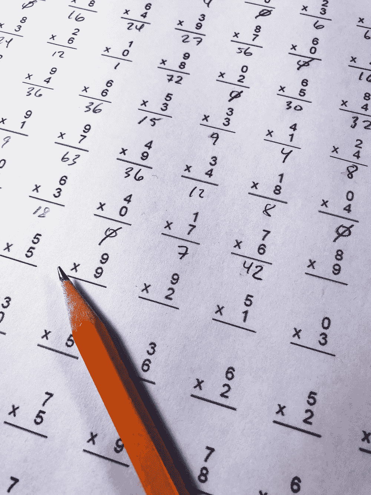
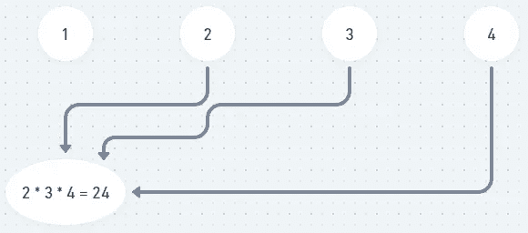
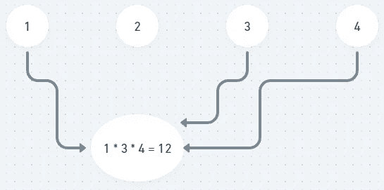
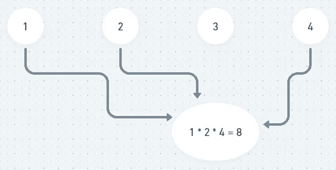
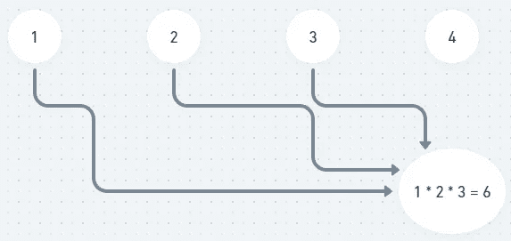
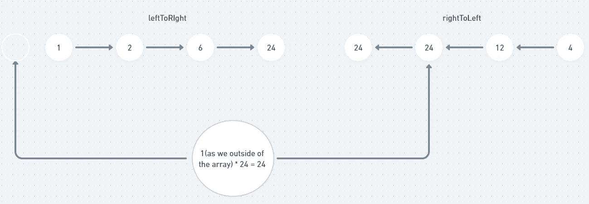
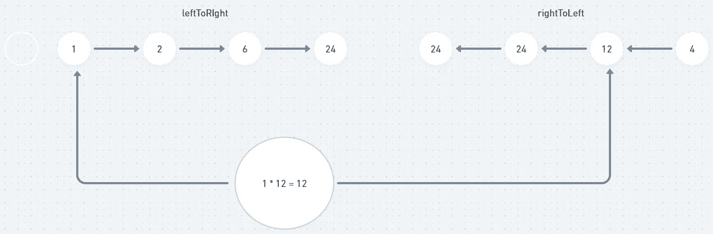
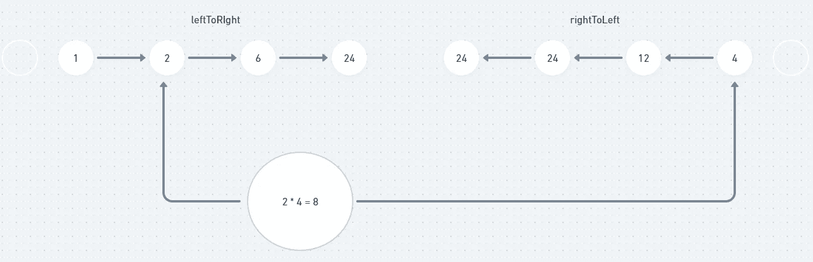
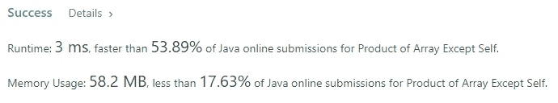
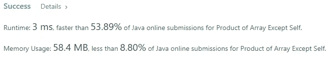

# 除自身盲 75 个 LeetCode 问题之外的阵列乘积

> 原文：<https://levelup.gitconnected.com/product-of-array-except-self-blind-75-leetcode-questions-4302888cd695>



克里斯·利维拉尼在 [Unsplash](https://unsplash.com/?utm_source=medium&utm_medium=referral) 上的照片

## 任务描述:

`nums`的任何前缀或后缀的乘积**保证**适合一个 **32 位**整数。

您必须编写一个在`O(n)`时间内运行且不使用除法运算的算法。

**例 1:**

```
**Input:** nums = [1,2,3,4]
**Output:** [24,12,8,6]
```

**例 2:**

```
**Input:** nums = [-1,1,0,-3,3]
**Output:** [0,0,9,0,0]
```

**约束:**

*   `2 <= nums.length <= 105`
*   `-30 <= nums[i] <= 30`
*   `nums`的任何前缀或后缀的乘积**保证**适合一个 **32 位**整数。

**跟进:**能否解决`O(1)`额外空间复杂度中的问题？(输出数组**不**算作空间复杂度分析的额外空间。)

## 推理:

这是一个有趣的算法任务。对于给定数组中的每个索引，我们需要找到数组中除当前位置元素之外的所有元素的乘积。让我们考虑一下给出的例子:



获取索引= 0 的结果



获取索引= 1 的结果



获取索引= 2 的结果



获取索引= 3 的结果

我想通过看上面的例子，你已经明白了主要意思。一个直接的想法会出现在你的脑海中，“让我们把数组中的所有元素相乘，我们可以用它除以每个位置的元素，它会给我们正确的结果”。这是正确的思考方式，它确实给了我们正确的结果，但是问题陈述说我们不能使用除法运算。

我们继续头脑风暴吧。另一个想法是使用类似于[运行求和数组](https://leetcode.com/problems/running-sum-of-1d-array/)的东西。让我们创建另外两个数组，leftToRigh 和 rightToLeft。对于 leftToRigh 数组，我们将从 index = 1 开始迭代，直到数组结束，并将每个 index 处的值设置为当前元素与前一个值的乘积。

左向右数组的构造

如果我们有[1，2，3，4]的输入，那么上面的代码给我们[1，2，6，24]

对于 rightToLeftarray，我们将从 index = array.length — 2 开始迭代，直到数组的开头，并将每个索引处的值设置为当前元素与前一个值的乘积。

rightToLeft 数组的构造

如果我们有[1，2，3，4]的输入，那么上面的代码给我们[24，24，12，4]

现在有了这些数组，我们可以通过迭代每个索引并将 leftToRigh 和 rightToLeft 的值相乘来简单地计算除当前元素之外的数组的乘积。这里有一个例子可以帮助你理解实际的逻辑。



索引= 0 的计算结果



索引= 1 的计算结果



索引= 2 的计算结果


索引= 3 的计算结果

如果你很难理解其中的逻辑，试着再看一遍上面的图片。

让我们看看我们的解决方案:

这很有效，给了我们很好的结果



酪让我们再看一遍任务描述。在最底部，我们有一个后续问题——使用常数空间解决问题。这里我们使用了两个辅助数组。

## 解决方案:

使用常数 O(1)空间的解

如果你仔细阅读描述，你可能会注意到输出数组不算额外的空间，这是一个诡计。有了输入数组和输出数组，我们仍然有 2 个数组，如我们在以前的解决方案中使用的 leftToRight 和 rightToLeft。我们只需要稍微调整一下我们的逻辑。

上面的代码给出了几乎相同的结果，但是使用了常数空间 O(1)。



让我知道你的想法。我的文章里见！

# 分级编码

感谢您成为我们社区的一员！在你离开之前:

*   👏为故事鼓掌，跟着作者走👉
*   📰查看[级编码出版物](https://levelup.gitconnected.com/?utm_source=pub&utm_medium=post)中的更多内容
*   🔔关注我们:[推特](https://twitter.com/gitconnected) | [LinkedIn](https://www.linkedin.com/company/gitconnected) | [时事通讯](https://newsletter.levelup.dev)

🚀👉 [**加入升级人才集体，找到一份惊艳的工作**](https://jobs.levelup.dev/talent/welcome?referral=true)