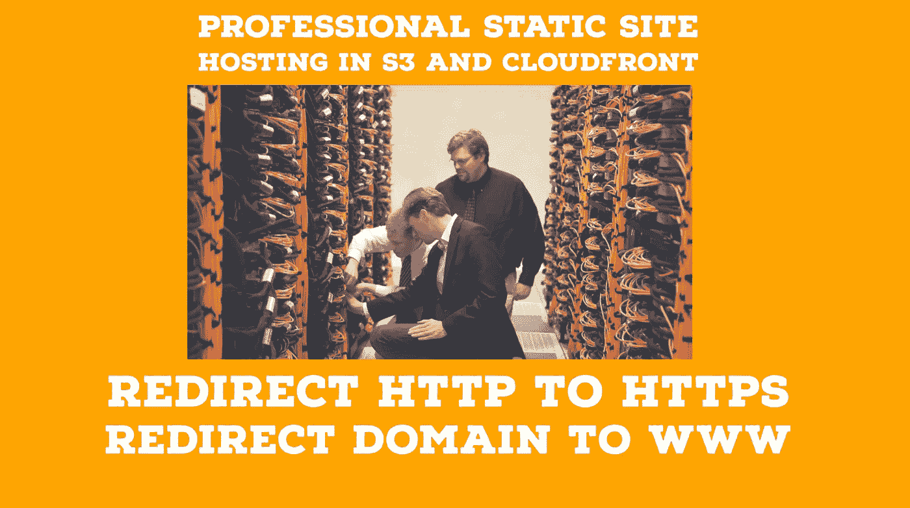
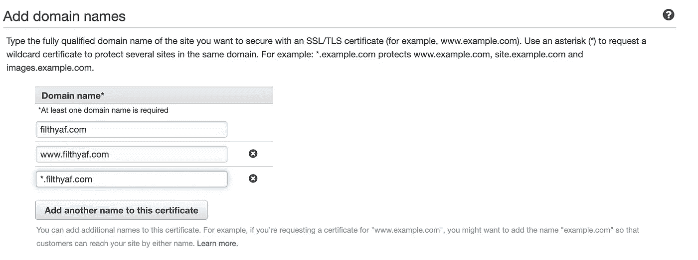

# AWS 中的生产级静态站点

> 原文：<https://levelup.gitconnected.com/production-level-static-sites-in-aws-39573c9bf4d5>

## 保持 S3 存储桶私有，将其放在 CDN 后面，同时将 apex 域路由到 www 子域



当你去大多数网站时，你可能会注意到两件事，该网站通常重定向到 HTTPS 和它通常重定向到 WWW 子域。无论您是否输入裸域(apex 域)。这样做的理由很长，但主要是出于 SEO 和专业期望，这里有一个好的[理由](https://stackoverflow.com/a/624480)的名单。

我要指出的另一件事是，当人们使用 AWS S3 进行托管时，会将他们的 S3 桶设置为公共的，这让我很恼火。我知道这是一个提供的功能，但你的一个错误配置的黑客破坏了你的网站。

在本文中，我将详细介绍我认为的使用 AWS 托管静态站点的更安全、更专业的方法。虽然我使用 Gatsby 来呈现我的静态站点，但我不打算深入站点代码本身。*这就是如何托管你已经生成的静态文件。*

这一开始看起来有些违反直觉，但是我们实际上是要先建立 www 子域。

# 创建一个私有 S3 存储桶

首先，我们将创建一个新的存储桶。名字并不重要，我们也不想给公众许可。我通常把它们称为名称中包含内容的桶。你**不要**想给桶域名，这个以后会搞混的。使用类似于 *domain-contents* 的名称作为桶名。

现在在这里上传你的静态站点的内容。老实说，为了方便起见，我通常会上传一个简单的大标题 index.html，只是为了测试我已经启动并运行了所有的东西，而不必同时调试我的站点。做一些可预见的事情。

现在我们有一个 ***的私人*** 的 S3 跟我们的网站斗。我们应该根本无法从 AWS 外部达到这一点。


# 在 AWS ACM 中设置 DNS 并创建 SSL 证书

接下来我们去玩 AWS Route53 吧。我们希望用您的域创建一个托管区域，并生成命名空间服务器。然后在你的域名托管(GoDaddy，Google Domains，Namecheap 等)中，你要指向 AWS 命名空间域。如果你需要更多关于如何做的细节，这里有一个有用的[教程](https://medium.com/@limichelle21/connecting-google-domains-to-amazon-s3-d0d9da467650)。

您可以在终端中使用`dig`命令来测试您的名称服务器是否正确。您也可以使用`nslookup`命令。您应该会看到亚马逊域名服务器正在运行。

```
dig @8.8.8.8 NS domain.com
```

转到 AWS 证书管理器，ACM，在这里，我们将为裸域 www 域申请 SSL 证书，并可能为任何未来的项目通配符子域。如果你不太了解证书，那么幸运的是 AWS 让这变得非常容易。[请务必在 **us-east-1** 地区制作您的所有证书，以便我们可以在 Cloudfront](https://stackoverflow.com/questions/37289994/aws-certificate-manager-do-regions-matter) 使用它！


请求公共证书



添加您的裸域，www 域，可能还有一个通配符


你可以用任何一种方式来验证它，但是 DNS 更快

幸运的是，AWS 允许我们通过一个简单的按钮自动为 SSL 创建 DNS 记录来验证证书。


在 Route53 中自动添加记录

您的证书可能需要一些时间来验证，但通常不会太长。下面应该是结果。*再次确认这都是在****us-east-1****地区！*


ACM 中经过验证的域

检查 SSL 证书是否连接正确。使用`openssl`工具。

```
openssl s_client -connect domain.com_cert_url
```

酷，现在我们有了一个私人的 S3 桶来存放我们的内容，我们有了指向 AWS 的域名，还有一个 SSL 证书来保护我们用户到我们网站的连接。

# 云锋 CDN

内容交付网络是一种快速共享静态资产的方式。基本思想是将人们最近使用的静态资产缓存在离他们很近的位置。

在 AWS Cloudfront 中创建一个发行版，并让它指向私有的 S3 桶。选择限制访问，创建新身份，并允许其更改 S3 存储桶权限。这使得只有 Cloudfront 可以从 S3 桶中获取数据。Cloudfront 将对公众开放，而我们的桶的细节将保持私有。


确保限制存储桶访问，并允许它更新存储桶策略

现在为备用域名添加 **www 子域**。在我的例子中，它是[www.filthyaf.com](http://www.filthyaf.com)，如果您的证书通过验证，当您选中“使用自定义 SSL 证书”时，它将出现在下拉列表中。该证书再次需要位于 **us-east-1** 地区，并且必须拥有 **www** 子域或*通配符子域才能工作。

现在选择选项**将 HTTP 重定向到 HTTPS** 。


这是我们做所有从 HTTP 到 HTTPS 的重定向的地方

创建发行版后，我们可以通过导航到提供的发行版 URL 来测试这一点。现在你应该可以公开看到 S3 水桶的 index.html 了！但是这个 URL 是一个丑陋的 Cloudfront URL，我们想要指向它。

好了，让我们导航回 Route53，为我们的 www 子域输入一个 CNAME，并将其指向 Cloudfront 分发 URL。


复制 AWS Route53 的 Cloudfront 域名


创建一个指向 Cloudfront 域的 DNS 记录

找到了。我们有它，如果我们在浏览器中导航到 www 子域，我们可以看到我们被重定向到 HTTPS 安全连接，可以看到我们的静态网站！

好了，现在我们有了我们网站的专业 www 子域。但是我们的 apex 域没有指向任何地方，这并不酷。

# 将 Apex 域重定向到 WWW

幸运的是，这非常简单，尽管我不喜欢这样做，但这是目前为止最简单的，也是 AWS 认可的将 apex 域重定向到 WWW 域的方法。

首先，我们需要用 apex 域名和域名扩展创建一个 S3 存储区。*了解我们为什么不想让我们的私有 S3 桶以域名命名。*


创建空的公共 S3 存储桶

确保它是公开的，并使它成为一个静态网站的网站托管桶。**不要将任何文件添加到此桶中。**现在确保你选择的是一个到 www 子域的重定向。现在，虽然这将在 apex 域自动重定向 HTTP 请求，但如果我们尝试在 apex 域上执行安全 HTTPS 请求，您会看到一些问题和挂起。原因是 **S3 无法检查 SSL 证书**我们需要通过 Cloudfront 发行版来完成。我知道很差劲。

我们创建一个新的 Cloudfront 发行版，并将其指向公共 apex S3 域的**网站端点**。省掉你的头痛，不要让它自动完成！


不要让这在 Cloudfront 中自动填充！你应该看到名字里的“网站”了！


使用这个端点从 S3 静态网站模态！

不要忘记添加域名和正确的 SSL 票证。


不要忘记选择您的 SSL 证书并添加域名！

现在保持公开和简单。现在，我们有一个分布式链接，应该访问 S3 桶，看到重定向，并前往 HTTPS WWW 子域。

现在转到 Route53，在 apex 域设置一个 A 记录，并将其指向此分发链接。就像我们对另一桶做的一样。


确保 apex 域指向它自己的 Cloudfront 发行版

我使用`curl`命令测试每个部分，看看是否一切都正常。我们希望能够看到一个 301 状态代码，位置更新到 www 子域和 HTTPS。

```
curl -i url 
```

在带有基本 HTTP 的浏览器中键入 apex 域名，并看到它路由到 HTTPS www 子域！

现在，请记住，我们本质上是在一个巨大的缓存后面，所以每次我们做出更改时，我们都需要确保在 Cloudfront 中使其无效，这样它就可以回到 S3 存储桶中，获得最新的内容，我们就可以看到最新的更改。

# TL；速度三角形定位法(dead reckoning)

*   将 HTTP 裸域重定向到 HTTPS WWW 子域
*   使用一个私人的 S3 桶，而不是一个公共的，同时也使您的网站快速！
*   使用 AWS Route53、S3、ACM 和 Cloudfront 创建更专业、更安全的连接和外观
*   任何 HTTP 或 apex 域都会直接重定向到 https www 域！

如果你是 Github 的用户并且喜欢 CI/CD，那么让我们建立一个 Github 工作流，这样每次你推送或者与 master 合并时，它都会将你的内容推送到 S3，然后使 Cloudfront 缓存失效。这是为此准备的一点小礼物。