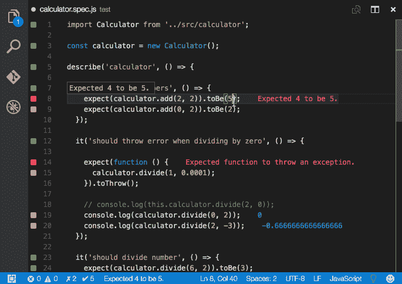
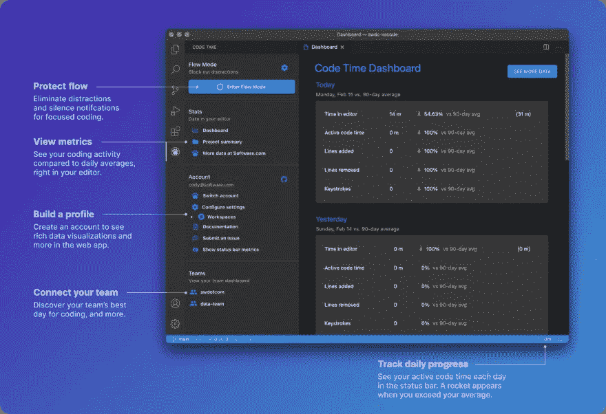
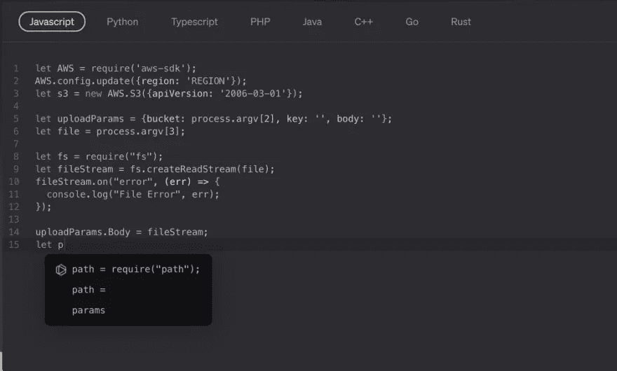
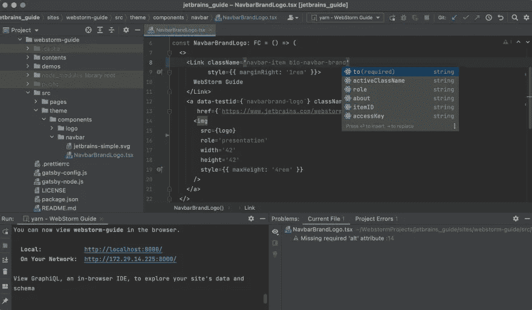

# 生产力助推器:我的五大物有所值的开发工具

> 原文：<https://levelup.gitconnected.com/productivity-boosters-my-top-five-developer-tools-worth-the-money-86e21c42a9d2>

他们说生活中最好的东西是免费的，但是当涉及到软件的时候…嗯，它并不总是正确的。不要误解我——我每天都在使用大量优秀的免费开源工具。但是，帮助您更快或更有效地开发的工具可以很容易地节省时间，因为正如他们所说，时间就是金钱。

我收集了一些我认为值得购买的工具，希望你会觉得有用。他们都有一个体面的免费计划或试用版本，所以你可以随时踢轮胎之前，你打破银行💰

# [GitLive](https://plugins.jetbrains.com/plugin/11955-gitlive)

GitLive 是我的团队最近的发现。这是一个点对点的代码流平台和 IDE UI 扩展(针对 VS 代码和 JetBrains)，通过实时功能增强了 Git，如团队成员的**在线呈现**和**即时合并冲突检测**。

**团队成员在线状态**。IDE 插件增加了一个团队侧边栏/工具窗口，在这里你可以看到你的团队中谁在线，他们正在处理什么问题和分支，以及他们在这些分支上所做的改变。这对于远程团队来说非常好，当您想要查看或共享正在进行的工作，而不需要求助于屏幕共享或剪切并粘贴代码片段到 Slack 或团队中时，这真的很有帮助。

**即时合并冲突检测**。编辑器中的指示器显示您的更改和其他人的更改之间的差异。这些会在您和您的队友编辑时实时更新，并提供潜在合并冲突的早期警告。这是一个很好的方式，可以在不被打扰的情况下提前了解你同事的潜在重叠工作。

✅ **免费计划。包括:**

*   无限用户
*   社交编码和问题跟踪
*   提取/提取时的合并冲突检测
*   使用代码共享进行一对一通话
*   40 分钟通话时长限制

💲 **Pro 计划(10 美元/用户/月或开源免费)。包括:**

*   免费计划中的所有内容
*   即时合并冲突检测
*   群组通话(即将推出)
*   4 小时通话时长限制
*   优先支持

# [Wallaby.js](https://marketplace.visualstudio.com/items?itemName=WallabyJs.wallaby-vscode)

Wallaby 是一个集成的 JavaScript 连续测试工具，由 Quokka 和 Dingo 背后的团队开发(有趣的事实:他们以澳大利亚本地动物🇦🇺命名他们所有的产品)

这种**不受干扰的 javascript 测试**在您键入时运行测试，并直接在您的编辑器中提供结果，就在您的代码旁边(不像传统的测试运行程序在您的控制台中显示反馈)，甚至在未保存的文件上。

Wallaby 在更大的项目上工作得非常好，它可以通过允许您专注于一组特定的测试来帮助您最大化您的生产力，无论您的项目变得多么大。

这些工具附带了许多很棒的功能，例如带有编辑并继续或值浏览器的**时间旅行调试器**和用于查看运行时值的**输出检查器**等等。此外，他们的文档非常棒，为您提供了所有功能的全面概述，可以让您立即开始使用该产品！

✅ **2 周免费试用**

💲**两周之后需要许可证**
正常价格是 200 美元/用户/年，但是你可以申请很多折扣(例如，初创公司和非营利组织可以享受 40%的折扣，团队+20 可以享受 10%的折扣)。OSS 免费。

# [代码时间](https://marketplace.visualstudio.com/items?itemName=softwaredotcom.swdc-vscode&ssr=false#overview)

如果你和我一样，你肯定会喜欢一个好的**数据可视化**来展示你在编码过程中是如何度过时间的。就个人而言，分析图表有助于我改善时间管理，更好地组织我的工作——这就是为什么我喜欢时间跟踪工具，我将它们用于我的个人项目，并鼓励我的团队也使用它们。最近我们一直在试验代码时间🕰

Code Time 是一个开源插件，用于 JetBrains 上 Visual Studio 代码中的**自动编程指标和**时间跟踪。它的高级功能可以为您提供关于您工作效率的详细反馈(这是巧妙设计的一大优势！).

它有很多很酷的功能，可以帮助你最大限度地减少分心，找出你一天中最有效率的时间，并分解你的编码统计数据(按项目、代码行和按键划分的编码时间)。)借助 Teams plan，您可以保护代码时间，了解会议的影响，并改善整个团队的工作生活平衡，同时您的数据始终是私有的，当您创建团队时，您将只能看到团队级别的汇总和匿名汇总数据，该团队的每个人都可以使用这些数据。此外，为了保护个人隐私，最小团队规模为五人。

✅ **免费计划。包括:**

*   不到五分钟快速设置
*   关键 DevOps 性能指标
*   90 天数据保留

**💲Pro 计划(20 美元/用户/月或开源免费)。包括:**

*   免费计划中的一切
*   无限制的数据保留
*   自定义仪表板
*   自动电子邮件报告
*   监视器和警报
*   EditorOps 工作流自动化(即将推出)

# [禁忌](https://plugins.jetbrains.com/plugin/12798-tabnine-ai-code-completion-js-java-python-ts-rust-go-php--more)

大多数开发团队一直在寻找能够提高他们生产力的解决方案。提高开发人员效率(并减少挫败感)的方法之一是更快的编码。如果你是那些总是在寻找加速编码工具的人之一，那么 Tabnine 肯定是你的目标。

这是一个**人工智能代码完成**工具，它可以索引你的代码并找到统计模式，根据你如何编写自己的代码来创建**定制建议**。它允许您在 IDE 中以更少的语法错误和更多的代码片段更快地编码。最好的一点是，随着时间的推移，它会变得更好，因为它获得了更多可以学习的材料，这为开发团队带来了巨大的价值(因为我们使用相同的特定于项目的模块、API、代码模式和约定，当在相同的上下文中工作时，人工智能从每个团队成员那里学到的东西很可能对团队的其他成员有用)🚀

✅ **免费计划。包括:**

*   1 个用户
*   基于公共代码的完成

**💲Pro 计划(12 美元/用户/月或开源免费)。包括:**

*   1–50 名用户
*   基于代码的完成
*   基于公共代码的高级完成
*   洞察力和分析
*   定制选项
*   优先支持

# [JetBrains IDEs](https://www.jetbrains.com/store/?rss#commercial?billing=yearly)

每个人都有自己的想法，但我不能真的把它漏掉，不是吗？没有必要向任何开发人员展示它们，JetBrains IDEs 广泛用于专业开发。

JetBrains IDEs 提供了许多专门针对特定语言的“开箱即用”功能。他们也因其强大的**代码重构能力**和**代码分析功能而闻名。除了 IDEA Community 和 Android Studio 之外，ide 都是要花钱的，但是如果你考虑到配置其他产品的工作量，这个价格似乎是合理的。**

✅ **30 天免费试用**

💲**30 天后需要许可证**
首先，他们的大部分 ide 每用户年花费 199 美元，不包括更便宜的 web storm(129 美元)和更贵的 ReSharper(299 美元)和 Rider(349 美元)。在使用该产品的第二年和第三年后，价格明显下降。

时间就是金钱，对于软件开发来说，这是毫无疑问的！我希望你会发现我选择的付费开发工具值得一试，在权衡它们提供的好处后，你会同意在高质量的工具上花钱是值得的。