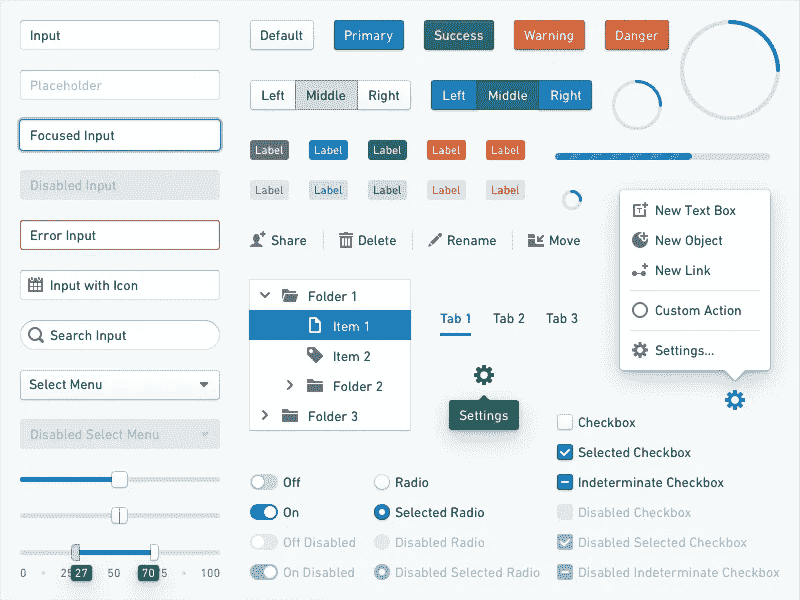
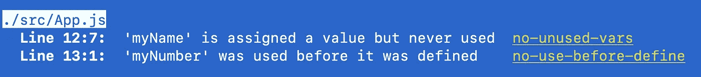

# 软件工程师和技术公司的生产力工具和实践

> 原文：<https://levelup.gitconnected.com/productivity-tools-and-practices-for-software-engineers-and-tech-companies-72869c5a40d5>


安德里亚斯·克拉森在 [Unsplash](https://unsplash.com?utm_source=medium&utm_medium=referral) 上拍摄的照片

每个人都想在不精疲力竭的情况下提高工作效率。那么，如何在不增加工作时间的情况下完成更多工作呢？你如何在不承担监工角色的情况下帮助团队的其他成员提高呢？答案是:使用有效的工具。

在这篇文章中，我们将看看软件工程师和技术公司可以用来加速他们的开发生命周期而不牺牲质量的五个有效工具。设计系统、代码链接器、代码格式化器、持续集成和 IaaS/PaaS 提供商都是工具，它们允许软件工程师简化日常工作，并依次优先构建他们的产品。

# 设计系统



[Palantir 的蓝图](https://dribbble.com/Palantir)组件库

一个设计系统可以归结为一个组件库，用来从可重用的构建模块中创建产品。

*(虽然在实践中，远不止如此！设计系统还包括设计模式、使用指南、文档、所有权模型、沟通方法、产品路线图等等。)*

这些构件可能由头像、徽章、按钮、下拉菜单、表单输入、图标、链接、模态、进度指示器和工具提示等组件组成。像乐高积木一样，这些组件可以组装起来，创建你的应用程序需要的所有页面和功能。

设计系统提供了大量的好处，允许你的组织的 UI 随着公司(和产品)的成长而扩展。

1.  首先，设计系统帮助你**创建一个一致的用户界面**，因为你在整个应用程序中使用相同的构建模块组件。
2.  第二，你的设计师和软件工程师可以**开发得更快**,因为他们不必花费数小时或数天重新发明轮子，重新构建像模态这样的东西。相反，设计系统可以提供一个可以在任何地方实现的通用模型。
3.  第三，使用一组共享的组件使得**在整个应用程序中一次性推出风格变化变得更加容易**。如果您的应用程序的按钮样式需要更改，而不是调整应用程序中的每个按钮，您可以只在设计系统中调整按钮样式，然后在应用程序的其他地方观察这些更改的效果！
4.  第四，设计系统允许你**关注 UX 难题**。UX 的设计师不用花时间去决定你的公司开发的每一个新功能应该如何使用下拉菜单和模态，而是可以把注意力放在整体体验上，以确保每个功能都是合理的和用户友好的。

如果你决定建立自己的设计系统，请注意他们需要做很多工作！设计系统是一个产品，而不是一个副产品。否则，如果你认识到你没有时间或资源来建立自己的设计系统，有很多好的选择，如谷歌的 [Material-UI](https://material-ui.com/) ，Adobe 的 [Spectrum](https://spectrum.adobe.com/) ，或 [Ant Design](https://ant.design/) 。

# 代码棉绒



ESLint 示例输出

像 [ESLint](https://eslint.org/) for JavaScript 这样的代码分析器对你的代码进行静态分析。它们有助于自动捕捉语法错误，甚至是最佳实践问题，并且可以直接包含在您的构建过程或 git 挂钩中。代码换行符很方便，因为它们自动化了人类不擅长但机器擅长的事情——不用再寻找第 245 行中丢失的花括号了！

ESLint 也是高度可配置的，并且有一个庞大的插件生态系统。您可以安装 ESLint 插件，如 [eslint-plugin-jsx-a11y](https://www.npmjs.com/package/eslint-plugin-jsx-a11y) 来帮助捕捉应用程序中的可访问性违规，或 [eslint-plugin-react](https://www.npmjs.com/package/eslint-plugin-react) 来帮助实施 react 最佳实践。如果您不想亲自挑选各种插件，也可以使用预设。一个流行的预设是 [eslint-config-airbnb](https://www.npmjs.com/package/eslint-config-airbnb) 包，其中包括 airbnb 推荐的 eslint 配置选项。

# 代码格式化程序

像[pretty](https://prettier.io/)这样的格式化器可以格式化你的 JavaScript、HTML、CSS，甚至 markdown 文件。与代码翻译器类似，代码格式化器有助于自动化原本是痛苦的手动任务。

不要再花时间争论是否应该使用空格或制表符、分号或不使用分号、尾随逗号或不使用分号——只需设置更漂亮的配置并允许它格式化您的代码。格式化程序将为您维护整个存储库中的一致性和团队标准。这也意味着不再需要花时间在代码审查上，比如说“这里缺少分号”或者“在文件末尾添加新的一行”更漂亮的允许你关注代码本身的功能和可维护性。

以下是我喜欢的更漂亮的配置设置:

```
{
  "tabWidth": 2,
  "useTabs": false,
  "printWidth": 80,
  "semi": false,
  "singleQuote": true,
  "trailingComma": "es5",
  "quoteProps": "as-needed",
  "jsxSingleQuote": false,
  "jsxBracketSameLine": false,
  "bracketSpacing": true,
  "arrowParens": "avoid",
  "endOfLine": "auto",
  "proseWrap": "preserve",
  "htmlWhitespaceSensitivity": "css"
}
```

使用这种更漂亮的配置会产生难看的、格式不一致的代码，如下所示:

```
function HelloWorld({greeting = "hello", greeted = '"World"', silent = false, onMouseOver,}) { if(!greeting){return null}; // TODO: Don't use random in render
  let num = Math.floor (Math.random() * 1E+7).toString().replace(/\.\d+/ig, "") return <div className='HelloWorld' title={`You are visitor number ${ num }`} onMouseOver={onMouseOver}> <strong>{ greeting.slice( 0, 1 ).toUpperCase() + greeting.slice(1).toLowerCase() }</strong>
    {greeting.endsWith(",") ? " " : <span style={{color: '\grey'}}>", "</span> }
    <em>
	{ greeted }
	</em>
    { (silent)
      ? "."
      : "!"} </div>;}
```

然后把它变成漂亮的代码，就像这样！

```
function HelloWorld({
  greeting = 'hello',
  greeted = '"World"',
  silent = false,
  onMouseOver,
}) {
  if (!greeting) {
    return null
  } // TODO: Don't use random in render
  let num = Math.floor(Math.random() * 1e7)
    .toString()
    .replace(/\.\d+/gi, '') return (
    <div
      className="HelloWorld"
      title={`You are visitor number ${num}`}
      onMouseOver={onMouseOver}
    >
      <strong>
        {greeting.slice(0, 1).toUpperCase() + greeting.slice(1).toLowerCase()}
      </strong>
      {greeting.endsWith(',') ? (
        ' '
      ) : (
        <span style={{ color: 'grey' }}>", "</span>
      )}
      <em>{greeted}</em>
      {silent ? '.' : '!'}
    </div>
  )
}
```

# 自动化测试和持续集成

随着任何应用程序的复杂性和规模的增长，一个人不可能记住所有东西是如何工作的。手动测试应用程序中的所有内容也变得不可行，更不用说成本高昂了。

单元测试、集成测试和端到端(e2e)测试确保您的代码做您认为它做的事情，作为文档，并防止未来的回归。如果你觉得编写测试是一件毫无意义的事情，请记住— [测试是为了将来](https://medium.com/better-programming/tests-are-for-the-future-e73c2724ffd0)。

持续集成(CI)确保您的主代码分支保持在可工作的状态(理论上)。您可以使用类似于 [Travis CI](https://travis-ci.org/) 、 [CircleCI](https://circleci.com/) 、 [GitLab CI/CD](https://docs.gitlab.com/ee/ci/) 或 [Heroku CI](https://devcenter.heroku.com/articles/heroku-ci) 的服务来为您的存储库建立持续集成。然后，您可以配置 CI 管道，在每次提交后运行 linters 和自动化测试，并要求在合并代码之前通过所有测试。

通过进行测试并经常运行它们——无论是在本地开发期间还是作为 CI 流程的一部分——您可以节省大量时间，否则您将花费大量时间来手动测试应用程序。

# IaaS 和 PaaS 提供商

基础架构即服务(IaaS)提供商和平台即服务(PaaS)提供商都为您管理基础架构，因此您不必再做任何工作。常见的 IaaS 提供商有[亚马逊 Web 服务](https://aws.amazon.com/)、[谷歌云平台](https://cloud.google.com/)、[微软 Azure](https://azure.microsoft.com/) 。PaaS 提供商可以是像 Heroku 或 Netlify 这样的解决方案。

例如，使用像[亚马逊关系数据库服务(RDS)](https://aws.amazon.com/rds/) 这样的托管数据库意味着您不必担心执行数据库升级或安装安全补丁。使用像[亚马逊简单通知服务(SNS)](https://aws.amazon.com/sns/?whats-new-cards.sort-by=item.additionalFields.postDateTime&whats-new-cards.sort-order=desc) 这样的通知服务意味着你不必为发送电子邮件或短信创建自己的服务。

将你的应用程序部署到 Heroku 平台上意味着，除了其他事情之外，你不必担心应用程序随着使用量的增加而扩展。[水平和垂直缩放](https://devcenter.heroku.com/articles/scaling)可以自动发生。


Heroku 标志

当你的基础设施为你管理时，你可以花更多的时间在你的产品上，花更少的时间在工作上。

# 结论

我们介绍的每个工具都有助于处理软件工程中固有的日常工作。设计系统、代码链接器、代码格式化器、测试、持续集成和 IaaS/PaaS 提供商可以大大加快软件开发生命周期。尽管如此，开始使用它们还是取决于你。一旦您完成了这些工具的初始配置，您将会惊奇地发现您和您的团队变得如此高效。

如果你想更有效率，使用你所拥有的工具来自动化你所能做的。然后你就可以专注于你喜欢的事情——构建你改变世界的应用程序。