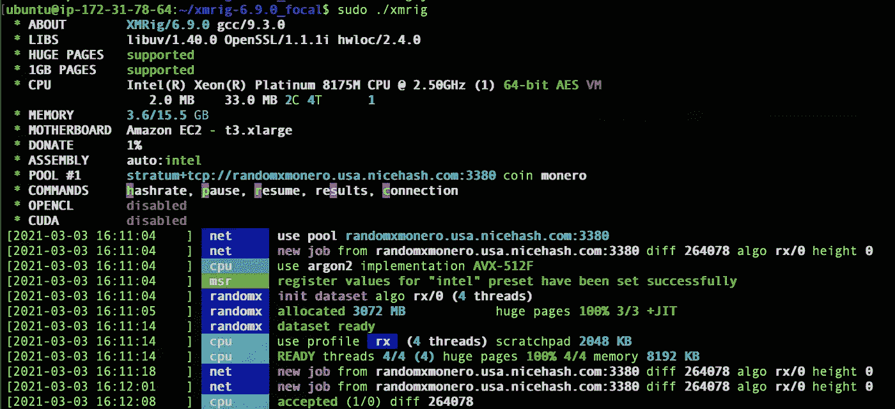
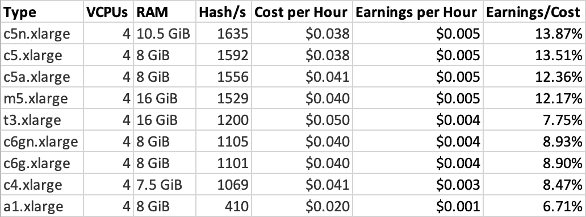

# CPU 在 AWS EC2s 上挖掘加密货币 Monero 的盈利能力

> 原文：<https://levelup.gitconnected.com/profitability-of-cpu-mining-the-cryptocurrency-monero-on-aws-ec2s-5a3ae3df2be4>

我们将在不同的 AWS EC2 实例类型上使用 XMRIG miner 查看 CPU 挖掘 Monero 的结果。


[张秀坤·万尼的照片](https://unsplash.com/photos/Mk2ls9UBO2E)

# 介绍

加密货币挖掘可以被认为是有助于交易确认的代理执行工作。由于需要大量理想的分散式采矿者来确保区块链(无重复支出等)，因此存在通过通用硬件(CPU)而非专用硬件(GPU、FPGA、ASIC)进行采矿的动机。

为了实现这个目标，加密货币 Monero 使用了 [RandomX](https://github.com/tevador/RandomX/blob/master/doc/design.md) 算法。这种算法得益于 CPU 的两个特性:执行任意指令的能力和对大量内存的访问。相反，该算法不依赖于对不同数据执行相同指令序列的散列函数，而是随机化数据和所使用的指令(操作序列)。数据和指令都是通过存储在 2080 MB RAM 中的随机生成的比特流来定义的。

在接下来的部分中，我们将回顾使用 [AWS EC2](https://aws.amazon.com/ec2/) 服务器的挖掘性能。将显示实例的租赁成本以及产生的 Monero 的收益。

# 方法

## 创建 EC2 实例

AWS EC2 实例是按照以下步骤通过管理控制台在 US-EAST-1 地区创建的:

1.  从 [EC2 仪表板](https://console.aws.amazon.com/ec2/v2/home?region=us-east-1)中点击“启动实例”。
2.  选择“Ubuntu Server 20.04 LTS (HVM)，SSD 卷类型”操作系统。在撰写本文时，它是 AMI 版本:ami-042e8287309f5df03 (64 位 x86) / ami-0b75998a97c952252 (64 位 Arm)。注意:如果在 ARM 处理器上启动，请选择 ARM 版本的操作系统。
3.  选择要分析的实例类型。
4.  跳过“步骤 3:配置实例详细信息”。我们将保持一切默认设置。
5.  添加 16GB 固态硬盘存储(GP2)。
6.  跳过“步骤 5:添加标签”。
7.  通过将端口 22 打开到“source”列下的“my IP ”,允许 SSH 访问实例。

要访问新创建的实例，请使用下面的命令。

```
ssh -i "YOUR_AWS_KEY.pem" ubuntu@YOU_INSTANCE_PUBLIC_IP
```

如果您收到错误`Permissions 0777 for 'YOUR_AWS_KEY.pem' are too open`，运行下面的命令来限制密钥权限。

```
sudo chmod 600 YOUR_AWS_KEY.pem
```

## 安装 XMRIG

[所有实验都使用 XMRIG 的 6.9.0](https://github.com/xmrig/xmrig/releases/tag/v6.9.0) 版本。对于基于英特尔的处理器(C5、M5 等)，使用了[预编译二进制码](https://github.com/xmrig/xmrig/releases/download/v6.9.0/xmrig-6.9.0-focal-x64.tar.gz)。对于 AMD 和 ARM 处理器的实例，下面的步骤用于按照此处[和下面所示](https://xmrig.com/docs/miner/build/ubuntu)的指示构建代码。

```
sudo apt-get update
sudo apt-get install git build-essential cmake libuv1-dev libssl-dev libhwloc-dev 
git clone https://github.com/xmrig/xmrig.git 
mkdir xmrig/build && cd xmrig/build 
cmake .. 
make -j$(nproc)
```

## 配置和执行 XMRIG

XMRIG 配置是通过与可执行文件位于同一目录的`config.json`文件定义的。完整的文件如下所示。与默认文件相比，一些关键变化包括:

1.  `1gb-pages`下的`randomx`被设置为真。在这里见文档[。](https://xmrig.com/docs/miner/config/cpu#1gb-pages)
2.  CPU `rx`配置被设置为“短对象格式”,此处显示为,以简化大型实例上线程数量的配置。
3.  在 pool 下，使用您的帐户信息配置 [NiceHash 层](https://www.nicehash.com/?refby=52e83c99-2b21-47d1-a262-554e682334e1)。我选择了 [NiceHash](https://www.nicehash.com/?refby=52e83c99-2b21-47d1-a262-554e682334e1) ，因为排除了 2017 年的黑客攻击，它似乎是一个稳定而安全的平台，具有直观的用户界面。

```
{
  "api": {
    "id": null,
    "worker-id": null
  },
  "http": {
    "enabled": false,
    "host": "127.0.0.1",
    "port": 0,
    "access-token": null,
    "restricted": true
  },
  "autosave": true,
  "background": false,
  "colors": true,
  "title": true,
  "randomx": {
    "init": -1,
    "init-avx2": -1,
    "mode": "auto",
    "1gb-pages": true,
    "rdmsr": true,
    "wrmsr": true,
    "cache_qos": false,
    "numa": true,
    "scratchpad_prefetch_mode": 1
  },
  "cpu": {
    "enabled": true,
    "huge-pages": true,
    "huge-pages-jit": false,
    "hw-aes": null,
    "priority": null,
    "memory-pool": false,
    "yield": true,
    "asm": true,
    "argon2-impl": null,
    "astrobwt-max-size": 550,
    "astrobwt-avx2": false,
    "argon2": [0, 2, 1, 3],
    "astrobwt": [0, 2, 1, 3],
    "cn": [
      [1, 0],
      [1, 1]
    ],
    "cn-heavy": [
      [1, 0],
      [1, 2],
      [1, 1],
      [1, 3]
    ],
    "cn-lite": [
      [1, 0], 
      [1, 2],
      [1, 1],  
      [1, 3]
    ],
    "cn-pico": [
      [2, 0],
      [2, 2],  
      [2, 1],
      [2, 3]
    ],
    "rx": {
      "intensity": 1,
      "threads": 4,
      "affinity": -1
    },
    "rx/wow": [0, 2, 1, 3],
    "cn/0": false,
    "cn-lite/0": false,
    "rx/arq": "rx/wow",
    "rx/keva": "rx/wow"
  },
  "log-file": null,
  "donate-level": 1,
  "donate-over-proxy": 1,
  "pools": [
    {
      "algo": null,
      "coin": "monero",
      "url": "stratum+tcp://randomxmonero.usa.nicehash.com:3380",
      "user": "YOUR_WALLET_ADDRESS_HERE",
      "pass": "x",
      "rig-id": null,
      "nicehash": true,
      "keepalive": false,
      "enabled": true,
      "tls": false,
      "tls-fingerprint": null,
      "daemon": false,
      "socks5": null,
      "self-select": null,
      "submit-to-origin": false
    }
  ],
  "retries": 5,
  "retry-pause": 5,
  "print-time": 60,
  "health-print-time": 60,
  "dmi": true,
  "syslog": false,
  "tls": {
    "enabled": false,
    "protocols": null,
    "cert": null,
    "cert_key": null,
    "ciphers": null,
    "ciphersuites": null,
    "dhparam": null
  },
  "user-agent": null,
  "verbose": 0,
  "watch": true,
  "pause-on-battery": false,
  "pause-on-active": false}
```

使用以下命令运行 miner:

```
sudo ./xmrig
```

成功执行后，您应该会在终端中看到如下所示的打印输出。



# 结果

## 优化配置

在深入研究单个实例类型的结果之前，需要注意的是，在不改变实例的情况下，miner 配置会对结果产生重大影响。影响最大的配置是挖掘线程的数量。

下图显示了使用不同数量的挖掘线程在 C5.metal 实例上进行挖掘所获得的 hashrate。随着线程的数量接近可用核心的数量(48 ),可以观察到 hashrate 几乎呈线性增长。41 个线程的问题可能是由 miner 的初始化问题引起的。当线程数量超过 CPU 内核数量时，hashrate 会随着线程竞争资源而下降。然而，在一个 VCPUs 数量较少的实例中(AWS 在 EC2 实例中对核心/线程总数的称呼)，有一些收益超过了核心数量(数据未显示)。因此，在尝试优化时，分析您的特定机器是很重要的。


另一个需要考虑的重要方面是可用的 RAM。在可用 RAM 少于 2GB 的情况下，该算法将在“慢速模式”下运行，性能会明显下降。具有 1 个 VCPU 和 2GB RAM(由操作系统共享)的 c6g.medium 只能实现 32 哈希/秒。与具有 2 个 VCPU 和 4GB RAM 的 c6g.large 的 554 哈希/秒相比，这是一个明显较低的性能。

## 实例类型之间的比较

比较实例时要考虑的一些关键属性包括:

1.  达到的哈希速率:这是实例“挖掘”的实际速率。
2.  每小时的成本: [EC2](https://aws.amazon.com/ec2/) 实例根据每小时的价格按比例收费。有不同的定价等级。为了这个实验的目的，我们将考虑“现货定价”,因为它是可用的最低价格。
3.  每小时收益:开采的 Monero 的美元价值。网站 [CryptoCompare](https://www.cryptocompare.com/mining/calculator/xmr?HashingPower=1529&HashingUnit=H%2Fs&PowerConsumption=0&CostPerkWh=0&MiningPoolFee=1) 将被用来估计收益。
4.  收益/成本:收益与成本的比率。高于 100%的值表明采矿是有利可图的。

下表显示了最终结果。毫不奇怪，**在当前的开采难度和加密货币价格下，没有一个实例是有利可图的**。



# 结论

Monero 的 CPU 开采以 [AWS EC2](https://aws.amazon.com/ec2/) 实例的形式利用租用的计算机能力，此时**不**似乎是有利可图的。在未来的工作中，我计划在 AWS 上分析 GPU 挖掘，以确定结果是否更有前途。

**免责声明:**本文**不是**投资、税务或法律建议，也不是招商引资。我可能与下面列出的一些公司有关联关系。此外，我不是金融专家，提供这些只是为了分享我的经验。