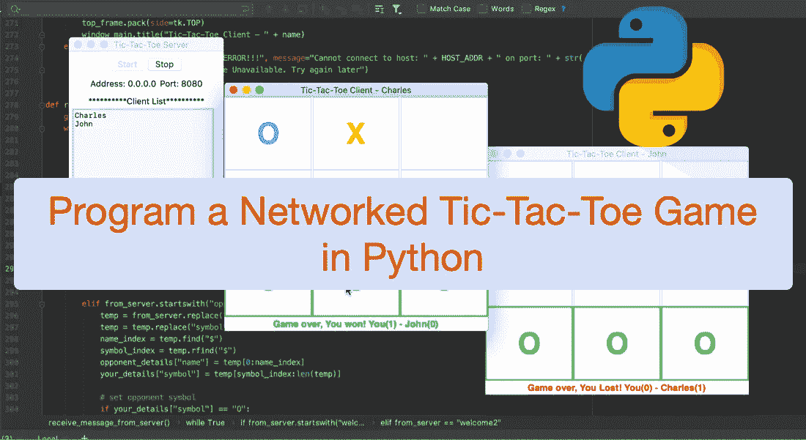
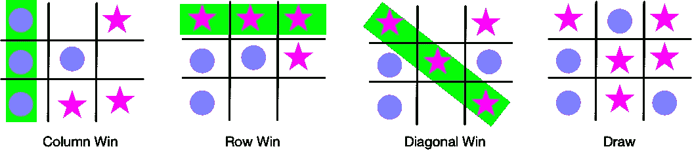
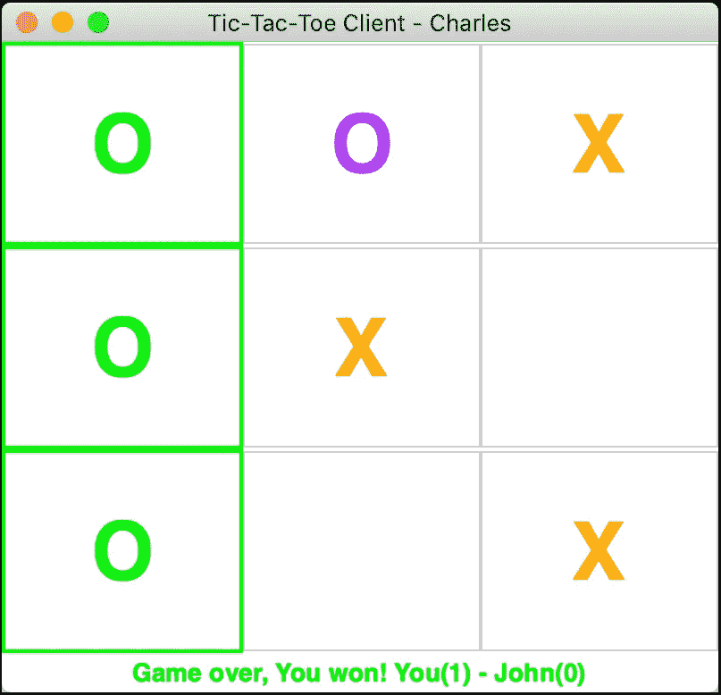
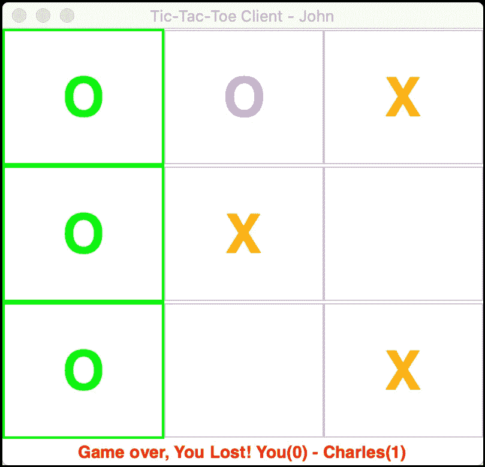
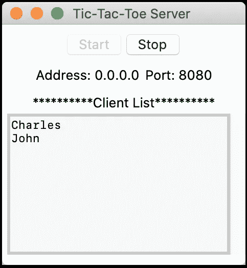

# 用 Python 编写一个网络井字游戏

> 原文：<https://levelup.gitconnected.com/program-a-networked-tic-tac-toe-game-in-python-30f8826e591d>

## 通过实现在线井字游戏，学习如何用 Python 编程一个网络回合制游戏

大家好，欢迎来到另一个教程，我将向你们展示如何用 Python 构建经典井字游戏的网络/在线版本。

与我的其他教程一样，我在这里的目标不仅仅是教你如何创建这个特定的游戏，而是提供创建网络应用程序和游戏的原则、技术和最佳实践。在我们开始之前，我已经在我之前的教程中介绍了非常重要的客户端-服务器概念。如果你还不熟悉网络(套接字)编程的话，请一定要看一看。

我们将在本教程中介绍的一些概念的基础上进行构建。在[之前的教程](/program-your-first-multiple-user-network-game-in-python-9f4cc3650de2?source=friends_link&sk=312059e7967875fdbf4c7b67520bbdc9)中，我们已经回答了一些非常重要的问题，比如:游戏逻辑放在哪里(客户端还是服务器端)，为什么？在哪里保存游戏分数？如何高效协调用户玩法？如果你不知道如何回答这些问题，或者为什么这些问题首先很重要，请看看前面的教程。

在开始学习教程之前，让我们先做一些“整理工作”。确保您已经安装并设置了[Python](https://www.python.org/downloads/)和 [Tkinter 库](https://tkdocs.com/tutorial/install.html)(用于创建 UI)。

既然我们已经解决了这个问题，那就让我们开始吧！

上面的电影展示了我们玩井字游戏的过程。当两个用户连接时，游戏开始。每次游戏结束时计算游戏分数(结果是赢、输或平)，几秒钟后开始下一次游戏。这个游戏和我之前的教程中的[石头剪刀布游戏最突出的区别是，这是一个回合游戏，即用户轮流玩，不能同时玩。回合游戏需要一种成本有效(从网络角度来看)和高效(就玩家协调而言)的机制来跟踪玩家回合并通知玩家何时轮到他们玩。](/program-your-first-multiple-user-network-game-in-python-9f4cc3650de2)

我已经在我的 github 上传了 [**完整的项目源代码供你下载试用。系好安全带，我们起飞吧！**](https://github.com/effiongcharles/tic_tac_toe_network_game)

# 井字游戏规则

我们将从一般的游戏规则开始。如果您已经熟悉，请随意跳到下一部分😊井字游戏通常由两个玩家在不同大小的棋盘上玩(为了简单起见，我们将在本教程中使用 3x3 的棋盘)。

图 1:井字游戏规则

图 1 显示了适用于这个游戏的规则。假设玩家 1 有“星”符号(X)，玩家 2 有“圆”符号(O)，那么在第一张图中，玩家 2 赢了(因为它的 3 个符号在棋盘的列上)。请注意，如果玩家 2 的 3 个符号在中间或右列，玩家 2 也赢。对于第二幅(玩家 1 获胜——行或水平获胜)和第三幅(玩家 1 获胜——对角线)图片，可以做出类似的论证。我们在第四幅画中有一个平局。

图 2:井字游戏逻辑

图 2 中的代码片段实现了游戏逻辑。每次玩家在棋盘上标记位置时，我们检查行、列、对角线、胜局和平局。在我的 github 上有完整的源代码。

让我们在下一节继续讨论客户机应用程序。

# 井字游戏客户端

井字游戏客户端应用程序为连接到服务器和玩游戏提供了一个直观的用户界面。最初，一个连接“框架”被打开，玩家输入名称并连接到服务器(请参见简介部分的电影)。连接后，连接框被隐藏，显示主游戏窗口。

图 3:井字游戏客户端窗口

图 3 显示了两个连接的客户端的主客户端窗口。让我们从如何创建我们的客户端游戏板开始。

图 4:井字游戏创建棋盘界面函数

图 4 显示了负责创建令人惊叹的 UI 的函数。它使用两个 *for-loops* 创建一个 3x3 板，即一个 9 单元网格。每个单元格由一个 XY 坐标表示，并包含一个标签(第 6 行)。请注意，我们将标签绑定到一个事件，该事件在标签被单击时触发(第 8 行)，并将标签存储在网格中(第 9 行)。我们还创建了一个字典，存储各种标签属性，如位置(XY 坐标)、符号(X 或 O)、标签对象和勾选信息(当标签被选中时，我们将勾选属性设置为 *true* ，这样我们的玩家就不会选择或标记标签两次了)——第 11 行。接下来，我们将字典添加到 1D 数组中，并创建状态标签，为玩家提供直观的连接和游戏会话信息(第 15 行)。当一个单元格被点击时，*的 get_coordinate(..)*"函数被调用。接下来让我们看看这个重要的函数。

图 5:井字游戏获取坐标函数

图 5 中的代码片段显示了“ *get_coordinate(..)*"每当玩家标记棋盘(或点击单元格)时触发的功能。下面详细讨论一下这个功能。

首先，我们使用方法(第 4 - 5 行)返回的 XY 坐标从标签列表中检索标签(被选择的)。接下来，我们检查是否轮到玩家了(第 7 行)。但是，我们如何协调玩家的转向呢？简单的答案是让服务器在每次轮到客户端玩的时候向客户端发送某种“信号”。这很好，但是在网络通信成本方面效率不高。因此，我们只在游戏客户端应用程序中协调游戏玩法(回合)。我们将在后面更详细地讨论它是如何工作的。假设轮到玩家了，我们确保单元格没有被选中(第 8 行)。然后，我们用玩家的符号(如 O 或 X)设置标签颜色和文本—第 8–12 行。接下来，我们将 XY 坐标发送给服务器(服务器将此信息转发给对手——第 14 行)。然后，我们检查当前选择是赢还是平。如果任何一种情况为真，我们更新分数，显示最新的分数，并启动一个线程重新初始化电路板(第 19 — 30 行)。我们还确保在每个游戏环节中，在 *init()* 函数中交替出现第一个回合的玩家——公平游戏，对吧..？

请注意，我们在客户端处理游戏逻辑和记分，以减少客户端/服务器通信步骤。这是网络编程的一个重要原则。这种做法确保了我们的服务器保持简单，并专注于转发数据(在客户端之间)，而不是处理各种各样的逻辑，使服务器过载并降低网络速度。接下来让我们看看如何接收和处理来自服务器的消息。

图 6:井字游戏从服务器接收消息功能

图 6 中的代码片段处理来自服务器的传入消息的接收和处理。我相信你看过我之前的教程就能搞清楚每一行是做什么的:)无论如何，我们一起来走一遍。首先，我们运行一个无限的 while 循环来继续接收服务器消息。如果我们有一个新的消息，我们解码它，找出服务器要求我们做什么。

如果服务器消息是欢迎消息。然后，我们设置玩家标记颜色，并“问候”刚刚连接的玩家(第 8–16 行)。相反，如果服务器消息以“*对手名称$”开头，*客户端知道消息包含其符号(O 或 X)和对手的名称(第 19-24 行)。客户端应用程序确定并保存对手的符号(第 27-30 行)，更新游戏状态(第 32 行)并休眠 3 秒。接下来，我们根据符号决定谁先玩，并存储该信息，以便我们可以在下一轮游戏(或会话)中交换谁先玩——第 35–42 行。

最后，如果服务器消息以*“*$ xy $*”，*开头，客户端知道对手已经选择了那个坐标。它更新板上选定的位置，并将该坐标标记为*勾选*(第 48–54 行)。接下来，客户端应用程序确定标记的位置是赢(对手)还是平。在任一情况下，当前游戏结束，计算并显示分数，棋盘被重新初始化，几秒钟后新的游戏开始。

请注意，客户端应用程序保留了对手的详细信息(如颜色、符号、名称、分数)。通过这种方式，我们避免了周期性地向服务器询问那些会导致额外通信成本的细节。我跳过了*“connect()”*和“ *init()* ”函数，因为它们非常简单。更重要的是，我已经在我之前的教程[中讨论了客户端如何连接到服务器。这就把我们带到了事情的客户端。让我们在下一节看看服务器应用程序。](/program-your-first-multiple-user-network-game-in-python-9f4cc3650de2?source=friends_link&sk=312059e7967875fdbf4c7b67520bbdc9)

# 井字游戏服务器

游戏服务器监听并接受客户端连接。服务器主要充当转发器，即将玩家 1 的名字及其标记的 XY 坐标转发给玩家 2，反之亦然。服务器不做任何逻辑——例如执行游戏规则、协调玩家回合和计算分数，因为我们已经在客户端应用程序中处理了这些以提高通信效率。

图 7:井字游戏服务器

图 7 示出了游戏服务器用户界面。我敢打赌，如果你看过我以前的教程，你已经熟悉这个界面。当点击“开始”按钮时，服务器开始监听客户端连接。请查看我之前的教程，我解释了接受客户端连接请求的函数，或者查看项目源代码。让我们讨论一下服务器如何发送和接收客户端消息。图 8 中的代码片段处理发送/接收客户端消息。这个功能看起来很简单。不过，我们一起仔细看看:)

图 8:井字游戏服务器发送和接收消息功能

当客户端连接时，服务器发送一条欢迎消息(第 7–10 行)。接下来，如果两个客户端(玩家)都连接，服务器发送对手的名字和符号(O 或 X)(第 12-17 行)。然后，服务器进入一个*无限 while 循环*，继续接收和响应客户端消息。在 while 循环中，我们使用 if 语句来检查来自客户端的消息是否是 XY 坐标。如果是这种情况，我们将数据转发给对手，是的，我们完成了！

服务器端的代码很简单，因为我们已经智能地允许客户端应用程序处理所有的游戏逻辑。服务器只负责向对手转发消息。

# 结论和进一步改进

本教程向您展示了如何通过实现井字游戏经典游戏的网络版本来用 Python 创建回合制网络游戏。它涵盖了创建有效网络游戏的重要原则、概念和最佳实践。我希望你能够将这些原则应用到构建其他很酷的应用程序和游戏中。

我已经上传了 [**完整的项目源代码供你克隆/下载**](https://github.com/effiongcharles/tic_tac_toe_network_game) 并试用。如果您对本教程有任何问题或一般意见，请随时联系我。我很高兴收到你的来信！

为了简单起见，我们将电路板尺寸限制为 3x3。但是，井字游戏也可以在更大的棋盘上玩。为了进一步的改进和你自己的编程实践，我建议你增加棋盘的大小，并决定单元格标记如何导致胜利。

祝您好运