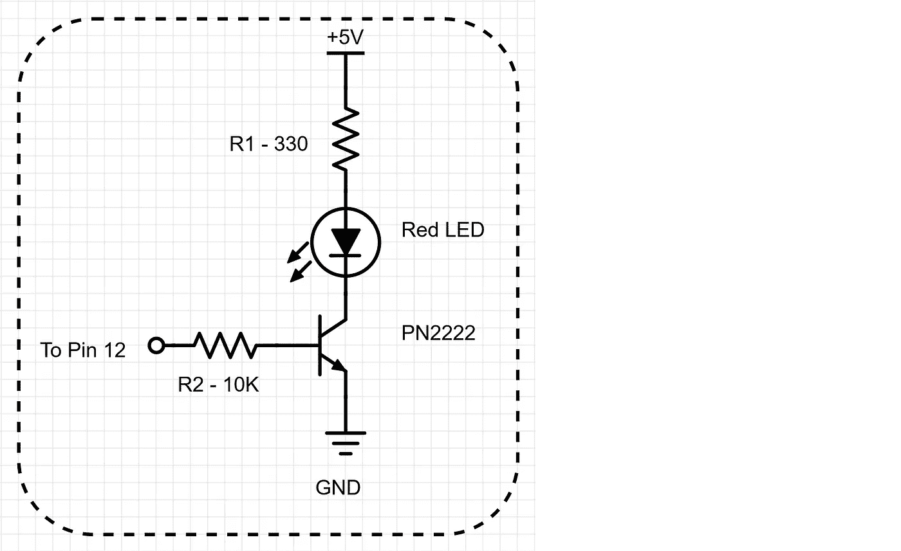
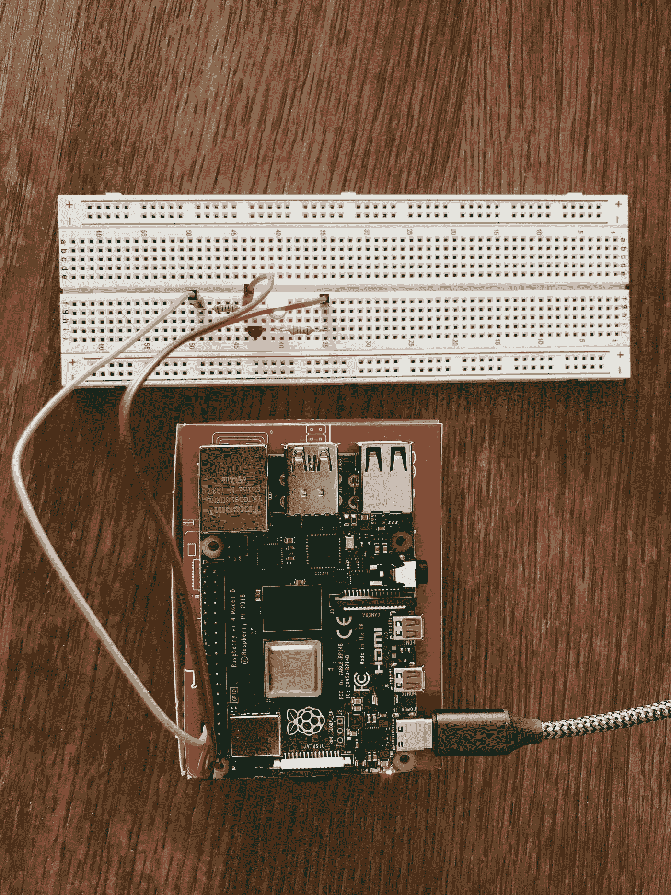
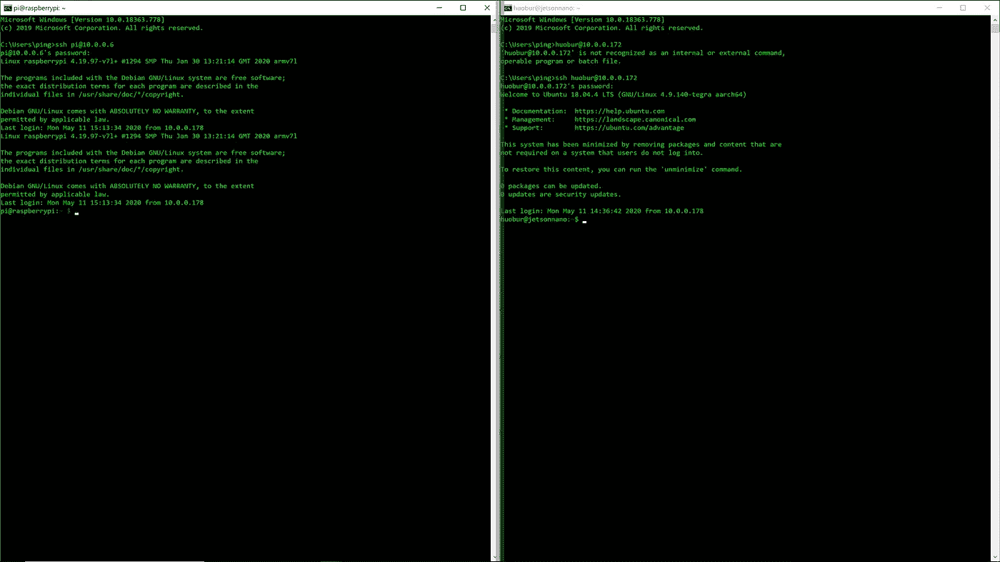

# 用多种语言在 Raspberry Pi 和 Jetson Nano 上编程 GPIO

> 原文：<https://levelup.gitconnected.com/program-gpio-on-raspberry-pi-and-jetson-nano-with-multiple-languages-b937c456f96b>

已经有很多关于如何在 Raspberry Pi 或 Jetson Nano 上使用 GPIO 的文章，这个项目试图专注于如何简化事情并编写在这两个系统上运行的可移植程序。我们将构建一个简单的 LED 电路，由一个晶体管连接，其基极插入 GPIO 引脚，供我们的程序控制。

将使用 3 种编程语言:
1。c 编程语言
2。Python 编程语言
3。Bash 脚本

上述每个程序都将用于控制 Raspberry Pi 和 Jetson Nano 系统上的 LED 电路，以演示如何为这两个系统编写可移植的程序。

图 1 两个系统演示


图 1 两个系统演示

# 1.系统配置

## 树莓 Pi 4 型号 B 版本 1.2 2019

*   四核 ARM 64 位 WiFi 蓝牙(4GB)
*   Linux raspberrypi 4.19.97-v7l+
*   gcc(Raspbian 8 . 3 . 0–6+rpi 1)8 . 3 . 0(用于 C 编程)
*   RPi。GPIO 安装在系统上(用于 Python 编程)

## 捷成纳米 B01

*   不带 WiFi/BT 的四核 ARM 64 位(4GB)
*   Linux jetsonnano 4.9.140-tegra
*   添加并配置了 OKN WiFi 6 AX200 802.11ax WiFi 卡
*   gcc(Ubuntu/Linaro 7 . 5 . 0–3ubuntu 1 ~ 18.04)7 . 5 . 0(用于 C 编程)
*   还安装了以下 GPIO 包(用于 Python 编程)
*   【https://github.com/NVIDIA/jetson-gpio 

**这两个系统都配置为通过 WiFi 进行 SSH 和 VNC 访问，因此它们可以在只连接电源线的情况下无头运行。**

## 主机 PC 是 Windows 10 机器

*   安装并配置了 TightVNC (v0.51.0)
*   安装了 VSCode (v1.45.0)
*   VSCode 中添加了远程 SSH (v0.51.0)扩展

有了以上配置，我可以通过以下三种方式在我的电脑上访问 Raspberry Pi 或 Jetson Nano 或两者:

1.  通过 VSCode 经由 Remote-SSH；(附录中的图 5)
2.  通过命令行 SSH(附录中的图 6)
3.  在绝对需要的时候通过 TightVNC。(我们没有使用配置。在本项目中)(附录图 7)

# 2.LED 电路设计

## 成分

*   红色 LED (x2)
*   晶体管 NPN PN2222 (x2)
*   电阻器 10K (x2) 330 (x2)
*   试验板(x1)
*   母对公 Depont 线(x6)

## 设计

请注意，上述组件用于为 Raspberry Pi 和 Jetson Nano 系统构建两个相同的电路，如图 1 所示，您也可以只构建一个电路，然后一次手动切换到一个系统(附录中的图 3 和图 4)。通过使用在线免费试用设计工具([https://www.digikey.com/schemeit/project/](https://www.digikey.com/schemeit/project/))，我们得到了图 2 所示的电路图。

由于这是一个非常简单的电路，一旦我们插上试验板上的所有元件，我们就可以将每个电路上的三条线连接到两个系统上相同的对应物理引脚:(如果您只是构建一个电路，您可以一次用一个系统测试您的电路和代码)。由于这是一个相当简单的电路，所以不打算解释细节。基本上，我们的软件程序使用晶体管的基极，通过系统板上的 GPIO 引脚控制 LED 的开关。

1.  线路图上显示“5V”的线的母端应插在系统板上的 2 号针脚上；
2.  线路图上显示“GND”的线的母端应插在系统板上的 6 号针脚上；
3.  线路图上显示“至针脚 12”的电线的母端应插入系统板上的针脚 12。

(提示:完成所有连接后，您可以简单地将 LED 阴极端直接连接到系统板上的地。LED 应该是亮的，如果不是，可能是 LED 坏了)



图 2 LED 电路图

# 3.软件设计

现在是时候设计我们的软件了。我们的目标是设计控制 LED 的软件。为了显示效果，我们计划打开和关闭红色 LED 10 次，打开和关闭之间的时间间隔为 1 秒。一旦完成，我们将退出我们的程序。这很简单，但是正如我们前面所说的，我们的重点是编写可移植的软件，这样每个程序都可以在两个系统上运行，而无需任何代码更改。这个练习帮助我们开始思考现实世界中的这类问题。应该有许多有效的方法来处理这类问题，本文演示的只是其中之一。

## BASH Shell 脚本— blink.sh

让我们先从 bash 脚本开始，因为它不需要任何编译器或解释器来运行。

```
# Check to see if the computer model file exists or not
FILE=/proc/device-tree/model
if [ ! -f "$FILE" ]; then
    echo "Blink only runs on Raspberry Pi 4 or Jetson Nano"
    echo "Please check your computer model"
    exit 0
fi

# Get the computer model string
# You can add elif to support other computer configurations
# with different GPIO pin layouts
model=$(tr -d '\0' < /proc/device-tree/model)

gpio='gpio'

if [[ $model =~ "NVIDIA Jetson Nano" ]]
then
    # Jetson Nano gpio79 is pin 12 on the board
    pin='79'

elif [[ $model =~ "Raspberry Pi 4" ]]
then
    # Raspberry Pi 4 gpio18 is pin 12 on the board
    pin='18'

else
    echo "Blink only runs on Raspberry Pi 4 or Jetson Nano"
    echo "Please check your computer model"

    exit 0
fi

# Setup the GPIO pin
gpiopin="${gpio}""${pin}"

# Set the pin to export
echo "${pin}" > /sys/class/gpio/export

# Set Direction to output
echo out > /sys/class/gpio/${gpiopin}/direction

# loop 10 times
for number in {1..10}
do
    echo 1 > /sys/class/gpio/${gpiopin}/value
    sleep 1s

    echo 0 > /sys/class/gpio/${gpiopin}/value
	sleep 1s

done

# Clean GPIO Pin
echo "${pin}" > /sys/class/gpio/unexport
```

我知道你只是想先尝试一下，看看这是否可行，请继续复制脚本，保存到“blink.sh”。然后，您可以在您的系统上运行它，请注意，您需要以 root 权限运行它:

```
sudo ./blink.sh
```

有用吗？如果是，恭喜你！如果没有，是不是忘了让文件可执行？

```
chmod +x blink.sh
```

如果电路连接正确，应该可以解决问题。

在这个脚本中，有几个部分负责不同的任务:

1.  检测并识别脚本运行在什么系统下:在这个脚本中，我们查看系统“/proc/device-tree/model”中的一个文件。这里的事情是，我们知道 Raspberry Pi 和 Jetson Nano 都有这样的文件，其中包含它们的身份，这样一旦找到，我们就可以在这两个系统上成功地运行我们的脚本。然而，有人可能会尝试我们的程序在其他系统上运行脚本，因为我们还没有在其他系统上完成我们的测试，我们需要小心地查看该文件是否存在。(我很快在我的主机上进行了测试，WSL 子系统没有这样的文件来举例避免这样的问题):

```
# Check to see if the computer model file exists or not
FILE=/proc/device-tree/model
if [ ! -f "$FILE" ]; then
    echo "Blink only runs on Raspberry Pi 4 or Jetson Nano"
    echo "Please check your computer model"
    exit 0
fi
```

因此，上面的脚本将计算机模型文件及其路径分配给“file”变量，然后测试它是否存在，如果不存在，它将打印出一条警告消息并退出脚本。否则，我们继续。

2.脚本的下一部分是找出我们是否有 Raspberry Pi 或 Jetson Nano 或其他东西，即使我们在前面的讨论中已经检测到计算机模型文件确实存在:

```
# Get the computer model string
# You can add elif to support other computer configurations
# with different GPIO pin layouts
model=$(tr -d '\0' < /proc/device-tree/model)

gpio='gpio'

if [[ $model =~ "NVIDIA Jetson Nano" ]]
then
    # Jetson Nano gpio79 is pin 12 on the board
    pin='79'

elif [[ $model =~ "Raspberry Pi 4" ]]
then
    # Raspberry Pi 4 gpio18 is pin 12 on the board
    pin='18'

else
    echo "Blink only runs on Raspberry Pi 4 or Jetson Nano"
    echo "Please check your computer model"

    exit 0
fi
```

我们获取计算机模型字符串，并将其赋给“模型”变量。这里唯一棘手的是“tr -d '\0 '”部分，这是为了去掉字符串中的空字节，以便在不这样做的情况下抑制来自系统的警告。

该型号字符串将对照“NVIDIA Jetson Nano”和“Raspberry Pi 4”进行测试，如果找到匹配项，则会分配相应的 pin 号“79”或“18 ”,进而连接到“gpiopin”变量:

```
# Setup the GPIO pin
gpiopin="${gpio}""${pin}"
```

如果既没有检测到 Jetson Nano 也没有检测到 Raspberry Pi，我们将打印出一条警告消息并退出脚本。

3.一旦我们成功地达到这一点，我们就可以使用 GPIO 了:

```
# Set the pin to export
echo "${pin}" > /sys/class/gpio/export

# Set Direction to output
echo out > /sys/class/gpio/${gpiopin}/direction
```

要启用 GPIO 功能，我们需要写入要导出的特定 pin 号。GPIO 也有方向:输入或输出。在我们的设计和示例中，我们使用输出功能，这意味着我们的程序决定将引脚设置为高电平还是低电平，而不是在引脚用作输入引脚时读取引脚来查看它是高电平还是低电平。

4.完成上述所有准备和设置后，我们可以循环 10 次，观察我们壮观的 LED 秀:

```
# loop 10 times
for number in {1..10}
do
    echo 1 > /sys/class/gpio/${gpiopin}/value
    sleep 1s

    echo 0 > /sys/class/gpio/${gpiopin}/value
    sleep 1s

done
```

当我们将引脚值设置为“1”时，GPIO 引脚进入高电压状态，这又会触发我们的红色 LED 点亮，我们让节目持续 1 秒钟，然后将 GPIO 引脚设置为“0”，这又会将电压切换到低状态，从而关闭红色 LED 1 秒钟。经过 10 次的交换，我们都完成了，退出了循环。

5.作为一名优秀的工程师，我们总是在任务完成后清理现场，让我们在自己或他人的下一次展示中保持这种方式:

```
# Clean GPIO Pin
echo "${pin}" > /sys/class/gpio/unexport
```

随着我们第一次浏览 bash 脚本过程，浏览下面的其他两个程序应该会容易得多。

## c 程序— blink.c

```
#include <errno.h>
#include <fcntl.h>
#include <stdio.h>
#include <stdlib.h>
#include <string.h>
#include <sys/stat.h>
#include <sys/types.h>
#include <unistd.h>

int main()
{
	char JetsonNano[] = "NVIDIA Jetson Nano";
	char RPi4[] = "Raspberry Pi 4";
	char model[] = "/proc/device-tree/model";
	char export[] = "/sys/class/gpio/export";
	char unexport[] = "/sys/class/gpio/unexport";
	char gpio[] = "/sys/class/gpio/gpio";
	char out[] = "out";
	char p18[] = "18";
	char p79[] = "79";
	char high[] = "1";
	char low[] = "0";
	char pin[4];
	char direction[256] = "";
	char value[256] = "";

    FILE *stream;
    char line[256];
    int len = 256;

    // Find the computer model we support:
    stream = fopen(model, "r");
    if ( stream == NULL ) {
        perror("Error: it cannot run the program as it doesn't know the computer model!");

        exit(EXIT_FAILURE);
    } else {
		fgets(line, len, stream);

        if ( (line != NULL) && (strstr(line,JetsonNano) != NULL) ) {
			strcpy(pin,p79);
		} else if ( (line != NULL) && (strstr(line,RPi4) != NULL) ) {
			strcpy(pin,p18);
		} else {
			// something wrong: clean up and exit
            fclose(stream);

			perror("Error: it cannot run this program as it doesn't support the computer model!");

			exit(EXIT_FAILURE);
		}

		// build direction and value paths/files
		// /sys/class/gpio/gpioxx/direction
		// /sys/class/gpio/gpioxx/value
		strcat(direction, gpio);
		strcat(direction, pin);
		strcat(value,direction);
		strcat(value,"/value");
		strcat(direction, "/direction");

	    // found a board we support, clean up and continue		
        fclose(stream);
	}

    // Check and setup export
    int fd = open(export, O_WRONLY);
    if (fd == -1) {
        perror("Error: cannot open the export file!");
        exit(EXIT_FAILURE);
    }

    if (write(fd, pin, 2) != 2) {
        perror("Error: cannot write to the export!");
        exit(EXIT_FAILURE);
    }

    close(fd);

    // Check and setup direction to output
    fd = open(direction, O_WRONLY);
    if (fd == -1) {
        perror("Error: cannot open the direction file!");
        exit(EXIT_FAILURE);
    }

    if (write(fd, out, 3) != 3) {
        perror("Error: cannot write the direction!");
        exit(EXIT_FAILURE);
    }

    close(fd);

    fd = open(value, O_WRONLY);
    if (fd == -1) {
        perror("Error: cannot open the value file!");
        exit(EXIT_FAILURE);
    }

    // Ready to go and loop 10 times with one second intervals
    for (int i = 0; i < 10; i++) {
        if (write(fd, high, 1) != 1) {
            perror("Error: cannot write the value!");
            exit(EXIT_FAILURE);
        }
        sleep(1);

        if (write(fd, low, 1) != 1) {
            perror("Error: cannot write the value!");
            exit(EXIT_FAILURE);
        }
        sleep(1);
    }

    close(fd);

    // We are done and clean up with the unexport
    fd = open(unexport, O_WRONLY);
    if (fd == -1) {
        perror("Error: cannot open the unexport file!");
        exit(EXIT_FAILURE);
    }

    if (write(fd, pin, 2) != 2) {
        perror("Error: cannot write the unexport!");
        exit(EXIT_FAILURE);
    }

    close(fd);

    return 0;
}
```

要运行它，请复制代码并保存到一个文件中，比如“blink.c”。因为它是如此简单的程序，我们没有 make 或 build 文件，而是简单地从命令行快速编译它:

```
gcc -o blink blink.c
```

如果没有显示错误，您可以运行它:

```
sudo ./blink
```

c 是非常强大和原始的编程语言。在这个程序中，我们倾向于定义很多字符串，这样我们可以避免在代码中嵌入文本字符串。我们还花了相当多的步骤来连接字符串，以处理我们的每个任务。编程逻辑和工作流程非常类似于我们在之前的“blink.sh”讨论中讨论的细节。一个人比较这些步骤并坚持下去应该没有问题。

有几件事需要注意:我们没有分配和释放内存，只是简单地使用堆栈来处理这么简单的程序中的所有字符串操作。我们经常检查错误条件，这在我们的项目中应该是一件好事。当然，当需要时，我们需要在每个步骤中勤奋地清理。

## Python 程序— blink.py

```
# Both Raspberry Pi 4 and Jetson Nano can be supported by Mode BCM Pin 18 mapped on BOARD Pin 12.
#
import sys
import time

# Check if GPIO module is available or not
try:
    import RPi.GPIO as GPIO
except ImportError:
    print ("Cannot locate RPi.GPIO module!")
    sys.exit(1)

# Check to see if we have found the system we support
def checkSystem(line):
    if ( ('NVIDIA Jetson Nano' not in line) and ('Raspberry Pi 4' not in line) ): 
        print ("The system is not supported by this program!")
        sys.exit(1)

def main():
    # Exam the system model file
    try:
        with open('/proc/device-tree/model') as f:
            for line in f:
                checkSystem(line)
                break
    except Exception as error:
        print ("The system is not supported by this program!")
        sys.exit(1)

    # Setup BCM Mode
    GPIO.setmode(GPIO.BCM)

    # Setup pin number
    pin =  18

    # Setup the pin as output direction
    GPIO.setup(pin, GPIO.OUT)

    # Loop 10 times with one second intervals
    for i in range(10):
        # Output pin value high and then sleep for 1 second    
        value = GPIO.HIGH
        GPIO.output(pin, value)
        time.sleep(1)

        # Output pin value low and then sleep for 1 second
        value = GPIO.LOW
        GPIO.output(pin, value)
        time.sleep(1)       

    # Clean it up
    GPIO.cleanup()

if __name__ == '__main__':
    main()
```

您可以运行它:

```
python blink.py
```

尽管与之前的 blink.sh 和 blink.c 程序具有相似的逻辑和工作流程，但 Python 程序版本 blink.py 确实存在一些差异:

1.  因为对 Python 的 GPIO 支持可以作为一个包安装，例如，在我们的 Jetson Nano 系统中，我们必须从[https://github.com/NVIDIA/jetson-gpio](https://github.com/NVIDIA/jetson-gpio)安装，这样我们就可以在我们的程序中导入它，以便与 GPIO 一起工作。为此，我们添加了一个检查来查看这个包是否真正安装了。对于杰特森来说有一件有趣的事。GPIO 包是你可以用任何一个“Jetson。GPIO”或“RPi”。GPIO”来标识要导入的包，我不需要任何鼓励就可以使用“Import RPi”。GPIO as GPIO”在我们的程序中:

```
# Check if GPIO module is available or not
try:
    import RPi.GPIO as GPIO
except ImportError:
    print ("Cannot locate RPi.GPIO module!")
    sys.exit(1)
```

2.杰特森。GPIO 包支持 4 种不同的模式:GPIO。GPIO 板。BCM，GPIO。CVM 和 GPIO。泰格拉 _SOC。因为我们正在设计一个与 Raspberry Pi 和 RPi 兼容的程序。GPIO 支持 BCM 模式，我们为什么要让自己的生活艰难？因此，我们为 Raspberry Pi 和 Jetson Nano 系统选择了 BCM 模式，pin 码匹配良好，因此我们甚至不需要像在早期程序中那样选择不同的 pin 码。这其实让我们的生活更早了！

```
# Setup BCM Mode
    GPIO.setmode(GPIO.BCM)

    # Setup pin number
    pin =  18

    # Setup the pin as output direction
    GPIO.setup(pin, GPIO.OUT)
```

以下循环 10 次的代码非常简单。最后，因为我们都是优秀的程序员，所以一旦完成，我们就清理它！

```
# Loop 10 times with one second intervals
    for i in range(10):
        # Output pin value high and then sleep for 1 second    
        value = GPIO.HIGH
        GPIO.output(pin, value)
        time.sleep(1)

        # Output pin value low and then sleep for 1 second
        value = GPIO.LOW
        GPIO.output(pin, value)
        time.sleep(1)       

    # Clean it up
    GPIO.cleanup()
```

# Bonus — switch.py

```
# Both Raspberry Pi 4 and Jetson Nano can be supported
# Please note the mapping between mode and board pins
# For instance: Mode BCM Pin 18 is BOARD Pin 12.
#
# Usage:
# python switch.py (BCM pin number) (1 or 0 -- means on or off)
#
# For instance: 
# python switch.py 18  1
#

import sys

try:
    import RPi.GPIO as GPIO
except ImportError:
    print ("Cannot locate RPi.GPIO module!")
    sys.exit(1)

# Check to see if we have found the system we support
def checkSystem(line):
    if ( ('NVIDIA Jetson Nano' not in line) and ('Raspberry Pi 4' not in line) ): 
        print ("The system is not supported by this program!")
        sys.exit(1)

def main():
    # Exam the system model file
    try:
        with open('/proc/device-tree/model') as f:
            for line in f:
                checkSystem(line)
                break
    except Exception as error:
        print ("The system is not supported by this program!")
        sys.exit(1)

    # Check commandline inputs
    if ( len(sys.argv) < 3 ):
        print ("Please provide two numbers: (BCM pin number; and 1/0 for on/off output)")
        print ("python switch.py number_1  number_2")
        sys.exit(1)

    # Setup BCM Mode
    GPIO.setmode(GPIO.BCM)

    # Setup pin number
    pin = int(sys.argv[1])

    # Get on/off instruction
    onoff = sys.argv[2]

    # Suppress warning message 
    # in case the pin was used before
    GPIO.setwarnings(False)

    # Setup the pin as output direction
    GPIO.setup(pin, GPIO.OUT)

    if ( onoff == "1" ):  
        value = GPIO.HIGH

    if ( onoff == "0" ):
        value = GPIO.LOW

    GPIO.output(pin, value)

    # Press a key to exit
    print ("Please press a key to exit the program...")
    ch = sys.stdin.read(1)

    # Clean it up
    GPIO.cleanup(pin)

if __name__ == '__main__':
    main()
```

这是奖金计划，这实际上是我用来测试我的程序和系统。一步一步测试引脚或其他东西是很有用的。您可以通过提供两个参数来运行它:

```
python switch.py <pin number> <1 or 0>
```

我甚至用它拍了图 1 的照片(打开两个发光二极管)

我还发现 RPi 之间的不一致。Raspberry Pi 和 Jetson Nano 上的 GPIO:一旦你打开 LED 并退出程序，即使在清理后，Jetson Nano 上的 LED 仍保持打开，而 Raspberry Pi 上的 LED 关闭。你自己试试！

我还注意到另一个问题:如果一个人在退出前没有清理，他会得到一个错误消息，有时甚至无法继续运行另一个具有相同 pin 码的 GPIO 程序，直到他清理完系统！有一种简单的方法可以使用 blink.sh 中的一个语句来修复它，但是如果您遇到这种情况，这是您的家庭作业。

# 附录—系统配置图像



图 3 树莓 Pi 系统


图 4 杰特森纳米系统


图 5 支持两种系统的 VSCode



图 6 SSH 命令行与两个系统一起工作


图 7 VNC 与两个系统一起工作