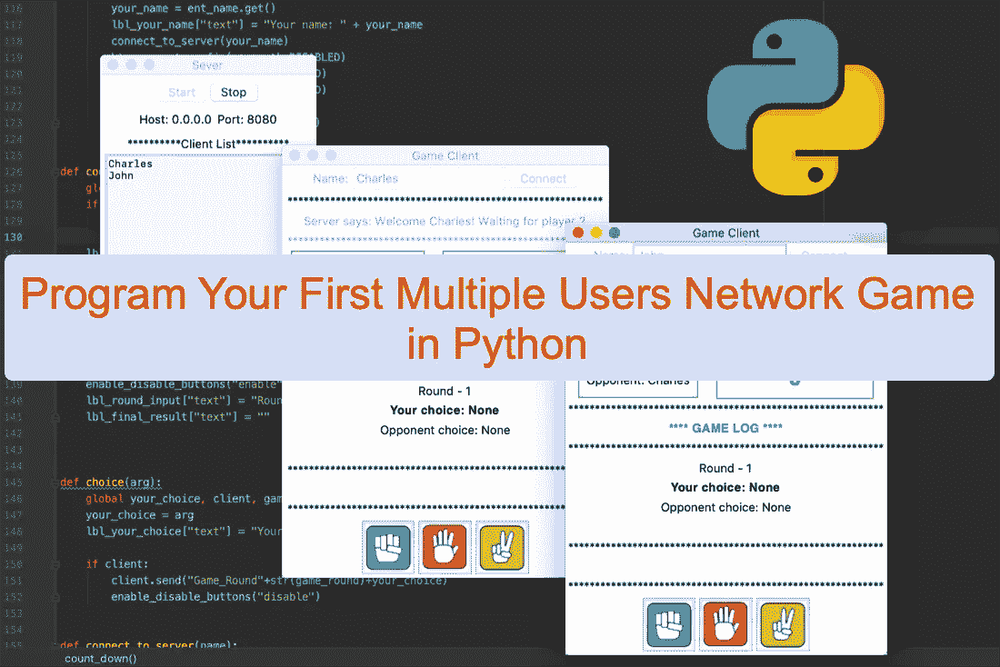
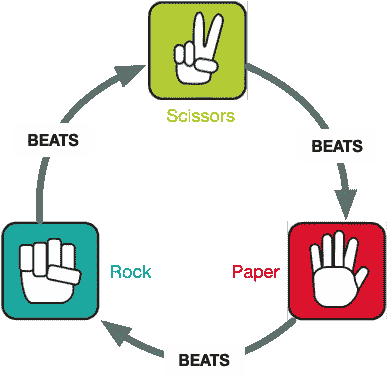
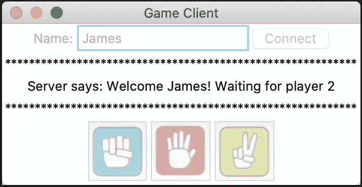
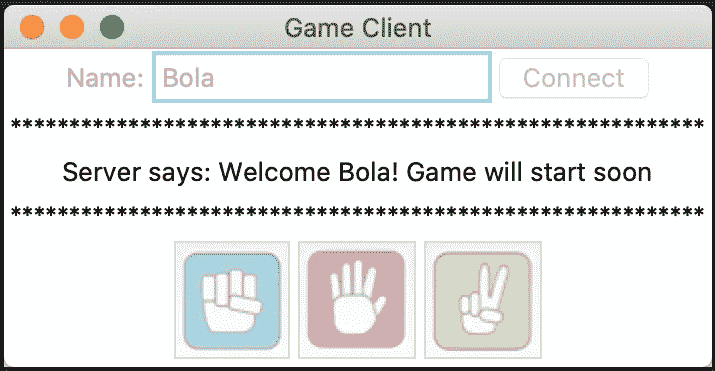
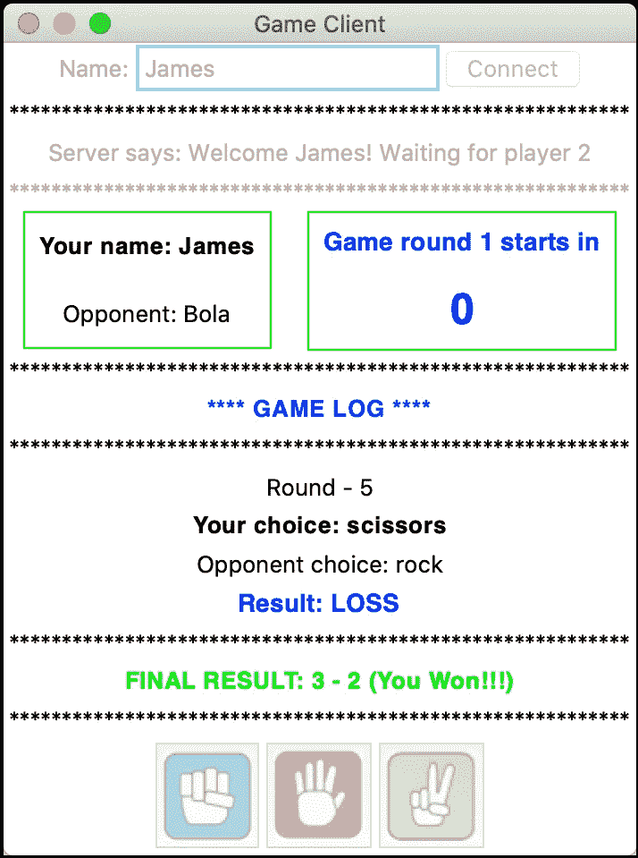
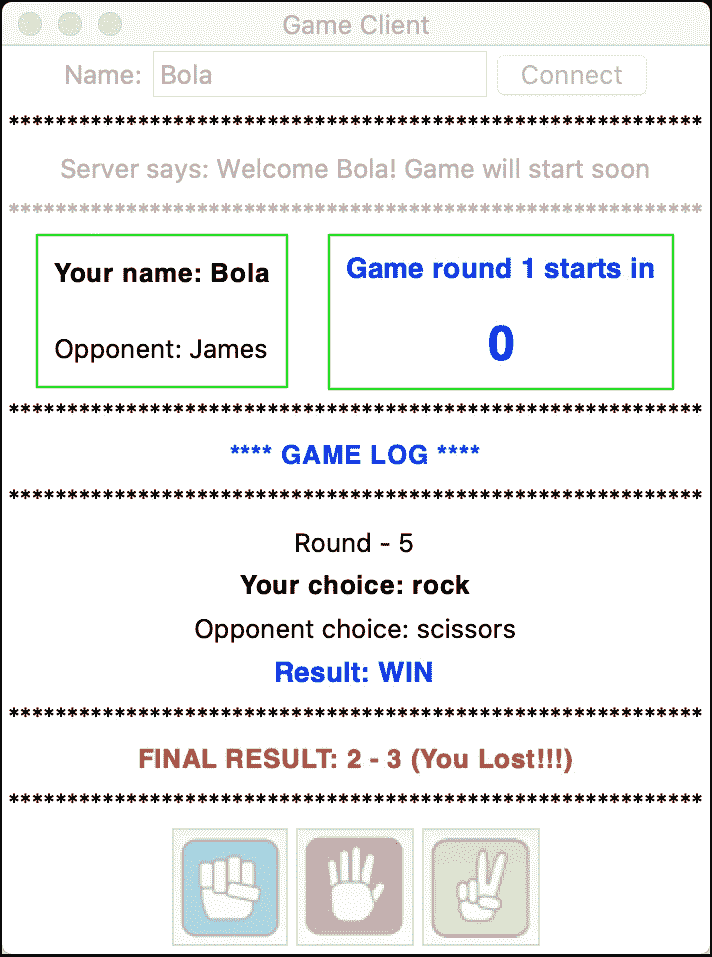
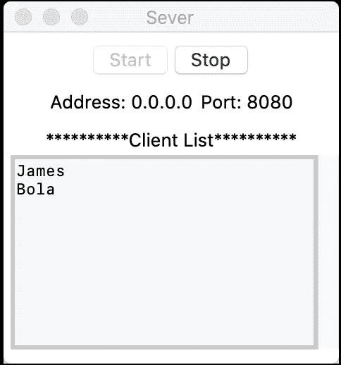

# 用 Python 编写你的第一个多用户网络游戏

> 原文：<https://levelup.gitconnected.com/program-your-first-multiple-user-network-game-in-python-9f4cc3650de2>

## 使用 python 构建您的第一个多用户石头剪子布网络游戏。

嗨，伙计们，我将向你们展示如何用 Python 编写你们的第一个多人在线或网络游戏。我们将设计流行的石头剪刀布游戏，你可以和另一个在线/网络玩家一起玩。所以，这肯定会很有趣！

与其他教程一样，我的目的不仅仅是向您展示如何编写这个特定的网络游戏，而是向您提供网络编程概念，您可以应用这些概念来创建其他很酷的网络应用程序和游戏。我在本科学习期间(在英国格林威治大学)选修的课程之一是网络编程(老师选择 Java 作为编程语言)，我们被要求为课程编写一个网络游戏。这太有趣了，因为我的许多同学都想出了很酷的网络游戏。我将应用本教程中学到的一些概念。

在我的[之前的教程](https://medium.com/p/learn-python-by-building-a-multi-user-group-chat-gui-application-af3fa1017689?source=email-aaf7407e4abd--writer.postDistributed&sk=af315050575d9a7bda095f4f5bf87a38)中，我展示了如何用 Python 编写一个多用户群聊应用程序。我们将在这里充分利用[之前的教程](https://medium.com/p/learn-python-by-building-a-multi-user-group-chat-gui-application-af3fa1017689?source=email-aaf7407e4abd--writer.postDistributed&sk=af315050575d9a7bda095f4f5bf87a38)。因此，我建议您在继续本教程之前先看一下那个教程，尤其是如果您还不熟悉网络编程(客户机/服务器模型)的话。在[之前的教程](https://medium.com/p/learn-python-by-building-a-multi-user-group-chat-gui-application-af3fa1017689?source=email-aaf7407e4abd--writer.postDistributed&sk=af315050575d9a7bda095f4f5bf87a38)中，我们已经讲述了以下内容:

1.  如何创建客户机/服务器套接字
2.  服务器如何监听和接受多个客户端连接请求
3.  客户端如何连接服务器并向服务器发送消息
4.  服务器如何接收和转发客户端消息

我们不打算在本教程中详细讨论这些，因为我们将关注如何在网络游戏编程中有效地处理客户端/服务器交互。我们会考虑一些非常重要的问题，比如“我们是在客户端还是服务器端处理游戏分数？这两个选项在速度和效率方面有何影响？游戏逻辑放在哪里——客户端还是服务器端？还有，如何有效协调玩家互动？”

我假设你已经在电脑上安装并设置了 Python 。我将使用流行的 Python GUI 库: [Tkinter](https://docs.python.org/3/library/tk.html) 作为用户界面——这将允许我们为我们的玩家创建一个令人敬畏的 UI。让我们开始玩我们的石头剪子布网络游戏吧。

石头剪刀布游戏环节

上面的视频显示了我们的网络游戏的典型游戏会话。它允许两个玩家连接到服务器并相互竞争。请注意，这不是一个回合游戏(即玩家轮流)，因为玩家可以同时玩游戏(做出选择)。游戏在特定回合数(本游戏 5 回合)后结束。然后，确定获胜者，并在倒计时后开始新的游戏。让我们从一般的游戏规则开始，然后转移到游戏客户端和服务器应用程序。整个项目的**源代码**可以在 github 上 [**下载/克隆。所以，系好安全带，我们起飞吧！**](https://github.com/effiongcharles/network_rock_paper_scissors_game)

# 网络石头剪子布

在我们继续讨论游戏客户机/服务器应用程序之前，让我们简单地讨论一下石头剪子布游戏规则。这个经典有趣的游戏通常由两个人玩(虽然可以由更多人玩)。稍后，您将通过添加对两个以上用户的功能支持来扩展游戏——这对您来说难道不是一项有趣的编程任务吗？我打赌会的！

图 1:石头剪子布游戏规则

图 1 描述了游戏规则，我希望你已经熟悉了。如果是这样，你可以刷新你的记忆或简单地继续下一部分，即游戏客户端应用程序。简单来说，这个规则就是“石头”打败了“剪刀”，“剪刀”打败了“纸”，“纸”打败了“石头”。让我们把这个游戏规则转换成代码。图 2 显示了实现游戏规则的代码。

图二。石头剪刀布游戏规则

该函数接受两个参数，并使用 *if/else* 语句来决定是赢、输还是平局。我们将把这个经典游戏转换成网络游戏，这样你就可以和你的朋友和家人在线玩了。游戏将有 5 个回合。我们将显示每一轮的获胜者和最后一轮的最终结果。然后，游戏环节重新开始。

# 游戏客户端应用程序

游戏客户端应用程序允许玩家连接到游戏服务器并与另一个连接的玩家(即对手)进行游戏。

图 3:游戏客户端窗口—连接

图 3 显示了两个连接的客户端的游戏客户端窗口(假设服务器已经在运行)。当玩家连接到服务器时，服务器会以欢迎消息作为响应。这里，欢迎消息取决于连接的玩家数量。在两个玩家都连接上之后。游戏客户端接收对手的名字，并在游戏窗口显示该信息。此外，“游戏日志”部分显示在游戏客户端窗口。这可以在下面的图 4 中看到

图 4:游戏客户端窗口——游戏会话

现在两个客户端都连接上了，我们知道对手是谁。游戏会话可以开始。但是我们怎么知道什么时候开始游戏会话呢？一种可能性是服务器向客户端发送“开始”信号。当客户端接收到开始信号时，游戏会话可以开始。你可能会说“这正是我所想的。”是的，我们可以这样做，但是我们能找到更好的方法吗？答案绝对是肯定的！我们需要减少“网络通信”来提高我们的游戏速度和效率。简单来说，“*最好在客户端处理逻辑(如果可能)*”这样，我们可以避免来回发送消息和堵塞网络，即减少网络流量。因此，在我们的精彩游戏中，当我们知道对手准备好了，也就是当我们从服务器收到对手的名字时，我们就开始游戏。因此，消除了为了开始游戏而进行服务器通信的需要。我希望你理解这个原则。

我们使用倒数计时器和启用/禁用“选择按钮”(即游戏窗口底部的石头剪刀布按钮)来控制用户何时可以玩游戏。最初，选项按钮被禁用，当计数器递减到 0 时，选项按钮被启用。当这种情况发生时，玩家做出选择。当玩家点击选择按钮时，它们会被禁用。通过这种方式，我们确保我们的玩家在每一轮游戏中不会做出一个以上的选择。所选择的选项被转发给服务器，并且服务器又将对手的选项转发给客户端(例如，玩家 1 的选项被转发给玩家 2，反之亦然)。该信息显示在游戏客户端窗口上，如图 2 所示。需要注意的是*我们不会转发玩家的选择，直到我们确定两个玩家都做出了选择*。因此，服务器在转发信息之前会一直等待，直到收到两种选择。

下一步是决定谁在当前游戏回合中获胜。一种可能是，服务器确定谁是获胜者，并将信息转发给客户端。这绝对可行，但在速度方面效率不高。记住，我们的原则是通过在客户端处理尽可能多的逻辑来减少服务器/客户端通信。想一想，如果我们在服务器端处理游戏逻辑，那么:

1.  游戏服务器将发送对手的选择，例如玩家 1 的选择给玩家 2，反之亦然(即 2 发送函数调用乘以 5 轮)
2.  游戏服务器将根据玩家的选择计算游戏分数，并将信息发送到游戏客户端(也发送函数调用乘以 5)
3.  游戏服务器将不得不跟踪分数，以便在最后一轮(在我们的例子中是第 5 轮)计算最终分数。不需要网络通信)
4.  游戏服务器必须计算最终分数，并将结果发送给游戏客户端(也发送函数调用。仅在最后一轮发送)

这给出了总共 **22 个服务器/客户端通信步骤**，仅用于确定获胜者(对于每一轮和最终结果)。相反，我们可以通过将游戏逻辑放在客户端来**显著**减少(超过一半——是的，你没看错)所有这些沟通步骤。让我们看看这是如何实现的

1.  游戏服务器将发送对手的选择，例如玩家 1 的选择给玩家 2，反之亦然(即 2 发送函数调用乘以 5 轮)
2.  游戏客户端确定赢家(运行游戏逻辑，比较两个选择，并确定是赢、输还是平。不需要网络通信)
3.  游戏客户端记录双方玩家的游戏分数——无需网络通信。
4.  游戏客户端计算最终得分，并确定最后一轮的总赢家。因此，不需要网络通信。

如你所见，如果游戏逻辑在服务器端，这仅需要 **10 个服务器/客户端通信步骤**而不是 **22** 。想象一下，如果我们把客户数量增加到 100000 人会怎么样？我们将通过在客户端处理逻辑来节省大量流量。希望你明白了:)

既然你已经掌握了游戏客户端程序的工作原理，那么让我们来看看客户端代码。在图 3 中，当玩家点击“*连接*”按钮时，调用*连接()*函数。下面图 5 中的代码片段显示了 connect 函数。

图 5:游戏客户端连接功能

connect 函数就像它看起来一样简单。它确保播放器输入一个名称，并调用 *connect_to_server(arg)* 函数，该函数实际连接到服务器。这个函数如下面图 6 中的代码片段所示。

图 6:游戏客户端连接到服务器功能

这个函数创建一个客户端套接字对象*，*连接到服务器*，*，并将玩家的名字发送到服务器*(第 4 行到第 6 行)。*这个已经在[之前的教程](https://medium.com/p/learn-python-by-building-a-multi-user-group-chat-gui-application-af3fa1017689?source=email-aaf7407e4abd--writer.postDistributed&sk=af315050575d9a7bda095f4f5bf87a38)中解释过了。请参见[之前的教程](https://medium.com/p/learn-python-by-building-a-multi-user-group-chat-gui-application-af3fa1017689?source=email-aaf7407e4abd--writer.postDistributed&sk=af315050575d9a7bda095f4f5bf87a38)如果在这个阶段你不确定什么是*套接字*:)接下来，我们禁用小部件，即连接、命名、标记小部件，并启动一个新线程来处理从服务器*接收消息(第 16 行)。*图 7 中的代码片段显示了*接收来自服务器的消息(..)*功能。

图 7:从服务器功能接收消息

这个函数是游戏客户端应用程序的核心。它接收并解码或解释来自游戏服务器的消息，并相应地更新游戏客户端 UI。代码可能看起来很长，但是它是不言自明的。我们一起经历吧。

我们运行一个 continues 循环来不断接收来自服务器的消息。对于每条消息，我们首先解码消息以知道要执行什么动作。如果收到的消息是 *welcome1 或 welcome2* ，我们知道这是一个欢迎消息(在连接到服务器后发送给我们的玩家)。接下来，我们用适当的欢迎消息更新游戏客户端 UI(*第 10 行—第 15 行)。*

如果从服务器收到的消息以*对手名$* 开头，我们知道这是我们对手的名字。我们删除了*前缀* *(第 18 行)，*用我们对手的名字*(第 19 行)*更新 UI，并显示我们的顶部框架(该框架包含玩家姓名和 UI 的游戏倒计时部分—见图 4)和中间框架(该框架包含 UI 的“游戏日志”部分)。接下来，我们启动一个新线程来运行我们的*倒计时器*代码。计时器只是从 3 数到 0。此后游戏回合开始*(第 24 行)。*

当对手做出选择时，该选择将被发送到游戏客户端，以便决定每一轮游戏的获胜者。我们在第 30 行检索对手的选择。然后，我们执行*游戏规则逻辑*来决定谁是(本轮的)赢家*(第 33 行-第 46 行)。*用户界面会根据玩家是赢、输还是平局而更新。请注意，我们使用*“your _ score”*和*“opposite _ score”*变量来记录双方玩家的分数。但是我们为什么要这样做呢？这是计算最后得分和决定最后一轮*(第 49 到 65 行)*的总赢家所需要的。对于每一轮，我们启动一个倒数计时器，这是为了协调游戏进行。简而言之，当*计数器*的值为 0 时，“*选择按钮”*即石头、布、剪刀被启用，当玩家做出选择(点击任何选择按钮)时被禁用。这在下面的图 8 中给出。

图 8:倒计时定时器

在我们完成客户端的事情之前，让我们看看处理发送玩家选择到服务器的函数。这个函数在下面的图 9 中给出。

图 9:选择功能

当玩家点击任何“*选择按钮”*时，我们检索选择*(第 3 行)，*将其发送到服务器*(第 7 行)*，并通过立即禁用按钮(*第 8 行*)来防止多重选择。

现在我们已经完成了游戏客户端的工作，让我们来看看这个令人敬畏的游戏应用程序的服务器端。

# 游戏服务器应用程序

游戏服务器应用程序负责处理游戏客户端连接并将消息转发给客户端。游戏服务器与[前作](https://medium.com/p/learn-python-by-building-a-multi-user-group-chat-gui-application-af3fa1017689?source=email-aaf7407e4abd--writer.postDistributed&sk=af315050575d9a7bda095f4f5bf87a38)的服务器相同。同样，如果你还没有或不熟悉客户机/服务器编程模型，去看看吧。在这一节中，我将只关注游戏应用程序特有的服务器代码部分。

图 10:游戏服务器窗口

图 10 示出了游戏服务器窗口。使用*“开始”*按钮启动服务器，之后客户端(玩家)可以连接并开始游戏。该窗口显示已连接的客户端名称列表。我们将连接的客户端数量限制为两个，因为我们只希望两个玩家玩我们的酷游戏。

图 11:游戏服务器接受客户端功能

接受游戏客户端的连接请求在 *accept_clients(..)*函数如图 11 中的代码片段所示。注意，我们启动了一个新线程来处理与连接的客户端*(第 8 行)*的通信(发送和接收消息)。

接下来，让我们看看负责处理客户端消息发送和接收的函数。这由图 12 中的代码片段显示。

图 12:游戏服务器发送和接收消息功能

这个函数是游戏服务器应用程序的核心。当客户端连接时，玩家的名字被发送到游戏服务器。该名称在第 8 行的*中检索。*接下来，我们向连接的客户端发送欢迎消息。该消息取决于连接的客户端数量。在这里，第一个客户端获得*“欢迎 1”*，而第二个客户端获得*“欢迎 2”(第 10 行—第 13 行)*游戏客户端能够解码消息并相应地更新其 UI。我们之前已经看到过这一点:)

接下来，我们检查两个客户端是否连接。如果是这种情况，那么我们将对手的名字发送给每个客户端，例如玩家 1 的名字发送给玩家 2，反之亦然*(第 22 行-第 23 行)*。我们进入一个无限 while 循环来处理与游戏客户端的持续通信。

对于每个连接的客户端，我们检索选择和连接(套接字)信息。然后，在确保两个玩家都做出选择后，我们将玩家 1 的选择发送给玩家 2，反之亦然*(第 43 行—第 44 行)。*请注意，服务器不需要知道游戏信息，例如哪几轮、谁赢了以及最终结果。这是因为如前所述，为了提高效率，这些都是在客户端处理的。

# 结论和进一步改进

本教程向您展示了如何通过实现经典的石头剪子布游戏来用 python 创建网络或在线游戏。本教程提供了创建网络/在线游戏和应用程序的最佳实践和原则。我希望你现在已经准备好运用这些原则来创建其他很酷的网络应用和游戏。

在本教程中，我们将玩家人数限制为两人。然而，石头剪子布游戏可以由两个以上的玩家玩。在这种情况下，游戏规则改变了。为了改进这个代码和你的练习，我建议你扩展这个游戏应用程序来支持两个以上的玩家。例如，一开始您可以支持 5 个用户。

我已经在我的 github 库上提供了 [**完整的源代码供下载/克隆**](https://github.com/effiongcharles/network_rock_paper_scissors_game) **。**请随意试用代码，如有任何问题，请联系我。

再见，祝你用 Python 编程愉快。

祝你好运！