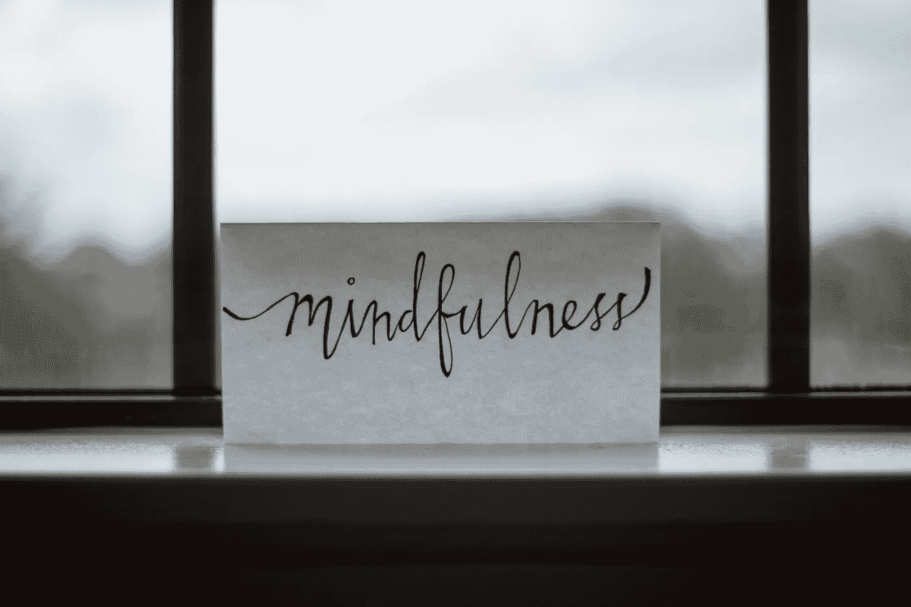

# 规划你的思维

> 原文：<https://levelup.gitconnected.com/program-your-mind-bdd72291ca>

我看到我的大脑像一台电脑。我不是我的思想。我不是我的思想。我观察我的想法，并决定它们是否与我的梦想、我的身份、我想要的一致。

我的心灵有这种不可思议的力量和愿望来保护我的安全和生存，对此我心存感激。我脑中的程序翻译成不安全的任何行为，都会自动引发恐惧和焦虑。我看到了恐惧，我看着她的眼睛。

在我的童年早期，我已经定义了一个清单，在这个清单中，大脑会把“我不安全”转化为其他情况。在我童年的早期，我不知道如何给我的大脑编程，我只是从别人的项目中复制粘贴代码，试图编译它。而且成功了。这让我学会了定义自己的代码。

来定义我自己的场景，在这些场景中，头脑会翻译“我不安全”。我允许自己不时更新那个文件，那不是我该带的部分。来自我的追随者的知识在那里保存和珍惜。

我现在看到这个在电脑上运行的大项目，就是我的生活。我有权查看目录、文件、子目录，查看项目的结构和架构。

我看到了我生活中的每个领域和角色。并且知道我有能力组织它。组织和管理项目。添加、更新、删除。

我有权力决定我在生命中的某个时刻处于哪个角色，以及哪个程序在后台运行。我有权决定代码是否可以改进。如果它符合我自己的编码风格和我自己定义的最佳实践。如果它有漏洞。我如何修复错误并创造出不同的结果。我有权测试代码，调试代码，质疑代码是否有效，并查看是否会得到不同的结果。我可能不会得到不同的结果，这没关系。我在学习，我在成长。

我只对我的代码、我的大项目和关于它的决策负责。但我不是电脑。我是人类。一个带着工具的人。我的思想。

我人性的一面提醒我，善良、有同理心、不完美也没关系。它提醒我，看到这个项目并拥有这种内在的进化欲望是可以的。但休息一下也是可以的，知道我对自己足够好，平静地对待自己，享受这个过程。

来到这里。享受这个过程。