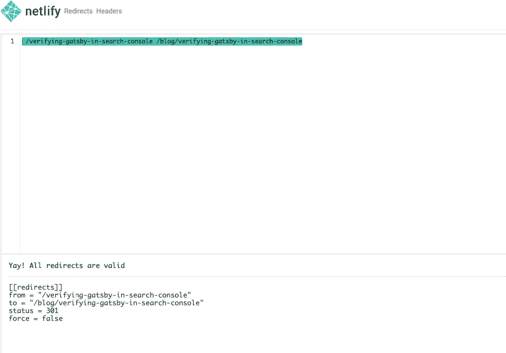

# 《盖茨比》中的纲领性重定向

> 原文：<https://levelup.gitconnected.com/programmatic-redirects-in-gatsby-7009a855e973>

## 在本帖中，我们将探讨如何以编程方式向我们的站点添加重定向


照片由 [**松瓦**](https://unsplash.com/@pinewatt?utm_source=unsplash&utm_medium=referral&utm_content=creditCopyText) 拍摄

假设我们想在我们的站点中将帖子的路径从一个路径迁移到另一个路径，但是我们不想麻烦地在其他共享 URL 的地方更新它。因为我们希望避免 404 页面的问题，如果用户访问了旧的 URL 路径，或者这些旧的路径已经在谷歌中被索引。

为了解决这个问题，我们需要研究如何以编程方式将用户重定向到新的 URL。

因此，在这篇文章中，我们将探讨如何以编程方式向我们的站点添加重定向，尤其是在您使用 Netlify 的情况下。

有两种重定向类型

# 1.使用盖茨比 createRedirect

Gatsby API 为我们提供了多种实用函数，可用于扩展 Gatsby 的工作方式，这些函数可在`gatsby-node.js`中配置，这些指令将在构建时完成。

我们特别感兴趣并且将要使用的是`createRedirect`函数，顾名思义，它将创建一个从一个页面到另一个页面的重定向。

# 装置

另外，我们需要记住，服务器重定向不是开箱即用的，所以我们需要安装一个插件来集成重定向和托管服务。

```
npm i gatsby-plugin-netlify
```

或者，如果您选择的托管服务在 gatsby 中没有插件，您可以使用元重定向插件来生成元重定向 HTML 文件。

```
npm i gatsby-plugin-meta-redirect
```

然后在`gatsby-config.js`中，我们将插件添加到插件数组中

```
plugins: [`gatsby-plugin-netlify`]
```

# 配置

为了创建重定向，我们需要更新`gatsby-node.js`中的`createPages`函数，该函数将在页面创建过程中运行一次。

在函数内部，我们调用 createRedirect 方法，该方法采用一个包含几个属性的选项对象

# 例子

在下面的例子中，我们可以看到如何从 actions 对象中析构 createRedirect 并调用它来创建重定向

```
exports.createPages = async ({ actions, graphql, reporter }) => {
  const { createRedirect } = actions;
	const result = await graphql(`
	    query {
	      allMdx {
	        nodes {
	          frontmatter {
	            path
	            images
	            type
	            redirects
	          }
	        }
	      }
	    }
	  `);

	  if (result.errors) {
	    reporter.panic('failed to create posts ', result.errors);
	  } const pages = result.data.allMdx.nodes;

	pages.forEach((page) => {
    const { redirects } = page.frontmatter;
    if (redirects) {
      createRedirect({
        fromPath: redirects[0],
        toPath: redirects[1],
        redirectInBrowser: true,
        isPermanent: true,
      });
    } actions.createPage({
        path: page.frontmatter.path,
        component: require.resolve('./src/templates/postTemplate.js'),
        context: {
          pathSlug: page.frontmatter.path,
          image: `resources/${page.frontmatter.images}`,
        },
      }); });
}
```

在遍历 GraphQL 查询的结果时，我们可以检查页面是否具有 frontmatter redirects 属性，该属性将是一个如下所示的数组

```
---
...
redirects:
  [
    '/gatsby-create-pages-with-mdx',
    '/blog/gatsby-create-pages-with-mdx',
  ]
---
```

如果它包含重定向数组，那么它将为该特定页面创建一个重定向，将访问用户重定向到指定的新路径。

我们可以在 [Gatsby 文档](https://www.gatsbyjs.org/docs/actions/#createRedirect)中查看`createRedict`提供的可用属性

```
createRedirect({
        fromPath: redirects[0],
        toPath: redirects[1],
        redirectInBrowser: true,
        isPermanent: true,
});
```

这将允许我们为静态生成的站点创建重定向，而不需要打乱重定向文件中的路由。

# 2.使用 Netlify _redirects 文件

我们可以在`_redirects`文件中手动添加所有的重定向。为了确保我们遵循 Netlify 使用的重定向语法，我们可以在[文档](https://docs.netlify.com/routing/redirects/#syntax-for-the-redirects-file)中检查它，并在他们提供的操场[这里](https://play.netlify.com/redirects)测试语法。

# 例子

在下面的内容中，我们可以看一下在他们的运动场中重定向的例子。

```
/verifying-gatsby-in-search-console /blog/verifying-gatsby-in-search-console
```

这将导致以下结果



# 结论

为了在 gatsby 中进行重定向，我们可以选择要么使用`_redirects`文件，要么使用`gatsby-node.js`中的`createRedirect`实用程序来遵循 gatsby 的方式。