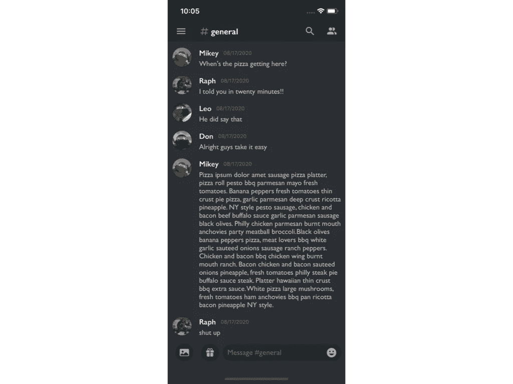
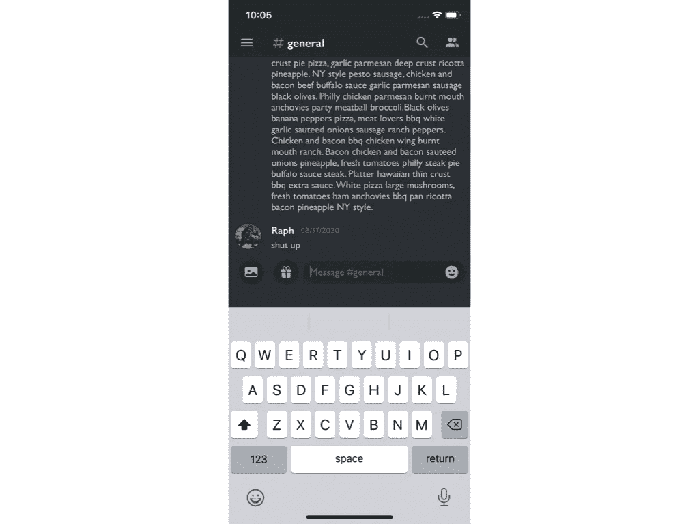
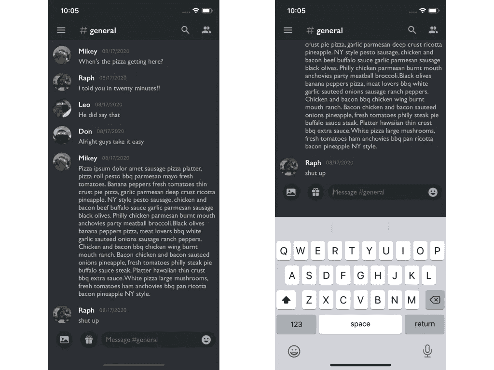

# 程序化用户界面:不和谐

> 原文：<https://levelup.gitconnected.com/programmatic-ui-discord-de1e59b3c2be>



我一直在练习编程 UI 约束，并决定通过从头构建一些熟悉的东西来测试我当前的能力。
两杯咖啡后，我登陆了 iOS Discord 应用。

完整的项目源代码可以在我的 [github](https://github.com/leoidiaz) 上找到

# 故障

Discord 的消息传递屏幕可以分为三个部分。


## 1 .顶视图

包含状态栏和一行自定义按钮。


## 2.表格视图

屏幕的主要组成部分。带有自定义单元格的 UITableView。


## 3.仰视图

包含两个自定义按钮和一个内部带有按钮的 UITextField。

# 最初的想法

屏幕上最大的一块是桌面视图，所以这一块正好放在中间。剩下顶部和底部。顶视图是一个导航控制器，底视图是一个自定义视图，限制在表视图底部和超级视图底部之间。

# 顶视图

以编程方式在导航控制器中嵌入 ViewController 可以在场景委托中轻松完成。

SceneDelegate.swift

在顶视图上创建按钮行现在只需要工具栏按钮属性和设置。

初始化通用 UIBarButtonItems 和一个分隔符。

ViewController.swift

设置属性并将按钮放置在右栏侧和左栏侧。

ViewController.swift

**# *通用*** 按钮制作独特，因为它包含图像和文本。我通过将标签和图像制作成一个单独的视图，合并组件，然后将视图添加到工具栏按钮项中来解决这个问题。

HashTagChatView.swift

# 表格视图

初始化 tableview，符合 UITableViewdelegate 和 Datasource，并配置 tableview。
*ui TableView . automatic dimension*和 *keyboardDismissMode* 是**消息样式 table view 的必备**。

ViewController.swift

# 仰视图

有趣的部分。这里的一切都是定制的。

BottomBarView.swift

## 自动布局

Autolayout 是编程 UI 的一个重要方面，需要反复练习才能弄清楚。试错是应该走的路。
帮助我学习自动布局的三个步骤:

1.  要使用自动布局，我们首先必须禁用自动调整大小:

```
messageField.translatesAutoresizingMaskIntoConstraints = false
```

2.将新的初始化视图添加到超级视图中

```
addSubView(messageField)
```

3.最后，您必须激活约束。你可以一个接一个地做，也可以像这样一次做完

```
NSLayoutConstraint.activate([
messageField.topAnchor.constraint(equalTo: topAnchor, constant: 16),
])
```

一起

BottomBarView.swift

## 通知中心



我为了好玩而添加的一个附加组件是能够在 textField 上使用键盘。文本字段一直在底部，所以调出键盘会完全覆盖它…除非你把屏幕上移！

有几个第三方库可以做到这一点。然而，我决定用通知中心手动实现它。第二杯咖啡仍然有效。☕️)

[Hacking With Swift](https://www.hackingwithswift.com/read/19/7/fixing-the-keyboard-notificationcenter) 有一篇精彩的文章详细介绍了这一点。

ViewController.swift

# 最终注释



这是我构建这个 UI 的思维过程和执行的概述。
我在这篇文章中只提到了关键点，所以请随意阅读源代码或克隆它。
图标资产包含在项目中，由[材料设计](https://material.io/resources/icons/?style=baseline)和 [SF 符号](https://developer.apple.com/sf-symbols/)提供

[推特](https://twitter.com/leoidiaz)

[](https://github.com/leoidiaz/DiscordUI) [## 莱奥迪亚兹/迪索杜伊

### 解散 GitHub 是超过 5000 万开发者的家园，他们一起工作来托管和审查代码，管理项目，以及…

github.com](https://github.com/leoidiaz/DiscordUI) 

# 分级编码

感谢您成为我们社区的一员！ [**订阅我们的 YouTube 频道**](https://www.youtube.com/channel/UC3v9kBR_ab4UHXXdknz8Fbg?sub_confirmation=1) 或者加入 [**Skilled.dev 编码面试课程**](https://skilled.dev/) 。

[](https://skilled.dev) [## 编写面试问题

### 掌握编码面试的过程

技术开发](https://skilled.dev)