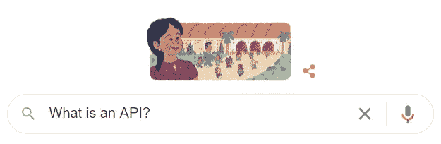
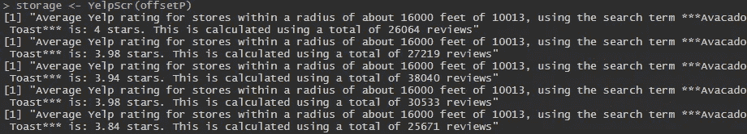
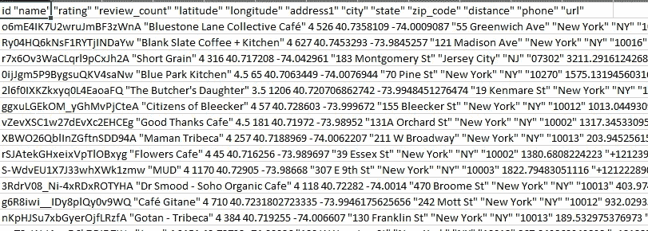
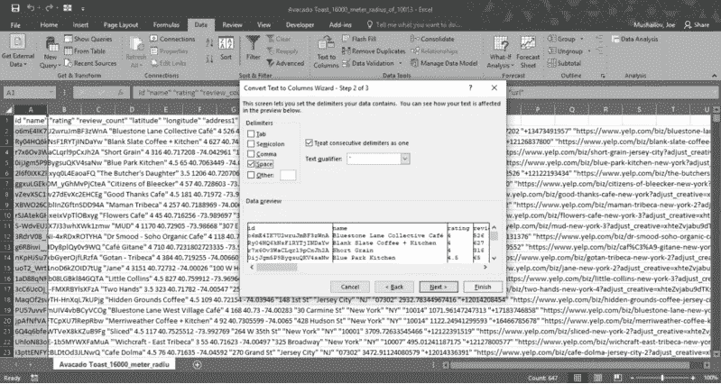
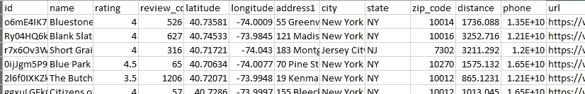

# 有计划地寻找你家附近最好的鳄梨吐司

> 原文：<https://levelup.gitconnected.com/programmatically-finding-your-neighborhoods-best-avocado-toast-820aeea44a32>

## 利用 Yelp 的 API 和 R 实时查询 Yelp 的数据库


信用:本·科尔德，Unsplash.com

使用公司 API 是自动化数据提取的一个好方法。虽然从网站上抓取数据是可能的，但 API 提供了一种更简单、通常也更合法的大规模获取数据的方式。

**完整的基础知识——什么是 API？**

API 代表“应用程序编程接口”，简单来说，就是一个允许两个应用程序进行通信的软件。App 1 将向 App 2 发送请求，App 2 将返回结果。不同的 API 对数据访问有不同的限制。



想想你与网站互动的方式。这离 RESTful APIs 的基础不远了

**完整的基础知识 Web 服务 API 的类型**

有许多不同类型的 web APIs，但我们将重点介绍 4 种主要的 web 服务 API。

1.  **JSON 协议:**查询服务器，返回 JSON 格式的结果。如果您使用的是 Python/R 之类的东西，您需要解析 JSON 以获得可用的数据格式。
2.  XML 协议:基本上与 JSON 相同，除了结果是以特定的 XML 格式提交的。很简单的协议。
3.  SOAP 协议:类似于 XML，只是要复杂得多。虽然它仍然以 XML 形式提供结果，但它使用了专有的 XML 格式。
4.  ***REST:** 虽然 REST 在技术上不是一个协议，但它经常被比作 SOAP。REST 更轻量级，并且(通常)具有更好的性能。对于初学者来说，它也很容易使用，这也是我们将在本文中讨论的内容。

**完整的基础知识——与 REST APIs 一起使用的 HTTP 方法**

**GET:** 检索资源和信息。GET 请求从不改变底层资源，因此它们被视为“安全的方法”如您所料，大多数 API 都允许 GET 请求。

**POST:** 创建一个新资源。我们使用 POST 方法来创建访问 API 的客户端凭证。

**PUT:** 更新现有的资源。如果你使用的是一家公司的 API，很可能你没有任何权限来放置资源。

**删除:**顾名思义，这是用来删除资源的。与 PUT 一样，您可能无法访问它。

**PATCH:** 像 PUT 一样，更新现有的资源。与 PUT 不同，PATCH 部分编辑资源。这种方法有一些相关的问题，并没有普遍使用。您可能不会使用补丁，尤其是在查询时。

更详细的文档可以在 RESTful 官网找到:[https://restfulapi.net/http-methods/](https://restfulapi.net/http-methods/)

# **TL；博士:给我密码**

# 分解功能

这个功能看起来有点吓人，但分解起来很简单。

1.  它将您想要查询的页数作为参数。默认情况下，Yelp API 每页最多只允许 50 个结果。因此，如果我们想得到多个页面，我们需要明确地告诉我们的程序继续。
2.  在我们定义任何东西之前，我们需要一个主数据框架来存储我们所有的结果。

```
# Defining the Function to search and parse
YelpScr <- function(offset=offsetP){

  # Define our storage dataframe where we will store results
  storage = data.frame()
```

3.要查询 Yelp，我们需要创建一个 URL。给定我们将传递的参数，下一个函数构造一个 URL。该 URL 看起来会像这样:“https://yelp . API . com/v3/business/search/query =…”

```
for(i in 1:length(offsetP)){  

    url <- modify_url(yelp, path = c("v3", "businesses", "search"),
                     query = list(term = term, location = location, 
                                   limit = limit,
                                   radius = radius,
          # For next pages -> offset 51 for pg 2, 101 for pg 3...
                                   offset = offsetP[i]
                      ))
```

4.我们传递一个 GET 请求，本质上是请求数据并提供我们的客户机 ID 来与服务器进行身份验证。

```
# Our GET request, querying the server
res <- GET(url, add_headers('Authorization' = paste("bearer", client_key)))

# Getting our results
results <- content(res)
```

5.我们创建了一个本地方法，可以将结果解析成一个列表，然后解析成一个易读的表。

```
# Parsing our results
yelp_httr_parse <- function(x) {

      # Defining the variables we want
      parse_list <- list(id = x$id, 
                         name = x$name, 
                         rating = x$rating, 
                         review_count = x$review_count, 
                         latitude = x$coordinates$latitude, 
                         longitude = x$coordinates$longitude, 
                         address1 = x$location$address1, 
                         city = x$location$city, 
                         state = x$location$state, 
                         zip_code = x$location$zip_code,
                         distance = x$distance,
                         phone = x$phone,
                         url = x$url
      )

# Quick lapply to clean the data up
parse_list <- lapply(parse_list, FUN = function(x) ifelse(is.null(x), "", x))

      # Making our data into a tibble for easy access
      df <- tibble(id=parse_list$id,
                   name=parse_list$name, 
                   rating = parse_list$rating, 
                   review_count = parse_list$review_count, 
                   latitude=parse_list$latitude, 
                   longitude = parse_list$longitude, 
                   address1 = parse_list$address1, 
                   city = parse_list$city, 
                   state = parse_list$state, 
                   zip_code = x$location$zip_code,
                   distance = x$distance,
                   phone = x$phone,
                   url = x$url)
      df
    }
```

6.我们将创建的本地方法应用到结果中，然后 rbind(按行追加)由我们的方法创建的所有数据结构。

```
# Results list
results_list <- lapply(results$businesses, FUN = yelp_httr_parse)

payload <- do.call("rbind", results_list)
```

7.我们创建另一个本地函数:在每个页面被查询后，我们显示一些与页面相关的元数据。下面是这个函数运行时的样子。

```
# Show analysis on every pageg
ratingsCalc <- function(payload){
      x <- payload$rating * payload$review_count 
      x2 <- round( (sum(x) / sum(payload$review_count)), 2)print(paste0("Average Yelp rating for stores within a radius of about ", radius, " feet of ", location, 
", using the search term ***", term,  "*** ", "is: ", x2, " stars. This is calculated using a total of ", sum(payload$review_count), " reviews"))
}# Show the messages as it queries Yelp
    msg <- ratingsCalc(payload)
    strsplit(msg, "\n")
```



我们的元数据正在显示。鳄梨拼错了。我的错。:/

8.在每个页面被解析后，我们将它按行存储在我们的存储数据帧中。我们还包括一个空页面的退出条件，并返回数据帧。

```
# Store the results in our dataframe
storage = rbind(storage, payload)if(sum(payload$review_count)==0){ break}
  }
  # Return our final storage DF
  return(storage)
  }
```

# 该跑了！

9.我们传递我们的客户 ID 和客户密钥(可以从 Yelp 的开发者门户免费获得)。我们需要确保我们**永远不会**明确地传递我们的凭证。有几种方法可以传递我们的凭证。评论中列出了 3 种最好的方法:使用 **Keyring 包，** opt 将其存储在文本文件中，打开、读取和关闭文件，或者强制用户输入。

```
# ~~~~~~~~~~~~~~~~~~~~~~~~~~~~~~~~~~~~~~~~~~~~~~~~~~~~ #
#                 Running Our Code
# ~~~~~~~~~~~~~~~~~~~~~~~~~~~~~~~~~~~~~~~~~~~~~~~~~~~~ ## We want to avoid explicitly having our client id/key in our code. Instead we can do 3 things:
  # 1) Open a .txt with our id/key in rows 1/2, respectively
  # 2) Use the R Keyring library to save your keys 
  # 3) Force user to input id/key manually. This becomes too much of a headache once you start using the script often since it's a manual touch every time#  ~~~~~~~~~~~~~~~~~~~~~~~ PASSING CREDENTIALS
# Opening text file, reading the keys, closing
f=open('C:/path/of/your/credentials.txt',"r")
lines=f.readlines()
client_id=lines[0]
client_key=lines[1]
f.close()# Alternatively, ask for a password if you run this script rarely.
client_id <- rstudioapi::askForPassword()
client_key <- rstudioapi::askForPassword()
#  ~~~~~~~~~~~~~~~~~~~~~~~ PASSING CREDENTIALS# Opening text file, reading the keys, closing
f=open('C:/path/of/your/credentials.txt',"r")
lines=f.readlines()
client_id=lines[0]
client_key=lines[1]
f.close()
```

10.发布并生成我们的访问令牌，这样我们就可以实际查询 API。

```
# POST command to access API
res <- POST("[https://api.yelp.com/oauth2/token](https://api.yelp.com/oauth2/token)",
            body = list(grant_type = "client_credentials",
                        client_id = client_id))# Generate our token
token <- content(res)$access_token
```

11.定义我们的搜索参数。关于搜索参数限制的完整文档可以在 Yelp 的网站上找到:

[https://www . yelp . com/developers/documentation/v3/business _ search](https://www.yelp.com/developers/documentation/v3/business_search)

```
# Search parameters
yelp <- "[https://api.yelp.com](https://api.yelp.com)" # Base URL
term <- "Avocado Toast" # Search term
location <- "10013" # Manhattan Zip Code
categories <- NULL # Optional filter, looking at specific category of place... ex: bar, park, etc.
limit <- 50 # Biggest limit of results Yelp returns per page
radius <- 16000 # Radius, in meters from location. Max is 40,000 (25 miles)# Number of pages you want to query. 50 = 1 page of results. So 600 is 600/50 = 12 pages of results
  # The function automatically stops if it reaches an empty page
offsetP <- seq(1,601, 50)
```

12.把所有东西放在一起！运行该功能，并将其导出为 CSV 格式。

```
# This will query our database with our function!
storage <- YelpScr(offsetP)# Export it
save_path = "C:/users/path/to/where/you/want/it"
nameOfExport <- paste0(term,"_", radius, "_meter_radius_of_",location)
write.table(storage, paste0(save_path, nameOfExport, ".csv"), row.names = FALSE)
```

# 我们完事了。嗯，除非你想在 Excel 中…

如果你是一个 Excel 的人，你有几个更快的步骤。我们得到的文件格式是. csv，但是可以很容易地转换成可读的 Excel 文件。



在 Excel 中打开时的输出

13.突出显示列 A →数据选项卡→“文本到列”→“下一步”→在**空格上定界** →“完成”



空间划界

现在我们有了一个易读的 Excel 文件，我们可以保存为. xlsx。从这里你可以过滤，排序等。



# 法律考虑


就像我的抓取文章一样，我想强调在使用这些数据之前阅读服务条款。通常公司会提供付费的 API 用于商业用途，而这些免费的 API 仅供个人使用。你可以在这里找到 Yelp 的 ToS:

[https://www.yelp.com/developers/api_terms](https://www.yelp.com/developers/api_terms)