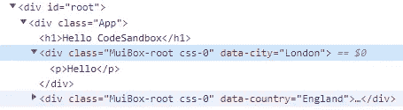
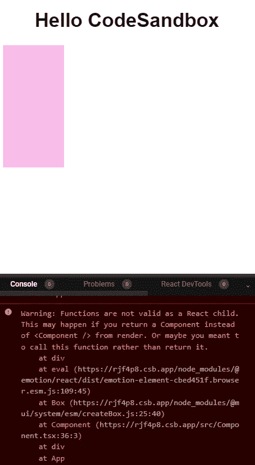

# 以编程方式在 React with TypeScript 中设置数据属性

> 原文：<https://levelup.gitconnected.com/programmatically-set-data-attribute-in-react-with-typescript-d256a2df712a>


我想以编程方式设置特定组件的数据属性，以便在测试中可以很容易地识别它。问题是如何在 TypeScript 中以编程方式设置 React 组件的属性。

# 数据属性

HTML 有一个很好的[数据属性](https://developer.mozilla.org/en-US/docs/Learn/HTML/Howto/Use_data_attributes)，这对于存储额外的数据很有用。用键`city`设置数据属性:

```
return (
  <Box data-city="London">
    <p>Hello</p>
  </Box>
);
```

`city`数据的值可以从`dataset`对象中获得:

```
const box = document.querySelector({/* some selector */});box.dataset.city // "London"
```

我想避免硬编码键和值，而是通过 props 获得它们。

# 以编程方式设置属性

我定义了获取数据属性键和值的变量，即`dataAttrName`和`dataAttrValue`。

```
interface ComponentProps {
  dataAttrName: string;
  dataAttrValue: string;
};
```

将`dataAttrName`附加到字符串文字`data-`会产生所需的键，然后使用该键将`dataAttrValue`插入到组件的 props 对象中。产生的道具对象可以直接在 JSX 元素中被析构。

例如，如果我想动态设置一个 [MUI](https://mui.com/material-ui/react-box/#main-content) `[Box](https://mui.com/material-ui/react-box/#main-content)` [组件](https://mui.com/material-ui/react-box/#main-content)的`data`属性，我可以这样做:

```
const Component: FC<ComponentProps> = ({ dataAttrName, dataAttrValue
}) => { let props = {} as BoxProps;
  const key = `data-${dataAttrName}`;
  const dataAttrKey = key as keyof BoxProps;
  props[dataAttrKey] = dataAttrValue; return (
    <Box {...props}>
      <p>Hello</p>
    </Box>
  );
};export default Component;
```

使用此组件:

```
export default function App() {
  return (
    <div className="App">
      <h1>Hello CodeSandbox</h1>
      <Component dataAttrName="city" dataAttrValue="London" />
      <Component dataAttrName="country" dataAttrValue="England" />
    </div>
  );
};
```

检查元件显示它们包含正确的`data`:



# 关于类型安全的说明

从技术上讲，使用这种方法，设置任何道具都是可能的，但是这很容易导致古怪的行为。例如，我可以传递一个函数引用作为组件的子组件**(这是错误的)**:

```
let props = {} as BoxProps;
const key = `children`;
const dataAttrKey = key as keyof BoxProps;
props[dataAttrKey] = () => {};return (
  <Box style={{ backgroundColor: "#fabcea", width: 100, height: 100 }} {...props} ></Box>
);
```

它可以编译，但是 React 警告我们函数不是 React 组件的有效子级:



通过对`key`变量进行造型，我在这里声明我确信这个`key`在`BoxProps`的键集中，这就是它不安全的原因:

```
const dataAttrKey = key as keyof BoxProps;
```

我认为这种方法**可能适合设置** `**data**` **属性**。在键前面加上`'data-'`可以确保它只设置`data`属性，如果有什么不工作，组件的功能不会受到影响。

**然而，我认为这对其他任何事情都是潜在的麻烦。**

# 结论

这是以编程方式在 TypeScript 中为 React 组件设置`data`属性的一种方式。

当`id`和`name`标签不适用时，此**可能对**测试有用。这就是我使用它的目的，我们需要一种更好的方法来识别用 Selenium 测试的组件，这就是出现的一个解决方案。