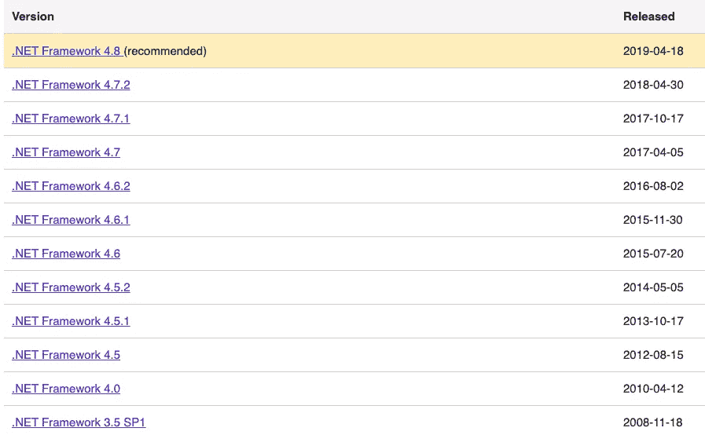

# 程序员:做这 5 件事让你在同龄人中脱颖而出

> 原文：<https://levelup.gitconnected.com/programmers-do-these-5-things-to-stand-out-among-your-peers-e518edfd750d>

马库斯·斯皮斯克在 [Unsplash](https://unsplash.com?utm_source=medium&utm_medium=referral) 上的照片

作为一名职业程序员，是一份既有挑战性又有回报的职业。这不是那些反对改变的人的职业道路。我们的行业处于不断变化的状态，几乎每天都有新的工具和库出现。保持现状不适合胆小的人，但是，如果你像我一样喜欢它，它会很有趣！

在这个游戏中待了很长时间，我寻找的某些特质告诉我一个候选人或同事对他们的工作是认真的。以下是前 5 名。

# 1.接受并适应不断的变化。

照片由[罗斯·芬登](https://unsplash.com/@rossf?utm_source=medium&utm_medium=referral)在 [Unsplash](https://unsplash.com?utm_source=medium&utm_medium=referral) 拍摄

无论你使用什么语言或框架，这个行业都会发生变化。你使用的工具将会发生很大的变化。你不一定要喜欢它，但你需要能够管理它。你需要逆来顺受。软件发布周期越来越短。就在你觉得已经掌握了上一个版本的更新时，一个新版本发布了。例如，请看一下。NET framework，并注意版本之间的时间间隔更短。

。net 框架发布日期(部分)

这个列表中最下面的几行在发布日期之间有*年。* ***年*** ！那些日子早已过去。拥抱变化，学会适应。

# 2.掌控你的继续教育

照片由[蒂姆·莫斯霍尔德](https://unsplash.com/@timmossholder?utm_source=medium&utm_medium=referral)在 [Unsplash](https://unsplash.com?utm_source=medium&utm_medium=referral) 上拍摄

这个超级重要。只有一个人会像你一样致力于你的成功——那个人就是你！

换句话说，没有人比你更关心你。

利己不是自私，而是一件好事。

如果我们能让其他人支付我们保持相关性所需的所有培训材料和工具，那就太好了。不幸的是，很多时候情况并非如此。

当另一方不愿意掏钱支持我们的发展时，我们需要站出来，选择我们认为需要的会议、工具和培训课程，并购买它们。

我们投资于自己和未来的收入潜力。

此外，考虑如何学习最好。书籍？截屏？视频讲座？你需要选择适合你的方式。

幸运的是，有很多培训公司提供你能想到的几乎任何技术的培训。查看本文末尾的参考资料部分获得部分列表。

# **3。磨练你的技术技能**

[阿三](https://unsplash.com/@ahsan19?utm_source=medium&utm_medium=referral)在 [Unsplash](https://unsplash.com?utm_source=medium&utm_medium=referral) 上的照片

这一点和前一点是一致的。参加培训课程和阅读书籍都很好，但在某些时候，你需要把手指放在键盘上，然后*创造*。

通过构建一个简单的应用程序来测试这些新获得的技能。阅读和理解书中的文字与真正坐下来创造东西相去甚远。

还记得在学校的那些时候，你以为你理解了一个数学概念，但却被给了一个需要应用这个概念的问题，而你只是盯着这个问题，毫无头绪？(也许那只是我)

准备考试的最好方法是什么？参加模拟考试。

***知道*** 你学到了可以用的新知识的最好方法是什么？应用这些知识，并用它们创造一些东西！

这让我想起了我在美国海军陆战队服役期间我们用过的一句话——你训练你将如何战斗，当然不包括真正的子弹。

新学到的概念的实际应用是无价的。

编写 katas 代码，加入开源项目，在本地机器上创建简单的应用程序。任何时候你把你的技能应用到真实的事情上，都是值得的。

# **4。培养你指导他人的能力**

由 [Austin Distel](https://unsplash.com/@austindistel?utm_source=medium&utm_medium=referral) 在 [Unsplash](https://unsplash.com?utm_source=medium&utm_medium=referral) 上拍摄的照片

指导他人真的很有意义。无论是和你一起工作的其他开发人员还是你生活中的人，有时我们都需要一点帮助。

许多教练书籍似乎过于倾向于给出建议。虽然这有时可能是合适的，但我发现，在与某人一起解决问题时，不断地问一些试探性的问题通常更好。你真的希望他们自己找到答案，而提问是让他们找到答案的好方法。

有大量的资源可以学习和发展教练技能，但这里有一本我非常喜欢的书。

[https://www . Amazon . com/Coaching-Habit-Less-Change-Forever-ebook/DP/b 01 buibzzi/ref = TMM _ kin _ swatch _ 0？_ encoding = UTF8&qid =&Sr =](https://www.amazon.com/Coaching-Habit-Less-Change-Forever-ebook/dp/B01BUIBBZI/ref=tmm_kin_swatch_0?_encoding=UTF8&qid=&sr=)

# **5。提高你的软技能**

[马太·亨利](https://unsplash.com/@matthewhenry?utm_source=medium&utm_medium=referral)在 [Unsplash](https://unsplash.com?utm_source=medium&utm_medium=referral) 上拍照

总而言之，你可以成为最好的、最有才华的、技术最精通的、吃算法的程序员，但如果因为你惹恼了所有人而没有人愿意和你一起工作，你就不会走得很远。

人们和那些像他们希望被对待那样对待他们的人一起工作得很好。我不知道为什么，但有时这个事实会被遗忘。

仅仅因为你可能在技术上更精通，并不意味着你有权看不起某人或对他们不好。

尊重每一个人。一点也不费力。

感谢阅读！

**资源——我使用所有这些**

[laracasts.com](https://laracasts.com/)——这是由 Jeffrey Way 运营的一个很棒的资源。这家伙是个很棒的教练。这个网站主要关注 Laravel、Vue、JavaScript 和 PHP。

lynda.com——琳达永远都在。我想这是我多年前在 LinkedIn 购买它之前的第一次培训订阅。琳达有一个广泛的目录，从编程到摄影，从商业到设计。好东西。你可能会在这里忙上好几年。

这个项目是由 John Lindquist 发起的，他是 JetBrains 的技术布道者，并开始制作 youtube 视频。他把它变成了一门生意。内容主要是 JavaScript 相关的，非常好。

pluralsight.com——这是我加入多年的另一个网站。最初，它主要专注于微软技术，但多年来已经扩展开来。他们现在为许多技术提供技能评估和学习途径。

docs.microsoft.com——有时候阅读真实的文件是无可替代的。还有很多非常有用的技术演示。免费！

[MDN web docs](https://developer.mozilla.org/en-US/)—Mozilla web 文档。这是所有 web 开发或 JavaScript 相关内容的绝佳资源。我发现自己一直在这个网站上。