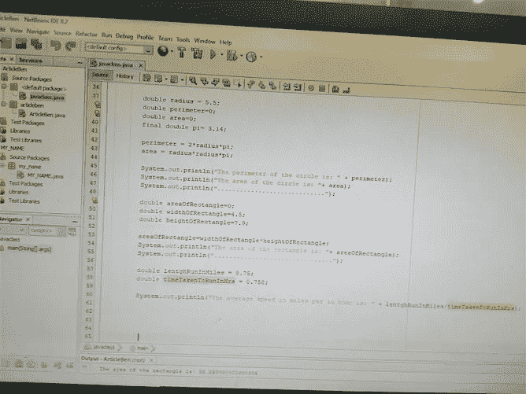
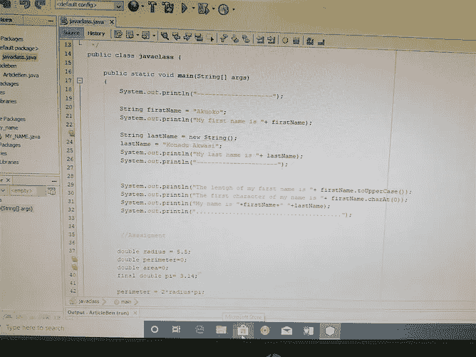
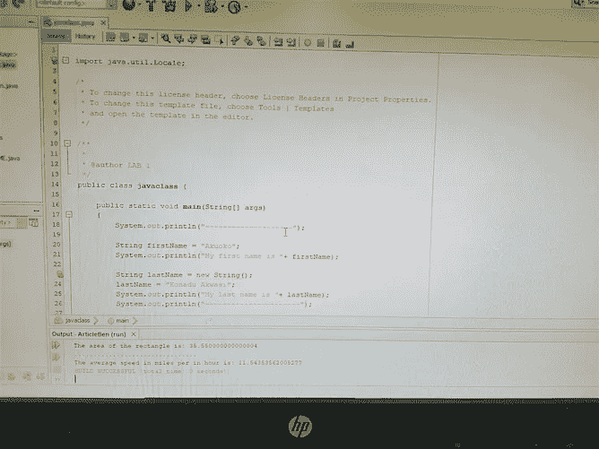

# 程序员们，不要待在自己的舒适区里。

> 原文：<https://levelup.gitconnected.com/programmers-dont-stay-in-your-comfort-zone-1b10e465b8cb>

## 呆在我们的舒适区非常有趣，但后果是什么，我们如何才能阻止这种情况。

照片由[布莱克·齐克](https://unsplash.com/@blakecheekk?utm_source=unsplash&utm_medium=referral&utm_content=creditCopyText)在 [Unsplash](https://unsplash.com/s/photos/jump?utm_source=unsplash&utm_medium=referral&utm_content=creditCopyText) 上拍摄

当我 17 岁开始上大学时，我选择做 IT，因为我选择的大学不提供经济学。在我的第一个学期，我被介绍给编程，这与我的期望相差甚远，我以为只有 CS 的学生才做繁重的编程，但男孩我怎么错了。在我的第二个学期，我们开始学习 C++，我决定要掌握 C++，但这不是一件容易的事情。有时作为人类，我们不得不呆在一个没有压力、焦虑或紧张的地方，但有时正是这些复杂因素帮助我们成长。我们都喜欢的、没有压力、焦虑或紧张的地方叫做舒适区。我掌握 C++了吗？首先，我们来看看什么是舒适区。

## 什么是舒适区？

根据 [***维基百科***](https://en.wikipedia.org/wiki/Comfort_zone) “舒适区是一种心理状态，在这种状态下，一个人对事物感到熟悉，他们放松并控制着他们的环境，经历着低水平的焦虑和压力。在这个区域，稳定的性能水平是可能的。”。舒适区意味着我们处于一种感觉非常舒适的状态。我们有规律的习惯和惯例被认为是我们的舒适区。当在我们的舒适区几乎没有风险时，我们会自动做事。有时，处于我们的舒适区是好的，但长期处于你的舒适区会对我们产生非常负面的影响，当处于我们的舒适区时，我们往往会停止实现我们的目标，我们让机会溜走，我们停止挑战自己，我们让自满渗透到我们的系统中。

照片由[科恩斯塔尔](https://unsplash.com/@coena?utm_source=unsplash&utm_medium=referral&utm_content=creditCopyText)在 [Unsplash](https://unsplash.com/s/photos/comfort?utm_source=unsplash&utm_medium=referral&utm_content=creditCopyText) 上拍摄

## 为什么我们经常呆在自己的舒适区？

呆在舒适区是我们每个人都会定期做的事情，这是我们人性的一部分。没人想强调。对失败的恐惧是我们长期呆在舒适区的主要原因。当参与某项活动时，作为人类，我们有时会考虑从中可能产生的所有可能性。我们害怕如果我们失败了，我们会让我们的家人、朋友和我们爱的人失望。人们倾向于不惜一切代价规避风险。规避风险是我们呆在舒适区的主要原因。我们倾向于问自己“如果呢？”问题，“如果我失业了怎么办？如果我丢了钱怎么办？我不懂编程怎么办？”问自己这些问题让我们想要避免冒险。

## 舒适区和程序员。

编程是每隔几年就要改变的工作类型，我们如何编码的新改进正在进行，这需要程序员学习很多东西。Visual Basic、Perl、Objective-c、Cobol、CoffeeScript、Scala 和 Lisp 都是过去使用的*编程语言，但现在已经不再使用，或者正在慢慢消亡。这告诉我们，在编程领域，如果你想变得有影响力，不要坐立不安，不要在自己的舒适区呆太久。根据 Quora 上的[***Mashable***](https://mashable.com/2013/02/11/bill-gates-things/)和 [***Ian Atkin 的说法***](https://www.quora.com/Which-programming-languages-does-Bill-Gates-know) 比尔盖茨在 20 世纪 90 年代就知道 Visual Basic，但他也学会了用 C、C++和 C#编写代码，这清楚地表明编程是为了跟上技术的进步。你不能呆在你的舒适区，期望作为一个开发者成长。为了成长，你需要推动自己学习新的东西，使用新的技术，通过这样做，你肯定会成为一名程序员。*

**

*克里斯多夫·高尔在 [Unsplash](https://unsplash.com/s/photos/computer?utm_source=unsplash&utm_medium=referral&utm_content=creditCopyText) 拍摄的照片*

## *作为开发人员，如何走出自己的舒适区？*

*作为开发人员，尝试学习新的东西，尽管你会面临不适，尝试克服不适，因为这是学习发生的地方。尝试学习使用命令行而不是用户界面，使用 vim 而不是记事本，尝试阅读技术书籍。尝试学习与你相关的新编程语言，去*[***hacker rank***](https://www.hackerrank.com/)尝试解决一些问题，从小处着手，逐步解决更难的问题。创建你感兴趣的项目游戏、网站和应用程序，从小项目开始，逐步推进。尝试与外界分享你所学到的东西，在 Twitter、Instagram 上发布或在媒体上写作，尝试冒险。通过做这些活动，你一定会成长为一名开发人员。**

****

**照片由[蒂姆·莫斯霍尔德](https://unsplash.com/@timmossholder?utm_source=unsplash&utm_medium=referral&utm_content=creditCopyText)在 [Unsplash](https://unsplash.com/s/photos/jump?utm_source=unsplash&utm_medium=referral&utm_content=creditCopyText) 上拍摄**

> **“我们中的一些人，特别是那些有抵押贷款、汽车和几个受抚养人的健康账单的人，以及我们身后大量的午夜便便和呕吐物清理工作，只是没有时间在凌晨 1 点急切地在导航到 Node JS 的参考网站时兴高采烈地搓着手，以此走出舒适区……在点燃软件开发人员众所周知的发令枪后，打开天堂般的健怡可乐罐的声音。更准确地说，我认为像我这样的人，实际上已经没有或不记得什么是舒适区了。我不得不强迫自己学习新东西，把它硬塞进我的日常工作中。我的职位描述是一名软件开发人员。但是，由于我工作场所的性质，我经常做 DevOps 的事情。我得写剧本。但是我一直在强迫自己停止过多地使用 bash，哦，上帝原谅我承认这一点，Perl，当我只需要费力地浏览一些日志或其他数据文件时。相反，我强迫自己根据需要学习 Python，而不是在凌晨 1 点。我认为我讨厌 Python 就像我最终学会讨厌 Perl 的美杜莎般丑陋一样。但是，嘿，这是所有酷孩子用的，你知道吗？与 Perl 相比，让 Python 与数据库和网络等交互只是一个梦想，更不用说 CLI 二进制+ bash 了。我给你的故事添加的寓意是，即使看起来你没有周期来打破你的舒适区，这也是值得的，不仅仅是为了一些存在主义的练习。想象一下在你的简历中加入另一个流行词的快乐！”——[**贾森·加布勒**](https://dev.to/jasongabler/comment/1aa8)**

****

**[豪尔赫·冈萨雷斯](https://unsplash.com/@jorgelameiras?utm_source=unsplash&utm_medium=referral&utm_content=creditCopyText)在 [Unsplash](https://unsplash.com/s/photos/jump?utm_source=unsplash&utm_medium=referral&utm_content=creditCopyText) 上拍照**

## **作为一名开发人员，我是如何成长的？**

**作为一名 IT 学生，我在 100 级的时候在大学学了 C++，掌握了 C++的基础，从而构建了控制台应用。但我想学习如何使用 Unity3d 用 C#创建游戏，所以我决定自学如何用 C#编写代码，C#不是我选择的学校，但我得到了一门关于 C#的课程，当我面临挑战时，学会了如何在不看教程的情况下使用文档，我感谢自己我学得很好，它帮助我相对较快地学会了如何用 C#编码。虽然我不是使用 C#和。NET 库，我每天都在学习如何更好地编码。我也学会了如何使用 git，到目前为止它对我帮助很大。随着我们今年从 100 级提高到 200 级，学习 Java 编程语言已经成为我们的一项要求，我对此非常重视，因为我希望有一天能开发出 Android 应用程序。这是我今天在课堂上用 Java 写的第一批代码之一。**

************

**我的第一批 java 代码。**

**我知道它远非完美，所以我会继续克服我在编写 Java 时遇到的所有不适和不熟悉，直到我变得更好。我还开始阅读我知道会对我有帮助的技术书籍，游戏设计和干净代码的基础:敏捷软件工艺手册，我知道这很难，但我会继续努力，直到我变得更好，我不会就此止步。**

**让我们继续走出舒适区，学习新事物，建立项目，并在社交媒体上分享我们的工作。**

**如果你喜欢这篇文章，你可以给我 50 次掌声👏👏👏，如果你对技术和软件开发感兴趣，也可以关注我的*和社交媒体。您可以在[***Twitter***](https://twitter.com/akuoko_konadu)上关注我，因为我们将讨论编码和一般的技术世界，我的 DM 永远是开放的。加入我的[***YouTube***](https://www.youtube.com/channel/UCYKFy3oPn2b6gbjAzmgNgJg)让我们一起做一些编码。祝你有愉快的一天。下一次快乐编码。***

**如果你希望有人为你写科技文章，我很乐意为你写一篇**低至 5 美元**[**【Fiverr**](https://www.fiverr.com/share/8Kq9Br)**。****