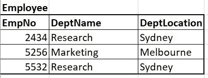
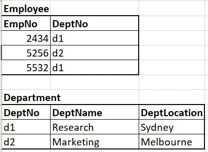

# 最好的程序员都很懒

> 原文：<https://levelup.gitconnected.com/programming-best-practices-boil-down-to-one-thing-c1b0ba79a3aa>

你可能已经学习了编程最佳实践，比如坚实的原则。

但是他们从未教过我的一件事是，他们中的大多数人都归结为一个概念——“程序员都很懒”。

# 我们不喜欢什么

有两件事我们不喜欢，因为我们懒:

1.  在多个地方更新东西——所以我们使用**集中控制点**。
2.  一次考虑太多事情——所以我们使用**抽象**。

当你写好代码时，你会自动地使用集中的控制点和抽象点，它们携手并进。

本文将向您展示大多数编程最佳实践如何归结为这两个概念的例子。

但是首先，让我们检查一下这两个概念，这样我们就知道它们是什么意思了。

# **集中控制点**

如果加价百分比发生变化，哪部分代码更容易更新？

## 示例 1

## 示例 2

显然是例 2，因为你只需要更新`markUp` 常量。

还要注意代码是如何更容易理解的，因为`1.25`已经被替换为一个有意义的名字(`markUp`)？

`1.25`已经被**抽象为**一个叫做“标记”的概念。

# 抽象

示例 1 和示例 2 中，哪一段代码更容易阅读和理解？

## 示例 1

## 示例 2

明明是例 2，为什么呢？

因为这段代码**减少了你在给定时刻需要考虑的事情**。

微软已经将计算平均值所需的代码抽象为 LINQ 扩展方法。

阅读`Average()`比试图理解 6 行代码在做什么要容易得多。

如果由于某种原因,“平均”的定义发生了变化，那么只需要更新扩展方法的实现。扩展方法是一个**集中控制点。**当代码在很多地方被使用时，这变得很有用(看这两个概念是如何联系在一起的？).

# 概念

以下是 OOP 概念，可以帮助你写出更好的代码。我将试着向您展示它们如何与**抽象**和**集中控制点**的概念相关。

# 包装

封装就是将相关的东西存储到一个单元中。在 C#中，你可以使用类或结构。

## 没有封装的示例

**集中控制点:**

如果您想添加“年龄”，在第一个示例中，您需要:

1.  添加年龄作为变量。
2.  更新对`StoreUserDetailsInDb()`的调用，以包含额外的参数。
3.  更新对`EmailUserDetailsToUser()`的调用以包含额外的参数。
4.  更新`StoreUserDetailsInDb()`的方法签名以包含额外的参数。
5.  更新`EmailUserDetailsToUser()`的方法签名以包含额外的参数。

**抽象:**

这里我们需要考虑 4 种不同的数据。

## 封装示例

在这个例子中，四条独立的信息被封装到一个叫做`Person`的单元中。

**集中控制点:**

将“年龄”添加到第二个示例更容易，您只需要:

1.  在`Person`类中添加`Age`属性。
2.  在`person`对象初始化中初始化`Age`属性。

**抽象:**

在这里，我们可以将这 4 个不同的数据视为一个“人”，这是一个更容易思考的概念。

这类似于我们认为房子是房子，而不是有前门、后门、厨房、休息室和卧室的砖造建筑。

# 遗产

这是对象从父类“继承”成员的地方。

## 没有继承的例子

**集中控制点:**

如果你想添加`Address`，因为这是一个`Teacher`和一个`Student`已经有的东西，你需要把它添加到这两个类中。

**抽象:**

我们需要想两个概念，`Teacher`和`Student`。

## 继承的例子

**集中控制点:**

如果你想添加`Address`，你只需要把它添加到`Person`类中。

**抽象:**

我们只需要考虑一个概念，a `Person`。

# 多态性

这就是一个对象可以表现得像一个不同的对象的地方。

## 没有多态性的示例

**集中控制点:**

如果您想更改`FullName`以包含破折号而不是空格，您需要在两个地方更新它。

**抽象:**

`GetFullName()`与一个`Teacher`和一个`Student`相关联，有两个独立的概念。

## 多态的例子

在这里，`student`和`teacher`对象的行为就像它们是`Person`对象一样。

**集中控制点:**

如果你想把`FullName`改成包含破折号而不是空格，你只需要在`Person`类中更新一次。

**抽象:**

`GetFullName()`仅与一个`Person`相关。

# 数据隐藏

这是你隐藏程序其他部分不需要知道的东西的地方。封装是实现数据隐藏的一种手段。

## 没有数据隐藏的示例

**集中控制点:**

如果您想在驱动程序驱动时添加另一个方法来表示另一个进程，您需要将该方法添加到`Driver`类，并添加对`driver1`和`driver2`对象的调用。

**抽象:**

当司机开车时，我们需要考虑 3 个过程。

## 数据隐藏示例

**集中控制点:**

三个流程现在是`private`，即。在`Driver`类之外不可访问。相反，它们被**封装**，因此**隐藏在`Drive()`方法中**。

现在如果驱动过程发生变化，我们只需要更新`Drive()`方法。

**抽象:**

我们只需要想到“驱动”这个概念，而不是三个不同的概念。

## 数据隐藏的另一个例子

有一个概念是*只传递给一个方法它实际上需要做的工作。*

## 没有数据隐藏的示例

在这里，我们需要创建一个新的方法，在每次创建新的类时发送电子邮件。

## 数据隐藏示例

因为发送电子邮件只需要电子邮件字符串，这就是我们需要传递给方法的全部内容。我们从`SendEmail()`方法中隐藏了*`Employee`和`Manager`。*

## *数据库中的示例*

*对于关系数据库，当您想要集中控制点时，您可以将一个表转换为第三范式(3NF)。*

*想象你有这张桌子:*

**

*如果“Research”和“Sydney”需要更新为“Res”和“Syd ”,则必须在两行上完成。*

*使用 3NF，我们可以创建另一个表，并通过集中控制点来减少重复:*

**

*如果您习惯于编程语言，您可以将此视为雇员表中的“d1”和“d2”是变量，它们使用部门表来引用“Research/Sydney”和“Marketig/Melbourne”。*

# *其他概念*

*我可以继续讨论其他概念，但是这篇文章太长了。*

*DRY、KISS、正交性和 SOLID 原则都非常相似，因为它们要么通过使用抽象使代码更容易阅读，要么有助于集中控制点。*