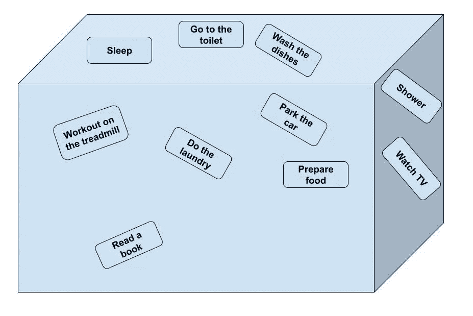
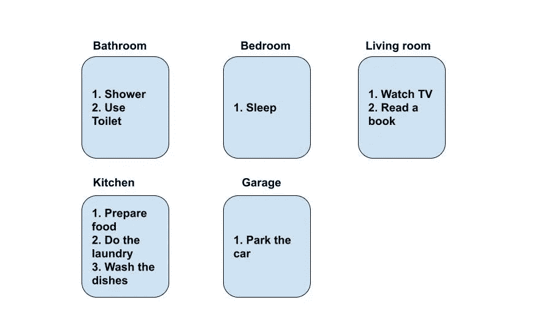

# 编程很复杂，但不需要过于复杂

> 原文：<https://levelup.gitconnected.com/programming-is-complicated-but-it-doesnt-need-to-be-overcomplicated-775d869af07e>

## 如何以更务实的方式看待编程

由 [Pakata Goh](https://unsplash.com/@pakata) 在 [Unsplash](https://unsplash.com/photos/EJMTKCZ00I0) 上拍摄的照片

编程很复杂，非 IT 行业的人通常很难掌握。我认为原因之一是它不是有形的，人们无法想象计算机软件是如何工作的。在这篇文章中，我想分享我对编码的看法，以及为什么我认为虽然它很复杂，但它不应该那么令人生畏，任何人都可以很容易理解。

## 可视化问题

假设我们有一栋房子，里面有不同的房间(咄)。

在房子里，我们可以做上述所有的动作，但目前情况有点混乱，我们不知道在哪里发生了什么，或者至少我们不知道这些动作是否是复杂的软件算法。

现在，我们已经根据实际执行动作的房间对动作进行了分组。

## 各个击破

作为软件开发人员，我们努力构建彼此独立的松散耦合的组件，您应该将编程视为构建单独的小软件，这些软件只执行特定的小功能。

通常，人们会想到网飞、Youtube、谷歌等。并且假设这些平台背后的代码极其复杂，难以理解。虽然代码确实很大，但它被分割成多个小部分，即使在一个部分上也很有意义。

比如，我们可以把 Youtube 上的评论区想象成一个独立的小程序。你可以发布评论，比如评论、回复等等，虽然它与 Youtube 这个巨大的应用程序紧密相连，但它在很大程度上是一个独立的组件。

## 数据库呢

数据库是以编程方式存储和访问的数据集合。对于非 IT 人员来说，数据库可能是编程中最不容易混淆的方面，因为他们将数据库与存储数据联系在一起。

这真的是在更高的层面上。程序执行的功能需要某些数据才能工作。对于 Youtube 的评论部分，这些数据可以是评论本身、谁写的、以及它发布在哪个视频上等等。

同样，当考虑这些大型平台时，您也可以认为该平台的每个组件可能都有自己的数据库。既然我们已经说过这些组件可以独立工作，那么每个服务应该有一个数据库是合乎逻辑的。

## 前端和后端

当你看到“前端”时，想想用户在网站、移动应用、游戏等上看到的一切。应用程序的前端部分是对外界可见的部分。当你点击一个按钮，改变页面，看网飞电影等等。

另一方面，后端是幕后的所有逻辑，使这些点击实际工作。软件的后端部分是大多数业务逻辑发生的地方，也是与数据库连接的地方。想想这个简单的例子，你正在洗衣服，所以你把你的衣服放进洗衣机，设置模式，然后按下“开”按钮。这是前端部分。然后洗衣机会决定你选择的模式，并开始释放洗涤剂，然后是水等等。这些是机器做出的决定，我们看不到，因此相当于我们洗衣机的“后端”。

## 结论

一般来说，编程和软件是一组独立的小部分，它们通过前端与用户协作，前端可视化我们希望做的事情，然后在后台执行给定的动作，并且还可以使用来自存储器的信息。

大型应用程序通过让软件的所有部分相互通信来实现复杂的任务，以获得想要的结果，我们必须记住这一点，因为当我们试图同时做太多事情时，编程会变得复杂。这就是为什么编写和思考编码的最佳方式是由多个小部分组成，每个小部分执行简单的任务，直到它们能够共同解决复杂的任务。