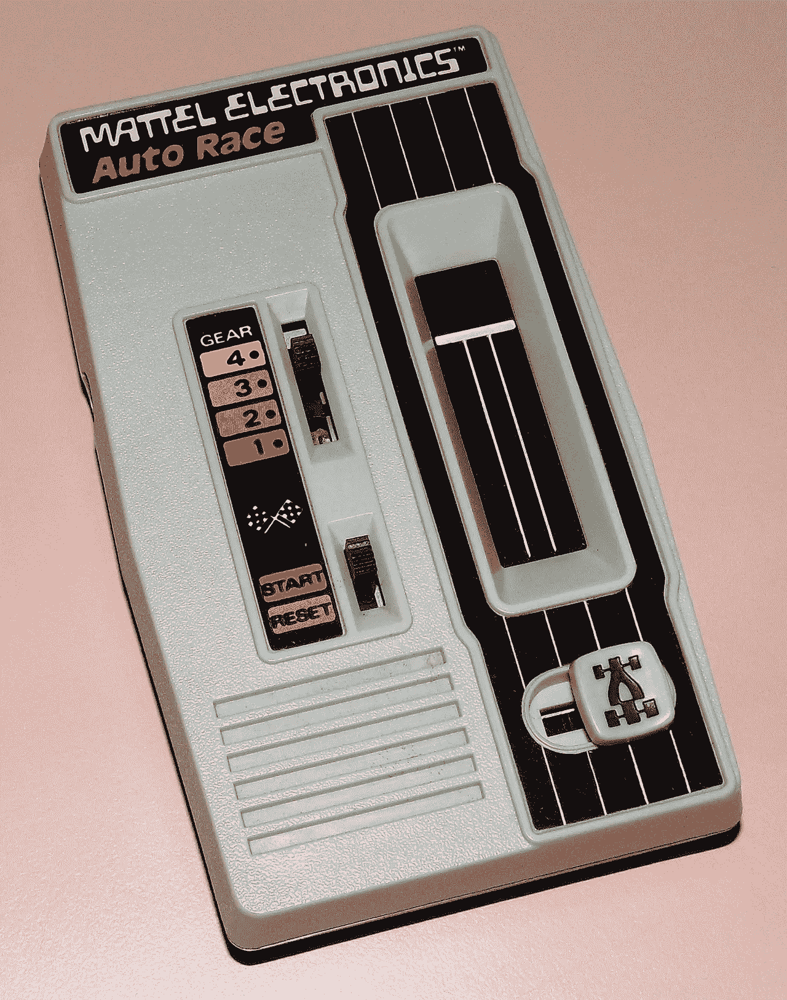
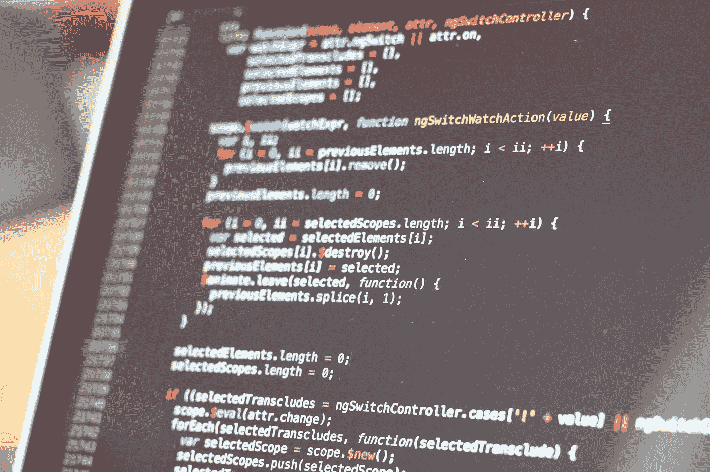
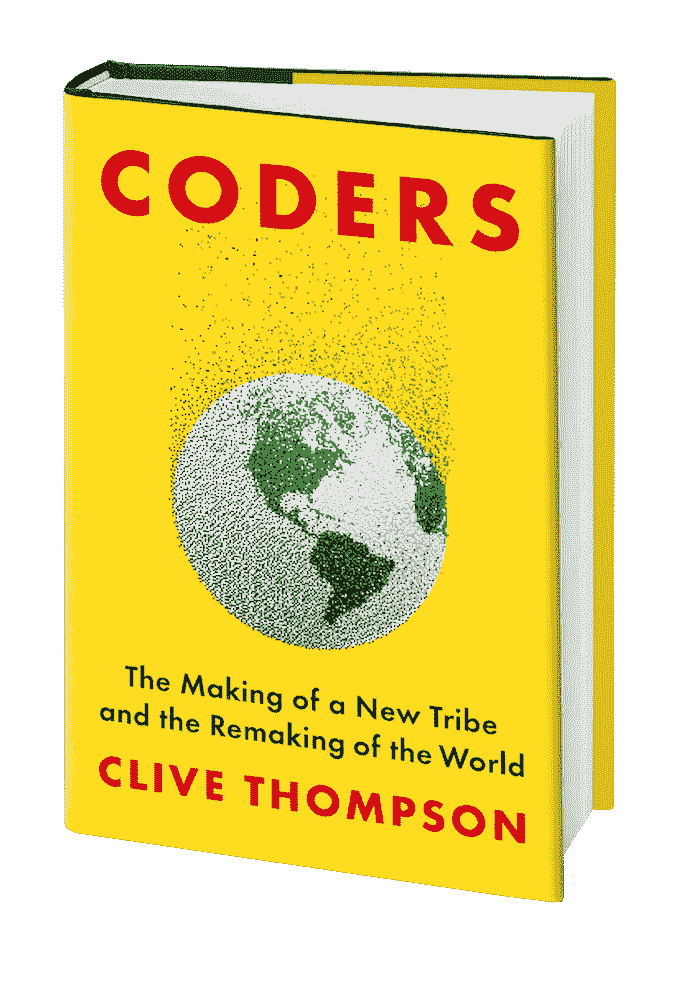

# 编程并不难，但令人沮丧

> 原文：<https://levelup.gitconnected.com/programming-isnt-hard-but-it-s-frustrating-6cb740085243>

## 培养对严重挫折的忍耐力是学习编码的关键部分

当我还是个孩子的时候，我有一份 Mattel Auto Race，这是最早的手持 LED 游戏之一。要玩这个游戏，你要驾驶一辆车——一个明亮的 LED 灯——在屏幕上开四次，尽量避免其他车向你驶来。非常简单，但在 70 年代末，它是数字娱乐的极致。

出于某种原因，这个周末我想起了它，周六晚上我突发奇想，决定用 P5 创建一个版本，P5 是制作交互式 gewgaws 的 Javascript 框架。

起初，事情进行得很顺利。我花了一个小时创建播放画布，一个代表迎面而来的汽车的类，以及生成和删除汽车的逻辑。然后我决定让多辆车在间隔但稍微随机的时间出现，让游戏变得更难一点。

这时候我遇到了问题。我管理时间的方式出了问题。汽车将一次产生两个，而不是交错。在尝试了一些不同的策略后，我不知道哪里出了问题。我开始变得沮丧，并把它推到一边。

那是两天前的事了，我还没回，因为我有点犹豫。我只是一个业余爱好者，所以我经常很快达到我的能力极限。每当我在做一个项目时，我总是有一种模糊的感觉，该死，我可能会在这里碰到一个我永远也不会*解决的障碍。*所以我开始回避这个项目。我不打开它。我不想面对挫败感和挫败感。

每隔一段时间，当有人发现我是一个涉足编程的作家时，他们会问我:*那么，编程很难吗？*

而且我一般都是这么回答的。

“‘艰难’这个词用得不对，”我会说。“与其说是难，不如说是难。

“那是那是*令人沮丧。*”

不可避免的“屏幕上的代码”拍摄，通过 [Pixabay](https://pixabay.com/photos/code-programming-hacking-html-web-820275/)

我在阅读 ACM*communication s*上的一篇文章时想到了这一点，这篇文章质疑了“编程很难”的整个假设。

正如作者 Brett A. Becker 指出的那样，你经常从教育工作者、技术公司和一些软件开发人员那里听到编码非常困难。然而正如 Becker 指出的，没有强有力的证据表明编程比其他困难的活动更难。我们没有任何可靠的数据表明，擅长编程比擅长成为一名急诊室护士、出庭律师或厨师更难——部分原因是“难”是一个奇怪的模糊词。

贝克尔怀疑，编程需要骷髅王智慧的名声等于自恋的卖弄和文化的守门人

> 编程到底难不难？目前的证据不足以令人信服，也不够多样，不足以回答这个问题。更合理(也可能更诚实)的回答是:“这要看情况”和“两者都要”。那么，为什么说困难是如此普遍呢？是不是因为没有那么多证据支持，所以才经常坊间说？因为确实存在的证据难以理解？会不会是因为这对于激励和证明工作来说太方便了？是许多人有意或无意地希望编程看起来很难吗？科技公司和招聘经理是否依赖于编程强硬精英的形象？

我同意。当我写我的书*程序员*时，我采访了 200 多名程序员，他们经常都告诉我同样的事情:

他们说，并不是编程特别难*。但它确实需要一丝不苟的思考，对细节的极度关注，这比许多其他学科更残酷。*

*最重要的是，他们注意到编码需要一种特殊的心理倾向:*

*对日常、恼人的挫折有很高的忍耐力。*

*这是因为大多数编程与其说是*创建*代码，不如说是*调试*代码。你写一个函数，你测试它，并且——经常——它不工作。您犯了一些错误，从微不足道的(忘记了分号)到更重要的(一个错误)。或者也许你的函数与别人的代码库交互，而你并不十分理解那堆软件真正是如何工作的。或者，也许你正试图使用一个庞大的代码库，这个库是许多以前的开发人员多年来写的，写得又差又乱，简直是一团乱麻。*

*无论哪种方式，程序员在键盘上花费了大量的时间，他们没有写新的代码。他们盯着满是错误的代码，手摸着头发，试图想出下一步*可能*让事情运转起来的策略。*

*自从编码出现以来，程序员就一直在与挫折作斗争。[正如我在我的书里写的*编码员* …](https://www.penguinrandomhouse.com/books/539883/coders-by-clive-thompson/#:~:text=From%20acclaimed%20tech%20writer%20Clive,what%20should%20give%20us%20pause.)*

> *1949 年 6 月，计算机科学家莫里斯·威尔克斯正要上楼时，突然灵光一现，“我余生的大部分时间将用来寻找我自己程序中的错误。”*

**

*让代码受挫如此令人抓狂的是，你不知道它会持续多久。也许你会在几分钟内解决这个问题。也许需要一两个小时。或者可能过了*周*或*月*之后，你仍然没有发现这个 bug，所以你只能用一个异常处理程序的巢把它捆住，并向上帝祈祷新的异常处理程序不会让你吃惊。*

*不管怎样，这就是我对那些问我，嘿，我能学编程吗？*

*当然，我说。几乎任何人都可以。*

*只要你能忍受无休止、永无止境的挫折。*

*显然，编程并不是生活中唯一令人沮丧的活动！大量的工作令人沮丧。*

*在销售、医疗保健、酒店或政治领域与人共事是令人沮丧的，因为人们可能极其复杂和矛盾。任何涉及身体灵活性和工艺的事情都会令人沮丧。掌握法国号或篮球的技巧可能会令人沮丧，因为你可以一遍又一遍地练习某样东西，但还没学会。我亲身经历了所有这些，因为我在一个与人相关的行业(新闻业)工作，我是一个经常尝试用吉他研究新技术的音乐家。*

*但是编码中的挫折有一种独特的痛苦，因为计算机和编程语言——至少在理论上——是确定的。它们是钟表机构。如果你能掌握你正在编写的程序的各个部分是如何工作的，你就应该能够在头脑中想象出流程，并找出你做错了什么。*

*这就是为什么与我在新闻业或音乐界感受到的挫败感相比，编码的挫败感更令人困扰，更令人心碎。如果我在一篇专题文章上进展困难，我可以安慰自己“研究很难，争论来源很复杂，写作是一个混乱的有机过程，洞察力并不总是按需而至。”学习新的吉他技巧也是如此:一个人的身体，一个人的本体感受，断断续续地进步。*

*但是当你陷入一个编码问题时，感觉更像是一个深刻的个人失败:我没有能力遵循逻辑顺序。*

*当然，我知道不一定是这样。编码不仅仅是简单的逻辑。这是一个基于洞察力的学科，所以和所有基于洞察力的学科一样，编程的“啊哈”时刻经常以奇怪的有机方式发生。你解决问题的方法是休息一会儿，让某些事情在你的背后反复思考，和别人聊天，逃避它。思维是怪异和非线性的，因此编码也是怪异和非线性的。*

*但是，在编码中碰壁*感觉*像是一个人纯粹理性的失败。这可能导致某种沮丧的可怕迷雾笼罩在灵魂上。*

*所以:编程不一定很难。*

*但这确实令人沮丧。*

*(喜欢这首曲子吗？请看下面的“拍手”按钮，以及它的深层秘密:你最多可以按 50 次！)*

*(还有！我写了一整本关于编码的怪异心理和心理流程的书——在这里可以买到各种格式的书**。*如果你是一名开发人员，这对于那些不知道你整天在做什么的人来说是一份非常好的礼物。)**

** [## 通过我的推荐链接加入媒体-克莱夫汤普森

### 作为一个媒体会员，你的会员费的一部分会给你阅读的作家，你可以完全接触到每一个故事…

clivethompson.medium.com](https://clivethompson.medium.com/membership) 

克莱夫·汤普森每周三次在 Medium 上发表文章； [*跟随他在这里获得你的电子邮件中的每个帖子*](https://clivethompson.medium.com/subscribe)*——如果你不是中等会员，* [*你可以在这里加入！*](https://clivethompson.medium.com/membership)

克莱夫是《纽约时报杂志》的特约撰稿人，也是《T21 连线》和《史密森尼》杂志的专栏作家，还是《琼斯母亲》的定期撰稿人。他是《编码者:一个新部落的形成和世界的重建》和《比你想象的更聪明的人:技术如何让我们的思想变得更好》的作者。何在推特上的[*@ pomeranian 99*](https://twitter.com/pomeranian99)*和*[*insta gram*](https://www.instagram.com/pomeranian99/)*。***