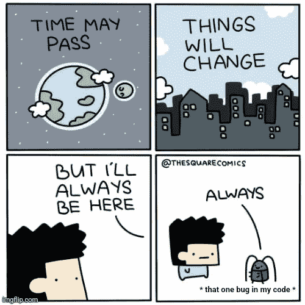
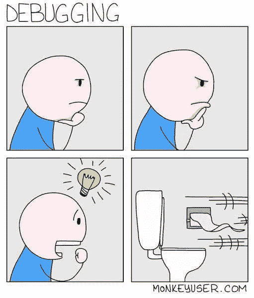
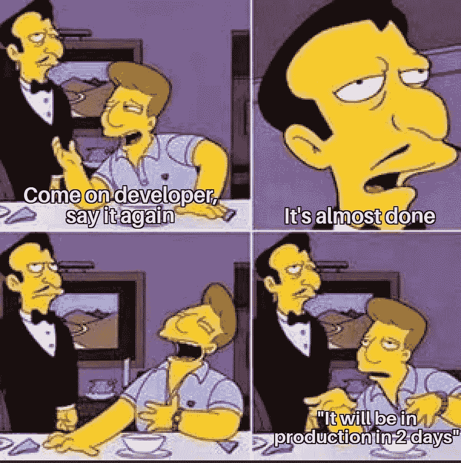
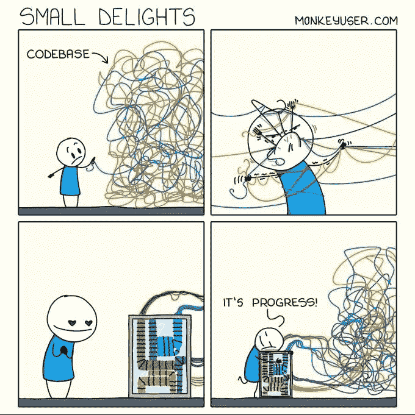
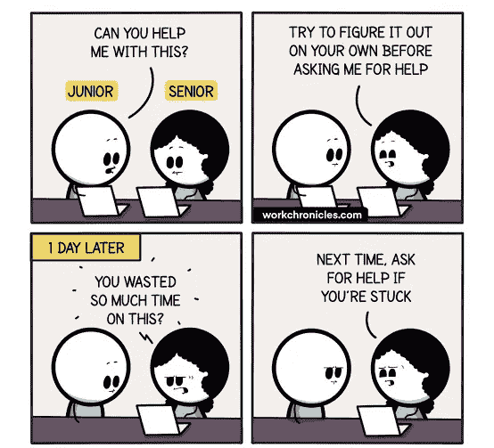
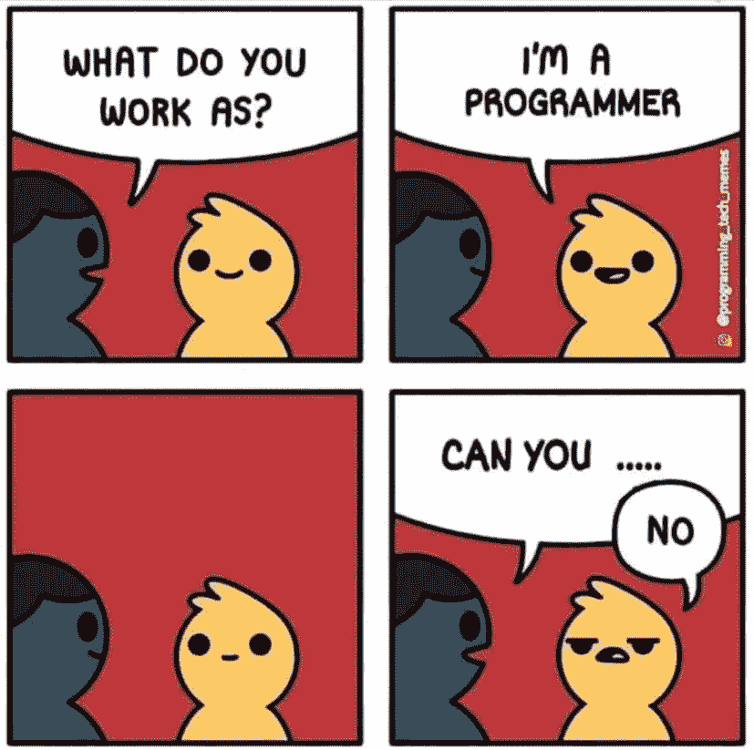
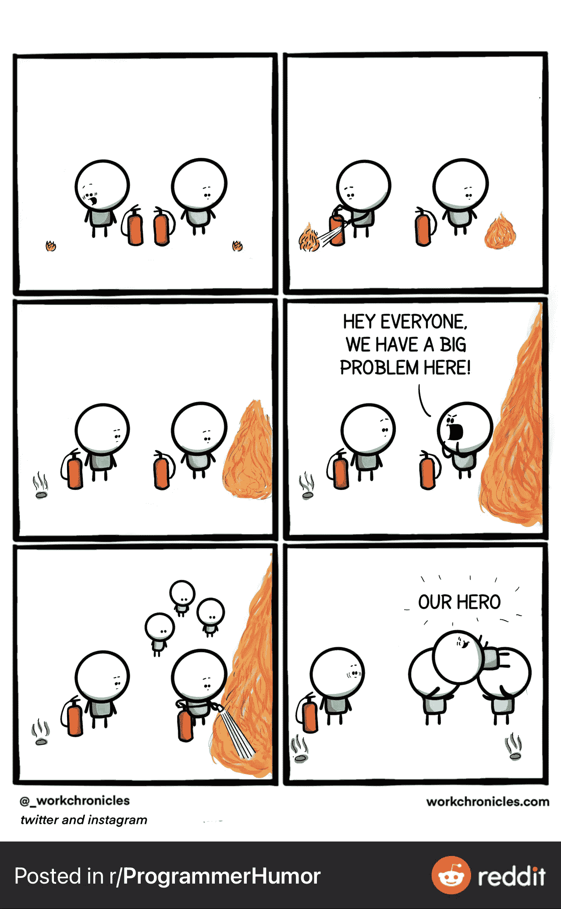
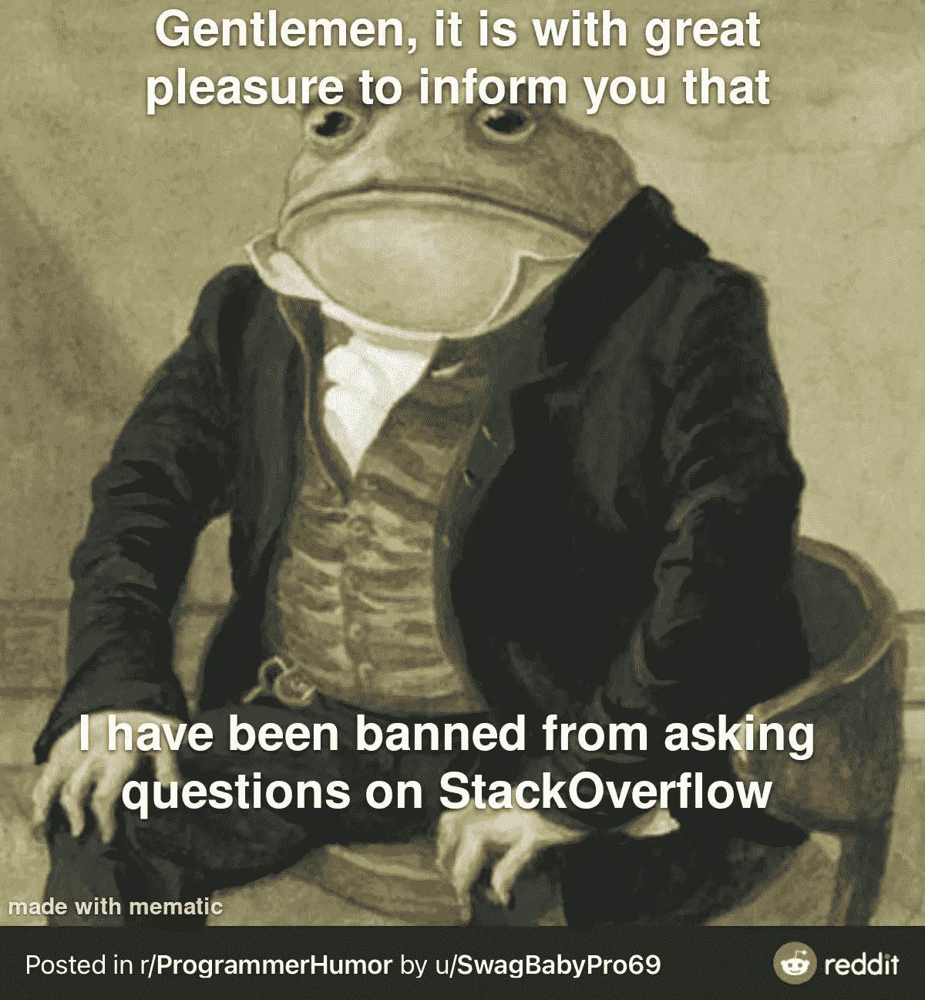

# 编写能让你发笑的笑话

> 原文：<https://levelup.gitconnected.com/programming-jokes-that-will-make-you-laugh-8898e62ca336>

## 可以和你日常工作生活联系起来的笑话

jovin kallis 在 [Unsplash](https://unsplash.com?utm_source=medium&utm_medium=referral) 上拍摄的照片

我们都喜欢笑话，尤其是当我们可以把它们与我们的日常生活和工作联系起来的时候。

在本文中，我整理了一些编程笑话，您可以将它们与您的日常工作联系起来。让我们一个接一个地看完它们，笑一笑，为你的一天打起精神😃

## 0.永远永远

灭霸可以快照 100 次，但错误仍然在我的代码:D

## 1.排除故障

调试不仅仅是在代码:D 中添加断点

## 2.每次 scrum 会议后

当经理询问您某项任务的状态时，您告诉他们将在 2 天内完成生产。

你知道这可能不会在两天内完成，但它会给你一些时间来解决问题😄

## 3.程序员的一生只有两个阶段

## 4.进展缓慢

进展慢还是进展吧？

## 5.这笑死我了，哈哈

嗯，寻求帮助的更好的方法是告诉他们你已经尝试过的事情，这表明你已经付出了足够的努力😉

## 6.当你知道，他们会说什么

两者之间总是各占一半:

“我有一个应用程序的想法”

或者

"你能帮我黑掉这个脸书账户吗？"😜

## 7.这个打击很大，哈哈

## 8.Stackoverflow 成就，嗯？

## 9.只是高级开发人员的事情...

## 额外笑话:

## 简而言之，程序员的生活

**感谢阅读！我希望你喜欢这篇文章，它让你开怀大笑。**

> *走之前……*

如果你喜欢这篇文章，并希望**关注**更多**精彩**文章，请考虑使用我的推荐链接[https://pralabhsaxena.medium.com/membership](https://pralabhsaxena.medium.com/membership)成为一名中级会员。

您可能还想阅读:

 [## 9 个终极编程笑话

### 程序员生活中的笑话，你可以与之相关

levelup.gitconnected.com](/9-ultimate-programming-jokes-aa4970492af4)  [## 让你捧腹大笑的终极编程笑话

### 你能理解的日常生活笑话

levelup.gitconnected.com](/ultimate-programming-jokes-that-will-make-you-lol-ef791b59d207)