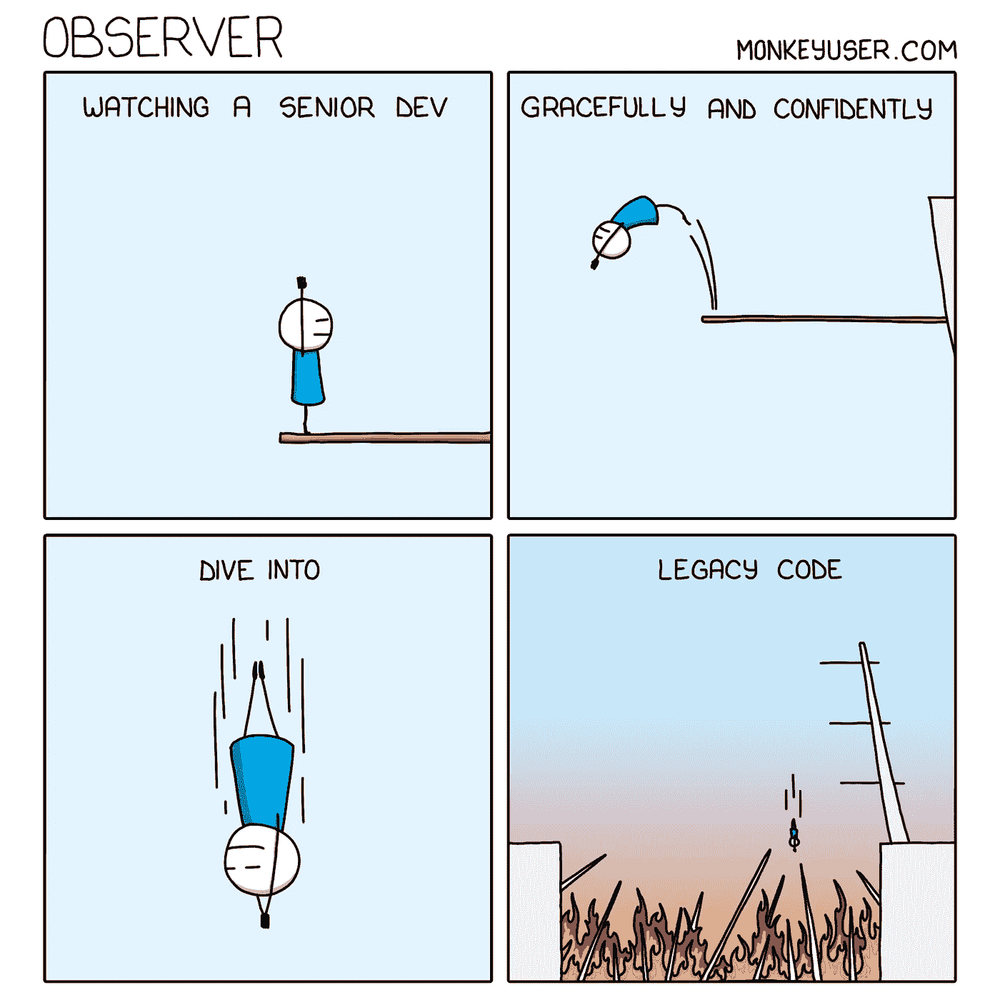
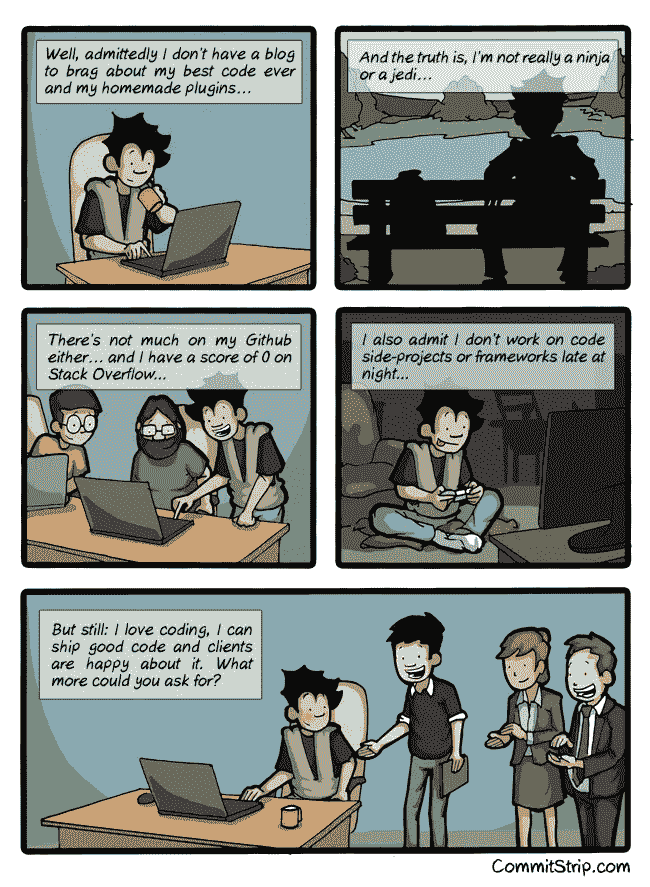
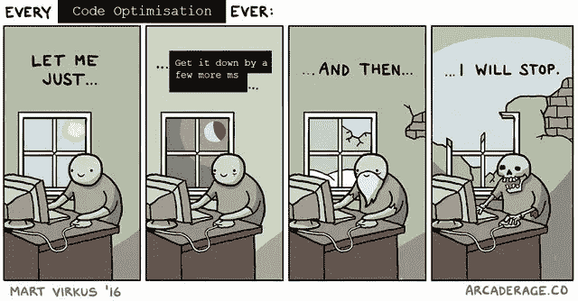
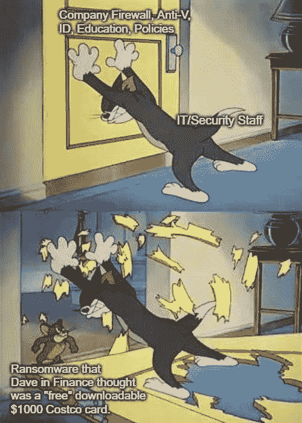
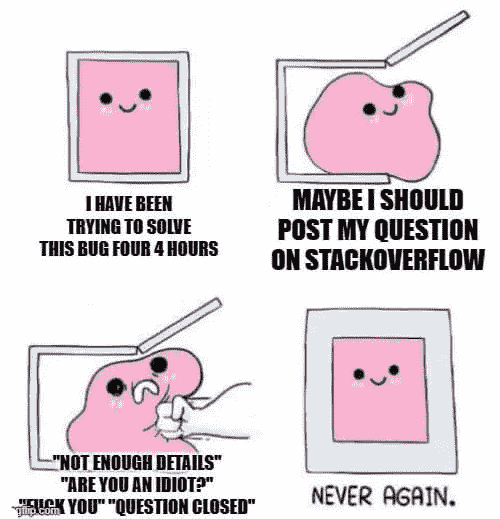
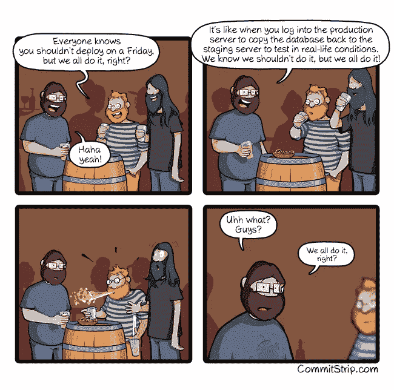
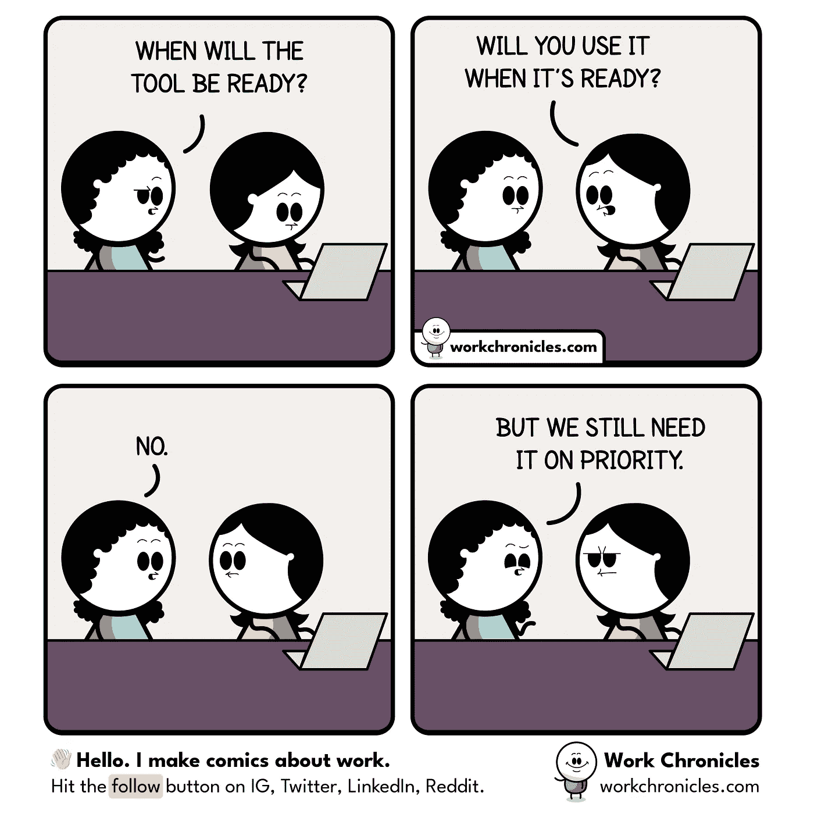
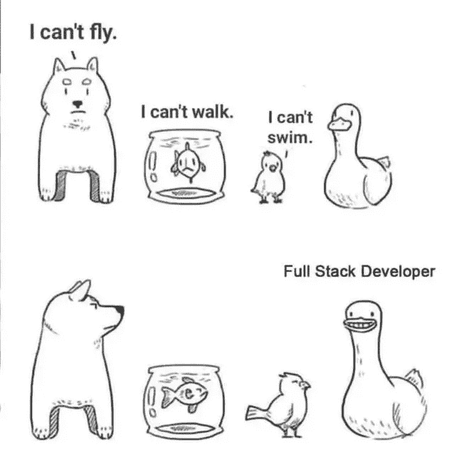

# 编写能让你发笑的笑话

> 原文：<https://levelup.gitconnected.com/programming-jokes-that-will-make-you-laugh-e22459cf2cea>

## 编写一些你会发现与日常生活相关的笑话

在 [Unsplash](https://unsplash.com?utm_source=medium&utm_medium=referral) 上由 [Rangarajan Ragunathan](https://unsplash.com/@ranga19?utm_source=medium&utm_medium=referral) 拍摄的照片

我们都喜欢笑话，尤其是当我们可以把它们与我们的日常生活联系起来的时候。编程不是程序员唯一擅长的事情，他们也有很强的幽默感。

在这篇文章中，我想出了一些笑话，你可以把它们和你作为程序员的日常工作联系起来。

振作你的一天，从一点欢笑开始😃

## 0.观察一个高级开发人员

## 1.我还能要求什么呢？:)

## 2.混合情绪

当你的代码没有经过适当的测试就投入使用时。你不知道它是会正常工作还是会失败，但你要冒这个险，:D

## 3.正则表达式入门

没有多少人喜欢正则表达式，但当你开始使用它们时，它们确实很有趣。不是吗？

## 4.优化您的代码

我们都知道这种优化代码的感觉。

## 5.IT/安全团队与免费下载

当 IT 和安全人员尽力保护您的系统安全，但您却中了一些免费计划的当，结果下载了一个包含病毒的文件😜

## 6.优先

修复漏洞从来都不是首要任务…

## **7。在 StackOverflow 上提问**

我们一生中都经历过一次，对吗？

## 8.该死…有点不对劲

## 9.那我们为什么还需要它？

## 奖金:

## 全栈开发人员:

**感谢阅读！我希望你喜欢这篇文章，它让你开怀大笑😄**

您可能还想阅读:

 [## 9 个终极编程笑话

### 程序员生活中的笑话，你可以与之相关

levelup.gitconnected.com](/9-ultimate-programming-jokes-aa4970492af4)  [## 让你捧腹大笑的终极编程笑话

### 你能理解的日常生活笑话

levelup.gitconnected.com](/ultimate-programming-jokes-that-will-make-you-lol-ef791b59d207) 

> *在你走之前……*

如果你喜欢这篇文章，并想继续关注更多精彩的文章，请考虑使用我的推荐链接[**https://pralabhsaxena.medium.com/membership**](https://pralabhsaxena.medium.com/membership)成为一名中级会员。

另外，你可以在这里免费订阅我的时事通讯: [Pralabh 的时事通讯](https://pralabhsaxena.medium.com/subscribe)。