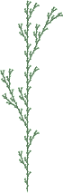

# 用 PostScript 编写 L 系统程序

> 原文：<https://levelup.gitconnected.com/programming-l-systems-in-postscript-3959abdfba90>

使用打印机运行递归函数


照片由 [Ridwan Meah](https://unsplash.com/@riddywankenobi?utm_source=unsplash&utm_medium=referral&utm_content=creditCopyText) 在 [Unsplash](https://unsplash.com/s/photos/dragon?utm_source=unsplash&utm_medium=referral&utm_content=creditCopyText) 上拍摄

# 这里有龙！


[龙曲线](https://en.wikipedia.org/wiki/Dragon_curve)是著名的分形。我第一次看到它是在我十几岁时读的一本(法语)书的封面上。然后我开始手绘美丽的龙。后来，我决定写一个程序来画曲线。这个程序是用帕斯卡语言写的。它成功了，画出了漂亮的龙。不幸的是，我已经丢失了它的源代码。今天我很想看看它，因为*程序没有使用递归*！我依稀记得是在一个大数组上进行反复迭代，具体细节不记得了。这一定是一段丑陋的代码…

# l 系统

多年后，我在网上发现了一个 [PostScript](https://www.adobe.com/products/postscript.html) 程序，可以画龙曲线。它激起了我足够的兴趣，让我学习 PostScript 来理解它。事实证明，PostScript 是一种成熟的(*用学究式的术语来说，是图灵完备的*)编程语言，打印机因此可以执行递归功能。

我无法理解 PostScript 程序中使用的算法。它似乎依赖于两个相互递归的函数`X`和`Y`，以及 45 度的旋转(尽管龙曲线中的所有角度都是直角)。一旦你清理了代码(这是可怕的，在递归调用之间共享全局变量)，它归结为:

```
X -> -FX++FY-
Y -> +FX--FY+
F ->
```

在使用表格或“乌龟图形”的地方:`-`代表*顺时针 45 度旋转*，`+`是*逆时针 45 度旋转*，`F`向前划一条线。

我认为这个算法很了不起——对于一个在相互递归的函数之间使用全局变量的人来说，这个算法实在太好了。在网上搜索了更多的龙曲线程序后，我在某处找到了上面的精确公式。它是 [*林登迈耶系统*](https://en.wikipedia.org/wiki/L-system) (L 系统)列表的一部分，该系统绘制了从经典分形(希尔伯特、科赫)到各种植物状图片的一切。

l 系统是由瑞典生物学家 Aristid Lindenmayer 发明的，他用 l 系统来模拟植物的生长。他最终在生物学和计算机科学期刊上发表了关于它们的文章。l-系统已经扩展到 3D，并广泛应用于植物生物学和计算机图形学。参考书似乎是 Przemyslaw Prusinkiewicz 和 Aristid Lindenmayer 的《植物的算法之美》。尽管本页使用的所有方程都是在网上找到的，但我强烈怀疑它们来自这本书。(我只能说，它们肯定不是我的。)

# 作为 L 系统的龙曲线

使用上面的重写规则集(从`X`开始)并迭代地应用它们，下面是你得到的结果(从左到右读一条曲线，水平开始):


如果你“圆角”，你最好看看曲线是怎么画的。在这里，在订单 7:


如果对你来说它看起来更像法国狮子狗而不是龙，那是因为你没有想象力。

# 后记中的龙曲线

现在，这是完成这项工作的 PostScript 程序。首先，告诉打印机我们是一个 PostScript 文件:

```
%!PS
```

然后，指定顺序(迭代次数)。20 岁以上的人，可能永远也画不出来了:

```
/N 7 **def**
```

这里是计算的核心，函数`X`和`Y`。顺序值(或深度)在堆栈上，对于 4 个函数调用，顺序值递减 1 并复制 4 次。当订单为零时，停止；否则，根据以下等式进行递归调用:

```
/X {
  **dup** 0 **ne**
  {1 **sub** 4 {**dup**} **repeat** - F X + + F Y -}
  **if** **pop**
} **def**

/Y {
  **dup** 0 **ne**
  {1 **sub** 4 {**dup**} **repeat** + F X - - F Y +}
  **if** **pop**
} **def**
```

函数`F`什么也不做，只是消失了，除了在最后，当顺序为 0 时，它画了一条线:

```
/F {
  0 **eq** { 10 0 **rlineto** } **if** 
} **bind** **def**
```

功能`-`和`+`按预期左右旋转 45 度:

```
/- { -45 **rotate** } **bind** **def**
/+ { 45 **rotate** } **bind** **def**
```

确保每一行都连接得很好:

```
1 **setlinejoin**
1 **setlinecap**
```

最后，决定从哪里开始，并在每次迭代中用两个因子的平方根来缩放绘图，这样无论顺序如何，它总是相同的大小:

```
**newpath**
220 180 **moveto**
50 N { 2 **sqrt** **div** } **repeat** **dup** **scale**
```

将绘图旋转到横向，然后开始:

```
90 **rotate**
N X
```

最后，自豪地展示结果页面:

```
**stroke**
**showpage**
```

整个 PostScript 程序可以在[这里](https://gist.github.com/charpov/0554546ca5aabe03831917943f261c72)下载。

# 更多 L 系统

在我理解我发现的这个龙曲线程序的奥秘的过程中，我遇到了许多 L 系统方程。其中一些是经典的分形，比如希尔伯特曲线:


```
angle 90
START -> X
X -> -YF+XFX+FY-
Y -> +XF-YFY-FX+
F ->
```

或者[科赫的雪花](https://en.wikipedia.org/wiki/Koch_snowflake):


```
angle 60
START -> +F--F--F
F -> F+F--F+F
```

但是我最喜欢的是植物类的图片。(毕竟，林登迈尔*是*生物学家。)我发现令人着迷的是它们彼此之间有多么不同，尽管它们是基于相似的方程组。下面是我最喜欢的一些:


```
angle 22.5
START -> F
F -> FF-[-F+F+F]+[+F-F-F]
```


```
angle 22.5
START -> X
X -> F-[[X]+X]+F[+FX]-X
F -> FF
```


```
angle 20
START -> F
F -> F[+F]F[-F][F]
```


```
angle 25
START -> X
X -> F[+X][-X]FX
F -> FF
```


```
angle 20
START -> X
X -> F[+X]F[-X]+X
F -> FF
```



```
angle 25
START -> F
F -> F[+F]F[-F]F
```


```
angle 25
START -> Y
X -> X[-FFF][+FFF]FX
Y -> YFX[+Y][-Y]
F ->
```


```
angle 30
START -> F
F -> F[+F[+F][-F]F][-F[+F][-F]F]F[+F][-F]F
```

我还没有提到`[`和`]`，它们是用来分支的。基本上，`]`会把你带回图纸中相应的`[`发布的地方。它们很容易在 PostScript 中使用`gsave`和`grestore`实现，将图形上下文推入堆栈或从堆栈中弹出。

# PostScript 中的 l-系统

这一页上的植物都是使用[这个 PostScript 程序](https://gist.github.com/charpov/30964b00bf3bcd7765283ae74f3abb58)通过简单地修改等式渲染的(`[`和`]`被称为`B`和`E`，因为方括号是 PostScript 语法的一部分)。这个程序比上面的龙曲线稍微复杂一点，但这主要是因为颜色的使用，也因为它是通用的，可以处理不同的方程。

由于从来不清楚的原因(可能涉及超出我们理解的宇宙力量)，这个用 PostScript 编程 l-系统的实验由*zpravodaj eskoslovenského sdrueníuživatelůtexu*(2012，第 1 卷)以标题*programujeme l-systémy v postscriptu*发表。这篇文章包含了更多的技术细节，尽管标题是捷克语，却是用英语写的。