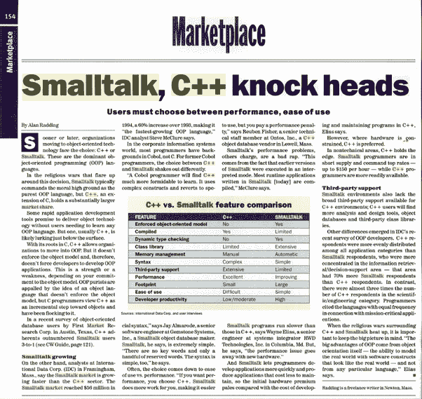
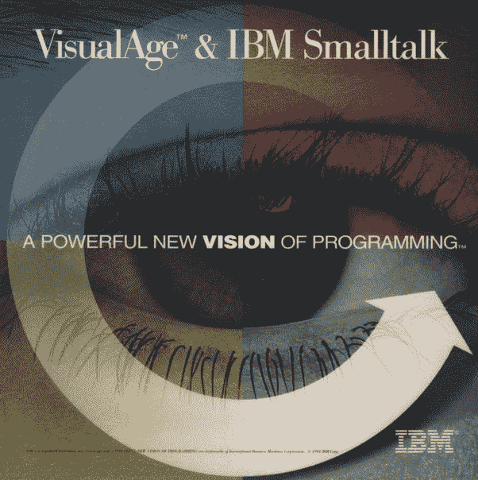

# 编程语言评论:Smalltalk

> 原文：<https://levelup.gitconnected.com/programming-language-review-smalltalk-e33fad5aa79a>

malltalk 是一种备受推崇的面向对象编程语言，它起源于 20 世纪 70 年代的 PARC 施乐公司。它最初是为向年轻人教授编程而设计的。

这种语言的主要特点是:

1.  它极其简单——[语法完全基于对象之间的消息传递](https://qr.ae/TWtgyr)。
2.  其面向对象的纯粹性和一致性— [甚至逻辑控制结构都是用对象实现的](https://qr.ae/TWtgyr)。
3.  它的*实时编码*能力是内置在语言中的！
4.  它的反射性质提供了强大的元编程能力。
5.  它的系统映像，类似于 VMware 和 VirtualBox 等操作系统虚拟化软件中的系统映像。

根据 Namcook Analytics 进行的一项研究[，这些独特的品质使 Smalltalk 成为世界上最具生产力的通用编程语言。](http://www.ifpug.org/wp-content/uploads/2017/04/IYSM.-Thirty-years-of-IFPUG.-Software-Economics-and-Function-Point-Metrics-Capers-Jones.pdf)

Smalltalk 有着丰富而传奇的历史。想想 Smalltalk 取得的成就…

*   Smalltalk 向世界介绍了 Java 和 Ruby 所基于的语言虚拟机*。*
*   Smalltalk 开创了 JIT(实时)编译。
*   Smalltalk 诞生了第一个现代 IDE(集成开发环境)，它包括一个文本编辑器、一个类浏览器、一个对象检查器和一个调试器。
*   Smalltalk 是第一个支持实时编程和高级调试技术的图形语言工具，例如以非常用户友好的格式在执行过程中进行动态检查和代码更改*。*
*   从 Smalltalk-80(1980 年)开始，它就有了一流的函数和闭包，奇怪的是，这使得 small talk 非常适合函数式编程。
*   Smalltalk 引入了软件架构模式 MVC(模型-视图-控制器)。
*   在很大程度上，Smalltalk 为我们提供了测试驱动开发(TDD)和极限编程(XP)，这两者在当今的标准敏捷实践中都非常有影响力。
*   Smalltalk 让“鸭子打字”这个词家喻户晓。
*   Smalltalk 率先开发了对象数据库，GemStone/S 就是一个很好的例子。
*   Smalltalk 给了我们第一个重构浏览器。
*   Smalltalk 在开发图形用户界面(GUI)和“所见即所得”(WYSIWYG)用户界面方面发挥了重要作用。
*   史蒂夫·乔布斯受到施乐 PARC 公司的 GUI 和 WIMP(窗口、图标、菜单、指针)的启发，彻底调整了苹果的战略；GUI 是 Smalltalk 工作的直接产物。

当然，Smalltalk 是第一种推广面向对象编程的语言。[艾伦·凯关于面向对象的概念绝对是开创性的。](https://www.quora.com/Why-is-OOP-Object-Oriented-Programming-the-standard-paradigm-for-most-software/answer/Richard-Kenneth-Eng)

从那以后，Smalltalk 直接启发了许多其他 OOP 语言，包括 Objective-C、Ruby、Python、PHP、Perl、Erlang、CLOS、Dart、Groovy 和 Scala。苹果公司甚至为麦金塔电脑创造了一个 Smalltalk。

尤其是 Objective-C 在 IT 行业产生了巨大的影响。它的语法本质上是 C 和 Smalltalk 的结合。

Objective-C 被用来为史蒂夫·乔布斯的下一个计算机公司编写 NeXTStep 操作系统。NeXTStep 最终演变成了 macOS，Objective-C 自此被用于编写大量的 iOS 应用程序。

尽管它很简单，尽管它是一种教学语言，Smalltalk 却有着惊人的通用性。它几乎可以用于任何事情！

*   感谢[海边](http://seaside.st/)、[茶壶](https://github.com/zeroflag/Teapot)和[法老](https://pharojs.github.io/)
*   手机——感谢 [PharoJS](https://pharojs.github.io/) 和 [Apache Cordova](https://cordova.apache.org/)
*   数据科学——感谢[博学家](https://github.com/PolyMathOrg/PolyMath)和 [Roassal](http://agilevisualization.com/)
*   机器学习和[神经网络处理](https://medium.com/towards-data-science/single-layer-perceptron-in-pharo-5b13246a041d) — Pharo 也有 TensorFlow 的语言绑定
*   [物联网](https://github.com/pharo-iot/PharoThings)和嵌入式编程
*   机器人学
*   [虚拟现实](http://www.opencobalt.net/)(例如， [3D 沉浸式协作](http://www.3dicc.com/)和[泰雷兹虚拟现实](https://www.youtube.com/watch?v=b4nNtN7XBi8))
*   Smalltalk 甚至可以用来[编写虚幻游戏引擎](https://youtu.be/6fsUKW8-bBE)
*   企业商务计算

JP 摩根用 Smalltalk 编写了他们的大型金融风险管理系统，名为 Kapital。

[Orient Overseas Container Lines 使用 Smalltalk 开发其 IRIS-2 航运管理系统。](http://www.cincomsmalltalk.com/main/successes/shipping/orient-overseas-container-lines-ltd/)

在 21 世纪初，美国联合军方使用 Smalltalk 编写了一个名为 JWARS 的*百万行*战斗模拟程序。它实际上胜过了美国空军用 C++编写的类似程序 STORM。这本身就是语言能力的惊人证明。

在我的祖国，Smalltalk 被加拿大国家密码机构通信安全机构(CSE)所使用。

Smalltalk 在 20 世纪 80 年代因《字节》杂志的这张著名封面而声名鹊起:

90 年代，Smalltalk 成为继 C++之后最流行的 OOP 语言。根据 1995 年的 IDC 报告，OOP 语言的市场份额是:

1.  C++ — 71.3%
2.  **Smalltalk — 15.1%**
3.  目标-C — 5.7%
4.  帕斯卡对象— 4.2%
5.  接近 2.5%
6.  埃菲尔铁塔——1.1%
7.  所有其他— 0.2%

这是《计算机世界》1995 年 11 月 6 日的一页，展示了 Smalltalk 和 C++之间的争斗:

Smalltalk 非常适合商业应用，以至于 IBM 选择它作为其 VisualAge enterprise 计划的核心，以取代 COBOL:

时至今日，Smalltalk 依然蒸蒸日上。有三个主要的商业 Smalltalk 供应商和不少于七个开源 small talk！！！

*   [Pharo](http://pharo.org/)
*   [吱吱声](https://squeak.org/)
*   [Cuis Smalltalk](https://cuis-smalltalk.org/)
*   [GNU Smalltalk](http://smalltalk.gnu.org/)
*   [海豚闲聊](http://www.object-arts.com/dolphin7.html)
*   [琥珀闲聊](https://amber-lang.net/)
*   [轰走闲聊](https://gitlab.com/hoot-smalltalk/hoot-smalltalk#hoot)

Pharo 无疑是最活跃、最激动人心的闲聊者。

加入这场革命，让编程世界变得更加高效。

从 1 到 10，我给 Smalltalk 一个简单的 10 分！少校竖起大拇指！