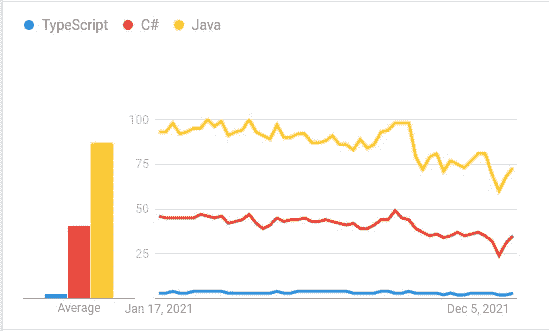

# 开发人员需要一直学习的编程语言

> 原文：<https://levelup.gitconnected.com/programming-languages-that-developers-need-to-learn-all-the-time-4ba9fe363b94>

## 编程语言有成千上万种，但我们需要掌握哪种语言呢？

奥斯卡·伊尔迪兹在 [Unsplash](https://unsplash.com/s/photos/coding?utm_source=unsplash&utm_medium=referral&utm_content=creditCopyText) 上拍摄的照片，由 Canva 编辑。

世界上有成千上万种编程语言，但在现代软件开发行业中，只有大约二十种编程语言相互竞争。此外，一些程序员出于娱乐和实验目的开发了类似[表情代码](https://github.com/emojicode/emojicode)、[奶牛](https://github.com/BigZaphod/COW)的表情符号。如今，流行的编程语言，如 Go、JavaScript、Python、Java、C#和 C++主导着软件开发市场。

程序员通常在他们的软件开发生涯中掌握各种编程语言。例如，如果你开始从事一个基于 Flutter 的移动项目，你必须学习 Dart——如果你有一个编写原生 Flutter 插件的任务，那么你必须学习 Swift/Objective-C 和 Kotlin/Java。在软件开发生涯中，每个程序员都会思考这样的问题:一直只学习一种语言可以吗？学什么编程语言最好？我需要掌握多少门语言？

我学习了十多种编程语言，包括目前已经过时的语言，比如 Pascal 和 Visual Basic。在这个故事中，我将解释为了成为一名优秀的软件开发人员，你需要学习什么类型的语言——在动态软件开发行业中保持最新。

# 学习一门语言来理解计算机

说到编程，我们都和计算机打交道。计算机是一种数字设备，只能理解 CPU 制造商定义的一组二进制模式。您编写的每一行代码最终都会作为 ISA(指令集架构)操作码语句执行。我在下面的故事中进一步解释了这些内部事实。

 [## 每个程序员都应该知道的 5 个计算机硬件概念

### 多亏了这些概念，你的计算机执行了你编写的程序

levelup.gitconnected.com](/5-computer-hardware-concepts-that-every-programmer-should-know-32711c759dc0) 

现在，几乎所有流行的编程语言都用人类友好的语法隐藏了硬件特定的概念。例如，你永远不会获得 Python 或 JavaScript 的低级编程经验。低级编程经验有助于我们了解计算机如何工作，以及操作系统如何公开内核函数。理解内部是每个成功程序员背后的秘密。

学习一门低级编程语言，了解内部。汇编语言很好，但是它没有为理论计算算法提供足够的抽象。C 编程语言不是一种非常低级的语言，但它是理解编程语言如何触及物理硬件层的最佳语言。由于这个原因，大多数大学以 C 开始计算机科学教学大纲。如果你需要从稍微低级的编程方面接触高级编程，C++是下一步。

# 选择一种语言来做几乎任何你需要的事情

程序员从事各种软件开发项目。例如，我们开发移动应用、桌面软件、web 应用、CLI 程序、实用程序脚本和 DevOps 工作流。你不需要学习很多编程语言来做所有这些事情。由于现代开源创新，现在你可以选择一种编程语言来构建任何东西。这些开源项目帮助编程语言进入不同的软件开发行业。

例如，Node.js 项目帮助 JavaScript 从浏览器沙箱中走出来。另外， [Kivy](https://github.com/kivy/kivy) 框架使得 Python 在移动开发者社区中流行起来。选择一种你可以用来构建任何东西的语言，这样你就可以自信地从事任何软件项目。

Python 和 JavaScript 现在是通用编程语言——它们可以在任何操作系统上运行，并帮助您构建任何软件开发项目。与此同时，Go 社区努力通过令人印象深刻的创新将 Go 提升到这个水平，如 [TinyGo 和 Go mobile](https://betterprogramming.pub/6-go-use-cases-which-are-good-to-know-a57ab99440ce) 。

# 学习一门语言来构建企业系统

大多数程序员从事自动化业务流程的面向企业的软件项目。例如，您可能使用一个服务于数百万用户的电子商务应用程序。软件架构师通常选择稳定的、静态类型的、高性能的、开发人员友好的、本地面向对象的编程语言来构建企业级软件系统。

企业软件系统无疑是复杂的，需要稳定的技术依赖。因此，出于稳定性、面向业务的设计、安全性和内存安全的考虑，许多软件开发团队通常会选择 Java 或 C#。如今，许多基于 web 的企业开发团队倾向于使用 TypeScript，并使 JavaScript 成为构建业务级应用程序的候选。看看下面的谷歌趋势图，分析一下这些语言在谷歌搜索中的受欢迎程度。

Java、TypeScript、C#的搜索兴趣， [Google Trends](https://trends.google.com/trends/explore/TIMESERIES/1642444200?hl=en-US&tz=-330&cat=31&q=TypeScript,C%23,Java&sni=3) 作者截图。

学习 Java 或 C#来构建企业软件系统。学习 Java 或 C#是提高设计模式和 OOP(面向对象编程)技能的好方法。

# 为未来学习一门语言

目前流行的编程语言虽然老了，但还没有过时。Java 已经 27 岁了，但仍然为许多企业软件项目提供动力，JavaScript 已经 26 岁了，但仍然为整个互联网提供动力，C++已经 37 岁了，但程序员仍然使用它来构建软件框架(Flutter、electronic、React Native 和 Neutralinojs 大量使用 C++)。

这些语言足够强大，可以存在几十年。但是，新的编程语言经常与当前稳定的编程语言竞争。例如，Go 提供了最少的语法和有前途的性能——在不到十年的时间里赢得了开发者的心。另一方面，在不到十年的时间里，由于内存安全，Rust 也成为了 C++的首选。

学习一门面向未来的编程语言总是一个明智的决定，因为我们无法预测当前稳定的语言会发生什么。Go 和 Rust 语言是用现代语法为未来设计的——牢记低级编程。比如围棋，给你高级编程和低级编程的感觉——同时。从 Go 和 Rust 中挑选你最喜欢的。你可以从下面的故事中了解更多关于 Go 语言的未来派设计。

 [## Golang 教给所有程序员的 5 条经验

### 你可能不会用 Go 编程，但是这些经验对你喜欢的编程语言是有效的

levelup.gitconnected.com](/5-lessons-that-golang-teaches-to-all-programmers-71b332504cf2) 

# 找到你喜欢的语言并掌握它

记得你在大学的时候或者你第一次学习计算机科学概念的时候——你有最喜欢的理论话题。同样，我们都有喜欢的编程语言。当我们用这些编程语言编写代码时，我们感到自信、愉快和快乐。程序员通常喜欢几种特定的编程语言，因为它们的编码风格、友好的开发环境、语法、标准库、特性、效率和社区支持。

首先，学习一门语言来理解计算机。c 语言无疑是与计算机变得友好的最佳语言。如果你需要一门没有限制的高级语言，那就学习 C++。接下来，学习一门(或两门)你可以用来构建任何软件程序的语言。这将有助于你高效地完成你需要的任何工作。你确实可以把 Python 和 JavaScript 归入这一类。

接下来，学习 Java、C#或 TypeScript 之类的语言来构建企业级软件系统，这样你就可以通过掌握设计模式和 OOP 基础来理解和贡献业务编程。为了未来，要么学习 Go，要么 Rust 这两种语言都被设计为像 C++一样存在很多年。最后，如果你统计这些类别，你会注意到你需要学习至少四种语言来涵盖我们讨论的每一个方面。但是，没有限制——学习多种语言，变得无所不能。

# 分级编码

感谢您成为我们社区的一员！[订阅我们的 YouTube 频道](https://www.youtube.com/channel/UC3v9kBR_ab4UHXXdknz8Fbg?sub_confirmation=1)或者加入 [**Skilled.dev 编码面试课程**](https://skilled.dev/) 。

 [## 编写面试问题+获得开发工作

### 掌握编码面试的过程

技术开发](https://skilled.dev)