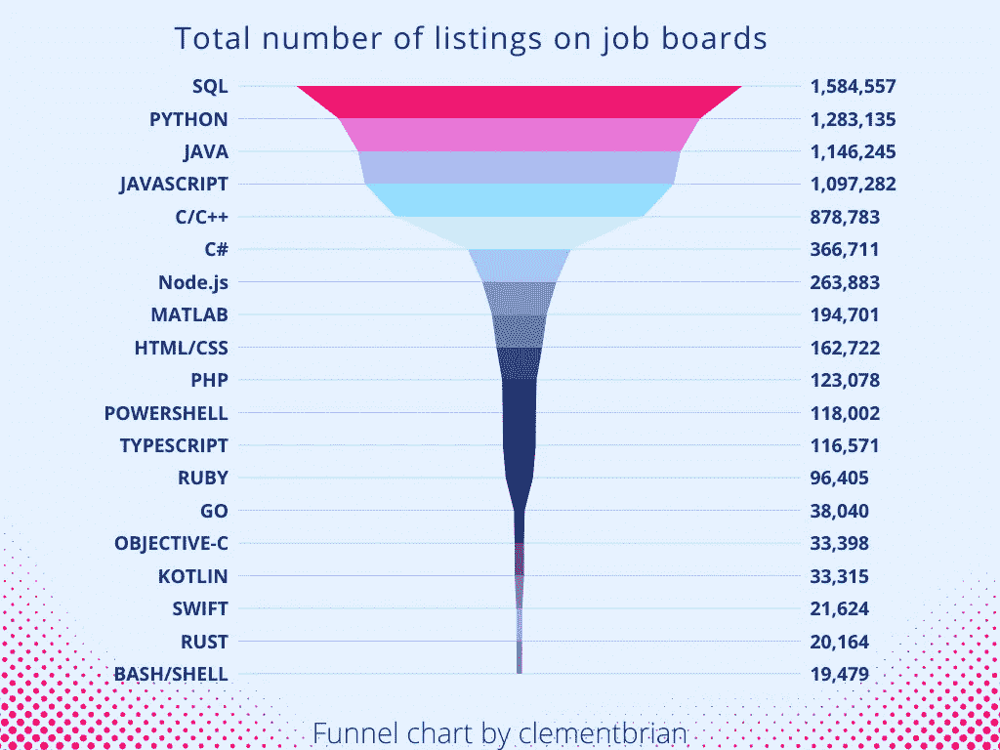
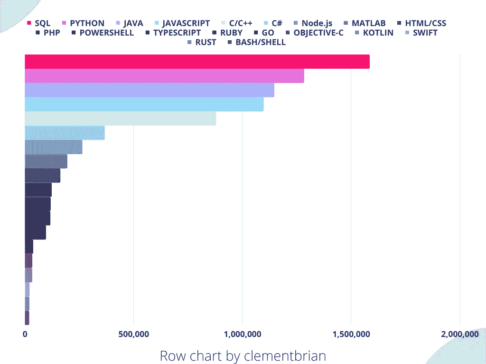
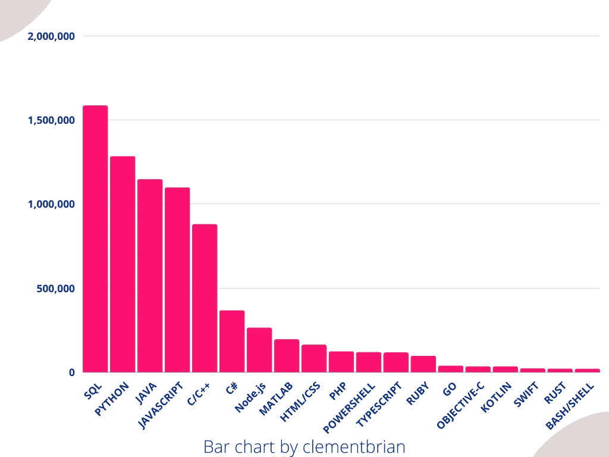
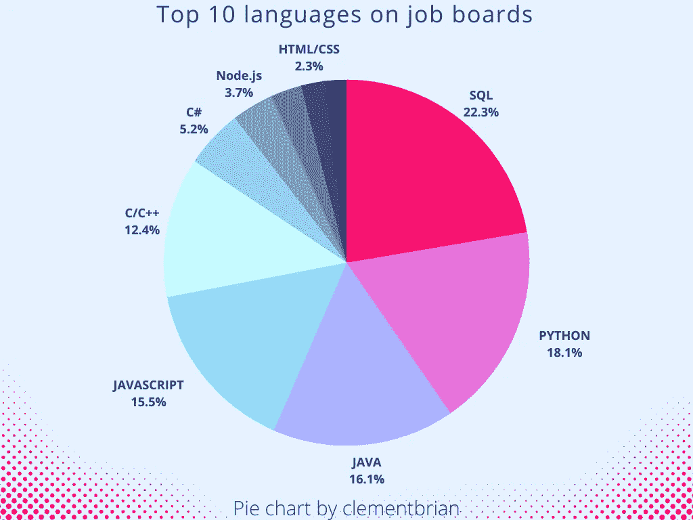

# 工作列表数量最多的编程语言(事实上，Glassdoor、LinkedIn 和 Upwork)

> 原文：<https://levelup.gitconnected.com/programming-languages-with-the-highest-amount-of-listings-indeed-glassdoor-linkedin-and-upwork-549a1c4618be>

## 截至 2022 年最受欢迎的编程语言

杰佛森·桑多斯在 [Unsplash](https://unsplash.com/s/photos/programmer?utm_source=unsplash&utm_medium=referral&utm_content=creditCopyText) 上拍摄的照片

知道拥有最多清单的编程语言是显而易见的。本质上，你会知道哪种编程语言最受欢迎。

听起来很甜蜜，要完全理解市场，你必须分析需求和供给。

在这篇文章中，我们将着眼于事物的需求方面。我们将研究哪种编程语言在不同的工作论坛和自由职业网站上拥有最高的列表数量。

# 方法:我们将如何做

首先我们来看一下 [TIOBE 指数](https://www.tiobe.com/tiobe-index/)、[流行语言栈溢出列表](https://insights.stackoverflow.com/survey/2021#overview)、 [PYPL 指数](https://pypl.github.io/PYPL.html)。这将列出 15 种最流行的语言。然后我们会在 indeed、glassdoor、Linkedin、Upwork 等网站上搜索这些语言。

我选择这种方法来消除不太流行的编程语言。这样可以节省时间，给我们留下相关的语言来查找。

我们想根据不同工作论坛上的列表数量，对最受欢迎的 15 种语言进行排名。

其余的将被忽略。我们将使用这些来确定我们的方法在逻辑上是否正确。这是通过挑选一些不像 control 那样流行的其他随机语言来实现的。

## 来自 TIOBE、Stalk Overflow 和 PYPL 的前 15 种语言排名不分先后

1.  计算机编程语言
2.  Javascript (Node.js 和 Typescript 需要单独考虑)
3.  Java 语言(一种计算机语言，尤用于创建网站)
4.  C/C++
5.  C#
6.  服务器端编程语言（Professional Hypertext Preprocessor 的缩写）
7.  SQL(我知道你们中的一些人会说 SQL 不是编程语言)
8.  去
9.  稀有
10.  矩阵实验室
11.  迅速发生的
12.  科特林
13.  装配
14.  VBA
15.  目标-C

## 奖金支票

*   锈
*   红宝石
*   HTML/CSS
*   Bash/Shell
*   Powershell

以上语言和技术都进行了检查。

# 结果呢

每种语言都在不同的工作论坛和自由职业网站上列出了它的数量。

## **Python**

事实上= 218，173 份工作

玻璃门= 72，294 份工作

LinkedIn = 877，403 份工作

弹性工作= 2，075 个工作

简单雇佣= 97，554 个职位

向上工作=15，327 个工作

自由职业者= 309 份工作

Total = **1，283，135 个**列表

## Java Script 语言

的确= 149，863 个工作岗位

玻璃门= 51，597 份工作

LinkedIn = 791，445 份工作

弹性工作= 1，858 个工作

简单雇佣= 62，904 个职位

向上工作= 39，410 个工作

自由职业者= 205 份工作

total =**1，097，282 件**物品

## 以打字打的文件

实际上= 30，604 个工作岗位

玻璃门= 7847 份工作

LinkedIn = 64275 份工作

弹性工作= 473 个工作

简单雇佣= 9754 个职位

向上工作= 3，572 个工作

自由职业者= 46 份工作

总计=**116571**清单

## 节点. js

事实上= 30，541 个工作岗位

玻璃门= 7136 份工作

LinkedIn = 206566 份工作

弹性工作= 382 个工作

简单雇佣= 10，599 个职位

向上工作= 8，579 个工作

自由职业者= 81 份工作

总计= **263，883** 清单

## Java 语言(一种计算机语言，尤用于创建网站)

的确= 176758 个工作岗位

玻璃门= 46506 份工作

LinkedIn = 844，147 份工作

弹性工作= 1，481 个工作

简单雇佣= 68，628 份工作

向上工作= 8，515 个工作

自由职业者= 210 份工作

total =**1，146，245 个**列表

## C

c 是一个相当宽泛的关键词。为了解决这个问题，我尝试使用关键字 *C developer* ，但是一些过滤器再次显示出包含单词 *developer 的结果。*

这让我抓耳挠腮。很难准确地找到 C 类工作。不管怎样，在大多数清单中，C 经常与 C++捆绑在一起。C++和 C#的结果通常会指导我们 C 语言工作总体上有多受欢迎。

## C++

的确= 89808 个工作岗位

Glassdoor =(搜索不允许+符号)

LinkedIn = 745973 份工作

弹性工作= 48 个工作

简单雇佣= 39，983 个职位

向上工作= 2，718 个工作

自由职业者= 253 份工作

Total = **878，783** 列表

## C#

的确= 101458 个工作岗位

玻璃门= 34，393 份工作

LinkedIn = 179830 份工作

弹性工作= 65 个工作

简单雇佣= 46，666 个职位

向上工作= 3，982 个工作

自由职业者= 317 份工作

Total = **366，711 个**列表

## 服务器端编程语言（Professional Hypertext Preprocessor 的缩写）

的确= 19001 个工作岗位

玻璃门= 9536 份工作

LinkedIn = 66199 份工作

弹性工作= 345 个工作

简单雇佣= 9935 个职位

向上工作= 17，686 个工作

自由职业者= 376 份工作

Total = **123，078 个**列表

## 结构化查询语言

事实上= 203961 个工作岗位

玻璃门= 86，231 份工作

Linkedln = 1，182，629 份工作

弹性工作= 2，665 个工作

简单雇佣= 102，059 个职位

向上工作= 6，808 个工作

自由职业者= 204 份工作

总计=**1584557 份**清单

## 去

Go 也是一个宽泛的关键词，会带来不良结果。使用的关键字是 Golang。

的确= 9049 个工作岗位

玻璃门= 2472 份工作

LinkedIn = 22，266 份工作

弹性工作=232 个工作

简单雇佣=3，333

向上工作=678 个工作

自由职业者=10 份工作

total =**38，040 个 T25 列表**

## 稀有

R 也是一个宽泛的关键词。寻找相关性高的工作有点困难。

## 矩阵实验室

的确= 17881 个工作岗位

玻璃门= 9059 份工作

LinkedIn =155，145 份工作

弹性工作=40 个工作

简单雇佣= 12，019 个职位

向上工作= 519 个工作

自由职业者= 38 份工作

总计= **194，701** 清单

## 迅速发生的

Swift 在一些求职网站上也是一个宽泛的关键词。我只列出了相关结果。

确实=宽泛的关键词。

Glassdoor = Broad 关键字。

LinkedIn = 19734 份工作

弹性工作=338 个工作

SimplyHired = Broad 关键字。

向上工作= 1，502 个工作

自由职业者= 50 份工作

总计= **21，624** 个清单

## 科特林

的确= 9966 个工作岗位

玻璃门= 2550 个工作岗位

LinkedIn = 16064 份工作

弹性工作= 167 个工作

简单雇佣= 3，407 份工作

向上工作= 1，138 个工作

自由职业者= 23 份工作

total =**33，315 个**列表

## 目标-C

确实=宽泛的关键词。

玻璃门= 25，384 份工作

LinkedIn = 7,192 份工作

Flexjobs = Broad 关键字。

SimplyHired = Broad 关键字。

向上工作= 723 个工作

自由职业者= 99 份工作

总计=**33398**清单

## 锈

的确= 9302 个工作岗位

玻璃门= 2825 份工作

LinkedIn = 7431

弹性工作= 83 个工作

SimplyHired = Broad 关键字。

向上工作= 508 个工作

自由职业者= 15 份工作

总计= **20，164** 清单

## 红宝石

事实上= 32，272 个工作岗位

玻璃门=10，102 份工作

LinkedIn = 39165 份工作

弹性工作= 600 个工作

简单雇佣= 13，105 份工作

向上工作=1，149 个工作

自由职业者= 14 份工作

total =**96，405 个**列表

## HTML/CSS

的确= 42540 个工作岗位

玻璃门= 18027 份工作

LinkedIn = 69132 份工作

弹性工作= 1，017 个工作

简单雇佣= 19994 个职位

向上工作= 11，668 个工作

自由职业者= 344 份工作

Total = **162，722** 列表

## Bash/Shell

的确= 4806 个工作岗位

玻璃门= 2189 份工作

LinkedIn = 9718 份工作

弹性工作= 17 个工作

简单雇佣= 2，406 个职位

向上工作= 309 个工作

自由职业者= 34 份工作

Total = **19，479** 个列表

## Powershell

事实上= 25，167 份工作

玻璃门= 12350 个工作岗位

LinkedIn = 66577 份工作

弹性工作= 118 个工作

简单雇佣=13，541 个职位

向上工作= 242 个工作

自由职业者= 7 份工作

Total = **118，002** 列表

从上一节提到的语言中，有些语言很难获得高度相关的结果。即 C 和 Go。大会和 VBA 也被证明是困难的，所以我没有把他们包括在结果中。

在某些情况下，高度相关的结果只能从少数几个工作公告板上获得。不太相关的结果被排除。

在解释结果时，我们将考虑所有这些因素。

# 理解数据

在我们解释数据之前，我们首先需要理解它。

以下是从列表数量最多的语言到列表数量最少的语言的排名。

1.  SQL ( **1，584，557** 列表)
2.  Python ( **1，283，135** 列表)
3.  Java **(1，146，245 个**列表)
4.  Javascript ( **1，097，282** 列表)
5.  C/C++ ( **878，783** 清单)——缺少 glassdoor 清单。
6.  C# ( **366，711** 清单)
7.  Node.js ( **263，883** 列表)
8.  MATLAB(**194701**工作)
9.  HTML/CSS ( **162，722** 列表)
10.  PHP ( **123，078** 清单)
11.  Powershell ( **118，002** 列表)
12.  打字稿( **116，571** 清单)
13.  Ruby ( **96，405** 列表)
14.  Go ( **38，040** 列表)——*Golang*是使用的关键字。 *Go* 作为一个关键词竟然如此宽泛。它吸引了不太相关的结果。
15.  Objective-C ( **33，398** 列表)—缺少真正的、灵活的工作和简单的雇佣列表。关键字 *objective-C* 吸引了不太相关的结果。
16.  科特林( **33，315** 列表)
17.  Swift ( **21，624** 清单)——缺乏真正的、Glassdoor 和简单租用的清单。关键字 *swift* 吸引了不太相关的结果。
18.  Rust ( **20，164** 清单)——缺少简单租赁的清单。
19.  Bash/Shell ( **19，479** 列表)

# 表示和解释数据

尽管我们跳过了一些参数，但获得的数据是相关的。

例如，在前 10 名中，缺失的参数不会影响排名，因为获得的数据是分散的。

一般来说，Linkedin 的列表数量最多，自由职业者最少。

SQL 特别让我震惊。没想到这么多房源。另一方面，和其他语言一样。它不需要作为一门独立的语言。

它与其他语言、技能和资格一起被要求。大多数(如果不是全部的话)数据库工作需要 SQL 知识。

下面是代表数据的漏斗图。

来源:作者创作

下面是一个代表数据的柱状图。

来源:作者创作

下面是代表数据的条形图。

来源:作者创作

下面是一个代表前 10 种语言的饼图。

来源:作者创作

# 最后

在这篇文章中，我孤注一掷。总共，我查了 19 种语言。这有助于我对编程工作列表有一个最诚实的看法。

如果你想寻找最受欢迎的语言，前 10 名是个不错的选择。这些语言包括:

1.  SQL ( **1，584，557** 列表)
2.  Python ( **1，283，135** 清单)
3.  Java**(1，146，245 个清单)**
4.  Javascript ( **1，097，282 个**列表)
5.  C/C++ ( **878，783** 清单)——缺少 glassdoor 清单。
6.  C# ( **366，711** 清单)
7.  Node.js ( **263，883** 列表)
8.  MATLAB(**194701**作业)
9.  HTML/CSS ( **162，722** 列表)
10.  PHP(**123078**清单)

无论如何，一门不在前 10 名的语言在找工作或演出方面会更好。尽管我做了研究并把这个贴了出来，但我并不认为大多数热门语言。我相信稀有技能胜过热门技能。

**附言**不吝指教或指正。我乐于接受建议。随着我不断更新这篇文章，我会添加一些建议。