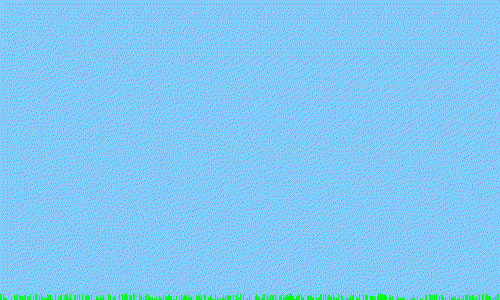
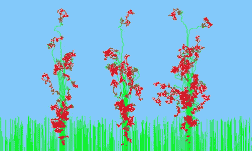
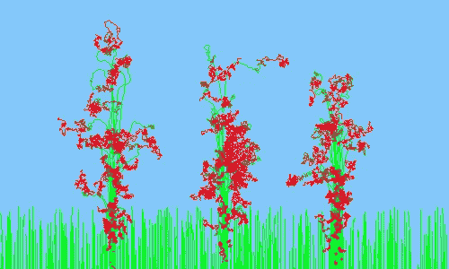
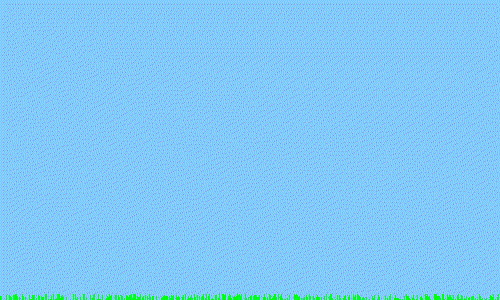

# 编程延时:种花

> 原文：<https://levelup.gitconnected.com/programming-timelapse-growing-flowers-71ff2cd3fa50>

用 Python 创建延时效果

## 简介和动机



你有没有想过种一朵美丽的花，并制作一个精美的延时视频？为此，你需要一台相机，一个三脚架，大量的时间，而且没有人能保证花一定漂亮。我没能让任何一朵花存活超过一周。

在这个故事中，我们用数学和随机性的力量来种花。这将是一个花卉生长模拟软件。

这可能是对粒子系统编程的一个很好的介绍。

## 增长算法

每个粒子将是一个在帧内移动的像素，改变颜色、方向和速度。每一步我们复制前一帧并添加这些像素，所以我们有一个延时效果。更准确地说，我们不只是画每个粒子的一个像素，而是画一条从前一个位置到当前位置的线。

我们从粒子类开始:

```
**class** Particle:
    _x = 0  # previous position
    _y = 0
    x = 0  # current position
    y = 0
    angle = 0  # direction
    speed = 0  
    color = (0,0,0)  
    turn_skip = 0  # we do not turn for this time
    turn_speed = 1  
    counter = 0
```

这些都是我们需要的变量。看起来最复杂的是`turn_skip`。这个想法是粒子不应该一直改变它的方向，因为它不漂亮。我们宁愿在一段时间内保持我们的方向，而这段时间将不断变化。

当然，我们需要一个`__init__`构造函数:

```
**class** Particle:
    ...
    **def** __init__(self, x, y):
        self.x = x + random.randint(-3, 3)
        self.y = y
        self._x = x
        self._y = y
        self.speed = random.randint(0, 300)/100
        self.color = (0, 255, random.randint(0, 50))  *# start color* self.angle = -math.pi/2
        self.turn_skip = random.randint(20,60)
        self.turn_speed = 1
```

你可以看到这些变量大部分都是随机的。这里最重要的随机变量是`speed`和`turn_skip`变量。

没什么复杂的。现在，我们切换到运动算法。最重要的是我们如何改变每个粒子的方向:

```
**class** Particle:
    ...
    **def** turn(self):
        self.counter += 1
        **if** self.counter > self.turn_skip:
            self.counter = 0 # change angle
            self.angle = self.angle + random.randint(-10, 10)/100*self.turn_speed
            self.turn_skip /= 1.5
            self.turn_speed *= 1.1 # change color
            r,g,b = self.color
            g -= 2
            **if** g < 0:
                g = 0
            r += 2
            **if** r > 255:
                r = 255
            self.color = (r,g,b)
```

总而言之，使用`counter`，我们等待`self.turn_skip`步骤并做两件事:

1.  改变方向(`angle`变量)
2.  改变颜色

而且都很简单。我们给`angle`加一个随机数来转弯。我们减少 RGB 中的绿色成分，增加红色成分。还有比这更简单的吗？

好的。我们如何移动粒子？这甚至更简单，我们在这里应用学校数学:

```
**class** Particle:
    ...**def** move(self):
        dx = self.speed*math.cos(self.angle)
        dy = self.speed*math.sin(self.angle)
        self._x = self.x
        self._y = self.y
        self.x += dx
        self.y += dy
```

我们只需要在改变当前位置之前记住之前的位置。

就是这样！就这么简单！

## 画草

草很简单。我们从底层开始，成长 35 步。有了这个数量的步骤，草将保持绿色，几乎不会改变方向。我们为此使用了 500 个粒子。

```
grass = []
**for** i **in** range(500):
    grass.append(Particle(random.randint(0, w), h))**for** i **in** range(35):
    **for** j **in** range(len(grass)):
        grass[j].turn()
        grass[j].move()
    draw_particles(grass)
```

## 画花

对于花，我们构建了三部分粒子，每部分 50 个。第一个在中间，第二个和第三个在它的左边和右边。

```
**for** i **in** range(50):
    flowers.append(Particle(w / 2, h))
    flowers.append(Particle(w / 4, h))
    flowers.append(Particle(w * 3 / 4, h))**for** i **in** range(300):
    **for** flower **in** flowers:
        flower.turn()
        flower.move()
    draw_particles(flowers)
```

## 看结果

让我们运行这个程序几次，看看我们得到了什么。



## 动画和代码

对于动画，我们使用著名的枕头库。你可以看我的其他文章来理解它的机制。



现在，让我们看看完整的代码。

如果你喜欢这篇文章，看看其他的。你可以从学习如何用 Python 写俄罗斯方块开始:

[](/writing-tetris-in-python-2a16bddb5318) [## 用 Python 写俄罗斯方块

### 用 Python 和 PyGame 编写俄罗斯方块的分步指南

levelup.gitconnected.com](/writing-tetris-in-python-2a16bddb5318) 

祝您愉快！