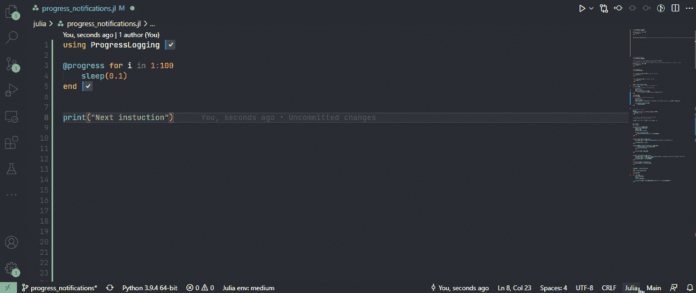
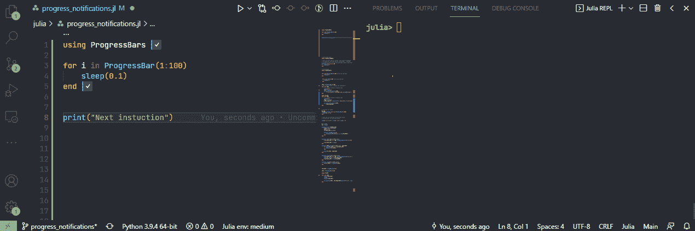
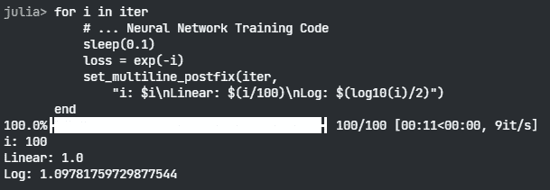

# Julia 中的进度条(tqdm 和 likes)

> 原文：<https://levelup.gitconnected.com/progressbars-tqdm-and-likes-in-julia-f5102cdd1841>

## 注意你的 for 循环

你有没有觉得某个功能太慢了？你是否经常发现自己**因为看不到你的功能正在取得的进展**而感到沮丧？不要害怕，我们有进度条！在本文中，我将介绍两个 Julia 包来展示您的循环是如何进行的，并强调一些您应该小心使用的**陷阱。**

照片由[迈克·范·登博斯](https://unsplash.com/@mike_van_den_bos?utm_source=unsplash&utm_medium=referral&utm_content=creditCopyText)在 [Unsplash](https://unsplash.com/s/photos/loading?utm_source=unsplash&utm_medium=referral&utm_content=creditCopyText) 上拍摄

# VSCode 的进展

如果你已经使用了 VSCode——这是我首选的 IDE——你可以使用直接集成到 Julia 的 vs code 插件中的`ProgressLogging`包。

用法很简单，只需要在你的 for 循环前面加一个`@progress`宏:

> 关于`ProgressLogging`的更多信息，请查看[官方 GitHub 回购](https://github.com/JuliaLogging/ProgressLogging.jl)。

好的，我已经完成了，但是没有任何反应。嗯，你必须**点击底部屏幕的 Julia 通知**部分:

作者拍摄的视频

如果您有一个长时间运行的任务，并且您想要查看您的函数进行到什么程度，这是非常有用的。

> 如果你知道如何让这个窗口默认弹出，请在评论中告诉我。🙏

# 印刷进度到 REPL

如果你想**将你的进度打印到 REPL** ，你可以使用`ProgressBars`。这是 Julia 的 tqdm 端口，所以如果你已经熟悉了，就跳过这篇文章的这一部分。

这里，不使用宏，而是用`ProgressBar()`或`tqdm()`函数包装范围。但是，请理智使用`ProgressBar`😃。

> 关于这个包的更多信息，请查看官方的 [GitHub 库](https://github.com/cloud-oak/ProgressBars.jl)。

这是它所有的荣耀，打印一个漂亮的酒吧到终端:

作者捕获的视频

如果你想在最后打印一些额外的东西——比如你奇特的深度神经网络的损失值——你可以**在你的进度条**上添加一个后缀:

但是，如果您运行这段代码，您会发现最后一个 log 函数大于 1！

不要。—作者捕获的图像。

日志功能不起作用。我们完了！——GIF 来自 [GIPHY](https://giphy.com/gifs/sad-crying-dexters-laboratory-11wP4znNl0yxXy)

我花了一段时间才意识到这一点，但实际情况是，最后打印的日志值**与前一个**的长度不同，因此它不会覆盖所有的小数。修复？使用`@sprintf`格式化您的数字:

ProgressBars 也适用于**螺纹 for 循环**，所以不要到处使用它们。

我还检查了每循环估计的准确性，看起来效果不错。查看我的 [GitHub repo](https://github.com/niczky12/medium/blob/master/julia/progress_notifications.jl) 中的一些片段。

# 该喝咖啡了

照片由[纳吉布·卡利尔](https://unsplash.com/@nkalil?utm_source=unsplash&utm_medium=referral&utm_content=creditCopyText)在 [Unsplash](https://unsplash.com/s/photos/sip-coffee?utm_source=unsplash&utm_medium=referral&utm_content=creditCopyText) 上拍摄

我们现在剩下要做的就是坐下来，喝杯咖啡(或茶)，看着我们辉煌的进度条填满 100%。

> 我写朱莉娅和其他很酷的东西。如果你喜欢这样的文章，请考虑关注我。要获得所有媒体文章的完整访问权限，包括我的文章，请考虑在此订阅。

 [## 在 Julia 中用 Flux.jl 构建你的第一个神经网络

### 没有任何外部数据的初学者教程

towardsdatascience.com](https://towardsdatascience.com/build-your-first-neural-network-with-flux-jl-in-julia-10ebdfcf2fa3)  [## 和 Julia 一起做一个命令行游戏

### 没有图形用户界面的 2048 游戏

blog.devgenius.io](https://blog.devgenius.io/make-a-command-line-game-with-julia-a408057adcfe)