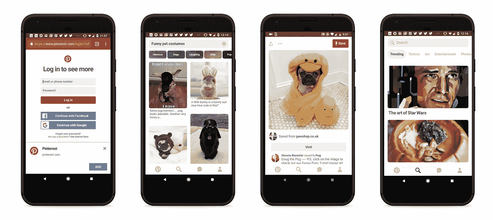
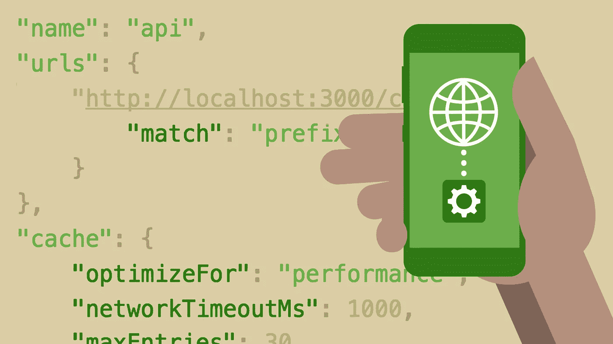
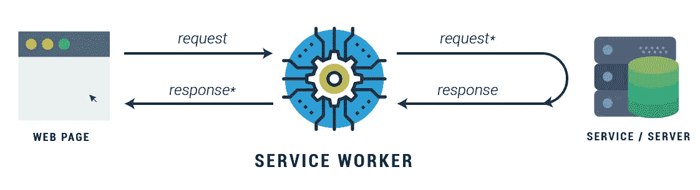

# 渐进式网络应用:下一个大事件还是原生应用的崇拜者？

> 原文：<https://levelup.gitconnected.com/progressive-web-apps-the-next-big-thing-or-native-app-wannabes-e99c143b5d14>

希尔特·彼得森在 [Unsplash](https://unsplash.com?utm_source=medium&utm_medium=referral) 上拍摄的照片

很多人关心“科技领域的下一件大事”在谷歌上快速搜索这个短语会显示超过 10 亿个结果。仅在过去十年中，技术进步的数量就有所增加，没有一家科技公司愿意在竞争中落在后面。我注意到 PWAs，或者说渐进式网络应用，是一些被科技行业的开发者或个人认可的东西，而不是普通大众。我个人甚至没有意识到有不同类型的应用程序。在我的脑海中，每当我想在手机上下载一个应用程序时，我都会去谷歌 Play 商店，搜索我想要的，然后点击下载按钮。今年早些时候，当我开始我的编码之旅时，我才意识到 PWAs 的存在。

**什么是渐进式网络应用？**

假设你正在手机上浏览一个网站。在页面底部会出现一个小的弹出通知，询问你是否喜欢他们的网站，以及你是否想在应用程序中打开。好奇，你点一下。你现在看到的不是被重定向到 app store 或 play store，而是他们相同的网站，现在是在类似移动应用的视图中。

Pinterest 的 PWA 展示

pwa 本质上是具有移动应用程序用户界面的网站。它们非常快，可以添加到移动设备的主屏幕上，能够发送推送通知，甚至还具有离线工作的功能。PWAs 的概念是将网站的精华部分与移动应用的精华部分结合起来。

PWA 的要求是什么？

创建渐进式 web 应用程序有三个不同的要求。第一，公共福利机构需要在 HTTPS 的领导下运行。HTTPS 是 HTTP 的扩展，只是它增加了双向加密的安全性。这为正在传输的任何数据的隐私和完整性增加了一个保护层，并防止数据被篡改。

PWA 需要的第二个组件是 web 应用程序清单。web 应用程序清单是一个 JSON 文件，其中包含关于如何与浏览器进行通信的所有元数据，这些元数据涉及 PWA 在安装到用户主页时在移动设备上的行为。web 应用程序清单需要的部分是安装在主屏幕上后要使用的名称，以及告诉浏览器用户点击应用程序后将用户发送到哪里的起始 url。

PWA 的最后一个要求是服务人员。服务人员是在独立于网页的后台运行的脚本。这引入了不需要网页或用户交互就能工作的功能。它们是可编程的网络代理，允许开发者控制如何处理来自网页的网络请求。服务人员负责缓存和检索数据、交付推送通知以及交付后台同步。这为 PWAs 提供了许多不同的功能，例如离线工作和在移动设备上显示推送通知。

**那么这和正规的原生 app 有什么不同呢？**

虽然原生应用程序需要从应用程序或 play store 进行初始下载，但渐进式网络应用程序使用设备的互联网连接。与原生应用相比，使用 PWA 有很多好处。首先，它占用了原生应用程序所需空间的一小部分。因为它不需要下载就可以工作，这意味着没有需要安装的更新。无论何时你使用 PWA，你总是使用最新的版本，因为它直接从网站上获取信息。

由于 pwa 依赖于从网站缓存数据的服务人员，它们的使用速度非常快。对于选择使用 PWA 而不是原生应用的公司来说，这是一个优势。在我的生活中有很多这样的例子，一个应用程序下载时间太长，我甚至在进入主屏幕之前就卸载了这个应用程序。

**如果 pwa 这么棒，为什么大家还在用原生应用？**

由于渐进式网络应用程序比原生应用程序更新，对于完全支持新技术的公司来说，总是存在谨慎的犹豫。这允许代码中的任何错误显示出来，并允许开发人员优化概念。因此，没有一个固定的位置，像 app store 或 play store，我可以作为一个用户去找到不同的 pwa。我觉得这将他们的潜在受众限制在已经在使用他们网站的个人。app store 和 play store 的一个很酷的功能是顶级免费和顶级付费应用部分。这实际上是来自公众的免费广告，针对用户喜欢的不同的本地应用。PWA 缺乏一个集中的位置阻碍了他们接触到的用户数量，这就是为什么本地应用下载和 PWA 下载之间存在如此巨大的差距。

PWAs 的使用仅依赖于浏览器的功能。然而，有大量的功能性网络浏览器，谷歌浏览器，火狐浏览器，Mozilla 浏览器，Safari 浏览器，ie 浏览器等等。PWAs 的开发人员必须确保 PWAs 的代码能够在每个浏览器上运行。这对公司来说可能是一笔额外的开支，因为他们需要的开发人员不仅要熟悉目标网络浏览器，还要熟悉渐进式网络应用。此外，公司网站的任何重大更新或翻新也需要更新每个浏览器的每个 PWA 文件。

有哪些受欢迎的公益广告？

即使有各种不同的优势和劣势，仍然有许多大型科技公司拥有正常运行的 PWA。脸书、福布斯、Pinterest，甚至谷歌地图 Go 都有 PWA 版本。随着越来越多的公司开始涉足 PWAs 领域，我很高兴看到即将到来的潜在改进和新功能。