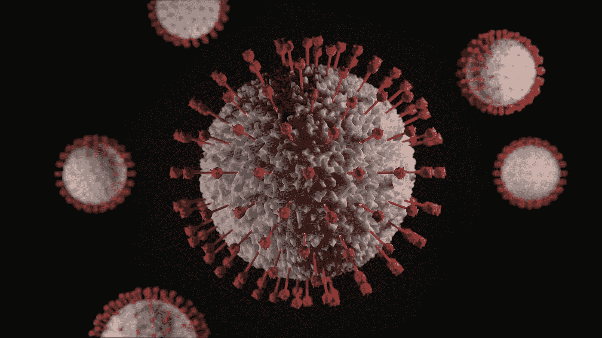
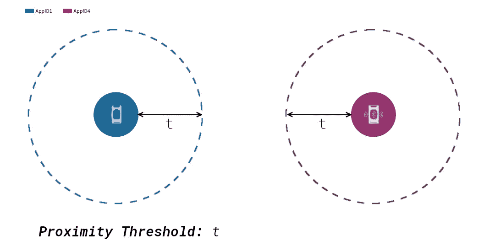
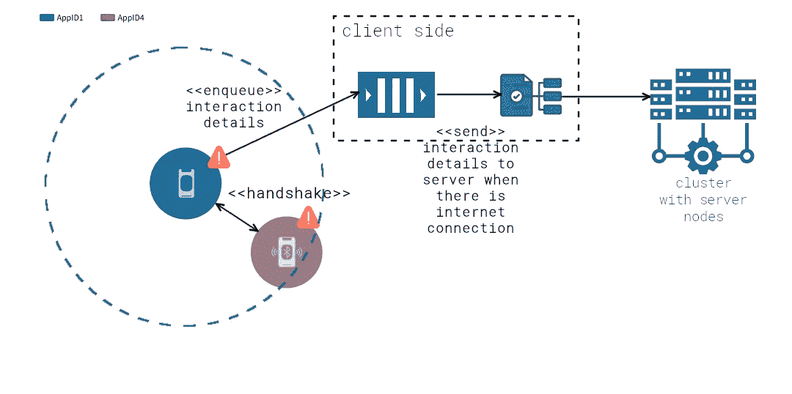
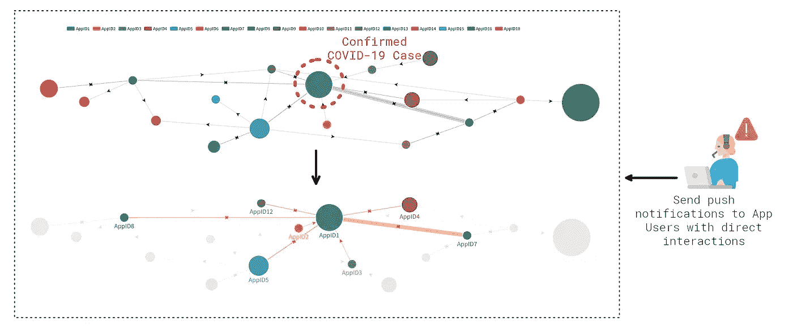
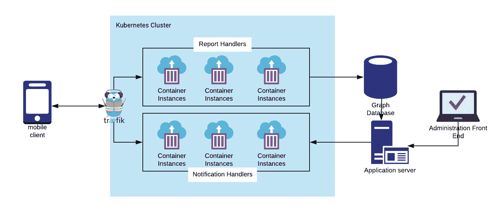

# 项目建议——通过建立 P2P 移动追踪器来对抗新冠肺炎

> 原文：<https://levelup.gitconnected.com/project-proposal-fight-back-covid-19-by-building-a-p2p-mobile-tracker-36738729837d>

## 一个 P2P 移动追踪器的高级项目描述，可以潜在地帮助新冠肺炎疫情控制。

Viktor Forgacs 在 [Unsplash](https://unsplash.com/s/photos/covid?utm_source=unsplash&utm_medium=referral&utm_content=creditCopyText) 上拍摄的照片

新冠肺炎正以前所未有的速度在全球蔓延。卫生保健系统正面临着巨大的压力，卫生专业人员竭尽全力应对需求。病毒不区分国界、种族或宗教！因此，我们有责任团结起来，抗击这种传染性极强的疾病。

世界上已经有过几次类似新冠肺炎的大流行，然而这次有一个显著的不同:大规模协作、透明和公开讨论在当时是不存在的！作为技术专业人员，现在自愿为抗击疾病做出贡献已经成为可能，这正是这篇文章的内容。

> 言归正传，这是对所有软件工程师、数学家、数据科学家或任何其他职业可以做出贡献的人的呼喊，以帮助开发一个可能有助于控制病毒传播的项目。

下面我在一个非常高的水平上描述这个项目，所以请随意修改和评论任何你认为必要的东西。

# 这个项目——P2P 移动跟踪器

## **高层描述**

由于其极强的传染性，我们知道在现阶段很难控制这种病毒。相反，主要目标应该是尽可能地控制它。然而，控制它涉及追踪确诊病例的人与其他人的任何接触的关键任务，我怀疑这是一项极其乏味的任务，并且在人工完成时涉及大量回忆和猜测。

考虑到这一点，如果..开发了一个移动应用程序，该应用程序使用蓝牙低能耗技术在智能手机上使用 P2P 网络来创建来自该应用程序用户的邻近互动的巨大图表，从而可以基于已确认的新冠肺炎病例进行追溯。下面给出了更全面的技术描述。

## 技术描述

为了实现这一点，尽可能多的人在他们的设备上下载应用程序并保持蓝牙活动是非常重要的。当下载应用程序时，它应该在后台运行，并定期扫描附近的其他对等点。

当在扫描范围内识别出另一个对等体时，ping 消息被发送到该对等体，并且交互被记录和排队以向服务器报告。

在服务器端，报告处理器将处理报告消息并更新图形数据库，使得如果之前没有先前的交互，则创建新的链接，或者递增计数器以指示两个节点之间更强的交互。结果，系统的管理员(无论是谁，政府、医疗保健 IT 管理员……)可以标记已经被测试为新冠肺炎阳性的节点，并因此基于交互图追溯它们的交互。

从下图可以明显看出，AppID7 与受感染者有很强的相互作用，因此具有很高的感染风险。因此，通过接收通知，AppID7 的用户可以调用相应的健康服务，并提供他的应用随机数详细信息来验证他的身份并报名参加新冠肺炎测试。

## 隐私保护

重要的是，用户的 ID 不会被邻近交互广播所公开。然而，当用户被通知他们已经接触到确诊病例时，他们必须能够验证他们的身份，以便他们可以报名参加新冠肺炎考试，同时不可能报告欺骗通知。即*用户报告他/她已经收到通知并需要尽快检查，而实际上他/她从未收到通知。*

这可以通过作为应用用户 ID 的加密承诺来实现。更准确地说，当应用程序第一次启动时，应该要求用户输入他们的护照号码。同时，必须从一个加密安全的 PRNG 中抽取一个随机字节序列，作为一个**随机数**。则加密承诺将按如下方式生成:

> **C = sha256(护照号码||随机数)**

*其中||是字符串串联。*

Commitment **C** 然后成为应用程序用户 ID，用于向服务器匿名标识应用程序。

当用户收到他们面临重大感染风险的通知时，他们可以拨打相应的医疗服务热线，并提供他们的 nonce(由应用程序提供)以及他们的护照号码。因此，医疗保健专业人员可以使用这两条信息来重新生成承诺，并确认该 ID 确实在高风险用户中。

此外，如果需要进一步的身份验证，可以要求用户出示他们的护照，以验证他们是给定护照号码的合法持有者。

# 技术栈

本节概述了可用于构建系统的可能的技术组合。

## 移动应用程序

为了开发应用程序**，Kotlin** 和 **Swift** 应该分别用于 Android 和 iOS，因为它们是厂商推荐的本地应用程序开发语言。备选的跨平台移动开发框架是另一种选择，但是由于该应用程序严重依赖蓝牙功能，本地开发将允许对本地功能的更多控制。

## P2P 监听器和扫描器

P2P 功能可以从头开始实现，但是考虑到问题的紧迫性，最好使用交钥匙解决方案。特别是， [**P2PKit**](http://p2pkit.io/) 为移动 P2P 交互提供了开箱即用的解决方案。

## 服务器端报告处理器

报告处理器应该是一个幂等 HTTP 微服务，它监听报告并更新图形数据库。这可以用任何 web 框架来构建，但理想情况下，应该使用轻量级框架来减少不必要的开销。一个很好的例子是使用 **Python** 的 **Flask** ，或者使用 **GoLang** 更快的更好的东西。

## 推送通知处理程序

另一个 HTTP 微服务来处理推送通知的发送和响应。同样，可以用与上面相同的技术来构建。

## **管理网络应用**

这是 IT 管理员将节点标记为确诊病例、执行查询、发送通知、验证身份等的界面。前端可以使用任何 javascript 前端框架构建，如 Vue、Angular 或 React，后端可以使用 web 框架单独构建，如针对 **Python** 的 **Flask** 或针对**节点**的**Express**(JavaScript)。作为一个 MVP，数据库的可视化编辑器可以用来手动更新节点。

## 邻近图-数据层

鉴于数据的本质是基于图形的，使用图形数据库不仅会使查询和数据建模更加直观，而且还会提供显著的查询速度优势。就我个人而言，我认为 Neo4J 是一个非常合适的候选，因为它已经被证明是非常可靠、快速的，并且自带可视化数据编辑器。

虽然这不是一个全面的列表，但这些是主要的软件组件及其相应的技术。当然，需要采用开发运维、基础设施和编排工具，这将有助于实现稳健的部署、高可扩展性和透明的监控。因此，这一节仍有待提出建议。

下面你可以找到整个系统的一个非常高级的架构。注意，除了图形数据之外，还缺少一些组件，比如用于存储数据的数据库。

# 挑战和局限

考虑到这是一个漫长的想法，它离一个完整的防失败的系统设计还很远。正如所料，仍然存在需要审查的公开挑战和限制，但这就是公开合作和讨论的全部内容，对吗？以下是我目前知道的需要考虑的挑战列表:

*   关于哪个对等体必须向服务器发送报告的共识应该避免重复的报告。
*   该系统能处理大量的报告请求吗？
*   如果图变得非常大，查询能运行多快？
*   这可以部署到什么规模？国家规模似乎是可持续的，但国际范围呢？在这种情况下，数据治理就成了一个问题。

## 假设

为了使系统有效，有一些假设必须成立:

*   尽可能多的人必须下载应用程序并保持蓝牙功能。
*   人们必须拥有一部 Android 或 iOS 智能手机。
*   人们应该允许并阅读来自应用程序的推送通知。

由于所有这些都取决于外部因素，政府有责任有效地传播上述信息，并鼓励人们下载该应用程序。

# 令人满意的改进

这个项目描述了一个为给定用例提供最小可能价值(尽管有影响)的系统。然而，还可以实现更多的功能。这些是:

*   运行更复杂的图形算法，从确诊病例中识别多个级别深度的高风险群集。
*   通过推送通知来通知具有高接近度交互的群集，推送通知提供保持距离的建议，以最大限度地降低感染风险。
*   使用邻近图数据库调查和研究疾病如何在密切相互作用的人群中传播。

# 项目开发

以我目前的时间工作安排，独自建立这个系统是一项极其困难的任务。此外，该系统的某些方面需要大量的学习，不可避免地需要时间和精力。因此，我恳请这篇文章的读者提供尽可能多的反馈，尽可能快地完善、设计和开发这个项目。

> 坦率地说，如果您认为自己有资源，甚至可以随意复制这个想法并在内部构建它！

尽管如此，我还是创建了一个知识库，如果你感兴趣，可以在这里分享想法和讨论:

 [## apogiatzis/covid 19-P2P-移动跟踪器

### 在 GitHub 上创建一个帐户，为 apogiatzis/covid 19-P2P-mobile-tracker 的开发做出贡献。

github.com](https://github.com/apogiatzis/covid19-p2p-mobile-tracker) 

目前，它只包含一个高层次的需求文档以及本文中的图表。任何贡献都非常受欢迎。

最后，如果你能分享这篇文章以接触尽可能多的人，我将不胜感激。