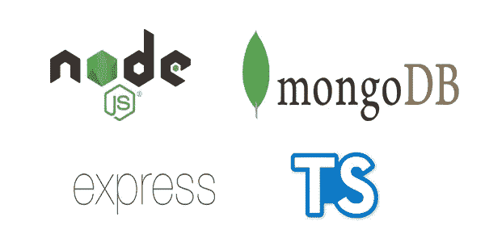
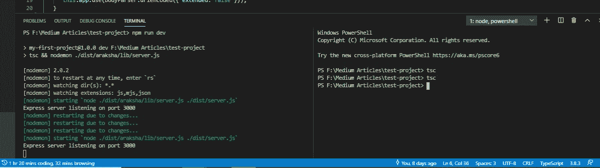
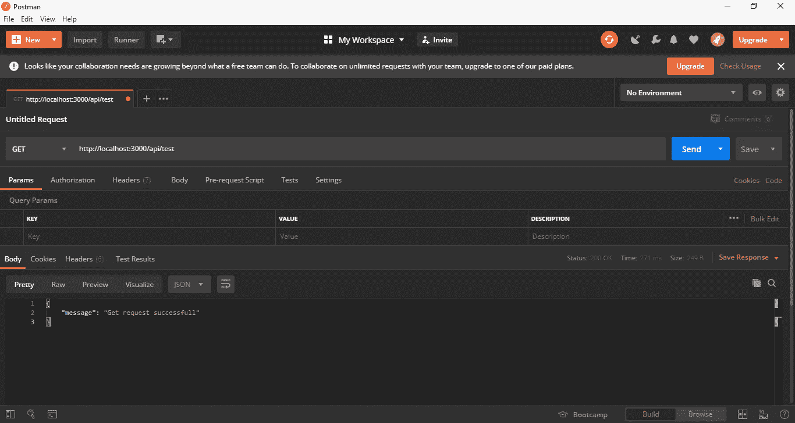
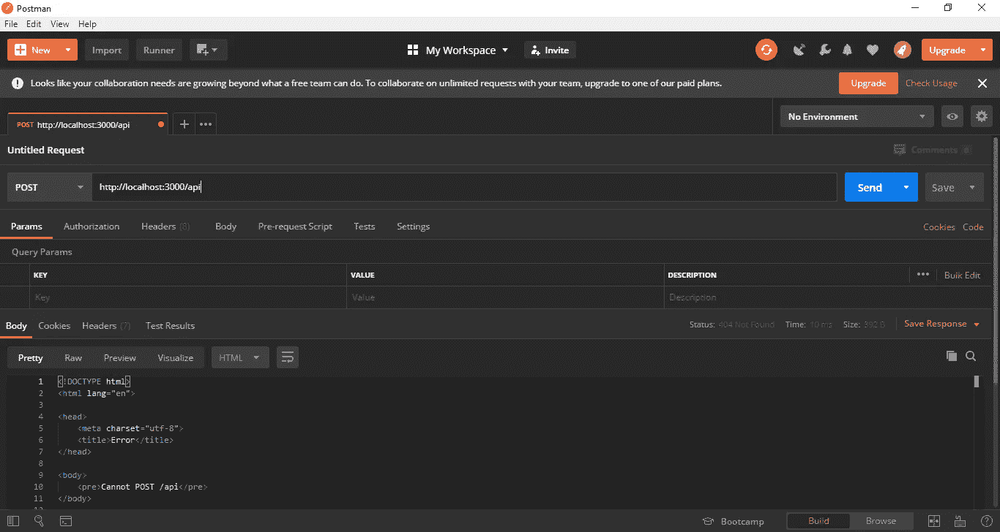

# 使用 TypeScript 的 Node.js、Express、MongoDB 的 RESTFUL API 的项目结构和构建路线

> 原文：<https://levelup.gitconnected.com/project-structure-and-building-routes-of-restful-api-with-node-js-f3a8b53d94e7>



第 1 部分:[设置 REST API](https://medium.com/@jpbinith/setup-restful-api-with-node-js-express-mongodb-using-typescript-261959ef0998)

第二部分:[REST API 中的项目结构和建设路线](https://medium.com/@jpbinith/project-structure-and-building-routes-of-restful-api-with-node-js-f3a8b53d94e7)

第 3 部分:[连接到 MongoDB 和 CRUD 操作](https://medium.com/@jpbinith/connect-express-rest-api-with-mongodb-and-crud-operations-using-typescript-58d9afcc06d)

在本文中，我将讨论如何为最佳实践维护项目结构，以及如何为您的第一个 API 实现路由。希望你会喜欢它。😃

在阅读本文之前，请务必阅读我关于如何设置第一个 REST API 的文章。

Express 是制作 Node.js REST APIs 的一个很好的框架，但是它没有给你任何关于如何组织你的项目的线索。

你可以随意使用任何你想要的结构。但是当你的代码库增长时，你最终会有长的处理程序。这使得你的代码难以理解，并且包含潜在的错误。

项目结构的正确组织将提高稳定性和效率，避免代码的重复，如果做得正确，还可以帮助您扩展服务。

这就是我所说的项目结构。我在我构建的每个 REST API 服务中都使用它，让我们来详细看看每个组件是做什么的。

```
backend
│
└─── dist                   #all the javascript files are here
└─── lib                    #all the typescript files are here
      └─── config           #app configurations files
            └─── app.ts     #app starting point            
      └─── controllers      #request managers
      └─── modules          #schemas, interfaces, services
      └─── routes           #define the endpoints
      └─── environment.ts   #store all environment variables
      └─── server.js        #HTTP server that listens to server port
└─── .gitignore             #git ignore file
└─── package-lock.json      #npm automatically generated document
└─── package.json           #holds metadata and npm packagage list
└─── tsconfig.json          #specify the root level files and the                                              .                            compiler options
```

这里，我在 app.ts 文件中执行 MongoDB 配置。如果你愿意，你也可以在一个单独的文件中完成。如果你能找到最适合你的项目结构，并在你的每个项目中保持最佳实践，那就更好了。

让我们进入下一部分，为您的第一个 RESTFUL API 构建路径。

正如我在[上一篇文章](https://medium.com/@jpbinith/setup-restful-api-with-node-js-express-mongodb-using-typescript-261959ef0998)中所说的，因为我们是用 typescript 开发的，所以我们在“ **lib** 文件夹中实现所有的实现。所以首先你必须在' **lib** 文件夹中创建一个名为' **routes** 的文件夹。然后在' **routes** '文件夹下创建一个文件，命名为' **test_routes.ts** '。在该文件中复制并粘贴以下内容。

```
//lib/routes/test_routes.ts
import {Application, Request, Response } from 'express';export class TestRoutes { public route(app: Application) { app.get('/api/test', (req: Request, res: Response) => {
         res.status(200).json({message: "Get request successfull"});
      }); app.post('/api/test', (req: Request, res: Response) => {
         res.status(200).json({message:"Post request successfull"});
      }); }}
```

现在我们已经完成了第一条有两个端点的路由的构建。但是，它仍然不能正常工作。为什么？只是因为我们还没有把它连接到 app 模块上。这仍然是一个外部模块，应用程序不知道这个模块的存在。所以我们必须告诉应用程序包含这个模块。我们来看看怎么做。在我们完成集成并调用相关的端点之后，它会用状态代码 200 进行响应。

让我们转到'**配置**文件夹中的' **app.ts** 文件。然后包括以下突出显示的行。

```
//lib/config/app.ts
import * as express from "express";
import * as bodyParser from "body-parser";
**import { TestRoutes } from "../routes/test_routes";**class App { public app: express.Application;
   **private test_routes: TestRoutes = new TestRoutes();** constructor() {
      this.app = express();
      this.config();
      **this.test_routes.route(this.app);**
   } private config(): void {
      // support application/json type post data
      this.app.use(bodyParser.json());
      //support application/x-www-form-urlencoded post data
      this.app.use(bodyParser.urlencoded({ extended: false }));
   }
}
export default new App().app;
```

在这里，我们创建了一个“ **TestRoutes** 的实例，并将其导入到 app 模块的构造函数中。现在，当应用程序运行时，它知道路线的存在。让我们通过在终端上运行' **npm run dev** '来启动我们的 API。如果您已经使用' **npm run prod** '启动了 API，您可以通过在另一个终端上运行' **tsc** '来重新启动它。



让我们使用 [Postman](https://www.getpostman.com/apps) 向 API 发送一个 GET 和 POST 请求，并查看结果。(http://localhost:3000/api/test)



因此我们可以看到我们的端点(http://localhost:3000/api/test)正在完美地工作。让我们看看，如果我们向除此端点之外任何其他端点发送请求，会发生什么。



因此它将返回状态为 404 的错误消息。我们来看看怎么处理。

在' **routes** '文件夹中创建另一个名为' **common_routes.ts** 的文件，复制并粘贴以下内容。

```
//lib/routes/common_routes.ts
import { Application, Request, Response } from 'express';export class CommonRoutes { public route(app: Application) { // Mismatch URL
      app.all('*', function (req: Request, res: Response) {
         res.status(404).send({ error: true, message: 'Check your URL please' }); });
   }
}
```

现在如上所述将其添加到' **app.ts** '文件中。但是要确保它总是作为构造函数中的最后一条路径。现在运行它，看看结果。

> **使用 CRUD？**

CRUD 代表创建、读取、更新和删除。关于它在 REST API 中的使用，CRUD 是 HTTP 请求的标准化使用。

*   获取:用于检索数据
*   发布:用于创建新数据
*   上传/修补:用于更新数据
*   删除:用于删除数据

> **状态码的使用？**

在监控时，通过应用程序的状态代码可以更容易地了解应用程序的健康状况。然而，对于一些 REST 服务，HTTP 状态代码没有很好地定义。

任何 HTTP 请求最常用的代码是:
200 — OK
404 —找不到
500 —内部服务器错误

如果需要，可以扩展到一组更详细的状态，例如:
201-已创建
204-无内容
304-已修改
400-错误请求
401-未授权
403-禁止
501-未实现

甚至你可以使用任何状态的任何代码。但是，如果您遵循最佳实践的标准，效果会更好。

这是这篇文章的结尾，希望你能理解一切。在下一篇关于实现 MongoDB 的文章中，我们将会看到关于控制器使用的内容。

完整代码请访问我的 [Github 库](https://github.com/jpbinith/test-project)。如果你感兴趣，你可以从下面的文章中学习关于 Node Express REST APIs 的移动。

1.  [设置 REST API](https://medium.com/@jpbinith/setup-restful-api-with-node-js-express-mongodb-using-typescript-261959ef0998)
2.  [REST API](https://medium.com/@jpbinith/project-structure-and-building-routes-of-restful-api-with-node-js-f3a8b53d94e7)项目结构和建设路线
3.  [连接到 MongoDB 和 CRUD 操作](https://medium.com/@jpbinith/connect-express-rest-api-with-mongodb-and-crud-operations-using-typescript-58d9afcc06d)