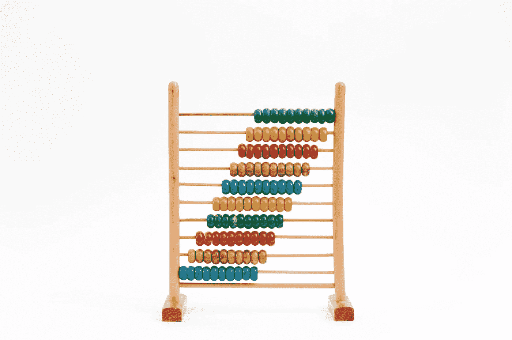
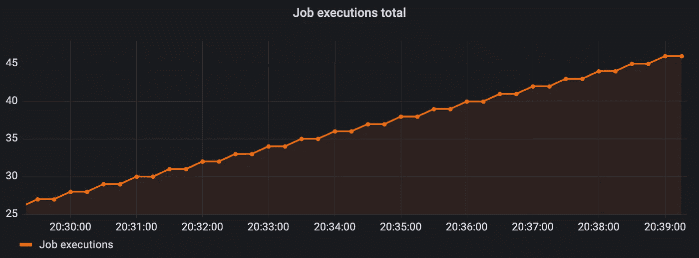
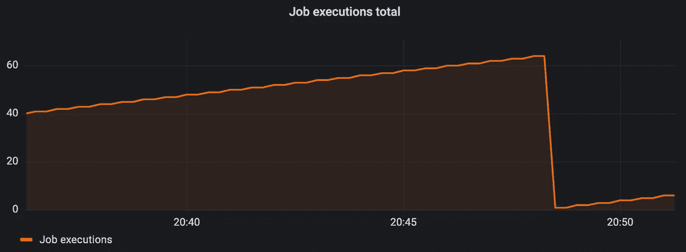
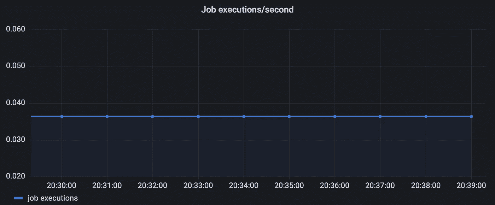
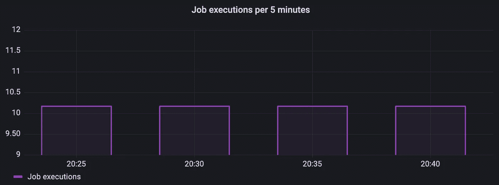
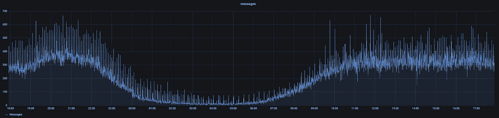
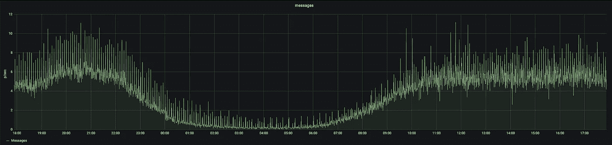

# 普罗米修斯计数器度量

> 原文：<https://levelup.gitconnected.com/prometheus-counter-metrics-d6c393d86076>

## 对最基本的普罗米修斯标准的深入研究



克里斯·贾维斯在 [Unsplash](https://unsplash.com/s/photos/counting?utm_source=unsplash&utm_medium=referral&utm_content=creditCopyText) 上拍摄的照片

普罗米修斯计数器需要一些时间来适应。官方文档很好地解释了这个理论，但是直到我创建了一些图表，我才明白这个度量是多么强大。

本文将理论与图形相结合，以更好地理解普罗米修斯的反度规。我们将看到 PromQL 函数`rate`、`increase`、`irate`和`resets`是如何工作的，更重要的是，我们将看到一些由生产数据的计数器指标生成的图表。

# 唯一的方法是向上…

正如你可能从名字中猜到的，计数器计数。它以最简单的方式做到了这一点，因为它的值只能增加而不能减少。

虽然不可能减少正在运行的计数器的值，但可以重置计数器。应用程序重启时会发生重置。

这种行为使得 counter 适合于跟踪只能上升的事物。一些例子包括:

*   你喝了多少啤酒
*   你开车行驶的总距离

或者在应用程序开发中:

*   HTTP 请求的总数
*   日志消息的总数
*   作业执行的总量

永远不要用计数器来计算可能上升或下降的数字。例如，您不应该使用计数器来跟踪数据库的大小，因为数据库的大小既可以扩大也可以缩小。

# 使用计数器

在本节中，我们将了解计数器可以提供的独特见解。我们将使用一个示例度量来计算作业执行的数量。

这段代码定义了一个名为`job_execution`的计数器。应用度量库 Micrometer 将把这个度量导出为`job_execution_total`。`execute()`方法每 30 秒运行一次，每次运行时，它都会将我们的计数器加 1。

## 原始计数器值

从原始计数器值中获得的见解在大多数情况下没有价值。如果我们绘制原始计数器值，我们会看到一条不断上升的线。



绘制原始计数器值会导致一条直线上升。

这条线会一直上升，直到我们重新启动应用程序。当应用程序重新启动时，计数器被重置为零。



当应用程序重新启动时，计数器重置为零。

幸运的是，prom QL(Prometheus 查询语言)提供了从我们的计数器中获取更有洞察力的数据的功能。

## 速度

Prometheus 的`rate`函数计算在定义的时间窗口内，计数器每秒增加的速率。以下 PromQL 表达式计算最后一分钟内每秒执行的作业数。

```
rate(job_execution_total[1m])
```

我们的作业以固定的时间间隔运行，所以将上面的表达式绘制成一条直线。



绘制一分钟窗口内的作业执行率

从图中，我们可以看到每秒大约执行 0.036 个作业。这个数乘以 60，你得到 2.16。这比预期的要高，因为我们的作业每 30 秒运行一次，也就是每分钟运行两次。

普罗米修斯抓取指标的方式会导致预期值和测量值之间的微小差异。根据时间的不同，结果值可能会更高或更低。重要的是要记住，普罗米修斯矩阵不是一门精确的科学。

PromQL 的`rate`自动调整计数器重置和其他问题。因此，每当应用程序重新启动时，我们不会像处理原始计数器值那样看到任何奇怪的下降。

> 单调性的中断(如由于目标重新启动导致的计数器重置)会自动进行调整。此外，计算会外推至时间范围的终点，考虑到遗漏的刮擦或刮擦周期与该范围的时间段不完全一致。—普罗米修斯文档

关于`rate`函数需要注意的最后一点是，我们应该只在计数器中使用它。将`rate`与任何其他普罗米修斯公制类型一起使用没有什么意义。

## 提高

普罗米修斯的`increase`函数计算指定时间范围内的计数器增量。以下 PromQL 表达式计算过去 5 分钟内的作业执行数。

```
increase(job_execution_total[5m])
```

因为我们的作业以 30 秒的固定时间间隔运行，所以我们的图表应该显示一个大约为 10 的值。



绘制过去 5 分钟内的作业执行数

普罗米修斯外推`increase`覆盖全部指定时间窗口。因此，尽管计数器仅按整数增量增加，也可能得到非整数结果。

类似于`rate`，我们应该只用带计数器的`increase`。将`increase`与任何其他普罗米修斯公制类型一起使用没有什么意义。

## 生气的

这个指标与`rate`非常相似。就像`rate`，`irate`计算在一个定义的时间窗口内计数器每秒增加的速率。不同之处在于`irate`只查看最后两个数据点。这使得`irate`非常适合绘制易变和/或快速移动的计数器。

下面的 PromQL 表达式返回每秒钟执行作业的速率，查找最早两分钟前的两个最近的数据点。

```
irate(job_execution_total[2m])
```

我们应该只使用带计数器的`Irate`。

## 重置

Prometheus 的`resets`函数给出指定时间窗口内计数器复位的次数。以下 PromQL 表达式计算过去 5 分钟内作业执行计数器重置的次数。

```
resets(job_execution_total[5m])
```

我们应该只使用带计数器的`resets`。

# 真实世界的示例图

到目前为止，我们看到的图表有助于理解计数器的工作原理，但它们很无聊。

为了更深入地了解这些图形在生产环境中会是什么样子，我从我们工作时的 Grafana 仪表板上截取了一些截图。

由于不想暴露公司机密，我对所有数据进行了匿名处理…

下图使用`increase`来计算每分钟处理的消息数量。当绘制 24 小时窗口的图表时，可以清楚地看到夜间的交通流量要低得多。



使用 increase 绘制我们每分钟处理的邮件数量

这里我们有相同的度量，但是这个使用`rate`来度量每秒处理的消息数。



使用 rate 来绘制我们每秒处理的消息数量

正如人们所料，这两张图看起来一样，只是比例不同。你应该使用哪一个取决于你测量的东西和你的偏好。

在这个例子中，我更喜欢`rate`变体。我认为看到我们每秒处理 6.5 条消息比看到我们每分钟处理 390 条消息更容易理解。

# 结论

Prometheus 计数器是一个简单的指标，但是可以通过使用不同的 PromQL 函数来创建有价值的见解，这些函数是为计数器设计的。您应该使用哪个 PromQL 函数取决于被测量的对象和您正在寻找的洞察力。

感谢您的阅读。我希望这有所帮助。如果您有任何问题或反馈，请随时回复。

# 参考

[1][https://prometheus.io/docs/concepts/metric_types/](https://prometheus.io/docs/concepts/metric_types/)

[2][https://Prometheus . io/docs/Prometheus/latest/query/functions/](https://prometheus.io/docs/prometheus/latest/querying/functions/)